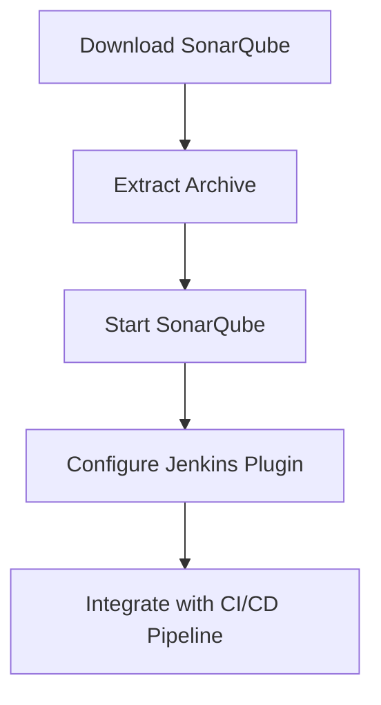
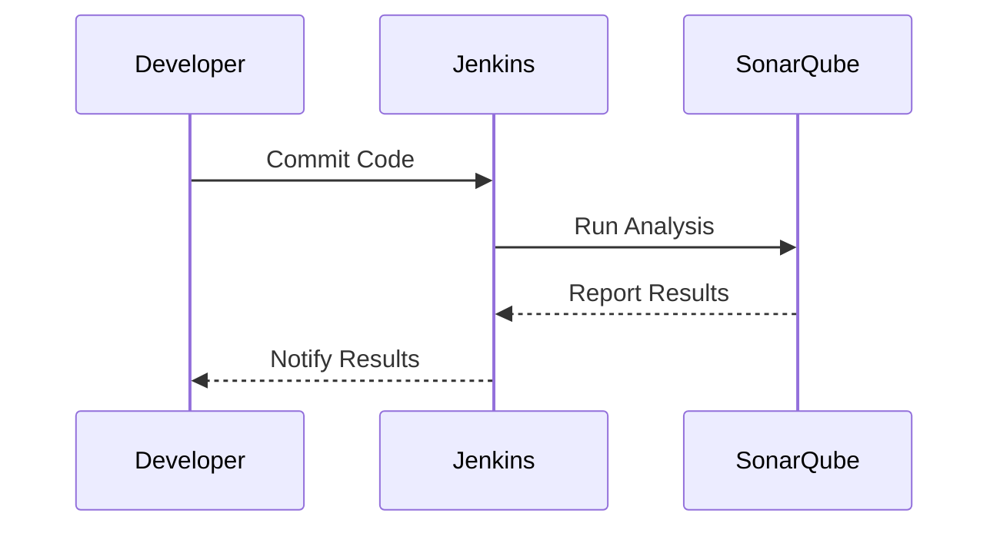
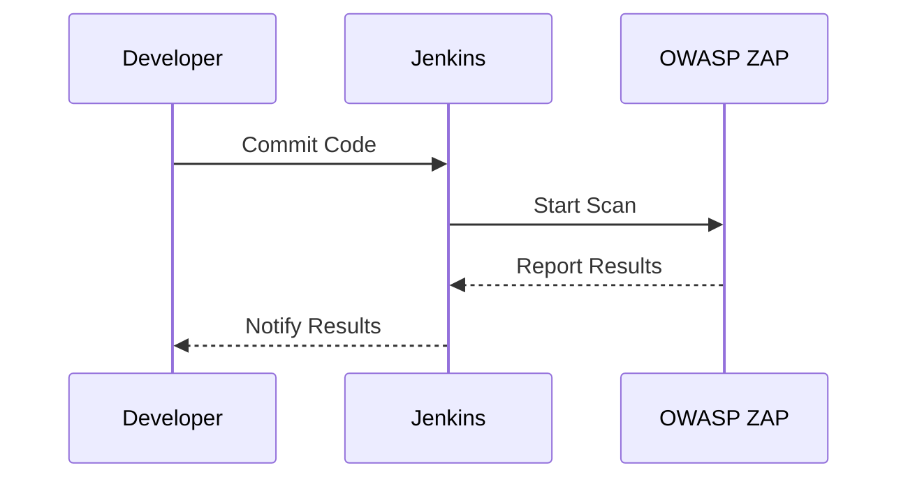

## Introduction to Performing DevSecOps Automated Security Testing

Welcome to the comprehensive guide on performing DevSecOps automated security testing. This chapter will delve deeply into the foundational aspects of setting up an environment for automated security testing, introducing various tools and techniques, and demonstrating how these can be integrated into continuous integration and continuous delivery (CI/CD) pipelines.

### Who is this Guide For?

This guide is designed for individuals like MAVE, who are looking to implement automated security testing in their development processes. Whether you are a developer, a security professional, or a DevOps engineer, this guide will provide you with the necessary knowledge and practical steps to integrate security testing into your workflows.

### What is DevSecOps?

DevSecOps is a philosophy that integrates security practices into the entire DevOps lifecycle. It emphasizes the importance of security throughout the development process, ensuring that security is not an afterthought but an integral part of the development workflow.

#### Why DevSecOps?

In today’s fast-paced development environments, traditional security practices often lag behind the rapid release cycles. DevSecOps aims to bridge this gap by embedding security into every stage of the software development lifecycle (SDLC). This approach helps in identifying and mitigating security vulnerabilities early in the development process, reducing the risk of security breaches and enhancing overall system resilience.

### Automated Security Testing

Automated security testing refers to the use of tools and scripts to automatically test software for security vulnerabilities. These tools can be integrated into CI/CD pipelines to ensure that security checks are performed consistently and efficiently.

#### Benefits of Automated Security Testing

- **Consistency**: Automated tests run the same way every time, ensuring consistent results.
- **Speed**: Automated tests can be executed quickly, allowing for faster feedback loops.
- **Coverage**: Automated tests can cover a wide range of scenarios, including those that might be overlooked in manual testing.
- **Integration**: Automated tests can be easily integrated into CI/CD pipelines, ensuring that security checks are performed as part of the regular development process.

### Setting Up the Environment for Automated Security Testing

Before diving into the tools and techniques, it is crucial to set up the environment properly. This includes configuring the necessary infrastructure, installing required tools, and setting up the CI/CD pipeline.

#### Infrastructure Setup

The first step is to set up the infrastructure that will support automated security testing. This typically involves:

- **Development Environment**: A local or remote development environment where code is written and tested.
- **Build Server**: A server that runs the build and test processes.
- **Version Control System**: A system like Git for managing code repositories.
- **Continuous Integration/Continuous Delivery (CI/CD) Platform**: Tools like Jenkins, GitLab CI, CircleCI, or Travis CI for automating the build and deployment processes.

##### Example: Setting Up a Build Server with Jenkins

```mermaid
graph TD
    A[Developer's Local Machine] --> B[Version Control System (Git)]
    B --> C[Build Server (Jenkins)]
    C --> D[Test Environment]
    D --> E[Deployment Environment]
```

**Step-by-Step Instructions:**

1. **Install Jenkins**: Download and install Jenkins on your build server.
2. **Configure Jenkins**: Set up Jenkins jobs to trigger builds and tests.
3. **Integrate with Version Control**: Configure Jenkins to pull code from your version control system.
4. **Set Up Test Jobs**: Create Jenkins jobs to run automated security tests.

```bash
# Install Jenkins on Ubuntu
sudo wget -q -O - https://pkg.jenkins.io/debian/jenkins.io.key | sudo apt-key add -
sudo sh -c 'echo deb http://pkg.jenkins.io/debian-stable binary/ > /etc/apt/sources.list.d/jenkins.list'
sudo apt-get update
sudo apt-get install jenkins

# Start Jenkins
sudo systemctl start jenkins
sudo systemctl enable jenkins
```

#### Installing Required Tools

Next, you need to install the tools that will be used for automated security testing. Some popular tools include:

- **Static Application Security Testing (SAST) Tools**: Tools like SonarQube, Fortify, and Checkmarx.
- **Dynamic Application Security Testing (DAST) Tools**: Tools like OWASP ZAP, Burp Suite, and Arachni.
- **Dependency Scanning Tools**: Tools like OWASP Dependency-Check, Snyk, and WhiteSource.

##### Example: Installing SonarQube



**Step-by-Step Instructions:**

1. **Download SonarQube**: Download the latest version of SonarQube from the official website.
2. **Extract Archive**: Extract the downloaded archive to a directory of your choice.
3. **Start SonarQube**: Start the SonarQube server.
4. **Configure Jenkins Plugin**: Install and configure the SonarQube plugin in Jenkins.
5. **Integrate with CI/CD Pipeline**: Add SonarQube analysis to your Jenkins job.

```bash
# Download SonarQube
wget https://binaries.sonarsource.com/Distribution/sonarqube/sonarqube-8.9.5.58690.zip
unzip sonarqube-8.9.5.58690.zip

# Start SonarQube
cd sonarqube-8.9.5.58690/bin/linux-x86-64/
./sonar.sh start
```

### Automating Code Security Testing

Once the environment is set up, the next step is to automate code security testing. This involves integrating security testing tools into the CI/CD pipeline.

#### Static Application Security Testing (SAST)

SAST tools analyze the source code to identify potential security vulnerabilities. They can detect issues such as SQL injection, cross-site scripting (XSS), and buffer overflows.

##### Example: Using SonarQube for SAST



**Step-by-Step Instructions:**

1. **Commit Code**: Developers commit code changes to the version control system.
2. **Run Analysis**: Jenkins triggers a build and runs SonarQube analysis.
3. **Report Results**: SonarQube reports the results back to Jenkins.
4. **Notify Results**: Jenkins notifies developers of the analysis results.

```bash
# Jenkinsfile for SonarQube Analysis
pipeline {
    agent any
    stages {
        stage('SonarQube Analysis') {
            steps {
                script {
                    def scannerHome = tool 'SonarQube Scanner'
                    withSonarQubeEnv('SonarQube') {
                        sh "${scannerHome}/bin/sonar-scanner"
                    }
                }
            }
        }
    }
}
```

#### Dynamic Application Security Testing (DAST)

DAST tools simulate attacks against a running application to identify vulnerabilities. They can detect issues such as SQL injection, XSS, and CSRF.

##### Example: Using OWASP ZAP for DAST



**Step-by-Step Instructions:**

1. **Commit Code**: Developers commit code changes to the version control system.
2. **Start Scan**: Jenkins triggers a build and starts OWASP ZAP scan.
3. **Report Results**: OWASP ZAP reports the results back to Jenkins.
4. **Notify Results**: Jenkins notifies developers of the scan results.

```bash
# Jenkinsfile for OWASP ZAP Scan
pipeline {
    agent any
    stages {
        stage('OWASP ZAP Scan') {
            steps {
                script {
                    sh 'zap-baseline.py -t http://localhost:8080 -r report.html'
                }
            }
        }
    }
}
```

### Integrating Security Testing into CI/CD Pipelines

To ensure that security testing is performed consistently and efficiently, it is essential to integrate these tests into the CI/CD pipeline.

#### Example: Integrating SonarQube and OWASP ZAP into Jenkins

```mermaid
graph TD
    A[Developer's Local Machine] --> B[Version Control System (Git)]
    B --> C[Build Server (Jenkins)]
    C --> D[SonarQube Analysis]
    D --> E[OWASP ZAP Scan]
    E --> F[Test Environment]
    F --> G[Deployment Environment]
```

**Step-by-Step Instructions:**

1. **Commit Code**: Developers commit code changes to the version control system.
2. **Trigger Build**: Jenkins triggers a build and runs SonarQube analysis.
3. **Run OWASP ZAP Scan**: Jenkins triggers OWASP ZAP scan.
4. **Test Environment**: Jenkins deploys the application to a test environment.
5. **Deployment Environment**: Jenkins deploys the application to the production environment.

```bash
# Jenkinsfile for Integrated Security Testing
pipeline {
    agent any
    stages {
        stage('SonarQube Analysis') {
            steps {
                script {
                    def scannerHome = tool 'SonarQube Scanner'
                    withSonarQubeEnv('SonarQube') {
                        sh "${scannerHome}/bin/sonar-scanner"
                    }
                }
            }
        }
        stage('OWASP ZAP Scan') {
            steps {
                script {
                    sh 'zap-baseline.py -t http://localhost:8080 -r report.html'
                }
            }
        }
    }
}
```

### Common Pitfalls and How to Avoid Them

When setting up automated security testing, there are several common pitfalls to avoid:

- **Incomplete Coverage**: Ensure that all parts of the application are covered by security tests.
- **False Positives/Negatives**: Configure tools to minimize false positives and negatives.
- **Performance Issues**: Optimize tests to ensure they do not significantly slow down the build process.
- **Security Misconfigurations**: Ensure that security tools are configured securely to prevent unauthorized access.

#### How to Prevent/Defend Against Common Pitfalls

- **Regularly Update Tools**: Keep security tools up to date to ensure they are using the latest rules and signatures.
- **Use Secure Configurations**: Follow best practices for configuring security tools to prevent misconfigurations.
- **Monitor Performance**: Regularly monitor the performance of security tests and optimize them as needed.
- **Review Results**: Regularly review the results of security tests to ensure they are accurate and actionable.

### Real-World Examples and Case Studies

To illustrate the importance of automated security testing, let’s look at some real-world examples and case studies.

#### Example: Equifax Data Breach (CVE-2017-5638)

In 2017, Equifax suffered a massive data breach that exposed sensitive information of millions of customers. The breach was caused by a vulnerability in Apache Struts, which could have been detected and mitigated through automated security testing.

##### How to Prevent/Defend Against Similar Breaches

- **Dependency Scanning**: Use tools like OWASP Dependency-Check to scan for known vulnerabilities in dependencies.
- **Regular Updates**: Ensure that all dependencies are regularly updated to the latest versions.
- **Automated Testing**: Integrate dependency scanning into the CI/CD pipeline to ensure that vulnerabilities are detected early.

```bash
# OWASP Dependency-Check Example
dependency-check --project "My Project" --out "results.xml" --scan "src/main/java"
```

#### Example: Capital One Data Breach (CVE-2019-11510)

In 2019, Capital One suffered a data breach that exposed sensitive information of millions of customers. The breach was caused by a misconfiguration in a web application firewall, which could have been detected and mitigated through automated security testing.

##### How to Prevent/Defend Against Similar Breaches

- **Configuration Management**: Use tools like Ansible or Terraform to manage configurations and ensure consistency.
- **Automated Testing**: Integrate configuration management into the CI/CD pipeline to ensure that misconfigurations are detected early.

```yaml
# Ansible Playbook Example
---
- hosts: all
  tasks:
    - name: Ensure web application firewall is configured correctly
      ansible.builtin.shell: |
        # Configuration commands
```

### Hands-On Labs

To gain practical experience with automated security testing, consider the following hands-on labs:

- **PortSwigger Web Security Academy**: Offers interactive labs for learning web security concepts and techniques.
- **OWASP Juice Shop**: A deliberately insecure web application for practicing security testing.
- **DVWA (Damn Vulnerable Web Application)**: A PHP/MySQL web application that demonstrates common web application vulnerabilities.
- **WebGoat**: An interactive training application that teaches web security lessons.

These labs provide a safe environment to practice and learn automated security testing techniques.

### Conclusion

In conclusion, setting up an environment for automated security testing is a critical step in implementing DevSecOps practices. By integrating security testing tools into the CI/CD pipeline, you can ensure that security is an integral part of the development process. This guide has provided a comprehensive overview of the steps involved, along with practical examples and real-world case studies. By following these guidelines, you can enhance the security of your applications and reduce the risk of security breaches.

---

This concludes the detailed guide on performing DevSecOps automated security testing. If you have any further questions or need additional assistance, feel free to reach out.

---
<!-- nav -->
[[DevSecOps/DevSecOps Bootcamp/05-Application Security Testing/06-Initializing the Setup for Automated Security Testing/01-Introduction to Performing DevSecOps Automated Security Testing/00-Overview|Overview]] | [[DevSecOps/DevSecOps Bootcamp/05-Application Security Testing/06-Initializing the Setup for Automated Security Testing/01-Introduction to Performing DevSecOps Automated Security Testing/02-Practice Questions & Answers|Practice Questions & Answers]]
