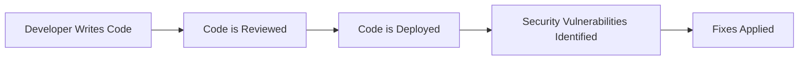
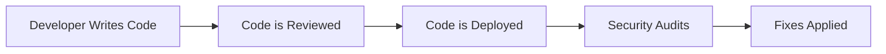
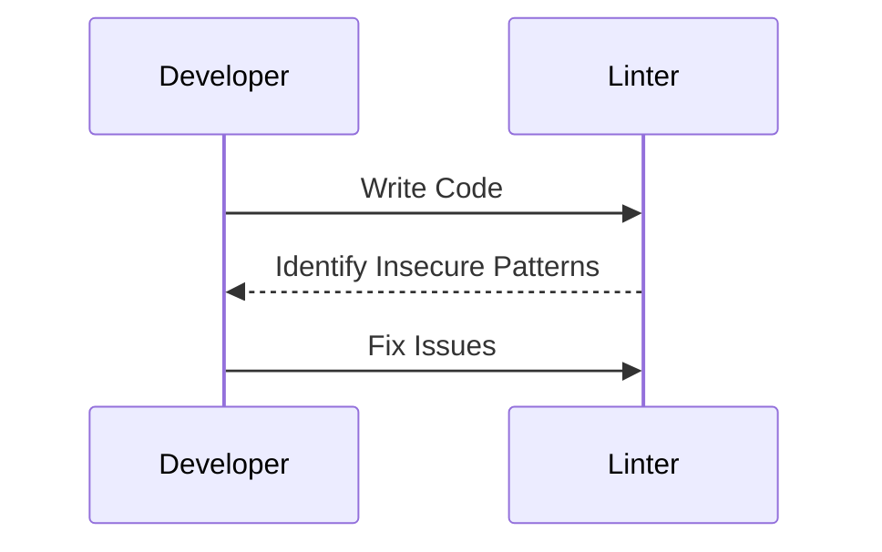
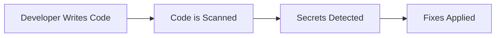
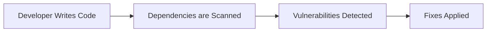

## Initializing the Setup for Automated Security Testing

### Overview of Automated Security Testing in DevSecOps

Automated security testing is a critical component of modern software development practices, particularly within the DevSecOps framework. This approach integrates security practices throughout the entire software development lifecycle, ensuring that security is not an afterthought but an integral part of the process. In this module, we will focus specifically on automating code security testing, which involves using tools and processes to identify and mitigate security vulnerabilities in the codebase.

### What Can You Test?

When testing code, several aspects are crucial to ensure both functional correctness and security:

1. **Readability**: How easy is it for other developers to understand the code?
2. **Maintainability**: How easy is it to modify and extend the code?
3. **Clarity**: How straightforward is the code structure and logic?
4. **Insecure Patterns**: Are there common coding mistakes that could lead to security issues?
5. **Hard-Coded Secrets**: Are sensitive information such as API keys or passwords embedded directly in the code?
6. **Insecure Third-Party Libraries**: Are there dependencies that introduce security risks?

### Importance of Readability

#### What is Readability?

Readability refers to how easily a piece of code can be understood by others. This includes factors such as consistent naming conventions, clear variable and function names, and well-structured code.

#### Why is Readability Important?

Code is typically written once but read many times. Ensuring that code is readable makes it easier for other developers to understand, debug, and maintain. This reduces the likelihood of introducing new bugs or security vulnerabilities during future modifications.

#### How Does Readability Impact Security?

Readable code makes it easier to spot potential security vulnerabilities. Developers can quickly identify areas where security might be compromised, such as improper handling of user input or insufficient validation checks.

#### Real-World Example

Consider a recent breach where a poorly documented and complex codebase led to a significant security vulnerability. The lack of readability made it difficult for the development team to identify and fix the issue promptly.



### Maintainability and Clarity

#### What is Maintainability?

Maintainability refers to how easily a codebase can be modified and extended. This includes factors such as modularity, separation of concerns, and adherence to design patterns.

#### Why is Maintainability Important?

Maintainable code allows developers to make changes without introducing new bugs or security vulnerabilities. This is particularly important in large codebases where multiple developers may be working on different parts of the system.

#### How Does Maintainability Impact Security?

Maintainable code reduces the risk of introducing security vulnerabilities during future modifications. Well-structured code makes it easier to implement security best practices consistently across the codebase.

#### Real-World Example

A well-maintained codebase can be seen in the open-source project Nextcloud, where modular architecture and clear documentation have helped maintain security over time.



### Insecure Patterns

#### What are Insecure Patterns?

Insecure patterns refer to common coding mistakes that can lead to security vulnerabilities. These include issues such as incorrect Boolean statements, improper error handling, and insufficient input validation.

#### Why are Insecure Patterns Important?

Identifying and addressing insecure patterns is crucial for maintaining the security of the codebase. These patterns often result in vulnerabilities that can be exploited by attackers.

#### How to Identify Insecure Patterns?

Tools such as linters can help identify insecure patterns in the code. Linters are static analysis tools that scan the code for common coding mistakes and provide suggestions for improvement.

#### Real-World Example

The Heartbleed bug in OpenSSL was caused by an insecure pattern where a buffer overflow allowed attackers to read sensitive data from memory. This highlights the importance of identifying and fixing insecure patterns.



### Hard-Coded Secrets

#### What are Hard-Coded Secrets?

Hard-coded secrets refer to sensitive information such as API keys, passwords, or encryption keys that are embedded directly in the codebase. This practice is highly discouraged due to the security risks it introduces.

#### Why are Hard-Coded Secrets Dangerous?

Hard-coded secrets can be easily exposed if the codebase is shared or leaked. This can lead to unauthorized access to systems and services, compromising the security of the application.

#### How to Detect Hard-Coded Secrets?

Tools such as `git-secrets` and `truffleHog` can be used to scan the codebase for hard-coded secrets. These tools search for patterns that match known secret formats and alert developers to their presence.

#### Real-World Example

In 2019, a GitHub repository containing hard-coded AWS credentials was discovered, leading to unauthorized access to sensitive data. This underscores the importance of avoiding hard-coded secrets.



### Insecure Third-Party Libraries

#### What are Insecure Third-Party Libraries?

Third-party libraries are external dependencies that are included in the codebase to provide additional functionality. However, these libraries can introduce security risks if they contain vulnerabilities or are not properly maintained.

#### Why are Insecure Third-Party Libraries Dangerous?

Using outdated or vulnerable third-party libraries can expose the application to security threats. Attackers can exploit known vulnerabilities in these libraries to gain unauthorized access or perform malicious actions.

#### How to Detect Insecure Third-Party Libraries?

Tools such as `Snyk` and `Dependabot` can be used to scan the codebase for dependencies and check them against known vulnerabilities. These tools provide alerts and recommendations for updating or replacing insecure libraries.

#### Real-World Example

The Log4j vulnerability (CVE-2021-44228) affected numerous applications due to the widespread use of the Log4j library. This highlights the importance of regularly checking and updating third-party dependencies.



### How to Prevent / Defend Against Security Vulnerabilities

#### Detection

Regularly scanning the codebase using tools such as linters, secret detectors, and dependency scanners can help identify potential security vulnerabilities. These tools provide alerts and recommendations for fixing issues.

#### Prevention

Implementing secure coding practices such as writing readable and maintainable code, avoiding insecure patterns, and using secure third-party libraries can help prevent security vulnerabilities.

#### Secure Coding Fixes

Here is an example of a vulnerable code snippet and its secure counterpart:

**Vulnerable Code:**
```python
import os

def authenticate(username, password):
    if username == "admin" and password == "password":
        return True
    else:
        return False
```

**Secure Code:**
```python
import os

def authenticate(username, password):
    if username == os.getenv("ADMIN_USERNAME") and password == os.getenv("ADMIN_PASSWORD"):
        return True
    else:
        return False
```

In the secure version, the hardcoded credentials are replaced with environment variables, reducing the risk of exposure.

#### Configuration Hardening

Ensuring that the development environment is configured securely can help prevent security vulnerabilities. This includes setting up proper access controls, using secure coding standards, and regularly updating dependencies.

### Complete Examples

#### Full HTTP Request and Response

Here is an example of a full HTTP request and response:

**HTTP Request:**
```http
POST /login HTTP/1.1
Host: example.com
Content-Type: application/json
Content-Length: 38

{
    "username": "admin",
    "password": "password"
}
```

**HTTP Response:**
```http
HTTP/1.1 200 OK
Date: Mon, 27 Mar 2023 10:00:00 GMT
Content-Type: application/json
Content-Length: 19

{
    "status": "success"
}
```

#### Policy/Config File

Here is an example of a full policy/config file:

**Nginx Configuration:**
```nginx
server {
    listen 80;
    server_name example.com;

    location / {
        root /var/www/html;
        index index.html index.htm;
    }

    location /api {
        proxy_pass http://localhost:3000;
        proxy_set_header Host $host;
        proxy_set_header X-Real-IP $remote_addr;
    }
}
```

#### Expected Result/Output

The expected result of running the above Nginx configuration would be a web server that serves static files from `/var/www/html` and proxies requests to `/api` to a backend service running on `localhost:3000`.

### Practice Labs

For hands-on experience with automated code security testing, consider the following labs:

- **PortSwigger Web Security Academy**: Offers interactive labs for learning web security concepts.
- **OWASP Juice Shop**: An intentionally vulnerable web application for practicing security testing.
- **DVWA (Damn Vulnerable Web Application)**: Another intentionally vulnerable web application for security testing.
- **WebGoat**: A deliberately insecure Java web application for learning about web application security.

These labs provide practical experience in identifying and mitigating security vulnerabilities in code.

### Conclusion

Automating code security testing is a critical aspect of modern software development practices. By focusing on readability, maintainability, clarity, insecure patterns, hard-coded secrets, and insecure third-party libraries, developers can significantly reduce the risk of introducing security vulnerabilities. Using tools such as linters, secret detectors, and dependency scanners can help identify and address these issues. Regularly reviewing and updating the codebase ensures that the application remains secure throughout its lifecycle.

---
<!-- nav -->
[[DevSecOps/DevSecOps Bootcamp/05-Application Security Testing/06-Initializing the Setup for Automated Security Testing/02-Automating Code Security Testing/00-Overview|Overview]] | [[DevSecOps/DevSecOps Bootcamp/05-Application Security Testing/06-Initializing the Setup for Automated Security Testing/02-Automating Code Security Testing/02-Practice Questions & Answers|Practice Questions & Answers]]
