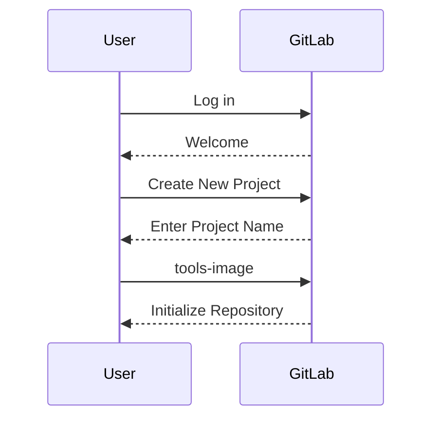
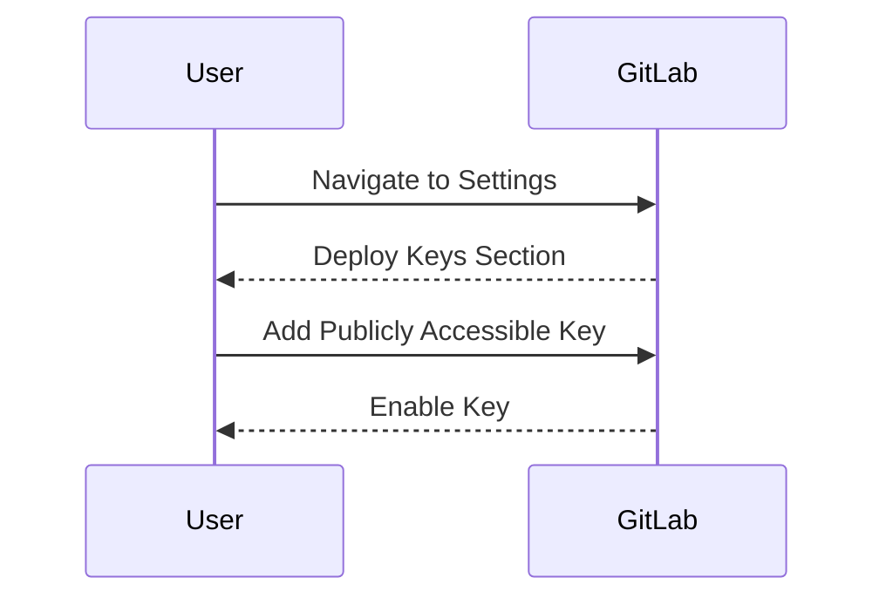
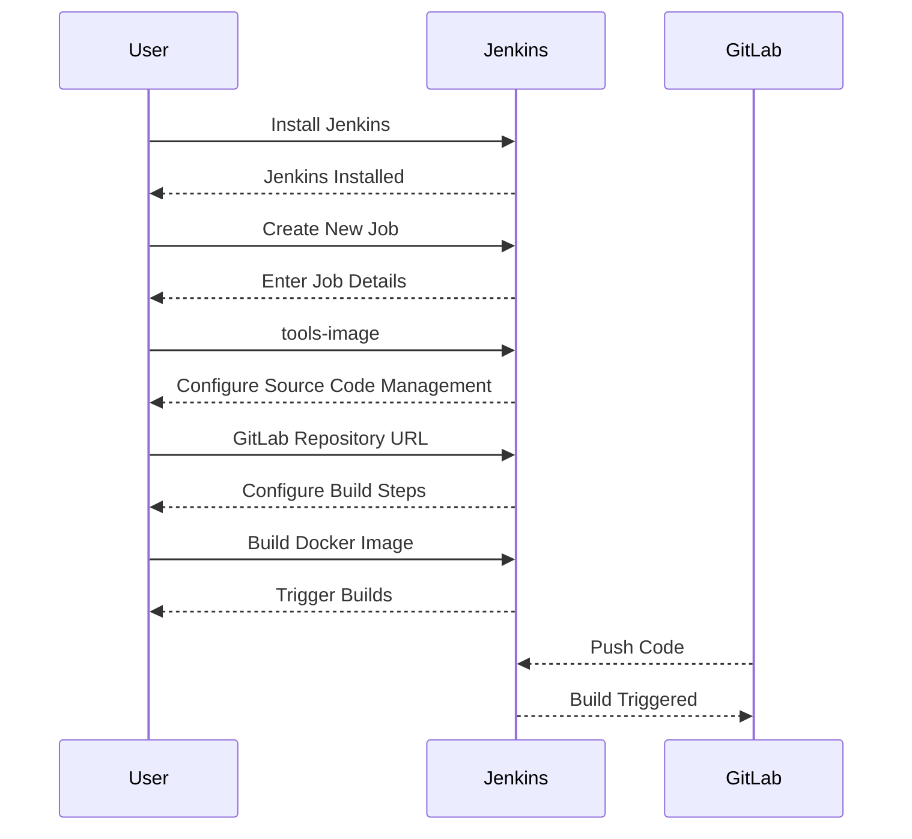
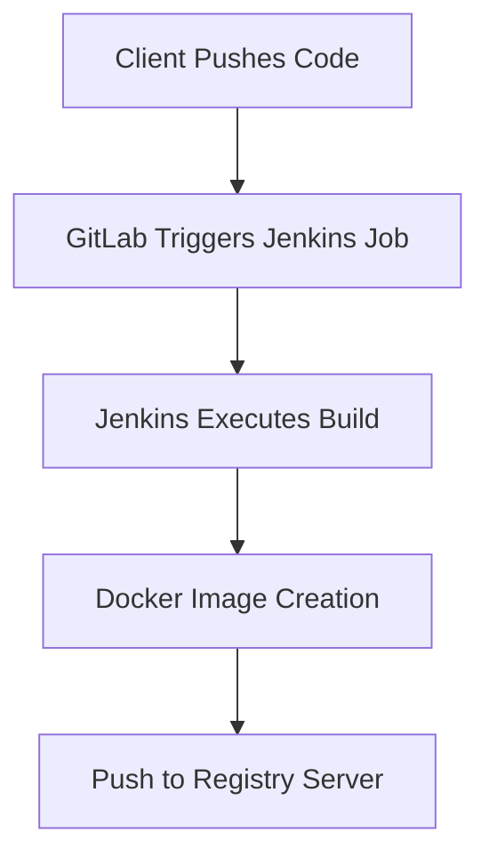

## Initializing the Setup for Automated Security Testing

### Background Theory

Automated security testing is an essential component of modern DevSecOps practices. It ensures that security vulnerabilities are identified and addressed early in the development lifecycle, reducing the risk of security breaches in production environments. To achieve this, a build pipeline is set up to automate the process of building, testing, and deploying applications.

The build pipeline typically consists of several stages:

1. **Source Code Management**: Storing and managing the source code in a version control system like Git.
2. **Build Automation**: Automating the compilation and packaging of the application.
3. **Security Testing**: Running automated security tests to identify vulnerabilities.
4. **Deployment**: Deploying the application to a staging or production environment.

### Setting Up the Tools Image Project

#### Creating a GitLab Project

The first step in setting up the build pipeline is to create a GitLab project to host the source code. GitLab is a popular choice for version control due to its robust features and integration capabilities.

**Steps to Create a GitLab Project:**

1. **Log in to GitLab**: Ensure you are logged in to your GitLab account.
2. **Create a New Project**: Click on the "New project" button.
3. **Enter Project Details**: Provide a name for the project, such as `tools-image`.
4. **Initialize Repository**: You can choose to initialize the repository with a README file or leave it empty.



#### Enabling Jenkins Key

To ensure that Jenkins can access the GitLab repository, a deploy key needs to be enabled. A deploy key is a public SSH key that allows read-only access to the repository.

**Steps to Enable Jenkins Key:**

1. **Navigate to Repository Settings**: Go to the project settings in GitLab.
2. **Deploy Keys Section**: Navigate to the "Deploy keys" section.
3. **Add Publicly Accessible Key**: Add the publicly accessible deploy key that Jenkins will use.
4. **Enable Key**: Ensure the key is enabled for the repository.



### Setting Up Jenkins Project

Jenkins is a widely used automation server that supports continuous integration and delivery. It integrates seamlessly with GitLab to trigger builds based on code changes.

**Steps to Set Up Jenkins Project:**

1. **Install Jenkins**: Ensure Jenkins is installed and configured on your server.
2. **Create a New Job**: In Jenkins, create a new job for the `tools-image` project.
3. **Configure Source Code Management**: Specify the GitLab repository URL and credentials.
4. **Configure Build Steps**: Define the steps to build the Docker image.
5. **Trigger Builds**: Configure the job to trigger builds upon code pushes to the GitLab repository.



### Workflow Overview

The workflow for the build pipeline is as follows:

1. **Client Pushes Code**: The developer pushes code changes to the GitLab repository.
2. **GitLab Triggers Jenkins Job**: GitLab triggers a Jenkins job based on the webhook.
3. **Jenkins Executes Build**: Jenkins pulls the code from the GitLab repository and executes the build steps.
4. **Docker Image Creation**: Jenkins creates a Docker image containing the automated security testing tools.
5. **Push to Registry Server**: The Docker image is pushed to a registry server for further use.



### Complete Example

#### GitLab Configuration

1. **Create Project**:
    - Navigate to GitLab and create a new project named `tools-image`.

2. **Enable Deploy Key**:
    - Go to the project settings.
    - Navigate to the "Deploy keys" section.
    - Add the publicly accessible deploy key and enable it.

#### Jenkins Configuration

1. **Install Jenkins**:
    - Install Jenkins on your server using the following commands:

    ```bash
    wget -q -O - https://pkg.jenkins.io/debian/jenkins.io.key | sudo apt-key add -
    sudo sh -c 'echo deb http://pkg.jenkins.io/debian-stable binary/ > /etc/apt/sources.list.d/jenkins.list'
    sudo apt-get update
    sudo apt-get install jenkins
    ```

2. **Create New Job**:
    - Open Jenkins and create a new job named `tools-image`.
    - Configure the source code management to use the GitLab repository URL.
    - Add build steps to build the Docker image.

3. **Build Steps**:
    - Add a shell script to build the Docker image:

    ```bash
    #!/bin/bash
    docker build -t tools-image .
    docker push tools-image
    ```

4. **Trigger Builds**:
    - Configure the job to trigger builds upon code pushes to the GitLab repository.

### Real-World Examples

#### Recent CVEs and Breaches

One notable example is the CVE-2021-21287, which affected Jenkins and allowed attackers to execute arbitrary code. This highlights the importance of keeping Jenkins and other tools up-to-date and properly configured.

### How to Prevent / Defend

#### Detection

1. **Monitor Logs**: Regularly monitor Jenkins logs for unauthorized access attempts.
2. **Use Security Scanners**: Integrate security scanners like SonarQube to detect vulnerabilities in the codebase.

#### Prevention

1. **Keep Jenkins Updated**: Ensure Jenkins and plugins are updated to the latest versions.
2. **Secure Credentials**: Use Jenkins credentials manager to securely store sensitive information.
3. **Limit Permissions**: Restrict permissions to only necessary users and roles.

#### Secure Coding Fixes

**Vulnerable Code**:
```yaml
pipeline {
    agent any
    stages {
        stage('Build') {
            steps {
                sh 'docker build -t tools-image .'
            }
        }
    }
}
```

**Fixed Code**:
```yaml
pipeline {
    agent any
    environment {
        DOCKER_IMAGE = 'tools-image'
    }
    stages {
        stage('Build') {
            steps {
                script {
                    withCredentials([usernamePassword(credentialsId: 'docker-credentials', usernameVariable: 'DOCKER_USERNAME', passwordVariable: 'DOCKER_PASSWORD')]) {
                        sh 'docker login -u $DOCKER_USERNAME -p $DOCKER_PASSWORD'
                        sh "docker build -t ${DOCKER_IMAGE} ."
                        sh "docker push ${DOCKER_IMAGE}"
                    }
                }
            }
        }
    }
}
```

### Practice Labs

For hands-on practice, consider the following labs:

- **PortSwigger Web Security Academy**: Offers a comprehensive set of labs for web application security.
- **OWASP Juice Shop**: A deliberately insecure web application for practicing security testing.
- **DVWA (Damn Vulnerable Web Application)**: Another popular web application for security testing.

These labs provide practical experience in setting up and securing build pipelines, ensuring that you can apply the concepts learned in real-world scenarios.

---
<!-- nav -->
[[DevSecOps/DevSecOps Bootcamp/05-Application Security Testing/06-Initializing the Setup for Automated Security Testing/03-Demo Setting up a Build Pipeline For Automated Security Testing/00-Overview|Overview]] | [[DevSecOps/DevSecOps Bootcamp/05-Application Security Testing/06-Initializing the Setup for Automated Security Testing/03-Demo Setting up a Build Pipeline For Automated Security Testing/02-Practice Questions & Answers|Practice Questions & Answers]]
