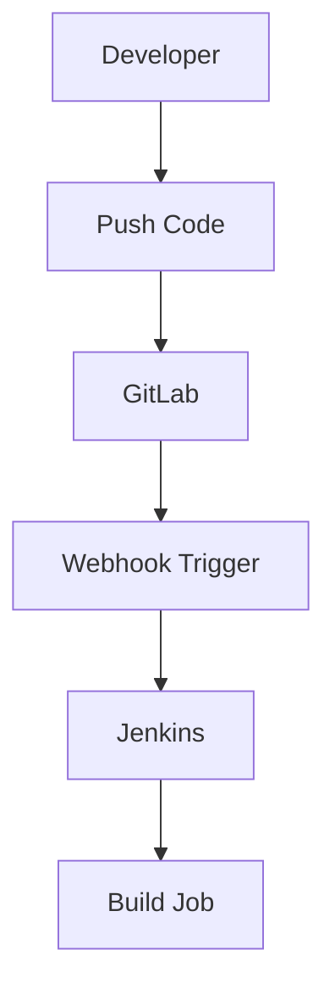
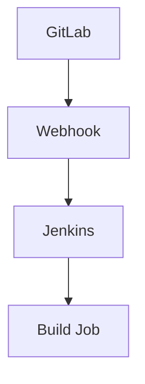
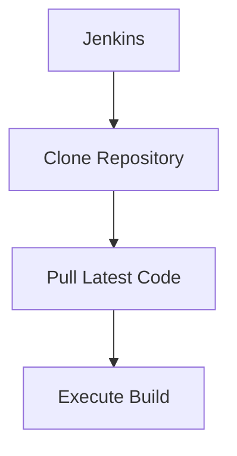

## Initializing the Setup for Automated Security Testing

### Overview of the Workflow

In the context of DevSecOps, automated security testing is a critical component of ensuring that applications are secure throughout their development lifecycle. The workflow typically involves several steps:

1. **Code Commit**: Developers commit code changes to a version control system such as GitLab.
2. **Webhook Trigger**: A webhook is triggered by the version control system, which notifies a continuous integration (CI) tool like Jenkins.
3. **Build Execution**: Jenkins executes a build or job, pulling the latest code from the version control system.
4. **Security Testing**: The build process includes automated security tests, which may involve static analysis, dynamic analysis, or both.

This setup ensures that security checks are integrated into the development process, helping to catch vulnerabilities early.

### Access Permissions Required

To make this workflow smooth, specific access permissions need to be set up:

1. **Client Permissions**:
    - **Push Code**: The client (developers) need to be able to push code to the Git server.
    - **Commit Code**: They should have the ability to commit code changes to the repository.

2. **Jenkins Permissions**:
    - **Set Webhooks**: Jenkins needs to be able to set up webhooks on GitLab. This allows Jenkins to automatically start builds whenever new code is pushed.
    - **Clone Repository**: Jenkins must be able to clone the repository to pull the latest code for building and testing.

#### Setting Up Access Permissions

Let's go through the steps to set up these permissions:

1. **Client Permissions**:
    - **GitLab Configuration**:
        - Navigate to the project settings in GitLab.
        - Under `Repository` settings, ensure that the client has the necessary permissions to push code.
        - You can also configure branch protection rules to enforce certain policies.



2. **Jenkins Permissions**:
    - **Webhook Setup**:
        - In Jenkins, navigate to the job configuration.
        - Add a post-commit hook to the GitLab project.
        - Ensure that the webhook URL is correctly configured to notify Jenkins.



- **Clone Repository**:
    - In Jenkins, configure the job to clone the repository from GitLab.
    - Ensure that the credentials used by Jenkins have the necessary permissions to access the repository.



### Projects Used in the Demos

The demos in this course revolve around two main projects:

1. **Docker Base Image Project**:
    - **Purpose**: Contains a Dockerfile to create a Docker image.
    - **Content**: The Docker image includes security testing tools that will be used throughout the demos.
    - **Source Code**: Available on GitHub.

2. **Node.js Web Shop Project**:
    - **Purpose**: A sample web application built using Node.js.
    - **Content**: Represents a typical web shop application that will undergo security testing.

#### Docker Base Image Project

The Docker base image project is crucial for setting up a consistent environment for security testing. Here’s how you can set it up:

1. **Dockerfile**:
    - Create a `Dockerfile` that defines the base image and installs necessary security testing tools.

```dockerfile
# Use an official Node.js runtime as a parent image
FROM node:14

# Set the working directory in the container
WORKDIR /app

# Copy package.json and package-lock.json
COPY package*.json ./

# Install app dependencies
RUN npm install

# Copy local code to the container image
COPY . .

# Run the app
CMD ["npm", "start"]
```

2. **Building the Docker Image**:
    - Build the Docker image using the following command:

```bash
docker build -t my-security-image .
```

3. **Running the Docker Container**:
    - Run the Docker container with the following command:

```bash
docker run -p 3000:3000 my-security-image
```

#### Node.js Web Shop Project

The Node.js web shop project is a typical web application that will be used for demonstrating security testing practices. Here’s how you can set it up:

1. **Project Structure**:
    - Typical structure of a Node.js project:

```plaintext
node-web-shop/
├── package.json
├── package-lock.json
├── src/
│   ├── index.js
│   └── routes/
│       └── shop.js
└── Dockerfile
```

2. **package.json**:
    - Define the dependencies and scripts in `package.json`.

```json
{
  "name": "node-web-shop",
  "version": "1.0.0",
  "main": "index.js",
  "scripts": {
    "start": "node src/index.js"
  },
  "dependencies": {
    "express": "^4.17.1"
  }
}
```

3. **src/index.js**:
    - Basic Express server setup.

```javascript
const express = require('express');
const app = express();
const port = 3000;

app.get('/', (req, res) => {
  res.send('Welcome to the Node.js Web Shop!');
});

app.listen(port, () => {
  console.log(`Server running at http://localhost:${port}`);
});
```

4. **Dockerfile**:
    - Define the Dockerfile for the Node.js web shop.

```dockerfile
# Use an official Node.js runtime as a parent image
FROM node:14

# Set the working directory in the container
WORKDIR /app

# Copy package.json and package-lock.json
COPY package*.json ./

# Install app dependencies
RUN npm install

# Copy local code to the container image
COPY . .

# Run the app
CMD ["npm", "start"]
```

5. **Building and Running the Docker Container**:
    - Build the Docker image:

```bash
docker build -t node-web-shop .
```

- Run the Docker container:

```bash
docker run -p 3000:3000 node-web-shop
```

### Real-World Examples and Recent Breaches

Recent breaches and CVEs highlight the importance of automated security testing:

1. **CVE-2021-44228 (Log4Shell)**:
    - **Description**: A critical vulnerability in Apache Log4j that allowed remote code execution.
    - **Impact**: Affected numerous applications and systems globally.
    - **Prevention**: Automated security testing can help identify and mitigate such vulnerabilities early.

2. **SolarWinds Supply Chain Attack (2020)**:
    - **Description**: Malware was injected into SolarWinds software updates, affecting thousands of organizations.
    - **Impact**: Demonstrated the importance of supply chain security.
    - **Prevention**: Continuous security testing of third-party components can help detect such issues.

### How to Prevent / Defend

#### Detection

1. **Static Analysis Tools**:
    - Use tools like SonarQube, ESLint, or Bandit to scan code for potential vulnerabilities.
    - Example SonarQube configuration:

```yaml
sonar.projectKey=my-project
sonar.sources=src
sonar.language=js
```

2. **Dynamic Analysis Tools**:
    - Use tools like OWASP ZAP, Burp Suite, or Arachni to test the application in a live environment.
    - Example OWASP ZAP command:

```bash
zap-cli --target http://localhost:3000 --spider --scan-all --report
```

#### Prevention

1. **Secure Coding Practices**:
    - Follow secure coding guidelines such as OWASP Top Ten.
    - Example of secure coding practice:

```javascript
// Vulnerable code
app.get('/login', (req, res) => {
  const { username, password } = req.query;
  // Insecure authentication logic
});

// Secure code
app.get('/login', (req, res) => {
  const { username, password } = req.query;
  if (validateCredentials(username, password)) {
    res.send('Login successful');
  } else {
    res.status(401).send('Unauthorized');
  }
});
```

2. **Configuration Hardening**:
    - Harden the Docker and Node.js configurations to minimize attack surfaces.
    - Example Dockerfile hardening:

```dockerfile
FROM node:14-slim

WORKDIR /app

COPY package*.json ./
RUN npm install --only=production

COPY . .

EXPOSE 3000

CMD ["npm", "start"]
```

3. **Regular Security Audits**:
    - Conduct regular security audits and penetration testing.
    - Example audit report:

```plaintext
Audit Report for Node.js Web Shop
----------------------------------

1. Vulnerability: SQL Injection
   - Identified in route `/shop`
   - Fixed by using parameterized queries

2. Vulnerability: Cross-Site Scripting (XSS)
   - Identified in route `/cart`
   - Fixed by sanitizing user input
```

### Complete Example of HTTP Request and Response

Here’s a complete example of an HTTP request and response during a security test:

#### HTTP Request

```http
POST /login HTTP/1.1
Host: localhost:3000
Content-Type: application/x-www-form-urlencoded
Content-Length: 27

username=admin&password=secret
```

#### HTTP Response

```http
HTTP/1.1 200 OK
Date: Mon, 20 Mar 2023 12:00:00 GMT
Content-Type: text/html; charset=UTF-8
Content-Length: 24

Login successful
```

### Common Pitfalls and Mistakes

1. **Ignoring Static Analysis Results**:
    - Many developers ignore static analysis results, leading to unpatched vulnerabilities.
    - **Solution**: Integrate static analysis into the CI/CD pipeline and treat warnings as errors.

2. **Manual Testing Only**:
    - Relying solely on manual testing can miss many vulnerabilities.
    - **Solution**: Combine manual and automated testing for comprehensive coverage.

3. **Outdated Dependencies**:
    - Using outdated dependencies can introduce known vulnerabilities.
    - **Solution**: Regularly update dependencies and use tools like Snyk to monitor for vulnerabilities.

### Hands-On Labs

For practical experience, consider the following labs:

1. **PortSwigger Web Security Academy**:
    - Offers interactive labs for web application security.
    - [Link](https://portswigger.net/web-security)

2. **OWASP Juice Shop**:
    - A deliberately insecure web application for security training.
    - [Link](https://owasp.org/www-project-juice-shop/)

3. **DVWA (Damn Vulnerable Web Application)**:
    - A PHP/MySQL web application that is riddled with vulnerabilities.
    - [Link](https://github.com/ethicalhack3r/DVWA)

4. **WebGoat**:
    - An interactive, gamified security training application.
    - [Link](https://github.com/WebGoat/WebGoat)

By thoroughly understanding and implementing these concepts, you can significantly enhance the security of your applications through automated testing and continuous integration.

---
<!-- nav -->
[[01-Introduction to Automated Security Testing Setup|Introduction to Automated Security Testing Setup]] | [[DevSecOps/DevSecOps Bootcamp/05-Application Security Testing/06-Initializing the Setup for Automated Security Testing/05-Describing the Demo Lab/00-Overview|Overview]] | [[DevSecOps/DevSecOps Bootcamp/05-Application Security Testing/06-Initializing the Setup for Automated Security Testing/05-Describing the Demo Lab/03-Practice Questions & Answers|Practice Questions & Answers]]
