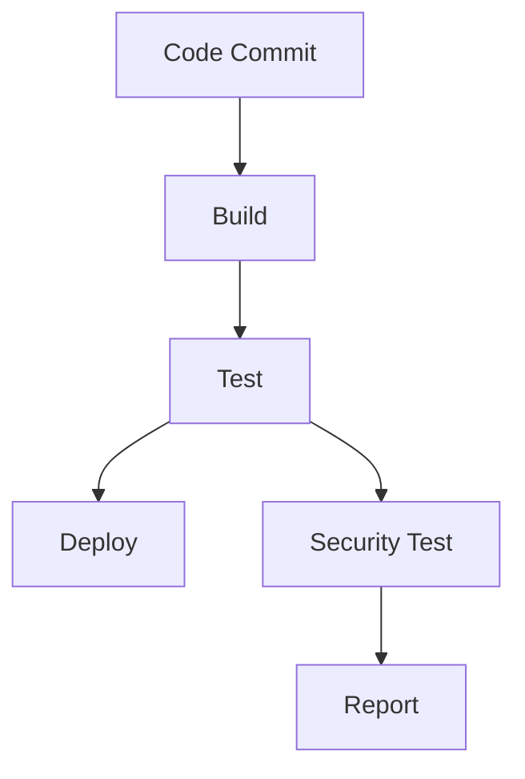
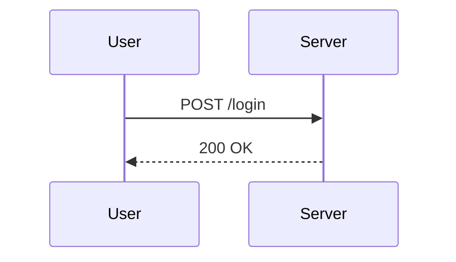

## Initializing the Setup for Automated Security Testing

### Introduction

Automated security testing is an essential component of modern DevSecOps practices. It helps ensure that applications are secure throughout their development lifecycle. This chapter will cover the foundational aspects of setting up an automated security testing pipeline, including key concepts, best practices, and practical examples.

### Key Concepts

#### Automated Security Testing

Automated security testing involves using tools and scripts to automatically check for vulnerabilities and security issues in software. This process can significantly reduce the time and effort required for manual testing and ensures consistent and thorough coverage.

**Why Automated Security Testing?**

- **Efficiency**: Automated tools can test large codebases quickly and efficiently.
- **Consistency**: Automated tests provide consistent results, reducing human error.
- **Coverage**: Automated tools can cover a wide range of security checks, ensuring comprehensive testing.

#### Quality Gates

Quality gates are checkpoints in the software development process where specific criteria must be met before proceeding to the next stage. In the context of automated security testing, quality gates help ensure that the codebase meets certain security standards before deployment.

**Don't Use Hard Quality Gates Upfront**

While quality gates are crucial, it’s important not to set them too high initially. This can lead to frustration and slow down the development process. Instead, start with reasonable thresholds and gradually increase them as the team becomes more familiar with the tools and processes.

### Setting Up a Simple Automated Pipeline

#### Planning Time for Tool Implementation

Implementing automated security testing tools requires careful planning. Here are some steps to consider:

1. **Tool Selection**: Choose tools that fit your project requirements. Consider factors such as language support, integration capabilities, and community support.
2. **Configuration**: Configure the tools to meet your project’s specific needs. This includes setting up rules, policies, and thresholds.
3. **Integration**: Integrate the tools into your existing CI/CD pipeline. Ensure that the tools run automatically during the build process.

#### Investing Time in Setting Up a Baseline

Setting up a baseline involves establishing initial security standards and metrics. This baseline serves as a reference point for future improvements and helps track progress over time.

**Steps to Set Up a Baseline:**

1. **Initial Scan**: Run an initial scan of your codebase using the chosen tools.
2. **Analyze Results**: Review the results to identify common vulnerabilities and patterns.
3. **Define Standards**: Based on the initial scan, define security standards and metrics.
4. **Document Findings**: Document the findings and establish a process for regular updates.

### Example: Setting Up a Basic Pipeline

Let’s walk through an example of setting up a basic automated security testing pipeline using popular tools like SonarQube and OWASP ZAP.

#### Step 1: Install and Configure SonarQube

SonarQube is a popular static code analysis tool that helps identify security vulnerabilities and coding issues.

```bash
# Install Docker
sudo apt-get update
sudo apt-get install docker.io

# Pull SonarQube image
docker pull sonarqube:latest

# Run SonarQube container
docker run -d --name sonarqube -p 9000:9000 sonarqube:latest
```

#### Step 2: Configure SonarQube Scanner

Configure the SonarQube scanner to integrate with your CI/CD pipeline.

```bash
# Install SonarScanner
wget https://binaries.sonarsource.com/Distribution/sonar-scanner-cli/sonar-scanner-cli-4.6.2.2472-linux.zip
unzip sonar-scanner-cli-4.6.2.2472-linux.zip
cd sonar-scanner-4.6.2.2472-linux

# Create a configuration file
echo "sonar.host.url=http://localhost:9000" > sonar-project.properties
echo "sonar.login=your_token_here" >> sonar-project.properties
echo "sonar.sources=src" >> sonar-project.properties
```

#### Step 3: Integrate with CI/CD Pipeline

Integrate the SonarQube scanner into your CI/CD pipeline. For example, using Jenkins:

```yaml
pipeline {
    agent any
    stages {
        stage('Build') {
            steps {
                sh 'mvn clean package'
            }
        }
        stage('Test') {
            steps {
                sh './sonar-scanner-4.6.2.2472-linux/bin/sonar-scanner'
            }
        }
    }
}
```

#### Step 4: Run OWASP ZAP for Dynamic Analysis

OWASP ZAP is a dynamic application security testing tool that can be integrated into your pipeline.

```bash
# Install ZAP
wget https://github.com/zaproxy/zaproxy/releases/download/2.11.1/ZAP_2.11.1_Linux.tar.gz
tar xvf ZAP_2.11.1_Linux.tar.gz
cd ZAP_2.11.1

# Run ZAP in headless mode
./zap.sh -daemon -port 8080 -config api.key=your_api_key_here
```

#### Step 5: Integrate ZAP with CI/CD Pipeline

Integrate ZAP into your CI/CD pipeline using a script.

```bash
#!/bin/bash

# Start ZAP
./ZAP_2.11.1/zap.sh -daemon -port 8080 -config api.key=your_api_key_here &

# Wait for ZAP to start
sleep 10

# Run ZAP scan
curl -X POST "http://localhost:8080/JSON/core/action/newSession/"
curl -X POST "http://localhost:8080/JSON/spider/action/scan/?url=http://your_app_url_here&apikey=your_api_key_here"

# Wait for scan to complete
sleep 60

# Get scan results
curl "http://localhost:8080/JSON/core/view/alerts/?apikey=your_api_key_here"
```

### Common Pitfalls and How to Avoid Them

#### Overly Strict Quality Gates

**Pitfall:** Setting overly strict quality gates can lead to frustration and slow down the development process.

**Solution:** Start with reasonable thresholds and gradually increase them as the team becomes more familiar with the tools and processes.

#### Lack of Regular Updates

**Pitfall:** Not regularly updating the baseline and security standards can lead to outdated and ineffective testing.

**Solution:** Establish a process for regular updates and reviews of the baseline and security standards.

### Real-World Examples

#### Recent CVEs and Breaches

Consider the following recent CVEs and breaches:

- **CVE-2021-44228 (Log4j)**: A critical vulnerability in the Apache Log4j library that allowed remote code execution. Automated security testing could have identified this vulnerability early in the development process.
- **SolarWinds Supply Chain Attack (2020)**: A sophisticated supply chain attack that compromised SolarWinds Orion software. Automated security testing could have helped identify and mitigate such vulnerabilities.

### How to Prevent / Defend

#### Detection

Regularly run automated security tests to detect vulnerabilities and security issues. Use tools like SonarQube and OWASP ZAP to perform both static and dynamic analysis.

#### Prevention

Implement secure coding practices and follow best practices for security. Use tools like SonarQube to enforce coding standards and identify potential security issues.

#### Secure-Coding Fixes

Compare vulnerable code with secure code to understand the differences and apply the necessary fixes.

**Vulnerable Code:**
```python
import os
import subprocess

def execute_command(command):
    subprocess.run(command, shell=True)
```

**Secure Code:**
```python
import os
import subprocess

def execute_command(command):
    subprocess.run(command.split(), check=True)
```

#### Configuration Hardening

Harden configurations to minimize the attack surface. For example, configure SonarQube to enforce strict security policies and OWASP ZAP to perform thorough dynamic analysis.

### Complete Example: Full HTTP Request and Response

Here’s a complete example of a full HTTP request and response using OWASP ZAP:

**HTTP Request:**
```http
POST /login HTTP/1.1
Host: example.com
Content-Type: application/x-www-form-urlencoded
Content-Length: 29

username=admin&password=secret
```

**HTTP Response:**
```http
HTTP/1.1 200 OK
Date: Tue, 14 Mar 2023 12:00:00 GMT
Server: Apache/2.4.41 (Ubuntu)
Content-Type: text/html; charset=UTF-8
Content-Length: 1234

<!DOCTYPE html>
<html>
<head>
    <title>Login</title>
</head>
<body>
    <h1>Login Successful</h1>
</body>
</html>
```

### Mermaid Diagrams

#### Pipeline Architecture



#### Request/Response Flow



### Practice Labs

For hands-on practice, consider the following labs:

- **PortSwigger Web Security Academy**: Offers interactive labs for web application security.
- **OWASP Juice Shop**: A deliberately insecure web application for practicing security testing.
- **DVWA (Damn Vulnerable Web Application)**: A PHP/MySQL web application that is riddled with vulnerabilities.

### Conclusion

Setting up an automated security testing pipeline is a critical step in ensuring the security of your applications. By following the steps outlined in this chapter, you can effectively integrate automated security testing into your CI/CD pipeline and improve the overall security posture of your applications.

---
<!-- nav -->
[[DevSecOps/DevSecOps Bootcamp/05-Application Security Testing/06-Initializing the Setup for Automated Security Testing/06-Module Summary/00-Overview|Overview]] | [[DevSecOps/DevSecOps Bootcamp/05-Application Security Testing/06-Initializing the Setup for Automated Security Testing/06-Module Summary/02-Practice Questions & Answers|Practice Questions & Answers]]
