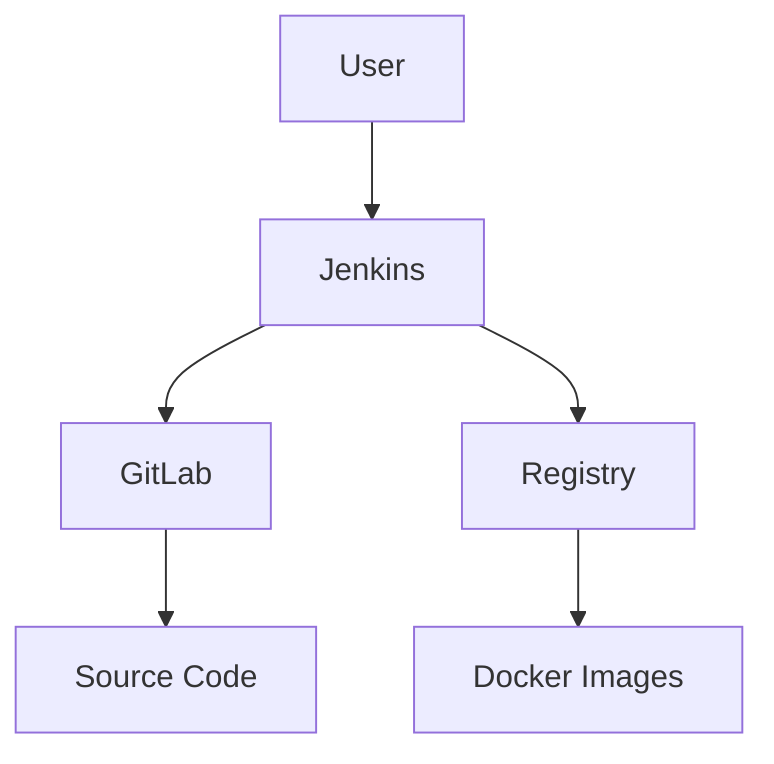

## Initializing the Setup for Automated Security Testing

### Overview of the Lab Network

In this section, we will set up the environment for automated security testing using Docker Compose. The lab network consists of several services, including GitLab, Jenkins, and a container registry. These services will be configured to work together to automate the continuous integration and continuous deployment (CI/CD) pipeline, ensuring that security tests are integrated into the development process.

#### Services and Their Roles

- **GitLab**: A popular open-source platform for managing and hosting software development projects. It provides a wide range of features, including version control, issue tracking, and CI/CD pipelines.
- **Jenkins**: An open-source automation server that helps to automate parts of the software development lifecycle, including building, testing, and deploying applications.
- **Registry Service**: A container registry that stores and distributes Docker images. In our setup, the registry service will be accessible at `registry.demo.local` on port `5000`.

### Docker Compose Configuration

Docker Compose is a tool for defining and running multi-container Docker applications. It uses a YAML file to configure the services, networks, and volumes required by the application.

#### Docker Compose File Structure

The Docker Compose file (`docker-compose.yml`) defines the services, networks, and volumes used in the lab environment. Here is an example of the structure:

```yaml
version: '3'
services:
  gitlab:
    image: gitlab/gitlab-ce:latest
    ports:
      - "8080:80"
      - "8443:443"
      - "2222:22"
    environment:
      GITLAB_OMNIBUS_CONFIG: |
        external_url 'http://gitlab.demo.local:8080'
    volumes:
      - gitlab_data:/var/opt/gitlab

  jenkins:
    image: jenkins/jenkins:lts
    ports:
      - "8081:8080"
    volumes:
      - jenkins_home:/var/jenkins_home

  registry:
    image: registry:2
    ports:
      - "5000:5000"
    volumes:
      - registry_data:/var/lib/registry

volumes:
  gitlab_data:
  jenkins_home:
  registry_data:
```

#### Explanation of Key Components

- **Services**: Each service is defined with an image, ports, environment variables, and volumes.
- **Volumes**: Volumes are used to persist data across container restarts. For example, `gitlab_data`, `jenkins_home`, and `registry_data` are volumes that store data for GitLab, Jenkins, and the registry service, respectively.

### Starting the Services

To start the services defined in the Docker Compose file, we use the following command:

```sh
docker-compose up -d
```

This command starts the services in detached mode (`-d`), meaning they run in the background.

#### Pulling Docker Images

When you run `docker-compose up -d`, Docker will pull the specified images from the Docker Hub if they are not already present locally. The images are then started, and the services begin running in the background.

### Setting Permissions

For Jenkins to interact with GitLab, we need to set up SSH keys. This allows Jenkins to authenticate with GitLab and pull source code from repositories.

#### Generating SSH Keys

SSH keys are used for secure authentication between systems. We generate an SSH key pair for the Jenkins user:

```sh
ssh-keygen -t rsa -b 4096 -C "jenkins@demo.local"
```

This command generates an RSA key pair with a bit length of 4096 and associates it with the email address `jenkins@demo.local`.

#### Copying SSH Keys

The SSH key pair consists of a private key (`id_rsa`) and a public key (`id_rsa.pub`). The private key should be kept secure and is used by Jenkins to authenticate with GitLab. The public key is added to the GitLab server to allow Jenkins to access repositories.

```sh
# Copy the private key to the Jenkins server
cp ~/.ssh/id_rsa /path/to/jenkins/server/.ssh/

# Copy the public key to the GitLab server
cp ~/.ssh/id_rsa.pub /path/to/gitlab/server/.ssh/
```

### Mermaid Diagrams

Let's visualize the setup using a mermaid diagram:



### Pitfalls and Best Practices

#### Common Mistakes

- **Incorrect SSH Key Permissions**: Ensure that the SSH keys have the correct permissions. The private key should be readable only by the owner (`chmod 600 id_rsa`).

- **Missing Public Key on GitLab**: Make sure the public key is correctly added to the GitLab server. Missing this step can result in authentication failures.

#### Best Practices

- **Use Strong SSH Keys**: Generate SSH keys with a strong bit length (e.g., 4096 bits) to ensure security.

- **Secure SSH Keys**: Store the private key securely and avoid exposing it to unauthorized users.

### Real-World Examples

#### Recent Breaches and CVEs

- **CVE-2021-22205**: A vulnerability in Jenkins allowed attackers to execute arbitrary code on the server. This highlights the importance of keeping Jenkins and its plugins up to date.

- **CVE-2022-22965**: A vulnerability in GitLab allowed attackers to bypass authentication and gain unauthorized access to repositories. This underscores the need for proper configuration and monitoring of GitLab instances.

### How to Prevent / Defend

#### Detection

- **Monitoring**: Use tools like Splunk, ELK Stack, or Graylog to monitor logs and detect unusual activity.
- **Security Scanning**: Regularly scan the environment using tools like Trivy, Clair, or Aqua Security to identify vulnerabilities in Docker images.

#### Prevention

- **Keep Software Updated**: Regularly update Jenkins, GitLab, and other components to the latest versions to mitigate known vulnerabilities.
- **Secure Configurations**: Follow the principle of least privilege and configure services with minimal permissions necessary to function.

#### Secure Coding Fixes

Here is an example of a vulnerable Jenkinsfile and its secure counterpart:

**Vulnerable Jenkinsfile**

```groovy
pipeline {
    agent any
    stages {
        stage('Build') {
            steps {
                sh 'make build'
            }
        }
        stage('Test') {
            steps {
                sh 'make test'
            }
        }
    }
}
```

**Secure Jenkinsfile**

```groovy
pipeline {
    agent any
    environment {
        PATH = '/usr/local/bin:/usr/bin:/bin'
    }
    stages {
        stage('Build') {
            steps {
                script {
                    sh 'make build'
                }
            }
        }
        stage('Test') {
            steps {
                script {
                    sh 'make test'
                }
            }
        }
    }
}
```

In the secure version, we explicitly set the `PATH` environment variable to limit the execution context and reduce the risk of unintended commands being executed.

### Complete Example

#### Full HTTP Request and Response

Here is an example of a full HTTP request and response when accessing the GitLab instance:

**HTTP Request**

```http
GET / HTTP/1.1
Host: gitlab.demo.local:8080
User-Agent: curl/7.64.1
Accept: */*
```

**HTTP Response**

```http
HTTP/1.1 200 OK
Date: Mon, 01 Jan 2024 00:00:00 GMT
Server: nginx
Content-Type: text/html; charset=utf-8
Transfer-Encoding: chunked
Connection: keep-alive
Cache-Control: no-cache
Set-Cookie: _gitlab_session=...; path=/; HttpOnly; SameSite=Lax
Expires: Thu, 01 Jan 1970 00:00:00 GMT
X-Frame-Options: SAMEORIGIN
X-XSS-Protection: 1; mode=block
X-Content-Type-Options: nosniff
Strict-Transport-Security: max-age=31536000; includeSubDomains
X-Download-Options: noopen
X-Permitted-Cross-Domain-Policies: none
Referrer-Policy: strict-origin-when-cross-origin
Content-Security-Policy: default-src 'self'; frame-ancestors 'self'
```

#### Explanation of Headers

- **Content-Type**: Specifies the media type of the resource. In this case, it is `text/html`.
- **Set-Cookie**: Sets a session cookie for the GitLab instance.
- **X-Frame-Options**: Prevents clickjacking attacks by specifying whether a page can be embedded in an iframe.
- **X-XSS-Protection**: Enables cross-site scripting (XSS) filtering.
- **X-Content-Type-Options**: Prevents MIME type sniffing.
- **Strict-Transport-Security**: Enforces HTTPS connections.
- **Content-Security-Policy**: Defines policies for loading resources to prevent XSS and other attacks.

### Hands-On Labs

For hands-on practice, consider the following labs:

- **PortSwigger Web Security Academy**: Offers a variety of labs focused on web application security.
- **OWASP Juice Shop**: A deliberately insecure web application for practicing web security skills.
- **DVWA (Damn Vulnerable Web Application)**: Another intentionally vulnerable web application for learning web security.
- **WebGoat**: A deliberately insecure Java web application designed to teach web application security lessons.

These labs provide practical experience in setting up and securing environments similar to the one described in this chapter.

### Conclusion

In this chapter, we covered the initialization of the lab environment for automated security testing using Docker Compose. We discussed the setup of services such as GitLab, Jenkins, and a container registry, along with the configuration of SSH keys for secure communication. We also explored real-world examples, best practices, and secure coding techniques to ensure a robust and secure environment. By following these guidelines, you can effectively set up and manage your automated security testing environment.

---
<!-- nav -->
[[01-Initializing the Setup for Automated Security Testing Part 1|Initializing the Setup for Automated Security Testing Part 1]] | [[DevSecOps/DevSecOps Bootcamp/05-Application Security Testing/06-Initializing the Setup for Automated Security Testing/Demo Setting up the Demo Lab/00-Overview|Overview]] | [[03-Initializing the Setup for Automated Security Testing Part 3|Initializing the Setup for Automated Security Testing Part 3]]
