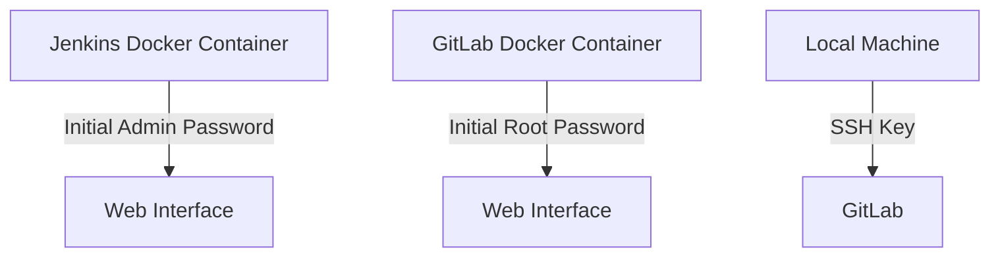

## Initializing the Setup for Automated Security Testing

### Jenkins Docker Instance and Initial Admin Password

When setting up Jenkins as a Docker container, one of the first steps is to retrieve the initial admin password. Jenkins automatically generates this password and stores it in a specific file within the Jenkins volume. Let's break down the process step-by-step.

#### Retrieving the Initial Admin Password

The initial admin password is stored in the following path within the Jenkins volume:

```
/var/jenkins_home/secrets/initialAdminPassword
```

To access this file, you can use the `cat` command. However, since we are working with a Docker container, we need to use the `docker exec` command to execute the `cat` command inside the running Jenkins container.

```bash
docker exec <jenkins_container_id> cat /var/jenkins_home/secrets/initialAdminPassword
```

Here, `<jenkins_container_id>` is the ID of the running Jenkins container. You can find the container ID by listing the running Docker containers using the `docker ps` command.

```bash
docker ps
```

This command will display a list of running Docker containers along with their IDs. Identify the Jenkins container from this list and use its ID in the `docker exec` command.

### Verifying Running Docker Containers

Before proceeding to the web interface, it's important to verify that all necessary services are running correctly. In this case, we are interested in ensuring that the Jenkins and GitLab services are up and running.

```bash
docker ps
```

The output of this command should show the running Docker containers, including Jenkins and GitLab. Each container will have a unique ID, name, image, and status. Ensure that both Jenkins and GitLab are listed and have a status indicating they are running.

### Accessing the Jenkins Web Interface

Once the Jenkins service is confirmed to be running, you can access the Jenkins web interface. Typically, Jenkins runs on port 8080, so you would navigate to `http://localhost:8080` or the appropriate hostname/IP address where Jenkins is hosted.

### Configuring GitLab

Next, we need to configure GitLab. GitLab is a popular open-source platform for managing Git repositories, providing features such as issue tracking, code review, and continuous integration/continuous deployment (CI/CD).

#### Accessing GitLab

To access GitLab, open a web browser and navigate to the address `http://gitlab.demo.local`. This is the URL configured for the GitLab instance in this setup.

#### Setting the Initial Root Password

Upon accessing GitLab for the first time, you will be prompted to set an initial password for the root account. This is a critical step for securing the GitLab instance.

```plaintext
Username: root
Password: [Choose a strong password]
Confirm Password: [Re-enter the strong password]
```

It is crucial to choose a strong password, even for a demo instance, to practice good security habits. A strong password typically includes a combination of uppercase and lowercase letters, numbers, and special characters.

After setting the password, click on the "Apply" button to proceed. You may also have the option to save the password, but it is generally recommended to avoid saving passwords in browsers for security reasons.

#### Logging into GitLab

With the initial password set, you can now log into GitLab using the username `root` and the password you just created.

```plaintext
Username: root
Password: [The strong password you set]
```

Click on the "Sign in" button to log into the GitLab instance.

### Adding SSH Keys for Code Pushing

To enable pushing code to the Git server, you need to add your personal SSH key to GitLab. This allows you to authenticate and push code without needing to enter a password each time.

#### Generating SSH Keys

If you haven't already generated an SSH key pair, you can do so using the `ssh-keygen` command.

```bash
ssh-keygen -t rsa -b 4096 -C "your_email@example.com"
```

This command will generate an RSA key pair with a bit length of 4096 and associate it with your email address. The keys will be stored in the `~/.ssh` directory.

#### Adding SSH Key to GitLab

To add your SSH key to GitLab, follow these steps:

1. **Navigate to Settings**: Click on the user icon in the upper-right corner and select "Settings."
2. **SSH Keys**: In the left-side menu, click on "SSH Keys."
3. **Paste Public Key**: Copy your public SSH key (located at `~/.ssh/id_rsa.pub`) and paste it into the "Key" field.
4. **Add Key**: Click on the "Add key" button to add your SSH key to GitLab.

### Diagramming the Setup

Let's visualize the setup using a Mermaid diagram to better understand the architecture.



### Common Pitfalls and How to Prevent Them

#### Weak Passwords

**What:** Using weak passwords for the initial admin account or root account in GitLab.
**Why:** Weak passwords are easily guessable and can lead to unauthorized access.
**How to Prevent:**
- Always use strong passwords that include a mix of uppercase and lowercase letters, numbers, and special characters.
- Consider using a password manager to generate and store complex passwords.

#### Missing SSH Keys

**What:** Forgetting to add SSH keys to GitLab.
**Why:** Without SSH keys, you won't be able to push code to the Git server securely.
**How to Prevent:**
- Ensure you generate SSH keys and add them to GitLab during the initial setup.
- Verify that the SSH keys are correctly configured by attempting to clone a repository.

### Real-World Examples and CVEs

#### CVE-2021-22205: Jenkins Pipeline Script Security Bypass

In 2021, a critical vulnerability was discovered in Jenkins that allowed attackers to bypass script security restrictions. This vulnerability could potentially allow unauthorized access to the Jenkins environment.

**Impact:** An attacker could execute arbitrary code on the Jenkins server.
**Mitigation:**
- Keep Jenkins and all plugins up to date.
- Regularly review and update security policies.
- Implement strict access controls and monitoring.

#### CVE-2020-10189: GitLab Remote Code Execution

In 2020, a remote code execution vulnerability was found in GitLab. This vulnerability could allow an attacker to execute arbitrary code on the GitLab server.

**Impact:** An attacker could gain full control of the GitLab server.
**Mitigation:**
- Keep GitLab and all dependencies up to date.
- Implement strict access controls and monitoring.
- Regularly review and update security policies.

### Secure Coding Practices

#### Vulnerable Code Example

```yaml
# Jenkinsfile (Vulnerable)
pipeline {
    agent any
    stages {
        stage('Build') {
            steps {
                sh 'echo Building...'
            }
        }
    }
}
```

#### Secure Code Example

```yaml
# Jenkinsfile (Secure)
pipeline {
    agent any
    stages {
        stage('Build') {
            steps {
                script {
                    withCredentials([usernamePassword(credentialsId: 'my-credentials', usernameVariable: 'USERNAME', passwordVariable: 'PASSWORD')]) {
                        sh 'echo Building... && echo $USERNAME $PASSWORD'
                    }
                }
            }
        }
    }
}
```

### Configuration Hardening

#### Jenkins Configuration

Ensure that Jenkins is properly hardened by implementing the following configurations:

```yaml
# Jenkins Configuration (Secure)
securityRealm:
  local:
    allowAnonymousReadAccess: false
    disableSignup: true
    enableCSRFProtection: true
authorizationStrategy:
  global:
    anonymous: []
    authenticated: ['read', 'write']
```

#### GitLab Configuration

Ensure that GitLab is properly hardened by implementing the following configurations:

```yaml
# GitLab Configuration (Secure)
gitlab_rails['initial_root_password'] = 'strong_password'
gitlab_rails['gitlab_shell_ssh_port'] = 22
gitlab_rails['gitlab_shell_secret_token'] = 'secret_token'
```

### Detection and Monitoring

#### Jenkins Monitoring

Use tools like the Jenkins Security Scanner to regularly monitor and detect potential vulnerabilities.

```bash
# Jenkins Security Scanner
java -jar jenkins-security-scanner.jar --url http://localhost:8080 --username admin --password admin
```

#### GitLab Monitoring

Use tools like GitLab Security Dashboard to monitor and detect potential vulnerabilities.

```bash
# GitLab Security Dashboard
curl --header "PRIVATE-TOKEN: <your_access_token>" "https://gitlab.demo.local/api/v4/projects/<project_id>/security/dependency_scanning"
```

### Practice Labs

For hands-on experience with setting up and securing Jenkins and GitLab, consider the following labs:

- **PortSwigger Web Security Academy**: Offers comprehensive training on web application security.
- **OWASP Juice Shop**: A deliberately insecure web application for practicing security testing.
- **DVWA (Damn Vulnerable Web Application)**: A PHP/MySQL web application that is riddled with vulnerabilities for educational purposes.
- **WebGoat**: An interactive, gamified training application for learning about web application security.

By following these detailed steps and best practices, you can ensure a secure and efficient setup for automated security testing using Jenkins and GitLab.

---
<!-- nav -->
[[02-Initializing the Setup for Automated Security Testing Part 2|Initializing the Setup for Automated Security Testing Part 2]] | [[DevSecOps/DevSecOps Bootcamp/05-Application Security Testing/06-Initializing the Setup for Automated Security Testing/Demo Setting up the Demo Lab/00-Overview|Overview]] | [[04-Initializing the Setup for Automated Security Testing Part 4|Initializing the Setup for Automated Security Testing Part 4]]
