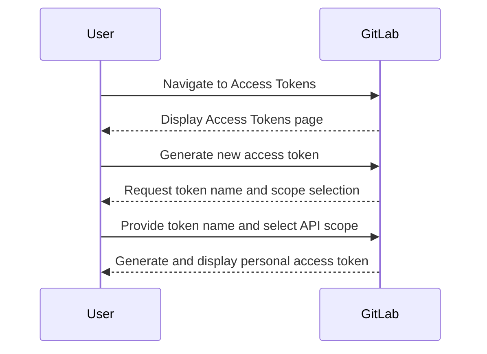
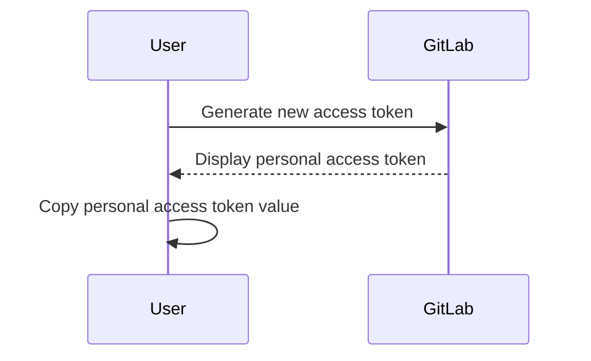
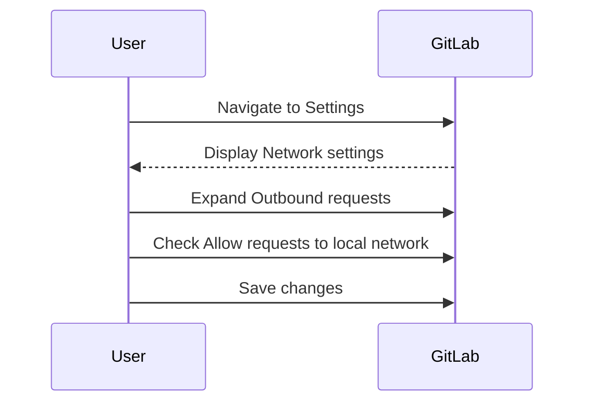
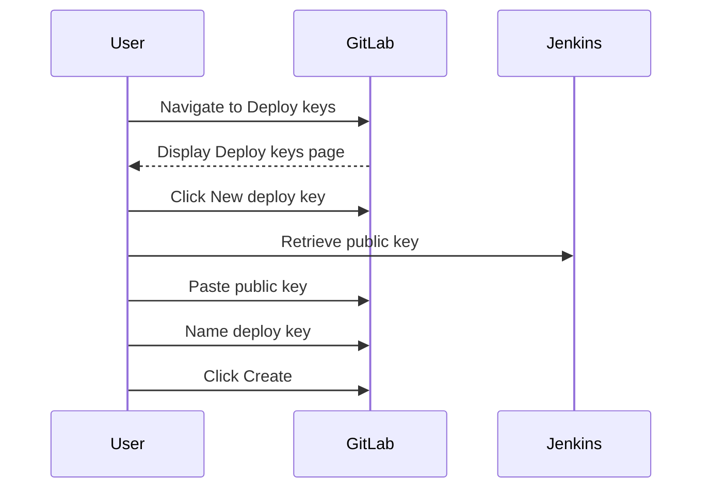
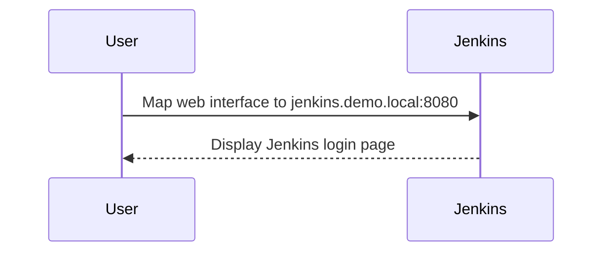

## Initializing the Setup for Automated Security Testing

### Access Tokens and API Keys

Access tokens and API keys are fundamental components in modern DevSecOps environments. They enable secure communication between different systems and services, such as Jenkins and GitLab in this case. An **API key** is a unique identifier used to authenticate and authorize access to an application programming interface (API). In the context of Jenkins and GitLab, the API key allows Jenkins to interact with GitLab's API securely.

#### Why Use Access Tokens?

Access tokens provide a layer of security by allowing controlled access to specific resources. Instead of using hardcoded credentials, which can be easily compromised, access tokens can be revoked or regenerated without affecting other parts of the system. This is particularly important in automated workflows where systems need to communicate with each other frequently.

#### How to Generate an Access Token in GitLab

To generate an access token in GitLab:

1. Navigate to the **Access Tokens** section in the GitLab settings.
2. Click on **Generate a new access token**.
3. Provide a name for the access token.
4. Select the appropriate **scopes**. In this case, select **API** to allow Jenkins to interact with GitLab's API.
5. Click on **Create personal access token**.



#### Copying the Access Token

After generating the access token, it is crucial to copy the token value immediately. This token will be used to configure Jenkins to interact with GitLab's API.



### Configuring Outbound Requests in GitLab

To ensure that Jenkins can communicate with GitLab via webhooks, it is necessary to configure the outbound requests settings in GitLab.

#### Why Configure Outbound Requests?

Webhooks are essential for automating workflows. They allow GitLab to notify Jenkins whenever certain events occur, such as code pushes or merge requests. By enabling requests to the local network from webhooks and services, you ensure that these notifications can be sent successfully.

#### Steps to Configure Outbound Requests

1. Navigate to the **Settings** section in GitLab.
2. Go to the **Network** subsection.
3. Expand the **Outbound requests** section.
4. Ensure that the checkbox for **Allow requests to the local network from webhooks and services** is checked.
5. Click on **Save changes**.



### Deploy Keys

Deploy keys are SSH keys that allow a specific server (in this case, Jenkins) to access a Git repository hosted on GitLab. This setup ensures that Jenkins can pull code from GitLab without needing to store user credentials.

#### Why Use Deploy Keys?

Deploy keys provide a secure way to grant limited access to a specific server. Unlike personal SSH keys, deploy keys are tied to a specific project and can be revoked independently. This reduces the risk of unauthorized access and simplifies key management.

#### Steps to Add a Deploy Key

1. Navigate to the **Deploy keys** section in GitLab.
2. Click on **New deploy key**.
3. Paste the public key from Jenkins.
4. Name the deploy key (e.g., Jenkins read-only deployment key).
5. Click on **Create**.



### Configuring Jenkins

Once GitLab is configured, the next step is to set up Jenkins to work with GitLab.

#### Mapping Jenkins Web Interface

To access Jenkins, you need to map its web interface to a specific URL. In this case, the URL is `jenkins.demo.local` on port `8080`.



#### Accessing Jenkins

Open the mapped URL (`http://jenkins.demo.local:8080`) in a web browser to access the Jenkins dashboard.

### Real-World Examples and Security Implications

#### Recent CVEs and Breaches

One notable example is the **CVE-2021-25283**, which affected Jenkins and allowed attackers to execute arbitrary code through malicious plugins. This highlights the importance of securing communication channels and ensuring that all components are properly configured and updated.

#### Secure Configuration Practices

To prevent such vulnerabilities, it is crucial to follow secure configuration practices:

1. **Use Strong Authentication**: Always use strong authentication mechanisms like OAuth tokens instead of plain passwords.
2. **Limit Permissions**: Ensure that access tokens and deploy keys have the minimum necessary permissions.
3. **Regular Updates**: Keep all software components, including Jenkins and GitLab, up to date with the latest security patches.

### How to Prevent / Defend

#### Detection

To detect potential security issues:

1. **Monitor Logs**: Regularly review logs for unusual activity.
2. **Use Security Tools**: Utilize tools like **SonarQube** for static code analysis and **OWASP ZAP** for dynamic analysis.

#### Prevention

To prevent security issues:

1. **Secure Configuration**: Follow the steps outlined above to ensure proper configuration of access tokens, deploy keys, and webhooks.
2. **Regular Audits**: Conduct regular security audits to identify and mitigate vulnerabilities.

#### Secure Coding Fixes

Here is an example of a vulnerable configuration and its secure counterpart:

**Vulnerable Configuration:**

```yaml
# Jenkinsfile (Vulnerable)
pipeline {
    agent any
    stages {
        stage('Build') {
            steps {
                sh 'git clone https://github.com/example/repo.git'
            }
        }
    }
}
```

**Secure Configuration:**

```yaml
# Jenkinsfile (Secure)
pipeline {
    agent any
    environment {
        GIT_CREDENTIALS = credentials('git-credentials-id')
    }
    stages {
        stage('Build') {
            steps {
                git branch: 'main', credentialsId: 'git-credentials-id', url: 'https://github.com/example/repo.git'
            }
        }
    }
}
```

### Complete Example

#### Full HTTP Request and Response

Here is an example of a full HTTP request and response for creating a webhook in GitLab:

**HTTP Request:**

```http
POST /api/v4/projects/:id/hooks HTTP/1.1
Host: gitlab.example.com
Authorization: Bearer <access_token>
Content-Type: application/json

{
  "url": "http://jenkins.demo.local:8080/github-webhook/"
}
```

**HTTP Response:**

```http
HTTP/1.1 201 Created
Content-Type: application/json

{
  "id": 1,
  "url": "http://jenkins.demo.local:8080/github-webhook/",
  "created_at": "2023-10-01T12:00:00Z"
}
```

### Hands-On Labs

For practical experience, consider the following labs:

- **PortSwigger Web Security Academy**: Offers comprehensive labs on web security.
- **OWASP Juice Shop**: A deliberately insecure web app for practicing security testing.
- **DVWA (Damn Vulnerable Web Application)**: Another popular web app for learning security testing.
- **WebGoat**: An interactive training application for learning about web application security.

These labs provide a hands-on approach to understanding and implementing secure configurations in a DevSecOps environment.

### Conclusion

Setting up automated security testing involves several critical steps, including generating access tokens, configuring outbound requests, adding deploy keys, and setting up Jenkins. Each step is crucial for ensuring secure and efficient communication between different systems. By following the detailed steps and best practices outlined above, you can effectively initialize your setup for automated security testing.

---
<!-- nav -->
[[03-Initializing the Setup for Automated Security Testing Part 3|Initializing the Setup for Automated Security Testing Part 3]] | [[DevSecOps/DevSecOps Bootcamp/05-Application Security Testing/06-Initializing the Setup for Automated Security Testing/Demo Setting up the Demo Lab/00-Overview|Overview]] | [[05-Initializing the Setup for Automated Security Testing Part 5|Initializing the Setup for Automated Security Testing Part 5]]
