## Initializing the Setup for Automated Security Testing

### Background Theory

Automated security testing is a critical component of modern DevSecOps practices. It involves automating the process of identifying vulnerabilities and weaknesses in software applications. Jenkins, an open-source automation server, is widely used for continuous integration and continuous delivery (CI/CD) pipelines. In this setup, we will initialize Jenkins and configure it for automated security testing.

### Initial Setup Steps

#### Admin Password Entry

The first step in setting up Jenkins is to enter the initial admin password. This password is typically generated during the installation process and is required to unlock Jenkins. Here’s how it works:

1. **Password Generation**: During the installation process, Jenkins generates a random password. This password is stored in a file on the server, usually located at `/var/lib/jenkins/secrets/initialAdminPassword`.

2. **Entering the Password**:
    - Open your browser and navigate to `http://<jenkins-server>:8080`.
    - You will be prompted to enter the initial admin password.
    - Copy the password from the file and paste it into the prompt.

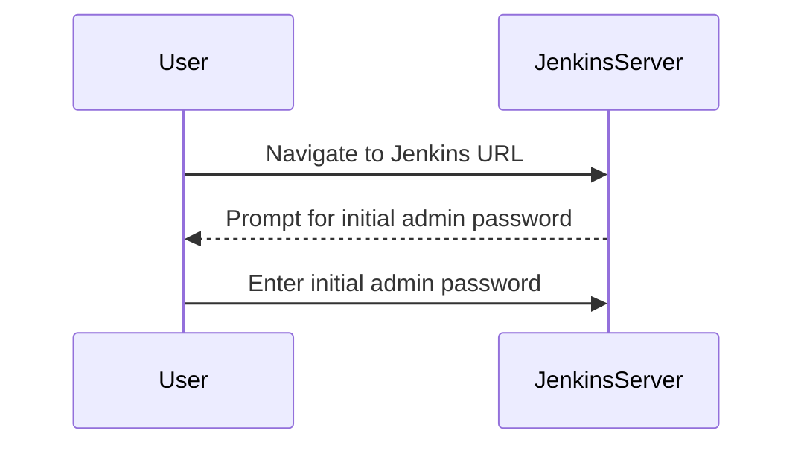

#### Saving the Password

It is crucial not to save the initial admin password. This is because the password is intended to be used only once to unlock Jenkins. Saving it could lead to unauthorized access if the saved password is compromised.

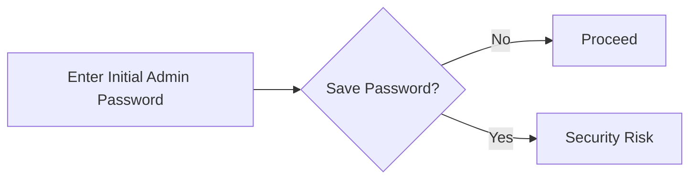

### Installing Suggested Plugins

After entering the initial admin password, Jenkins prompts you to install suggested plugins. These plugins provide various functionalities that can be useful for setting up Jenkins for automated security testing.

1. **Selecting Plugins**:
    - Click on "Install suggested plugins".
    - This will install a set of commonly used plugins that are useful for setting up Jenkins.

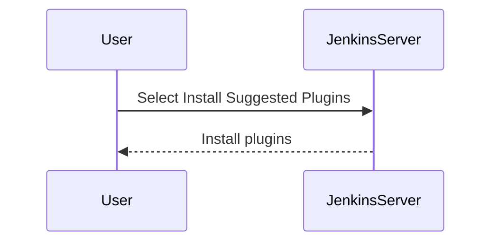

#### Why Not All Plugins Are Needed

While installing suggested plugins simplifies the setup process, it is important to note that not all plugins are necessary for your specific use case. Installing unnecessary plugins can increase the attack surface and introduce potential vulnerabilities.

### Generating a Jenkins User

Once the plugins are installed, the next step is to generate a Jenkins user. This involves creating a username, a strong password, and providing an email address.

1. **Creating a Username**:
    - Choose a unique username that does not contain sensitive information.
    - Example: `jenkinsadmin`.

2. **Strong Password**:
    - Ensure the password is strong and follows best practices for password creation.
    - Example: `P@ssw0rd!123`.

3. **Email Address**:
    - Provide a valid email address for notifications and recovery purposes.
    - Example: `jenkinsadmin@example.com`.

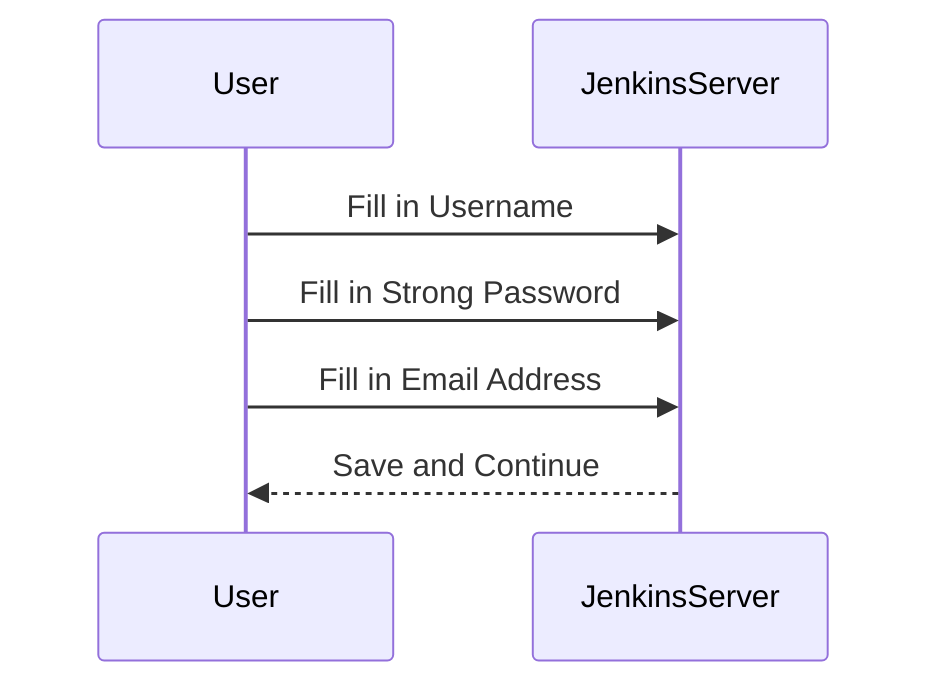

### Configuring Jenkins URL

Jenkins will pre-populate the Jenkins URL based on the server's IP address or hostname. Verify that the URL is correct and proceed to save and finish the setup.

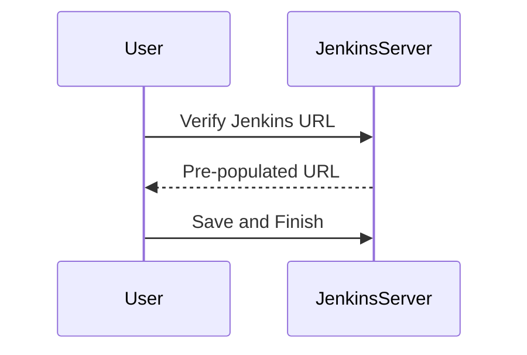

### Accessing Jenkins Web Interface

After completing the setup, you can access the Jenkins web interface by clicking on "Start Using Jenkins". This will take you to the main dashboard where you can manage Jenkins configurations.

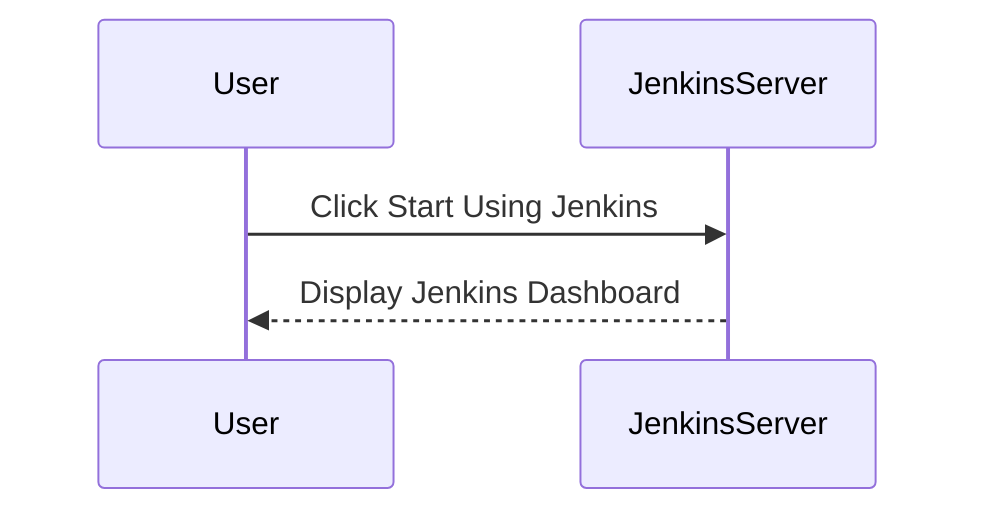

### Managing Jenkins

To manage Jenkins, click on "Manage Jenkins" on the left-hand side of the dashboard. This will allow you to configure various settings and plugins.

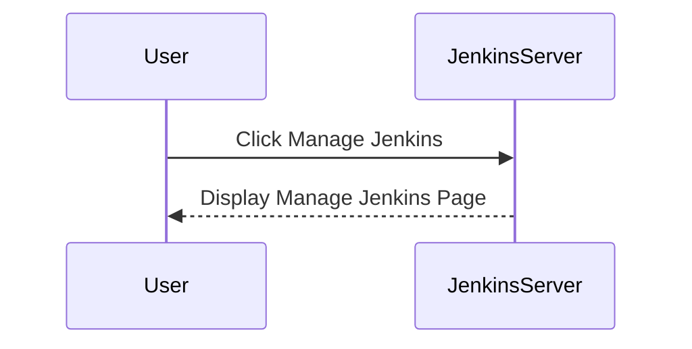

### Managing Plugins

Click on "Manage Plugins" to manage the installed plugins. This includes updating and installing new plugins.


#### Updating Plugins

Check for available updates and install them to ensure that Jenkins is running the latest versions of the plugins.

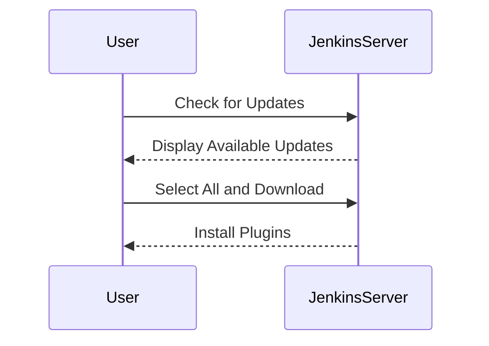

### Restarting Jenkins

Sometimes, Jenkins may require a restart to apply changes. This can be done by reloading the page or manually restarting the Jenkins service.

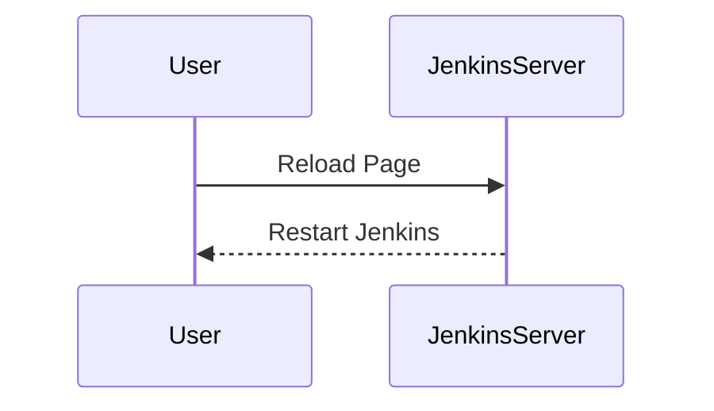

### Installing Additional Plugins

For automated security testing, you may need to install additional plugins such as the "OWASP Dependency-Check Plugin" or "Fortify Software Security Center".

1. **Selecting the Tab**:
    - Click on the "Available" tab to browse and install additional plugins.

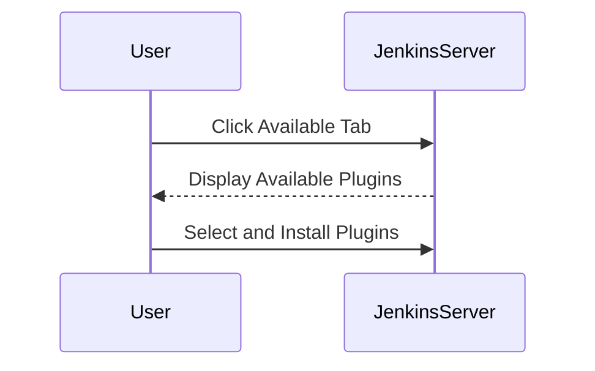

### How to Prevent / Defend

#### Detection

Regularly monitor Jenkins logs and audit trails to detect any unauthorized access attempts or suspicious activities.

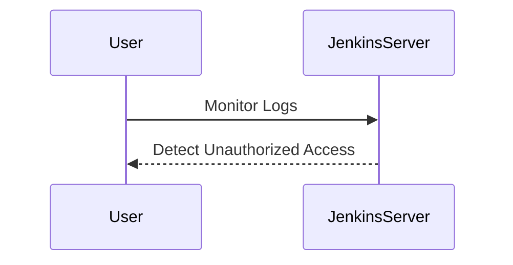

#### Prevention

1. **Secure Password Management**:
    - Use strong passwords and avoid saving them.
    - Consider using a password manager to generate and store complex passwords.

2. **Limit Plugin Installation**:
    - Only install necessary plugins to reduce the attack surface.
    - Regularly review and remove unused plugins.

3. **Regular Updates**:
    - Keep Jenkins and plugins updated to the latest versions.
    - Enable automatic updates if possible.

4. **Access Control**:
    - Implement role-based access control (RBAC) to restrict access to Jenkins.
    - Use SSH keys for authentication instead of passwords.

5. **Network Segmentation**:
    - Isolate Jenkins servers in a separate network segment.
    - Use firewalls to restrict access to Jenkins.

### Real-World Examples

#### CVE-2018-11248

In 2018, a critical vulnerability was discovered in Jenkins (CVE-2018-11248). This vulnerability allowed attackers to execute arbitrary code on the Jenkins server by exploiting a flaw in the Jenkins CLI.

**Impact**:
- Attackers could gain full control of the Jenkins server.
- This could lead to data theft, unauthorized access to build jobs, and disruption of CI/CD pipelines.

**Mitigation**:
- Update Jenkins to the latest version.
- Disable the Jenkins CLI if it is not needed.
- Implement network segmentation and access controls.

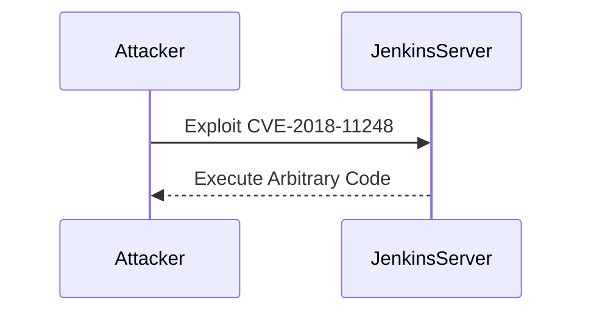

### Complete Example

#### Full HTTP Request and Response

Here is an example of a full HTTP request and response when accessing Jenkins:

**HTTP Request**:
```http
GET /jenkins HTTP/1.1
Host: <jenkins-server>
User-Agent: curl/7.64.1
Accept: */*
Authorization: Basic <base64-encoded-username-password>
```

**HTTP Response**:
```http
HTTP/1.1 200 OK
Date: Mon, 01 Jan 2024 00:00:00 GMT
Server: Jetty(9.4.35.v20201120)
Content-Type: text/html;charset=UTF-8
Content-Length: 12345

<!DOCTYPE html>
<html>
<head>
    <title>Jenkins</title>
</head>
<body>
    <!-- Jenkins HTML content -->
</body>
</html>
```

### Secure Coding Fixes

#### Vulnerable Code

```java
public class JenkinsController {
    public void authenticate(String username, String password) {
        // Vulnerable code: No validation or hashing of password
        if (username.equals("admin") && password.equals("password")) {
            System.out.println("Authentication successful");
        } else {
            System.out.println("Authentication failed");
        }
    }
}
```

#### Secure Code

```java
import java.security.MessageDigest;
import java.security.NoSuchAlgorithmException;

public class JenkinsController {
    public void authenticate(String username, String password) throws NoSuchAlgorithmException {
        // Secure code: Hash the password before comparison
        MessageDigest md = MessageDigest.getInstance("SHA-256");
        byte[] hashedPassword = md.digest(password.getBytes());
        
        if (username.equals("admin") && Arrays.equals(hashedPassword, new byte[]{ /* hashed password bytes */ })) {
            System.out.println("Authentication successful");
        } else {
            System.out.println("Authentication failed");
        }
    }
}
```

### Configuration Hardening

#### Jenkins Configuration File

Here is an example of a hardened Jenkins configuration file (`config.xml`):

```xml
<?xml version='1.0' encoding='UTF-8'?>
<jenkins>
  <securityRealm class="hudson.security.HudsonPrivateSecurityRealm">
    <disableSignup>true</disableSignup>
    <useSecurity>true</useSecurity>
    <users>
      <hudson.tasks.Maven.MavenInstallation>
        <name>Maven 3.8.1</name>
        <home>/usr/local/maven</home>
      </hudson.tasks.Maven.MavenInstallation>
    </users>
  </securityRealm>
  <authorizationStrategy class="hudson.security.FullControlOnceLoggedInAuthorizationStrategy"/>
  <useSecurity>true</useSecurity>
</jenkins>
```

### Practice Labs

For hands-on practice with Jenkins and automated security testing, consider the following labs:

- **PortSwigger Web Security Academy**: Offers interactive labs for learning web application security.
- **OWASP Juice Shop**: A deliberately insecure web application for practicing security testing.
- **DVWA (Damn Vulnerable Web Application)**: A PHP/MySQL web application that is riddled with vulnerabilities.
- **WebGoat**: An interactive, gamified training application for learning about web application security.

These labs provide practical experience in setting up and securing Jenkins for automated security testing.

### Conclusion

Initializing Jenkins for automated security testing involves several steps, including entering the initial admin password, installing plugins, generating a Jenkins user, and configuring Jenkins. By following best practices and implementing security measures, you can ensure that Jenkins is securely configured and ready for automated security testing.

---
<!-- nav -->
[[04-Initializing the Setup for Automated Security Testing Part 4|Initializing the Setup for Automated Security Testing Part 4]] | [[DevSecOps/DevSecOps Bootcamp/05-Application Security Testing/06-Initializing the Setup for Automated Security Testing/Demo Setting up the Demo Lab/00-Overview|Overview]] | [[06-Initializing the Setup for Automated Security Testing Part 6|Initializing the Setup for Automated Security Testing Part 6]]
