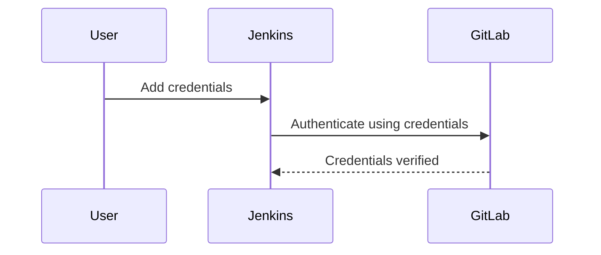
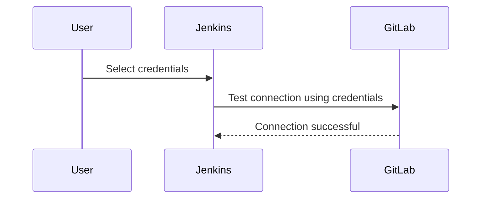
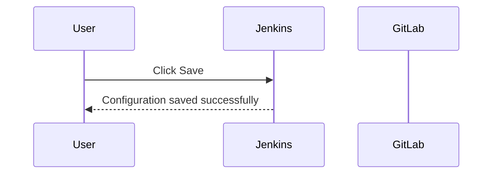
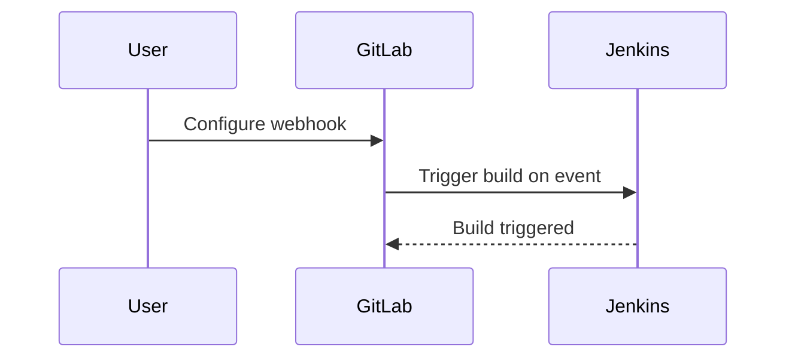
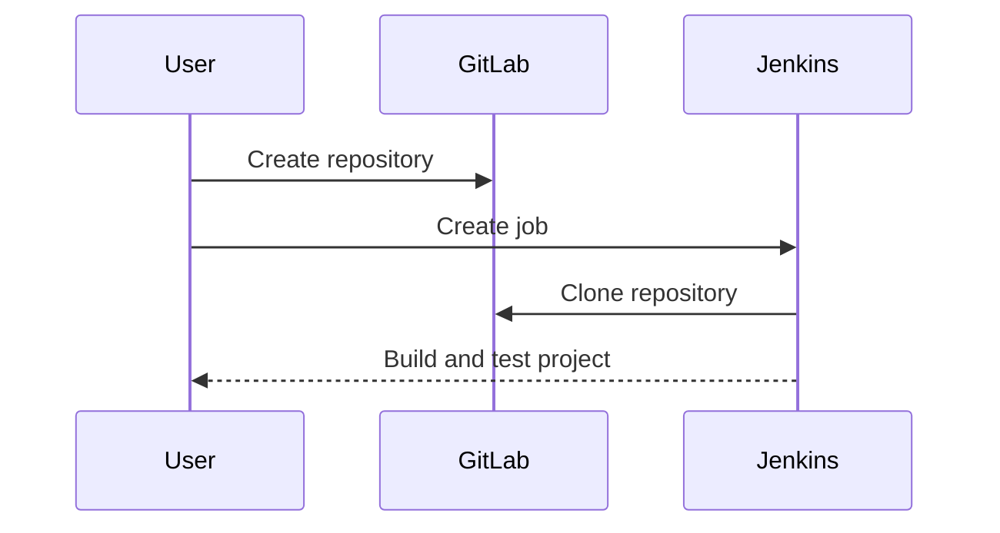

## Initializing the Setup for Automated Security Testing

### Background Theory

Automated security testing is a critical component of modern DevSecOps practices. It allows teams to identify and mitigate security vulnerabilities early in the development lifecycle, reducing the risk of security breaches and ensuring that applications are secure before they go live. This process typically involves setting up continuous integration (CI) and continuous delivery (CD) pipelines that integrate security testing tools and processes.

In this context, Jenkins and GitLab are two popular tools used for automating the build and deployment processes. Jenkins is an open-source automation server that provides hundreds of plugins to support building, deploying, and automating any project. GitLab, on the other hand, is a DevOps platform that offers a wide range of features including source code management, CI/CD, issue tracking, and more.

### Setting Up Credentials in Jenkins

Before we can configure Jenkins to interact with GitLab, we need to set up the necessary credentials. These credentials allow Jenkins to authenticate with GitLab and perform actions such as cloning repositories, pushing changes, and triggering builds.

#### Step-by-Step Process

1. **Add Credentials**: Navigate to the Jenkins dashboard and go to `Credentials` under the `Manage Jenkins` section. Click on `Global credentials (unsecured)` and then `Add Credentials`.

2. **Enter Details**: Fill in the required details:
   - **Scope**: Global
   - **Username**: Your GitLab username
   - **Password**: Your GitLab personal access token (PAT)

3. **Save Credentials**: Click `OK` to save the credentials.

#### Example Code



### Testing the Connection

Once the credentials are added, it's essential to test the connection to ensure that Jenkins can successfully communicate with GitLab.

#### Step-by-Step Process

1. **Select Credentials**: Go back to the `Credentials` page and select the credentials you just added.

2. **Test Connection**: Click on `Test Connection`. If everything is set up correctly, you should see a message indicating that the credentials were verified.

#### Example Code



### Saving the Configuration

After verifying the connection, it's important to save the configuration to ensure that Jenkins retains the settings.

#### Step-by-Step Process

1. **Click Save**: Once the connection is verified, click on `Save` to finalize the configuration.

2. **Confirmation**: You should see a confirmation message indicating that the configuration was saved successfully.

#### Example Code



### Configuring GitLab

While Jenkins handles the CI/CD pipeline, GitLab is responsible for managing the source code and triggering the builds. To ensure seamless integration, we need to configure GitLab to work with Jenkins.

#### Step-by-Step Process

1. **Navigate to Project Settings**: Go to your GitLab project and navigate to the `Settings` tab.

2. **Webhooks**: Under `Integrations`, find the `Webhooks` section and click on `Add webhook`.

3. **Enter URL**: Enter the URL of your Jenkins instance followed by `/gitlab-webhook/`.

4. **Token**: Optionally, you can add a secret token for additional security.

5. **Trigger Events**: Select the events that should trigger the webhook (e.g., push events).

6. **Save**: Click `Add webhook` to save the configuration.

#### Example Code



### Setting Up Demo Projects

With the initial setup complete, we can now proceed to set up our demo projects. This involves creating new repositories in GitLab and configuring Jenkins to build and test these projects automatically.

#### Step-by-Step Process

1. **Create Repository**: In GitLab, create a new repository for your demo project.

2. **Configure Jenkins Job**: In Jenkins, create a new job and configure it to clone the repository from GitLab.

3. **Add Build Steps**: Define the build steps, including any security tests you want to run.

4. **Save and Run**: Save the job configuration and run it to verify that everything is working as expected.

#### Example Code



### Real-World Examples

To illustrate the importance of automated security testing, let's look at some recent real-world examples:

#### Example 1: CVE-2021-21972

**Description**: A vulnerability in Jenkins allowed attackers to execute arbitrary code on the Jenkins server.

**Impact**: This vulnerability could lead to unauthorized access, data theft, and system compromise.

**Mitigation**: Ensure that Jenkins is kept up-to-date with the latest security patches and that unnecessary plugins are removed.

#### Example 2: CVE-2020-10188

**Description**: A vulnerability in GitLab allowed attackers to bypass authentication and gain unauthorized access to the system.

**Impact**: This vulnerability could result in unauthorized access to sensitive information and potential data breaches.

**Mitigation**: Regularly update GitLab to the latest version and enable two-factor authentication (2FA) for all users.

### Common Pitfalls and How to Avoid Them

#### Pitfall 1: Outdated Software

**Explanation**: Using outdated versions of Jenkins and GitLab can leave your system vulnerable to known security issues.

**Prevention**: Always keep your software up-to-date with the latest security patches and updates.

#### Pitfall 2: Weak Authentication

**Explanation**: Using weak or default credentials can make it easy for attackers to gain unauthorized access.

**Prevention**: Use strong, unique passwords and enable multi-factor authentication (MFA) whenever possible.

#### Pitfall 3: Misconfigured Webhooks

**Explanation**: Incorrectly configured webhooks can lead to unintended behavior, such as triggering builds unnecessarily.

**Prevention**: Carefully review and test your webhook configurations to ensure they are set up correctly.

### How to Prevent / Defend

#### Detection

- **Regular Audits**: Conduct regular security audits to identify and address vulnerabilities.
- **Monitoring Tools**: Use monitoring tools to detect unusual activity and potential security breaches.

#### Prevention

- **Secure Coding Practices**: Follow secure coding practices to minimize the risk of introducing vulnerabilities.
- **Configuration Hardening**: Harden the configuration of both Jenkins and GitLab to reduce the attack surface.

#### Secure-Coding Fixes

##### Vulnerable Code

```yaml
# Jenkinsfile (Vulnerable)
pipeline {
    agent any
    stages {
        stage('Build') {
            steps {
                sh 'npm install'
            }
        }
    }
}
```

##### Secure Code

```yaml
# Jenkinsfile (Secure)
pipeline {
    agent any
    environment {
        PATH = '/usr/local/bin:${PATH}'
    }
    stages {
        stage('Build') {
            steps {
                sh 'npm install --audit'
            }
        }
    }
}
```

### Conclusion

Setting up automated security testing with Jenkins and GitLab is a crucial step in ensuring the security of your applications. By following the steps outlined above and being aware of common pitfalls, you can effectively integrate security into your DevSecOps pipeline. Remember to regularly review and update your configurations to stay ahead of potential threats.

### Practice Labs

For hands-on practice, consider the following labs:

- **PortSwigger Web Security Academy**: Offers a variety of labs focused on web application security.
- **OWASP Juice Shop**: A deliberately insecure web application for practicing web security skills.
- **DVWA (Damn Vulnerable Web Application)**: Another intentionally vulnerable web application for learning web security.
- **WebGoat**: An interactive, gamified training application for learning about web security.

These labs provide practical experience in setting up and securing CI/CD pipelines, making them invaluable resources for mastering DevSecOps practices.

---
<!-- nav -->
[[06-Initializing the Setup for Automated Security Testing Part 6|Initializing the Setup for Automated Security Testing Part 6]] | [[DevSecOps/DevSecOps Bootcamp/05-Application Security Testing/06-Initializing the Setup for Automated Security Testing/Demo Setting up the Demo Lab/00-Overview|Overview]] | [[08-Initializing the Setup for Automated Security Testing|Initializing the Setup for Automated Security Testing]]
