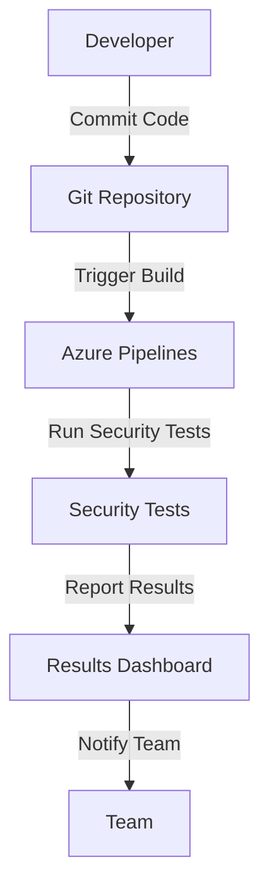

## Integrating Automated Security Testing into Azure Pipelines

### Introduction to Automated Security Testing

Automated security testing is an essential component of modern DevSecOps practices. It enables teams to identify and mitigate security vulnerabilities early in the development lifecycle, thereby reducing the risk of security breaches and ensuring the overall security posture of applications. In the context of Azure Pipelines, integrating automated security testing can be achieved through various methods, each with its own set of advantages and disadvantages.

### Control Over Security Test Results

One of the key considerations when integrating automated security testing is the level of control over the interpretation of test results. This control lies within the team itself, meaning that the team is responsible for analyzing and acting upon the results generated by the security tests. This level of control ensures that the team remains accountable for the security of their applications and can take immediate action to address any identified issues.

### Where to Run the Tests and How to Define Them

When integrating automated security testing into Azure Pipelines, one of the primary questions to consider is where to run the tests and how to define them. There are several approaches to achieve this:

1. **Native Approach**: Using built-in Azure syntax and functionality.
2. **Extensions**: Leveraging Azure Pipeline tasks provided by extensions.
3. **External Services**: Utilizing third-party services to perform security tests.

Each of these approaches has its own set of pros and cons, which we will explore in detail.

### Native Approach

#### Advantages

The native approach involves using built-in Azure syntax and functionality to define and run security tests. This method offers several advantages:

- **Full Control**: The team has complete control over the definition and execution of the security tests. They can choose the specific tools and configurations that best suit their needs.
- **No External Dependencies**: Apart from the testing tools themselves, there are no external dependencies. This reduces the complexity of the setup and ensures that the tests are tightly integrated with the rest of the pipeline.
- **Version Control**: Since the tests are defined in the YAML pipeline, they are automatically under version control. This ensures that changes to the tests are tracked and can be rolled back if necessary.
- **Existing Knowledge**: Teams can leverage their existing knowledge of automated security testing to define and configure the tests effectively.

#### Disadvantages

Despite its advantages, the native approach also has some drawbacks:

- **Complexity**: The pipeline definitions can become very elaborate, especially as the number of tests and their configurations increases. This complexity can make it difficult to maintain and understand the pipeline.
- **Tool Management**: Managing the testing tools and ensuring they are up-to-date can be challenging. This requires additional effort to keep the tools current and effective.

#### Example: Running Security Tests in Containers

To illustrate the native approach, let's consider an example where security tests are run in containers. This approach leverages Docker to ensure that the testing environment is consistent and isolated.

```yaml
# azure-pipelines.yml
trigger:
- main

pool:
  vmImage: 'ubuntu-latest'

jobs:
- job: SecurityTests
  pool:
    vmImage: 'ubuntu-latest'
  steps:
  - task: Docker@2
    inputs:
      command: 'build'
      dockerfile: '**/Dockerfile'
      tags: '$(Build.BuildId)'
  - script: |
      docker run --rm $(Build.BuildId)
    displayName: 'Run Security Tests'
```

In this example, the `Docker@2` task builds a Docker image based on the `Dockerfile` in the repository. The `script` step then runs the security tests inside the container. This ensures that the tests are executed in a consistent and isolated environment.

### Extensions

#### Advantages

Using extensions to integrate automated security testing into Azure Pipelines offers several advantages:

- **Ease of Use**: Extensions often provide pre-built tasks that simplify the process of defining and running security tests. This reduces the amount of custom configuration required.
- **Community Support**: Many extensions are developed and maintained by the community, which means they are regularly updated and improved based on user feedback.
- **Integration**: Extensions can seamlessly integrate with other Azure DevOps features, such as reporting and alerting.

#### Disadvantages

However, using extensions also has some drawbacks:

- **Dependency on Third Parties**: Relying on extensions means that the team is dependent on third parties for updates and support. This can introduce delays and potential compatibility issues.
- **Limited Customization**: While extensions can simplify the process, they may limit the ability to customize the tests to meet specific requirements.

### External Services

#### Advantages

Using external services to perform security tests offers several advantages:

- **Specialized Tools**: External services often provide specialized tools that are designed specifically for security testing. These tools can offer advanced features and capabilities that may not be available in the native approach.
- **Scalability**: External services can scale easily to handle large volumes of tests, which can be particularly useful for large organizations.
- **Expertise**: External services often have dedicated teams of security experts who can provide insights and recommendations based on the test results.

#### Disadvantages

However, using external services also has some drawbacks:

- **Cost**: External services can be expensive, especially for large-scale testing. This cost can be a significant factor for smaller organizations.
- **Data Privacy**: Using external services means that sensitive data may be exposed to third parties. This can raise concerns about data privacy and compliance.

### Real-World Examples

To illustrate the importance of integrating automated security testing into Azure Pipelines, let's consider some recent real-world examples:

- **CVE-2021-44228 (Log4j)**: This critical vulnerability affected millions of applications worldwide. By integrating automated security testing into Azure Pipelines, teams could have detected and mitigated this vulnerability early in the development cycle.
- **SolarWinds Supply Chain Attack**: This sophisticated attack compromised the software supply chain of SolarWinds, leading to widespread breaches. By integrating automated security testing, organizations could have detected and prevented such attacks.

### How to Prevent / Defend

#### Detection

To detect security vulnerabilities, teams should integrate automated security testing into their Azure Pipelines. This can be achieved through the following steps:

1. **Define Security Tests**: Use the native approach, extensions, or external services to define and configure security tests.
2. **Run Tests Regularly**: Ensure that security tests are run regularly as part of the build and deployment process.
3. **Monitor Results**: Monitor the results of the security tests and take immediate action to address any identified issues.

#### Prevention

To prevent security vulnerabilities, teams should implement the following measures:

1. **Secure Coding Practices**: Follow secure coding practices to minimize the introduction of vulnerabilities in the first place.
2. **Regular Updates**: Keep testing tools and configurations up-to-date to ensure that they are effective against the latest threats.
3. **Access Controls**: Implement strict access controls to ensure that only authorized personnel can modify the security tests and configurations.

#### Secure Code Fix

To illustrate the secure code fix, let's consider an example where a SQL injection vulnerability is detected in a web application. The following code demonstrates the vulnerable and secure versions of the code:

**Vulnerable Code**

```python
import sqlite3

def get_user(username):
    conn = sqlite3.connect('database.db')
    cursor = conn.cursor()
    query = f"SELECT * FROM users WHERE username = '{username}'"
    cursor.execute(query)
    result = cursor.fetchone()
    conn.close()
    return result
```

**Secure Code**

```python
import sqlite3

def get_user(username):
    conn = sqlite3.connect('database.db')
    cursor = conn.cursor()
    query = "SELECT * FROM users WHERE username = ?"
    cursor.execute(query, (username,))
    result = cursor.fetchone()
    conn.close()
    return result
```

In the secure version, parameterized queries are used to prevent SQL injection attacks.

### Complete Example: Full HTTP Request and Response

To illustrate a complete example, let's consider a scenario where a security test is run using an external service. The following code demonstrates the full HTTP request and response:

**HTTP Request**

```http
POST /api/v1/security-tests HTTP/1.1
Host: api.example.com
Content-Type: application/json
Authorization: Bearer <access_token>

{
  "test_name": "sql_injection",
  "target_url": "https://app.example.com/login",
  "payload": "' OR '1'='1"
}
```

**HTTP Response**

```http
HTTP/1.1 200 OK
Content-Type: application/json

{
  "status": "success",
  "result": {
    "vulnerability_found": true,
    "details": "SQL injection vulnerability detected"
  }
}
```

In this example, the HTTP request sends a payload to the external service to test for SQL injection vulnerabilities. The HTTP response indicates whether a vulnerability was found and provides details about the vulnerability.

### Mermaid Diagrams

To illustrate the architecture and flow of the security testing process, let's use a mermaid diagram:



This diagram illustrates the flow of the security testing process, from the developer committing code to the Git repository, triggering the build in Azure Pipelines, running the security tests, reporting the results, and notifying the team.

### Practice Labs

For hands-on practice with integrating automated security testing into Azure Pipelines, consider the following real-world labs:

- **PortSwigger Web Security Academy**: Offers a comprehensive set of labs for learning web security concepts and techniques.
- **OWASP Juice Shop**: Provides a vulnerable web application for practicing security testing and penetration testing.
- **DVWA (Damn Vulnerable Web Application)**: Offers a deliberately insecure web application for practicing security testing.

These labs provide practical experience in integrating automated security testing into Azure Pipelines and help reinforce the concepts learned in this chapter.

### Conclusion

Integrating automated security testing into Azure Pipelines is a crucial step in ensuring the security of applications throughout the development lifecycle. By leveraging the native approach, extensions, or external services, teams can effectively detect and mitigate security vulnerabilities. By following secure coding practices, keeping tools up-to-date, and implementing strict access controls, teams can prevent security vulnerabilities and ensure the overall security posture of their applications.

---
<!-- nav -->
[[DevSecOps/DevSecOps Bootcamp/05-Application Security Testing/07-Integrating Automated Security Testing into Azure Pipelines/02-Approaches on Integrating Automated Security Testing with Azure Pipelines/01-Introduction to Integrating Automated Security Testing into Azure Pipelines|Introduction to Integrating Automated Security Testing into Azure Pipelines]] | [[DevSecOps/DevSecOps Bootcamp/05-Application Security Testing/07-Integrating Automated Security Testing into Azure Pipelines/02-Approaches on Integrating Automated Security Testing with Azure Pipelines/00-Overview|Overview]] | [[DevSecOps/DevSecOps Bootcamp/05-Application Security Testing/07-Integrating Automated Security Testing into Azure Pipelines/02-Approaches on Integrating Automated Security Testing with Azure Pipelines/03-Practice Questions & Answers|Practice Questions & Answers]]
