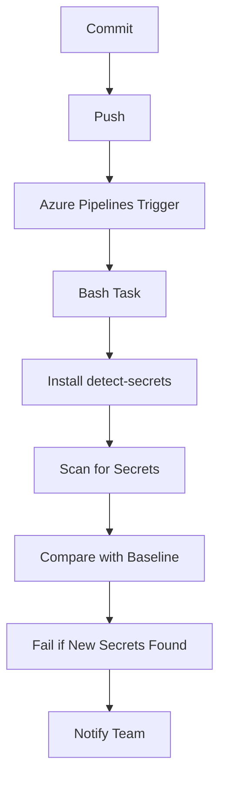

## Integrating Automated Security Testing into Azure Pipelines

### Background Theory

Automated security testing is a critical component of modern DevSecOps practices. It allows teams to identify and mitigate security vulnerabilities early in the development lifecycle, reducing the risk of security breaches and ensuring that applications are secure before they go live. One of the most common types of security issues that automated testing can catch is the presence of secrets (such as API keys, passwords, and other sensitive information) in the codebase.

Azure Pipelines is a powerful continuous integration and continuous delivery (CI/CD) platform provided by Microsoft. It integrates seamlessly with Azure DevOps and supports a wide range of tools and languages, making it an ideal choice for automating security testing in a DevSecOps environment.

### Creating a Simple File with Secrets

To demonstrate how automated security testing works in Azure Pipelines, let's start by creating a simple file that contains some sensitive information. In this case, we'll create a file named `users.yml` that contains a username and password.

```yaml
# users.yml
username: myuser
password: mypassword
```

This file simulates a scenario where developers might accidentally commit sensitive information into the codebase. The goal of automated security testing is to catch such issues before they become a problem.

### Adding the File to the Repository

Next, we need to add this file to our Git repository and commit it. This simulates the scenario where a developer might accidentally commit a file containing secrets.

```sh
git add users.yml
git commit -m "Add users.yml with username and password"
```

The commit message should follow conventional commit guidelines to ensure clarity and consistency.

### Pushing the Changes to the Repository

After committing the changes, we need to push them to the remote repository. This triggers the CI/CD pipeline configured in Azure Pipelines.

```sh
git push origin main
```

### Configuring Azure Pipelines

Now, let's configure Azure Pipelines to run an automated security test that detects secrets in the codebase. We'll use a tool called `detect-secrets` for this purpose.

#### Pipeline Configuration

First, we need to define the pipeline configuration in a YAML file. Here's an example of how the pipeline might look:

```yaml
# azure-pipelines.yml
trigger:
- main

pool:
  vmImage: 'ubuntu-latest'

steps:
- task: Bash@3
  inputs:
    targetType: 'inline'
    script: |
      pip install detect-secrets
      detect-secrets scan --baseline .secrets.baseline
```

This pipeline does the following:
1. Triggers on changes to the `main` branch.
2. Uses an Ubuntu virtual machine image.
3. Installs the `detect-secrets` tool.
4. Runs the `detect-secrets` tool to scan the codebase for secrets.

### Running the Pipeline

Once the pipeline is configured, pushing the changes to the repository will trigger the pipeline. The pipeline will execute the steps defined in the YAML file.

### Verifying the Results

After the pipeline runs, we can check the results to see if the secret was detected. In this case, since we added a file containing secrets without updating the baseline, the pipeline should fail.

#### Example Output

Here's an example of what the output might look like:

```plaintext
Starting: Bash Script
==============================================================================
Task         : Bash
Description  : Run a Bash script using an installed version of Bash or by downloading the latest version of Bash
Version      : 3.193.0
Author       : Microsoft Corporation
Help         : https://learn.microsoft.com/azure/devops/pipelines/tasks/utility/bash
==============================================================================
Generating script.
Script contents:
pip install detect-secrets
detect-secrets scan --baseline .secrets.baseline
========================== Starting Command Output ===========================
/usr/bin/bash --noprofile --norc /home/vsts/work/_temp/7b4b6d6b-8b4c-4e4e-ba8c-0b4c8b4c8b4c.sh
Collecting detect-secrets
  Downloading detect_secrets-0.14.0-py3-none-any.whl (21 kB)
Installing collected packages: detect-secrets
Successfully installed detect-secrets-0.14.0
Scanning...
Scanning done.
Baseline file: .secrets.baseline
New secrets found:
- users.yml:myuser
- users.yml:mypassword
Pipeline failed due to new secrets found.
Finishing: Bash Script
```

As you can see, the pipeline detected the secrets in the `users.yml` file and failed because the secrets were not part of the baseline.

### How to Prevent / Defend

#### Detection

To detect secrets in your codebase, you can use tools like `detect-secrets`. These tools scan your codebase for patterns that match known secret formats and alert you when they find something suspicious.

#### Prevention

To prevent secrets from being committed to the codebase, you can take several steps:

1. **Educate Developers**: Make sure developers understand the importance of keeping secrets out of the codebase and provide training on how to handle sensitive information securely.
2. **Use Environment Variables**: Store secrets in environment variables instead of hardcoding them in the code.
3. **Use Secret Management Tools**: Use tools like Azure Key Vault or HashiCorp Vault to manage secrets securely.
4. **Automated Scanning**: Integrate automated scanning tools into your CI/CD pipeline to detect secrets early.

#### Secure Coding Fixes

Here's an example of how to securely store secrets using environment variables:

**Vulnerable Code**

```python
# app.py
import os

username = "myuser"
password = "mypassword"

print(f"Username: {username}, Password: {password}")
```

**Secure Code**

```python
# app.py
import os

username = os.getenv("USERNAME")
password = os.getenv("PASSWORD")

print(f"Username: {username}, Password: {password}")
```

In the secure version, the secrets are stored in environment variables, which are not committed to the codebase.

### Real-World Examples

#### Recent Breaches

One recent example of a breach caused by secrets in the codebase is the Capital One data breach in 2019. The attacker gained access to sensitive data by exploiting a misconfigured web application firewall rule, which exposed a server that contained sensitive information, including secrets.

#### CVEs

Another example is CVE-2021-21972, which affected the Jenkins plugin ecosystem. The vulnerability allowed attackers to inject arbitrary code into Jenkins pipelines, potentially exposing secrets stored in the codebase.

### Mermaid Diagrams

#### Pipeline Topology



### Conclusion

Integrating automated security testing into Azure Pipelines is a crucial step in ensuring that your codebase remains secure. By using tools like `detect-secrets`, you can catch secrets early and prevent them from being committed to the codebase. This helps to reduce the risk of security breaches and ensures that your applications are secure before they go live.

### Practice Labs

For hands-on practice with integrating automated security testing into Azure Pipelines, consider the following labs:

- **PortSwigger Web Security Academy**: Offers a variety of labs focused on web application security, including automated security testing.
- **OWASP Juice Shop**: A deliberately insecure web application for security training purposes, which can be used to practice automated security testing.
- **DVWA (Damn Vulnerable Web Application)**: Another popular web application for security training, which can be used to practice automated security testing.

These labs provide a safe environment to practice and learn about automated security testing in Azure Pipelines.

---
<!-- nav -->
[[DevSecOps/DevSecOps Bootcamp/05-Application Security Testing/07-Integrating Automated Security Testing into Azure Pipelines/03-Demo Detecting a Secret in the Code Base/00-Overview|Overview]] | [[DevSecOps/DevSecOps Bootcamp/05-Application Security Testing/07-Integrating Automated Security Testing into Azure Pipelines/03-Demo Detecting a Secret in the Code Base/02-Practice Questions & Answers|Practice Questions & Answers]]
