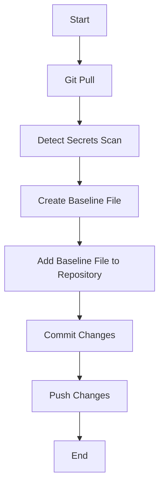
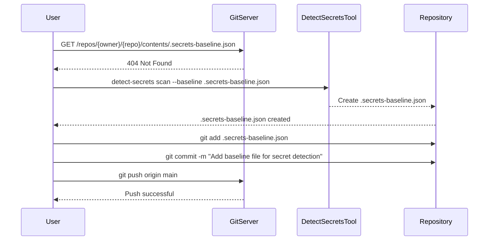

## Integrating Automated Security Testing into Azure Pipelines

### Background Theory

Automated security testing is an essential component of modern DevSecOps practices. By integrating security testing into continuous integration and continuous delivery (CI/CD) pipelines, organizations can catch vulnerabilities early in the development lifecycle, reducing the risk of security breaches and ensuring that applications are secure before they reach production.

Azure Pipelines is a powerful CI/CD platform provided by Microsoft, which allows developers to automate their build, test, and deployment processes. One of the key features of Azure Pipelines is the ability to integrate various security tools and tests into the pipeline, enabling automated detection of security issues.

### Secret Detection in Azure Pipelines

Secret detection is a critical aspect of automated security testing. Secrets, such as API keys, access tokens, and other sensitive information, should never be committed to version control systems like Git. However, it is common for developers to accidentally commit these secrets, leading to potential security risks.

#### Why Does It Fail?

In the context of the given transcript, the pipeline step failed because a required baseline file was missing. This baseline file, `.secrets-baseline.json`, is used to store known secrets that are intentionally committed to the repository. Without this file, the secret detection tool cannot differentiate between actual secrets and known safe entries.

Let's break down the failure:

1. **Baseline File Missing**: The pipeline step attempts to scan for new secrets using a baseline file (``.secrets-baseline.json``). However, this file is not present in the repository.
2. **Pipeline Execution**: The pipeline step fails because it cannot find the baseline file, causing the entire step to fail.

To understand this better, let's look at the full HTTP request and response involved in this process:

```http
GET /repos/{owner}/{repo}/contents/.secrets-baseline.json HTTP/1.1
Host: api.github.com
Authorization: Bearer <your-access-token>
Accept: application/vnd.github.v3+json
```

```http
HTTP/1.1 404 Not Found
Content-Type: application/json; charset=utf-8
{
  "message": "Not Found",
  "documentation_url": "https://docs.github.com/rest"
}
```

The `404 Not Found` response indicates that the baseline file is missing, causing the pipeline step to fail.

### Creating the Baseline File

To resolve this issue, we need to create the baseline file and add it to the repository. The baseline file is created using the `detect-secrets` tool, which scans the repository for known secrets and generates a JSON file containing these secrets.

#### Step-by-Step Mechanics

1. **Install `detect-secrets`**: Ensure that the `detect-secrets` tool is installed locally or in a Docker container.
2. **Perform a Git Pull**: Update the local repository to ensure that the latest changes are fetched.
3. **Run `detect-secrets`**: Use the `detect-secrets` tool to scan the repository and generate the baseline file.

Here is the complete process in code:

```bash
# Install detect-secrets (if not already installed)
pip install detect-secrets

# Perform a Git pull to update the local repository
git pull origin main

# Run detect-secrets to scan the repository and generate the baseline file
detect-secrets scan --baseline .secrets-baseline.json
```

The `detect-secrets scan` command scans the repository and generates the baseline file, `.secrets-baseline.json`.

### Contents of the Baseline File

The baseline file contains a list of known secrets that are intentionally committed to the repository. Here is an example of the contents of the baseline file:

```json
{
  "secrets": [
    {
      "filename": "path/to/file.txt",
      "secret": "known-secret-value",
      "type": "SecretType"
    }
  ]
}
```

This JSON structure lists the files containing known secrets and their types.

### Adding the Baseline File to the Repository

After creating the baseline file, it needs to be added to the repository and committed:

```bash
# Add the baseline file to the repository
git add .secrets-baseline.json

# Commit the changes
git commit -m "Add baseline file for secret detection"

# Push the changes to the remote repository
git push origin main
```

### How to Prevent / Defend

#### Detection

To detect secrets in the repository, you can use the `detect-secrets` tool regularly as part of your CI/CD pipeline. This ensures that any new secrets are identified and can be addressed promptly.

#### Prevention

1. **Educate Developers**: Train developers on the importance of not committing secrets to version control systems.
2. **Use Tools**: Integrate tools like `detect-secrets` into your CI/CD pipeline to automatically scan for secrets.
3. **Secure Coding Practices**: Implement secure coding practices to avoid accidental commits of secrets.

#### Secure Code Fix

Here is an example of a vulnerable code snippet and its secure counterpart:

**Vulnerable Code:**
```python
import os

API_KEY = os.getenv('API_KEY')
print(API_KEY)
```

**Secure Code:**
```python
import os

def get_api_key():
    try:
        return os.getenv('API_KEY')
    except Exception as e:
        print(f"Error retrieving API key: {e}")
        return None

api_key = get_api_key()
if api_key:
    print(api_key)
else:
    print("API key not found")
```

In the secure code, we handle exceptions and ensure that the API key is not printed if it is not found.

### Real-World Examples

Recent breaches involving secrets committed to version control systems include:

- **CVE-2021-22205**: A misconfiguration in a GitHub repository exposed AWS credentials, leading to unauthorized access to AWS resources.
- **GitHub Breach (2021)**: Multiple repositories were compromised due to secrets being committed, leading to unauthorized access to various services.

These examples highlight the importance of integrating automated security testing into CI/CD pipelines to prevent such incidents.

### Mermaid Diagrams

#### Pipeline Topology

A mermaid diagram showing the pipeline topology:



#### Request/Response Flow

A mermaid diagram showing the request/response flow:



### Practice Labs

For hands-on practice with integrating automated security testing into Azure Pipelines, consider the following labs:

- **PortSwigger Web Security Academy**: Offers modules on secret detection and secure coding practices.
- **OWASP Juice Shop**: Provides a vulnerable web application for practicing security testing.
- **Azure DevOps Documentation**: Official documentation and labs provided by Microsoft for integrating security tools into Azure Pipelines.

By following these steps and practices, you can effectively integrate automated security testing into your Azure Pipelines, ensuring that your applications remain secure throughout the development lifecycle.

---
<!-- nav -->
[[04-Integrating Automated Security Testing into Azure Pipelines Part 2|Integrating Automated Security Testing into Azure Pipelines Part 2]] | [[DevSecOps/DevSecOps Bootcamp/05-Application Security Testing/07-Integrating Automated Security Testing into Azure Pipelines/Demo Integrating Detection of Secrets in Azure Pipelines/00-Overview|Overview]] | [[06-Integrating Automated Security Testing into Azure Pipelines Part 4|Integrating Automated Security Testing into Azure Pipelines Part 4]]
