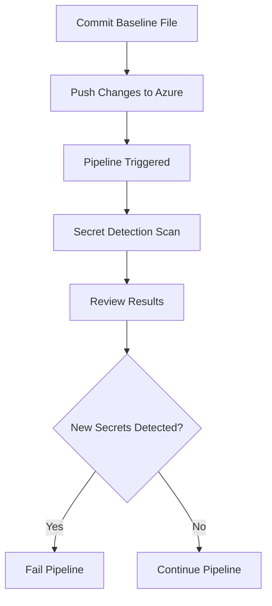

## Integrating Automated Security Testing into Azure Pipelines

### Background Theory

Automated security testing is an essential component of modern DevSecOps practices. It allows teams to detect and mitigate security vulnerabilities early in the development lifecycle, reducing the risk of security breaches and ensuring that applications are secure before they are deployed. One of the key aspects of automated security testing is detecting secrets in the codebase, which can include API keys, passwords, and other sensitive information.

Azure Pipelines is a powerful continuous integration and continuous delivery (CI/CD) platform provided by Microsoft. It integrates seamlessly with Azure DevOps and supports a wide range of tools and languages. By integrating automated security testing into Azure Pipelines, developers can ensure that their codebase remains free of secrets and other security issues throughout the development process.

### Detecting Secrets in Azure Pipelines

#### Step-by-Step Mechanics

To integrate automated security testing into Azure Pipelines, we need to follow several steps:

1. **Create a Baseline File**: This file contains known secrets that are already part of the codebase. This helps in distinguishing between existing secrets and new ones that might be accidentally added.

2. **Add the Baseline File to the Repository**: The baseline file needs to be committed to the Git repository so that it can be used during the pipeline execution.

3. **Configure the Pipeline**: The pipeline needs to be configured to perform a secret detection scan. This involves setting up a task that runs a tool capable of detecting secrets.

4. **Trigger the Pipeline**: Pushing changes to the repository should trigger the pipeline, which will execute the secret detection scan.

5. **Review the Results**: The results of the secret detection scan should be reviewed to ensure that no new secrets have been added to the codebase.

#### Example Code and Configuration

Let's walk through the process with a detailed example.

##### Creating the Baseline File

The baseline file (`Secrets.Baseline`) contains known secrets that are already part of the codebase. This file is crucial because it helps in distinguishing between existing secrets and new ones that might be accidentally added.

```plaintext
# Secrets.Baseline
api_key_1=abc123
api_key_2=def456
```

##### Adding the Baseline File to the Repository

To add the baseline file to the Git repository, we use the `git add` and `git commit` commands.

```bash
# Add the Secrets.Baseline file to the staging area
git add Secrets.Baseline

# Commit the file to the local repository with a descriptive message
git commit -m "Add secrets baseline file"
```

##### Pushing Changes to Azure

Once the changes are committed locally, they need to be pushed to the remote repository hosted on Azure.

```bash
# Push the changes to the remote repository
git push origin main
```

##### Configuring the Pipeline

The pipeline needs to be configured to perform a secret detection scan. This involves setting up a task that runs a tool capable of detecting secrets. For this example, we will use the `trufflehog` tool, which is a popular open-source tool for detecting secrets in code repositories.

Here is an example of an Azure Pipeline YAML configuration that includes a secret detection task:

```yaml
trigger:
- main

pool:
  vmImage: 'ubuntu-latest'

steps:
- task: Bash@3
  inputs:
    targetType: 'inline'
    script: |
      # Install trufflehog
      pip install trufflehog
      
      # Run trufflehog to detect secrets
      trufflehog --regex --entropy=False --max-depth=10 .
      
      # Check if any new secrets were detected
      if [ $? -ne 0 ]; then
        echo "New secrets detected! Please review the codebase."
        exit 1
      else
        echo "No new secrets detected. Pipeline continues."
      fi
```

This pipeline configuration does the following:

1. **Trigger**: The pipeline is triggered whenever changes are pushed to the `main` branch.
2. **Pool**: The pipeline runs on an Ubuntu virtual machine.
3. **Steps**:
   - **Bash Task**: Runs a Bash script to install and execute `trufflehog`.
   - **Install Trufflehog**: Installs the `trufflehog` tool using `pip`.
   - **Run Trufflehog**: Executes `trufflehog` to detect secrets in the codebase.
   - **Check Results**: Checks the exit status of `trufflehog`. If any new secrets are detected, the pipeline fails and prompts the user to review the codebase.

##### Reviewing the Results

After the pipeline executes, the results of the secret detection scan should be reviewed. If no new secrets are detected, the pipeline continues. If new secrets are detected, the pipeline fails, and the user is prompted to review the codebase.

### Real-World Examples

#### Recent Breaches and CVEs

One notable example of a breach caused by secrets in the codebase is the Capital One data breach in 2019. In this case, a misconfigured server allowed unauthorized access to sensitive customer data, including social security numbers and bank account details. The breach was caused by a misconfiguration in the server settings, but it highlights the importance of ensuring that secrets are not inadvertently exposed in the codebase.

Another example is the GitHub data breach in 2020, where attackers gained access to private repositories containing sensitive information, including API keys and passwords. This breach underscores the importance of using automated security testing to detect and mitigate secrets in the codebase.

### Pitfalls and Common Mistakes

#### Common Mistakes

1. **Not Using a Baseline File**: Without a baseline file, it is difficult to distinguish between existing secrets and new ones that might be accidentally added.
2. **Incorrect Configuration**: Incorrectly configuring the pipeline can lead to false positives or false negatives, making it difficult to trust the results.
3. **Ignoring Results**: Ignoring the results of the secret detection scan can lead to security vulnerabilities being introduced into the codebase.

#### How to Prevent / Defend

To prevent and defend against secrets in the codebase, the following steps should be taken:

1. **Use a Baseline File**: Create and maintain a baseline file that contains known secrets in the codebase.
2. **Configure the Pipeline Correctly**: Ensure that the pipeline is correctly configured to perform a secret detection scan.
3. **Review Results Thoroughly**: Review the results of the secret detection scan thoroughly to ensure that no new secrets have been added to the codebase.

### Secure Coding Fixes

#### Vulnerable Code

Here is an example of vulnerable code that exposes a secret in the codebase:

```python
# Vulnerable code
import os

API_KEY = os.getenv('API_KEY', 'abc123')
```

#### Secure Code

Here is the same code with the secret removed:

```python
# Secure code
import os

API_KEY = os.getenv('API_KEY')
```

### Detection and Prevention

#### Detection

Detection involves using automated tools to scan the codebase for secrets. Tools like `trufflehog` can be used to detect secrets in the codebase.

#### Prevention

Prevention involves using secure coding practices to avoid exposing secrets in the codebase. This includes using environment variables to store secrets and avoiding hardcoding secrets in the codebase.

### Hardening

#### Hardening the Environment

Hardening the environment involves securing the environment where the codebase is stored and executed. This includes:

1. **Using Secure Environments**: Use secure environments like Azure DevOps to store and execute the codebase.
2. **Limiting Access**: Limit access to the codebase to only authorized personnel.
3. **Monitoring**: Monitor the codebase for any suspicious activity.

### Complete Example

#### Full HTTP Request and Response

Here is an example of a full HTTP request and response for pushing changes to Azure:

```http
POST /repos/{owner}/{repo}/git/refs/heads/main HTTP/1.1
Host: api.github.com
Authorization: Bearer <token>
Content-Type: application/json

{
  "sha": "<commit_sha>",
  "force": true
}
```

Response:

```http
HTTP/1.1 200 OK
Content-Type: application/json

{
  "ref": "refs/heads/main",
  "url": "https://api.github.com/repos/{owner}/{repo}/git/refs/heads/main",
  "object": {
    "type": "commit",
    "sha": "<commit_sha>",
    "url": "https://api.github.com/repos/{owner}/{repo}/git/commits/<commit_sha>"
  }
}
```

#### Full Pipeline Configuration

Here is the full pipeline configuration in YAML:

```yaml
trigger:
- main

pool:
  vmImage: 'ubuntu-latest'

steps:
- task: Bash@3
  inputs:
    targetType: 'inline'
    script: |
      # Install trufflehog
      pip install trufflehog
      
      # Run trufflehog to detect secrets
      trufflehog --regex --entropy=False --max-depth=10 .
      
      # Check if any new secrets were detected
      if [ $? -ne 0 ]; then
        echo "New secrets detected! Please review the codebase."
        exit 1
      else
        echo "No new secrets detected. Pipeline continues."
      fi
```

### Mermaid Diagrams

#### Secret Detection Workflow



### Hands-On Labs

For hands-on practice with integrating automated security testing into Azure Pipelines, consider the following labs:

- **PortSwigger Web Security Academy**: Offers a variety of labs focused on web application security, including automated security testing.
- **OWASP Juice Shop**: A deliberately insecure web application for practicing web security skills.
- **DVWA (Damn Vulnerable Web Application)**: Another intentionally vulnerable web application for learning web security.
- **CloudGoat**: A cloud security training platform that includes labs focused on Azure security.

These labs provide practical experience in integrating automated security testing into Azure Pipelines and help reinforce the concepts covered in this chapter.

### Conclusion

Integrating automated security testing into Azure Pipelines is a critical component of modern DevSecOps practices. By following the steps outlined in this chapter, teams can ensure that their codebase remains free of secrets and other security issues throughout the development process. This not only reduces the risk of security breaches but also ensures that applications are secure before they are deployed.

---
<!-- nav -->
[[05-Integrating Automated Security Testing into Azure Pipelines Part 3|Integrating Automated Security Testing into Azure Pipelines Part 3]] | [[DevSecOps/DevSecOps Bootcamp/05-Application Security Testing/07-Integrating Automated Security Testing into Azure Pipelines/Demo Integrating Detection of Secrets in Azure Pipelines/00-Overview|Overview]] | [[07-Integrating Automated Security Testing into Azure Pipelines|Integrating Automated Security Testing into Azure Pipelines]]
