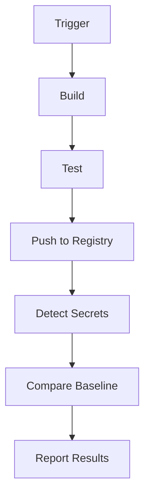

## Integrating Automated Security Testing into Azure Pipelines

### Modifying an Existing Pipeline

To integrate automated security testing into an Azure pipeline, we start by modifying an existing pipeline. This involves adding steps to detect secrets in the source code and setting up a baseline for secret detection.

### Step-by-Step Guide

#### 1. Open the Organization's Homepage

First, open a web browser and navigate to your organization's homepage. In this case, the organization has a project called "automated security testing."

```markdown
- Open a web browser.
- Navigate to the organization's homepage.
- Select the "automated security testing" project.
```

#### 2. Access the Code Repository

The project contains a code repository that builds Docker images. The codebase can also be found on GitHub.

```markdown
- The codebase is located at https://github.com/petermosmans/tools-image.
- The repository contains a file called `azure-pipelines.yml`.
```

#### 3. View the Current Pipeline

Next, view the current pipeline by selecting "pipelines" from the left-side menu.

```markdown
- Click on "pipelines" in the left-side menu.
- Look at the current run.
- You should see a pipeline called "Tools Image".
```

#### 4. Edit the Pipeline

Click on the three dots on the top right side and select "Edit Pipeline".

```markdown
- Click on the three dots on the top right side.
- Select "Edit Pipeline".
```

### Adding Secret Detection to the Pipeline

#### 1. Define the Secret Detection Task

To add secret detection to the pipeline, we need to define a task in the `azure-pipelines.yml` file. This task will use a tool like `detect-secrets` to scan the codebase for secrets.

```yaml
# azure-pipelines.yml
trigger:
- main

pool:
  vmImage: 'ubuntu-latest'

variables:
  SECRET_DETECTION_BASELINE: 'secret-detection-baseline.txt'

stages:
- stage: Build
  jobs:
  - job: BuildAndTest
    steps:
    - task: Bash@3
      inputs:
        targetType: 'inline'
        script: |
          pip install detect-secrets
          detect-secrets scan --baseline $SECRET_DETECTION_BASELINE
```

#### 2. Create a Baseline File

Create a baseline file (`secret-detection-baseline.txt`) that contains known secrets. This file will be used to compare against the current codebase.

```plaintext
# secret-detection-baseline.txt
# Known secrets
# Example: API_KEY=abc123
```

#### 3. Add a Secret to the Codebase

Add a secret to the codebase and observe what the pipeline does.

```plaintext
# example.py
API_KEY = 'abc123'
```

### Full HTTP Request and Response

When the pipeline runs, it will send a request to the Azure Pipelines server to execute the defined tasks.

```http
POST /pipelines HTTP/1.1
Host: dev.azure.com
Authorization: Bearer <access_token>
Content-Type: application/json

{
  "definition": {
    "id": 1
  },
  "resources": {
    "repositories": {
      "self": {
        "refName": "refs/heads/main"
      }
    }
  }
}
```

Response:

```http
HTTP/1.1 200 OK
Content-Type: application/json

{
  "status": "inProgress",
  "url": "https://dev.azure.com/<organization>/<project>/_apis/build/builds/12345"
}
```

### Mermaid Diagram: Pipeline Flow



### Common Pitfalls and How to Avoid Them

#### 1. Incorrect Configuration

Ensure that the `azure-pipelines.yml` file is correctly configured. Missing or incorrect steps can lead to the pipeline failing to execute properly.

#### 2. Outdated Dependencies

Keep dependencies up to date. Using outdated versions of tools like `detect-secrets` can lead to missed vulnerabilities.

#### 3. Insufficient Logging

Enable detailed logging to help diagnose issues. Without sufficient logging, it can be difficult to determine why a pipeline failed.

### How to Prevent / Defend

#### 1. Secure Coding Practices

Implement secure coding practices to prevent secrets from being hardcoded into the codebase.

```python
# Vulnerable code
API_KEY = 'abc123'

# Secure code
import os
API_KEY = os.getenv('API_KEY')
```

#### 2. Dependency Management

Use tools like `pip` to manage dependencies and ensure that they are up to date.

```bash
pip install --upgrade detect-secrets
```

#### 3. Regular Audits

Regularly audit the codebase for secrets using tools like `detect-secrets`.

```bash
detect-secrets scan --baseline secret-detection-baseline.txt
```

### Real-World Example: Recent Breaches

The Equifax breach in 2017 (CVE-2017-5638) involved a vulnerability in Apache Struts. This breach could have been prevented if proper security checks were integrated into the development process.

### Practice Labs

For hands-on practice with integrating automated security testing into Azure Pipelines, consider the following labs:

- **PortSwigger Web Security Academy**: Offers a variety of labs focused on web application security.
- **OWASP Juice Shop**: A deliberately insecure web application for practicing security testing.
- **DVWA (Damn Vulnerable Web Application)**: Another popular web application for security testing.

These labs provide a safe environment to practice and learn about integrating security into CI/CD pipelines.

By following these steps and best practices, you can effectively integrate automated security testing into your Azure pipelines, ensuring that your applications are secure and reliable.

---
<!-- nav -->
[[06-Integrating Automated Security Testing into Azure Pipelines Part 4|Integrating Automated Security Testing into Azure Pipelines Part 4]] | [[DevSecOps/DevSecOps Bootcamp/05-Application Security Testing/07-Integrating Automated Security Testing into Azure Pipelines/Demo Integrating Detection of Secrets in Azure Pipelines/00-Overview|Overview]] | [[DevSecOps/DevSecOps Bootcamp/05-Application Security Testing/07-Integrating Automated Security Testing into Azure Pipelines/Demo Integrating Detection of Secrets in Azure Pipelines/08-Practice Questions & Answers|Practice Questions & Answers]]
