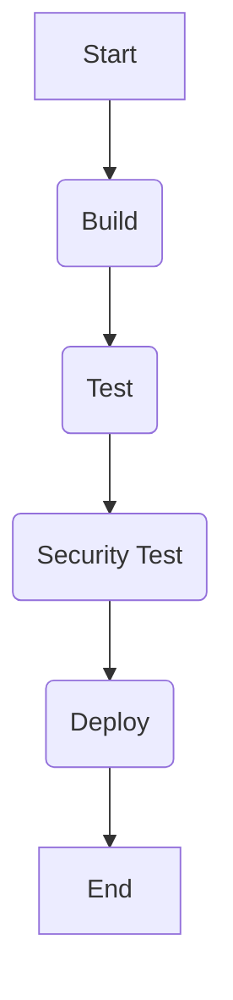

## Introduction to Continuous Integration and Continuous Deployment (CI/CD)

Continuous Integration (CI) and Continuous Deployment (CD) are fundamental practices in modern software development that aim to improve the quality and speed of software releases. CI involves automatically building and testing code changes as soon as they are committed to a version control system, ensuring that the codebase remains stable and functional. CD extends this by automating the deployment process, allowing new features and bug fixes to be released to production environments quickly and reliably.

### Importance of CI/CD

The primary benefits of CI/CD include:

- **Faster Feedback Loops**: Developers receive immediate feedback on their changes, reducing the time needed to identify and fix issues.
- **Improved Code Quality**: Regular automated testing helps catch bugs early, leading to higher-quality code.
- **Increased Productivity**: Automation reduces manual effort, allowing developers to focus on more complex tasks.
- **Reduced Risks**: Frequent deployments help mitigate risks associated with large, infrequent releases.

### Overview of Jenkins

Jenkins is an open-source automation server widely used for implementing CI/CD pipelines. It supports various plugins and integrations, making it highly flexible and adaptable to different development environments. Jenkins can be configured to build, test, and deploy applications automatically, providing a robust framework for managing the entire software lifecycle.

### Setting Up a Jenkins Pipeline

To set up a Jenkins pipeline, you typically define a `Jenkinsfile` within your project's repository. This file contains the pipeline definition written in Groovy, specifying the steps and stages of the pipeline.

#### Example Jenkinsfile

Here’s a basic example of a `Jenkinsfile`:

```groovy
pipeline {
    agent any

    stages {
        stage('Build') {
            steps {
                sh 'npm install'
                sh 'npm run build'
            }
        }

        stage('Test') {
            steps {
                sh 'npm run test'
            }
        }

        stage('Deploy') {
            steps {
                sh 'npm run deploy'
            }
        }
    }
}
```

This `Jenkinsfile` defines three stages: Build, Test, and Deploy. Each stage contains one or more steps that execute shell commands to perform specific tasks.

### Integrating Automated Security Testing

Automated security testing is a critical component of a CI/CD pipeline. It ensures that security vulnerabilities are identified and addressed early in the development cycle, reducing the risk of deploying insecure code to production.

#### Tools for Automated Security Testing

Several tools can be integrated into a Jenkins pipeline for automated security testing:

- **OWASP ZAP**: An open-source web application security scanner.
- **SonarQube**: A static code analysis tool that detects security vulnerabilities.
- **Trivy**: A container image scanner that identifies vulnerabilities in Docker images.
- **Bandit**: A security linter for Python code.

#### Example: Integrating OWASP ZAP

Here’s how you can integrate OWASP ZAP into a Jenkins pipeline:

```groovy
pipeline {
    agent any

    stages {
        stage('Build') {
            steps {
                sh 'npm install'
                sh 'npm run build'
            }
        }

        stage('Test') {
            steps {
                sh 'npm run test'
            }
        }

        stage('Security Test') {
            steps {
                script {
                    def zapHome = '/path/to/zap'
                    def zapJar = "${zapHome}/zap.jar"
                    def zapApiPort = 8090
                    def zapTargetUrl = 'http://localhost:3000'

                    // Start ZAP
                    sh "${zapHome}/zap.sh -daemon -port ${zapApiPort} -host 0.0.0.0"

                    // Wait for ZAP to start
                    sleep 10

                    // Run ZAP scan
                    sh "java -jar ${zapJar} -cmd -quickurl ${zapTargetUrl}"

                    // Stop ZAP
                    sh "curl http://localhost:${zapApiPort}/JSON/core/action/shutdown/"
                }
            }
        }

        stage('Deploy') {
            steps {
                sh 'npm run deploy'
            }
        }
    }
}
```

### Mermaid Diagram of the Pipeline

A visual representation of the pipeline can help understand the flow of operations:



### Common Pitfalls and How to Prevent Them

#### Pitfall: Incomplete Security Testing

**Problem**: Not including comprehensive security testing in the pipeline can lead to undetected vulnerabilities.

**Solution**: Ensure that all relevant security tools are integrated and configured correctly. Regularly review and update the list of tools to cover new types of vulnerabilities.

#### Pitfall: False Positives

**Problem**: Security tools may generate false positives, leading to unnecessary investigations and delays.

**Solution**: Configure security tools to minimize false positives. Use suppression rules and whitelist known safe patterns.

#### Pitfall: Lack of Automation

**Problem**: Manual intervention in the pipeline can introduce human error and slow down the release process.

**Solution**: Automate as much of the pipeline as possible. Use tools like Jenkins to handle builds, tests, and deployments automatically.

### Real-World Examples

#### Example: CVE-2021-21972

CVE-2021-21972 is a vulnerability in the Apache Log4j library that allows remote code execution. Integrating automated security testing tools like SonarQube can help detect such vulnerabilities early.

#### Example: Equifax Breach

The Equifax breach in 2017 exposed sensitive data due to unpatched vulnerabilities. Implementing a robust CI/CD pipeline with automated security testing could have helped prevent such breaches.

### Secure Coding Practices

#### Vulnerable Code Example

Consider a Node.js application that uses `eval()` to execute user input:

```javascript
app.post('/evaluate', (req, res) => {
    const userInput = req.body.input;
    eval(userInput);
    res.send('Evaluated');
});
```

#### Secure Code Example

Replace `eval()` with safer alternatives like `JSON.parse()`:

```javascript
app.post('/evaluate', (req, res) => {
    const userInput = req.body.input;
    try {
        const result = JSON.parse(userInput);
        res.send(result);
    } catch (error) {
        res.status(400).send('Invalid input');
    }
});
```

### Configuration Hardening

#### Example: Jenkins Configuration

Ensure Jenkins is configured securely by:

- Disabling unnecessary plugins.
- Using strong authentication mechanisms.
- Limiting access to sensitive information.

#### Example: Docker Configuration

Use Docker security best practices:

- Use non-root users for running containers.
- Avoid using `latest` tags for images.
- Regularly update base images.

### Detection and Prevention

#### Detection

Regularly monitor the pipeline for security issues using tools like:

- **Log Analysis**: Analyze logs for suspicious activities.
- **Vulnerability Scanners**: Use tools like Trivy to scan for vulnerabilities.

#### Prevention

Implement the following measures to prevent security issues:

- **Code Reviews**: Conduct regular code reviews to catch potential security issues.
- **Security Training**: Train developers on secure coding practices.
- **Penetration Testing**: Perform regular penetration testing to identify and fix vulnerabilities.

### Hands-On Labs

For practical experience with integrating automated security testing into a CI/CD pipeline, consider the following labs:

- **PortSwigger Web Security Academy**: Offers interactive labs to practice web security techniques.
- **OWASP Juice Shop**: A deliberately insecure web application for practicing security testing.
- **DVWA**: Damn Vulnerable Web Application for learning web application security.

By following these guidelines and practices, you can ensure that your CI/CD pipeline is robust and secure, helping to deliver high-quality software efficiently and safely.

---
<!-- nav -->
[[DevSecOps/DevSecOps Bootcamp/05-Application Security Testing/08-Integrating Automated Security Testing into a CI CD Pipeline/01-Demo Reviewing a Generic CI CD Pipeline/00-Overview|Overview]] | [[02-Integrating Automated Security Testing into a CICD Pipeline|Integrating Automated Security Testing into a CICD Pipeline]]
