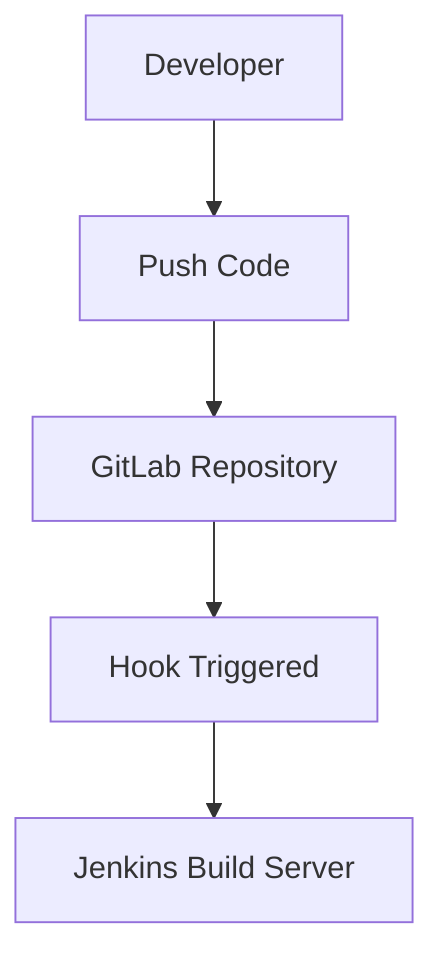
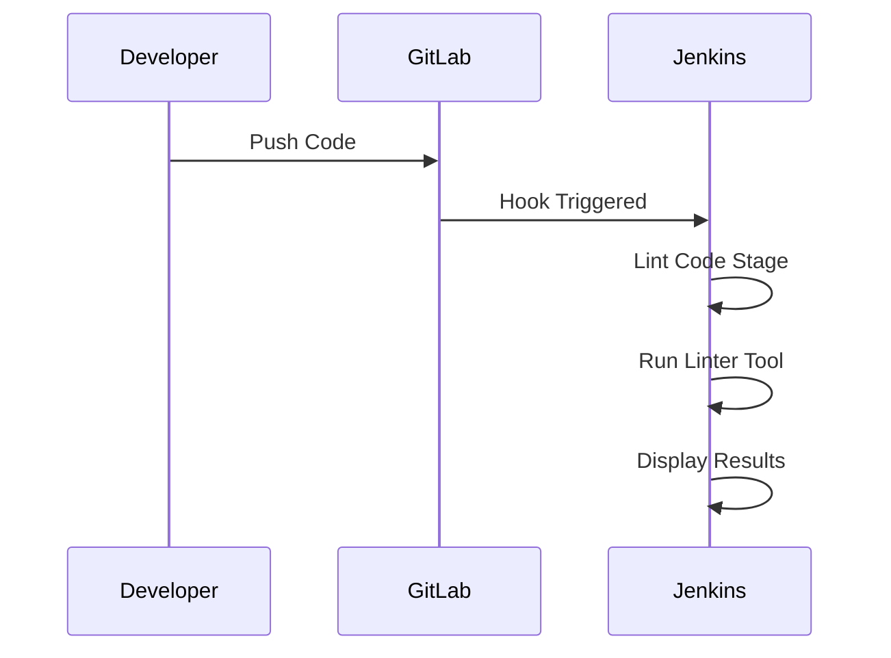
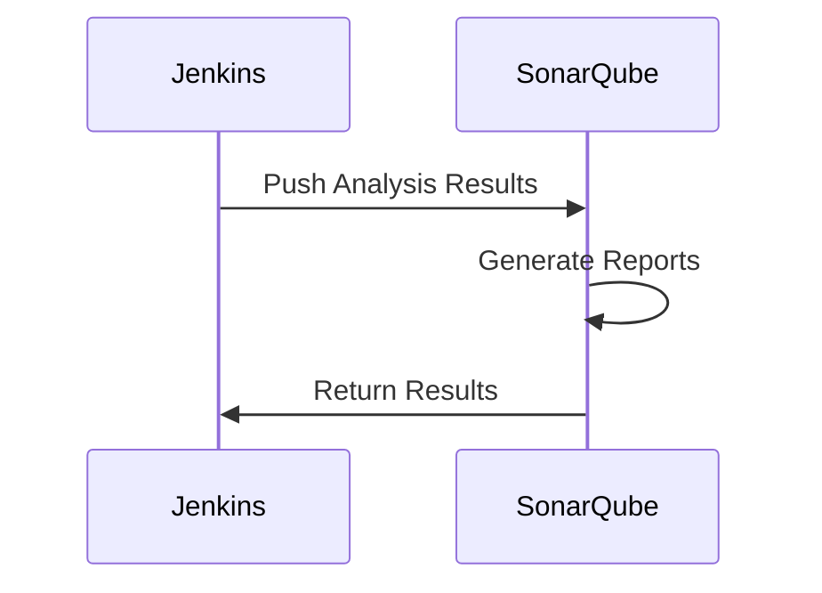
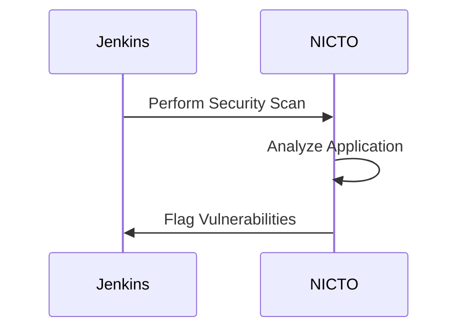
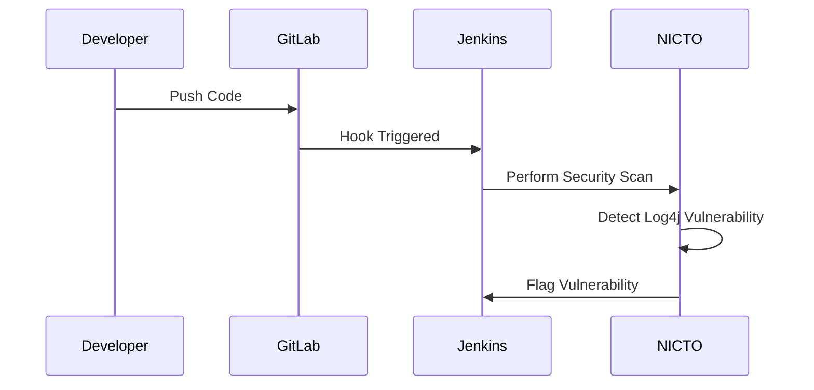

## Integrating Automated Security Testing into a CI/CD Pipeline

### Background Theory

In modern software development practices, Continuous Integration/Continuous Deployment (CI/CD) pipelines play a crucial role in ensuring that code changes are integrated, tested, and deployed efficiently. A key aspect of these pipelines is the integration of automated security testing, which helps identify vulnerabilities and ensure the security of the application throughout its lifecycle.

### Components of a CI/CD Pipeline

A typical CI/CD pipeline consists of several stages, including:

- **Source Control Management (SCM)**: Tools like GitLab, GitHub, or Bitbucket manage the source code repositories.
- **Build Server**: Tools like Jenkins, CircleCI, or Travis CI automate the build process.
- **Testing**: Automated tests are run to ensure the code meets quality standards.
- **Deployment**: The code is deployed to various environments (development, staging, production).

#### Source Control Management (SCM)

Source Control Management (SCM) tools like GitLab provide a central repository for storing and managing the source code. When a developer pushes code to the repository, SCM tools can trigger hooks to notify other systems, such as build servers.



### Build Server: Jenkins

Jenkins is a popular open-source automation server used to automate parts of the software development process, including building, testing, and deploying applications. When a new commit is pushed to the GitLab repository, Jenkins can be configured to automatically start a pipeline.

#### Jenkinsfile

The Jenkinsfile defines the steps of the pipeline. Each step can be customized to perform specific tasks, such as linting, static analysis, and security testing.

```yaml
pipeline {
    agent any
    stages {
        stage('Lint Code') {
            steps {
                script {
                    docker.image('linter-image').inside {
                        sh 'lint-command'
                    }
                }
            }
        }
        stage('Code Quality Control') {
            steps {
                script {
                    docker.image('static-analysis-image').inside {
                        sh 'static-analysis-command'
                        sh 'push-results-to-sonarqube'
                    }
                }
            }
        }
        stage('Security Testing') {
            steps {
                script {
                    docker.image('nicto-image').inside {
                        sh 'nicto-command'
                    }
                }
            }
        }
    }
}
```

### Stages of the Pipeline

#### Lint Code Stage

The lint code stage ensures that the code adheres to coding standards and best practices. This is typically done using a linter tool, which checks the code for syntax errors, style violations, and potential bugs.



#### Code Quality Control Stage

The code quality control stage performs static analysis on the code to identify potential issues and vulnerabilities. Tools like SonarQube can be used to analyze the code and generate reports.



#### Security Testing Stage

The security testing stage uses tools like NICTO (Network Inventory and Configuration Tester) to scan the application for web vulnerabilities. This stage helps ensure that the application is secure before deployment.



### Real-World Examples

#### Recent CVEs and Breaches

Recent CVEs and breaches highlight the importance of integrating automated security testing into CI/CD pipelines. For example, the Log4j vulnerability (CVE-2021-44228) affected numerous applications and systems worldwide. By integrating security testing into the pipeline, organizations can proactively identify and mitigate such vulnerabilities.

#### Example: Log4j Vulnerability

The Log4j vulnerability (CVE-2021-44228) allowed attackers to execute arbitrary code on affected systems. By integrating security testing into the CI/CD pipeline, organizations can detect and patch such vulnerabilities before they are exploited.



### Pitfalls and Common Mistakes

#### Incomplete Testing

One common mistake is not performing comprehensive testing. It is essential to cover all aspects of the application, including functional, performance, and security testing.

#### Lack of Automation

Another pitfall is the lack of automation. Manual testing is time-consuming and prone to human error. Automating the testing process ensures consistency and efficiency.

### How to Prevent / Defend

#### Detection

To detect vulnerabilities, integrate security testing tools into the CI/CD pipeline. Regularly scan the application for known vulnerabilities and ensure that the tools are up to date.

#### Prevention

To prevent vulnerabilities, follow secure coding practices and adhere to best practices. Use tools like SonarQube to enforce coding standards and static analysis.

#### Secure Coding Fixes

Show the vulnerable pattern and the corrected secure version side by side.

**Vulnerable Code:**
```java
public class Log4jExample {
    public void logMessage(String message) {
        Logger logger = Logger.getLogger(Log4jExample.class);
        logger.info(message);
    }
}
```

**Secure Code:**
```java
public class Log4jExample {
    public void logMessage(String message) {
        Logger logger = Logger.getLogger(Log4jExample.class);
        if (message != null && !message.isEmpty()) {
            logger.info(message);
        } else {
            logger.error("Invalid message");
        }
    }
}
```

#### Configuration Hardening

Hardening the configuration of the application and the infrastructure can help prevent vulnerabilities. For example, configure the firewall to block unauthorized access and restrict access to sensitive data.

#### Mitigations

Implement mitigations such as input validation, output encoding, and least privilege principles to reduce the risk of vulnerabilities.

### Complete Examples

#### Full HTTP Request and Response

Show the complete HTTP request and response for a security test.

**HTTP Request:**
```http
POST /api/v1/security-test HTTP/1.1
Host: example.com
Content-Type: application/json

{
    "test": "Log4jExample"
}
```

**HTTP Response:**
```http
HTTP/1.1 200 OK
Content-Type: application/json

{
    "status": "success",
    "message": "No vulnerabilities detected"
}
```

#### Policy/Config File

Show the complete policy/config file for a security test.

**Jenkinsfile:**
```yaml
pipeline {
    agent any
    stages {
        stage('Lint Code') {
            steps {
                script {
                    docker.image('linter-image').inside {
                        sh 'lint-command'
                    }
                }
            }
        }
        stage('Code Quality Control') {
            steps {
                script {
                    docker.image('static-analysis-image').inside {
                        sh 'static-analysis-command'
                        sh 'push-results-to-sonarqube'
                    }
                }
            }
        }
        stage('Security Testing') {
            steps {
                script {
                    docker.image('nicto-image').inside {
                        sh 'nicto-command'
                    }
                }
            }
        }
    }
}
```

### Hands-On Labs

#### PortSwigger Web Security Academy

PortSwigger Web Security Academy provides hands-on labs for learning web security concepts. These labs can be used to practice integrating security testing into a CI/CD pipeline.

#### OWASP Juice Shop

OWASP Juice Shop is a deliberately insecure web application for security training. It can be used to practice identifying and fixing vulnerabilities in a CI/CD pipeline.

#### DVWA

Damn Vulnerable Web Application (DVWA) is another tool for practicing web security. It can be used to simulate a real-world application and integrate security testing into the CI/CD pipeline.

### Conclusion

Integrating automated security testing into a CI/CD pipeline is essential for ensuring the security of the application. By following best practices, using tools like Jenkins, SonarQube, and NICTO, and regularly scanning for vulnerabilities, organizations can proactively identify and mitigate security risks.

---
<!-- nav -->
[[01-Introduction to Continuous Integration and Continuous Deployment (CICD)|Introduction to Continuous Integration and Continuous Deployment (CICD)]] | [[DevSecOps/DevSecOps Bootcamp/05-Application Security Testing/08-Integrating Automated Security Testing into a CI CD Pipeline/01-Demo Reviewing a Generic CI CD Pipeline/00-Overview|Overview]] | [[DevSecOps/DevSecOps Bootcamp/05-Application Security Testing/08-Integrating Automated Security Testing into a CI CD Pipeline/01-Demo Reviewing a Generic CI CD Pipeline/03-Practice Questions & Answers|Practice Questions & Answers]]
