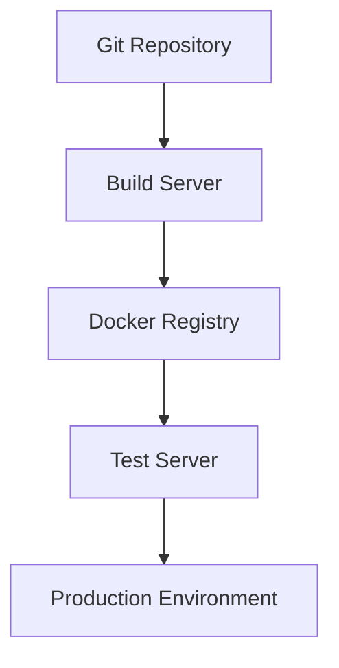

## Introduction to CI/CD Pipelines

A Continuous Integration/Continuous Deployment (CI/CD) pipeline is a series of steps that automate the process of integrating code changes from multiple contributors into a shared repository, followed by automated testing and deployment to production environments. This ensures that the codebase remains stable and that new features and bug fixes can be released quickly and reliably.

### Components of a CI/CD Pipeline

A typical CI/CD pipeline consists of several key components:

1. **Git Repository Server**: This is where the source code is stored. It acts as the central hub for version control and collaboration among developers.
2. **Build Server**: This component compiles the source code and generates an artifact, such as a Docker image, that can be deployed.
3. **Automation Server**: This orchestrates the entire pipeline, including triggering builds, running tests, and managing deployments.
4. **Docker Registry**: This is where the built artifacts are stored. It serves as a centralized repository for Docker images.
5. **Production Environment**: This is where the final artifact is deployed for end-users to access.

### Defining a CI/CD Pipeline

Defining a CI/CD pipeline involves specifying the steps and conditions that the pipeline should follow. Modern CI/CD tools allow you to define pipelines using declarative syntax, typically in YAML or JSON format. This approach makes the pipeline configuration explicit and easier to understand and maintain.

#### YAML Syntax Example

YAML is a human-readable data serialization language commonly used in CI/CD pipelines. Here’s an example of a simple CI/CD pipeline defined in YAML:

```yaml
stages:
  - build
  - test
  - deploy

build:
  stage: build
  script:
    - docker build -t myapp .
    - docker push myapp

test:
  stage: test
  script:
    - docker run myapp pytest

deploy:
  stage: deploy
  script:
    - kubectl apply -f deployment.yaml
```

In this example:
- `stages` defines the different phases of the pipeline.
- Each phase (`build`, `test`, `deploy`) contains a `script` section that specifies the commands to execute.

#### JSON Syntax Example

JSON is another popular format for defining CI/CD pipelines, especially in cloud-native environments like AWS. Here’s an example of a pipeline defined in JSON:

```json
{
  "pipeline": {
    "stages": [
      {
        "name": "build",
        "actions": [
          {
            "actionType": "runCommand",
            "command": "docker build -t myapp ."
          },
          {
            "actionType": "runCommand",
            "command": "docker push myapp"
          }
        ]
      },
      {
        "name": "test",
        "actions": [
          {
            "actionType": "runCommand",
            "command": "docker run myapp pytest"
          }
        ]
      },
      {
        "name": "deploy",
        "actions": [
          {
            "actionType": "runCommand",
            "command": "kubectl apply -f deployment.yaml"
          }
        ]
      }
    ]
  }
}
```

In this example:
- The `pipeline` object contains a list of `stages`.
- Each stage has a list of `actions`, where each action specifies a command to run.

#### Groovy Syntax Example

Jenkins, a widely-used CI/CD tool, uses Groovy for defining pipelines. Here’s an example of a pipeline defined in Groovy:

```groovy
pipeline {
    agent any

    stages {
        stage('Build') {
            steps {
                sh 'docker build -t myapp .'
                sh 'docker push myapp'
            }
        }
        stage('Test') {
            steps {
                sh 'docker run myapp pytest'
            }
        }
        stage('Deploy') {
            steps {
                sh 'kubectl apply -f deployment.yaml'
            }
        }
    }
}
```

In this example:
- The `pipeline` block defines the overall structure.
- Each `stage` contains a list of `steps`, where each step specifies a command to run.

### Execution of Pipeline Steps

The execution of pipeline steps typically involves the following processes:

1. **Pulling Code**: The automation server pulls the latest code from the Git repository.
2. **Building Artifacts**: The build server compiles the code and generates an artifact, such as a Docker image.
3. **Pushing Artifacts**: The built artifact is pushed to a Docker registry.
4. **Running Tests**: The tests are executed in ephemeral environments, which are temporary and isolated.
5. **Deploying to Production**: The final artifact is deployed to the production environment.

### Practical Example

Let’s consider a practical example of a CI/CD pipeline for a web application. The pipeline includes the following steps:

1. **Clone Repository**: Clone the source code from the Git repository.
2. **Build Docker Image**: Build a Docker image from the source code.
3. **Push Docker Image**: Push the Docker image to a Docker registry.
4. **Run Tests**: Run unit and integration tests in ephemeral environments.
5. **Deploy to Production**: Deploy the Docker image to the production environment.

Here’s a detailed breakdown of the pipeline:

#### Step 1: Clone Repository

```bash
git clone https://github.com/myorg/myapp.git
cd myapp
```

#### Step 2: Build Docker Image

```bash
docker build -t myapp .
```

#### Step 3: Push Docker Image

```bash
docker push myapp
```

#### Step 4: Run Tests

```bash
docker run myapp pytest
```

#### Step 5: Deploy to Production

```bash
kubectl apply -f deployment.yaml
```

### Mermaid Diagram of CI/CD Pipeline

To visualize the pipeline, we can use a mermaid diagram:



### Common Pitfalls and Best Practices

#### Common Pitfalls

1. **Manual Interventions**: Manual steps can introduce errors and delays.
2. **Inconsistent Environments**: Differences between development, testing, and production environments can cause issues.
3. **Security Vulnerabilities**: Lack of security checks can expose the application to vulnerabilities.

#### Best Practices

1. **Automate Everything**: Automate as many steps as possible to reduce manual interventions.
2. **Use Version Control**: Ensure that all code changes are tracked and reviewed.
3. **Consistent Environments**: Use containerization and infrastructure-as-code to ensure consistent environments.
4. **Security Checks**: Integrate security scans and tests into the pipeline.

### Real-World Examples

#### Recent Breaches

One notable breach was the Capital One data breach in 2019, where a misconfigured web application firewall allowed unauthorized access to sensitive customer data. This highlights the importance of proper configuration management and security testing in CI/CD pipelines.

#### Secure Coding Fixes

Consider a scenario where a web application is vulnerable to SQL injection attacks. The following code demonstrates a vulnerable pattern and its secure counterpart:

**Vulnerable Code**

```python
import sqlite3

def get_user_data(user_id):
    conn = sqlite3.connect('database.db')
    cursor = conn.cursor()
    query = f"SELECT * FROM users WHERE id = {user_id}"
    cursor.execute(query)
    result = cursor.fetchone()
    conn.close()
    return result
```

**Secure Code**

```python
import sqlite3

def get_user_data(user_id):
    conn = sqlite3.connect('database.db')
    cursor = conn.cursor()
    query = "SELECT * FROM users WHERE id = ?"
    cursor.execute(query, (user_id,))
    result = cursor.fetchone()
    conn.close()
    return result
```

### Detection and Prevention

#### Detection

To detect vulnerabilities, integrate static and dynamic analysis tools into the pipeline. For example, use tools like SonarQube for static analysis and OWASP ZAP for dynamic analysis.

#### Prevention

To prevent vulnerabilities, implement the following measures:

1. **Code Reviews**: Regularly review code changes for security issues.
2. **Security Policies**: Define and enforce security policies, such as least privilege and principle of least surprise.
3. **Training**: Train developers on secure coding practices.

### Hands-On Labs

For hands-on practice, consider the following labs:

- **PortSwigger Web Security Academy**: Offers interactive labs to learn about web application security.
- **OWASP Juice Shop**: A deliberately insecure web application for practicing security testing.
- **DVWA (Damn Vulnerable Web Application)**: A PHP/MySQL web application that is intentionally vulnerable for educational purposes.
- **WebGoat**: An interactive training application designed to teach web application security lessons.

By following these guidelines and best practices, you can effectively integrate automated security testing into your CI/CD pipeline, ensuring that your applications are secure and reliable.

---
<!-- nav -->
[[DevSecOps/DevSecOps Bootcamp/05-Application Security Testing/08-Integrating Automated Security Testing into a CI CD Pipeline/Examining a CI CD Pipeline/00-Overview|Overview]] | [[DevSecOps/DevSecOps Bootcamp/05-Application Security Testing/08-Integrating Automated Security Testing into a CI CD Pipeline/Examining a CI CD Pipeline/02-Building Automation and Test Servers|Building Automation and Test Servers]]
