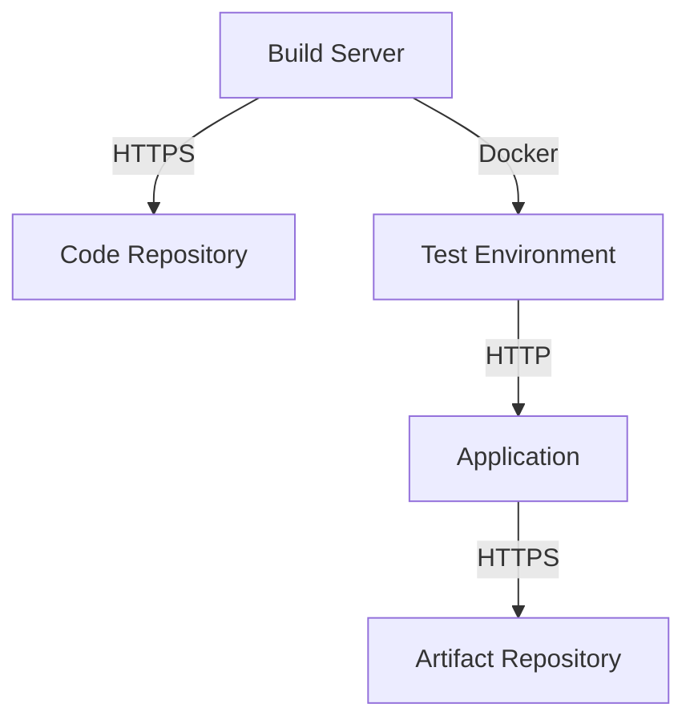

## Network Communication

### What Is It?

Network communication refers to how different components of the CI/CD pipeline communicate with each other. This includes communication between build servers, test servers, repositories, and other services.

### Why Is It Important?

Secure network communication ensures that data is transmitted securely and that unauthorized access is prevented. This is critical for maintaining the integrity and confidentiality of the code and artifacts.

### How Does It Work?

#### Secure Communication Protocols

Secure communication protocols like HTTPS, SSH, and TLS should be used to encrypt data in transit.

Example of using HTTPS for repository access:

```bash
# Clone the repository over HTTPS
git clone https://github.com/example/repo.git
```

#### Network Topology

A typical network topology for a CI/CD pipeline might look like this:



### Real-World Example: Recent Breach

In the Uber data breach (CVE-2016-1000127), attackers exploited a misconfigured Elasticsearch cluster, which allowed unauthorized access to sensitive data. This highlights the importance of secure network communication to prevent such breaches.

### How to Prevent / Defend

#### Secure Network Communication

- **Use HTTPS**: Ensure that all communication with repositories and services is encrypted.
- **SSH keys**: Use SSH keys for secure access to servers and repositories.
- **Firewall rules**: Implement strict firewall rules to limit access to necessary services.

---
<!-- nav -->
[[DevSecOps/DevSecOps Bootcamp/05-Application Security Testing/08-Integrating Automated Security Testing into a CI CD Pipeline/Examining a CI CD Pipeline/05-Hardening Steps|Hardening Steps]] | [[DevSecOps/DevSecOps Bootcamp/05-Application Security Testing/08-Integrating Automated Security Testing into a CI CD Pipeline/Examining a CI CD Pipeline/00-Overview|Overview]] | [[DevSecOps/DevSecOps Bootcamp/05-Application Security Testing/08-Integrating Automated Security Testing into a CI CD Pipeline/Examining a CI CD Pipeline/07-Repository for Code and Artifacts|Repository for Code and Artifacts]]
