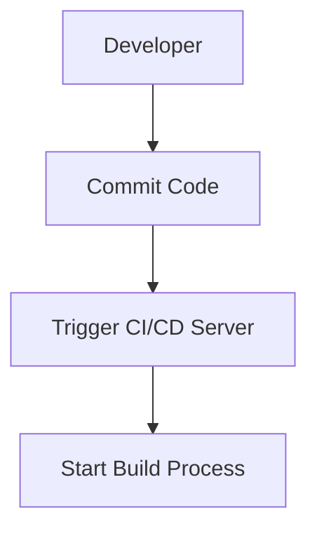
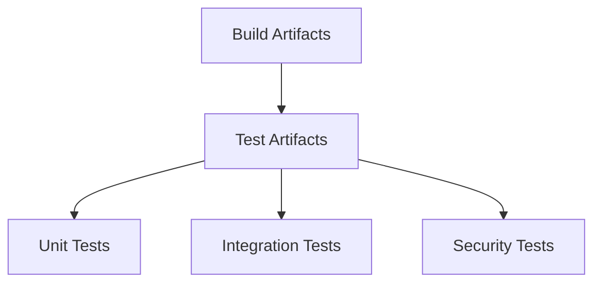

## Understanding CI/CD Pipelines

A Continuous Integration/Continuous Deployment (CI/CD) pipeline is a series of steps that automate the process of integrating code changes from multiple contributors, building the application, testing it, and deploying it to production. This automation ensures that the software is reliable, secure, and ready for deployment at any time. Let's break down the components of a typical CI/CD pipeline and understand how each step contributes to the overall process.

### Commit Phase

The first step in a CI/CD pipeline is the commit phase. This is where developers push their changes to a shared repository. The repository acts as a central hub for all the code changes made by the team. The commit phase is crucial because it triggers the entire pipeline.

#### Why Commit Phase Matters

- **Version Control**: Using a version control system like Git allows developers to track changes, revert to previous versions, and collaborate effectively.
- **Automated Triggers**: Committing code to the repository triggers the next steps in the pipeline, ensuring that the latest changes are integrated and tested automatically.

#### Real-World Example

Consider a scenario where a developer pushes a change to a Git repository hosted on GitHub. This action triggers a webhook that notifies the CI/CD server (like Jenkins or CircleCI) to start the build process.



### Pre-Commit Hooks

Before committing code, developers often run pre-commit hooks to ensure that the code meets certain standards. These hooks can perform tasks such as code formatting, static analysis, and basic security checks.

#### Why Pre-Commit Hooks Matter

- **Code Quality**: Pre-commit hooks help maintain a high standard of code quality by catching issues early.
- **Security Checks**: Basic security checks can prevent common vulnerabilities from being committed to the repository.

#### Real-World Example

In a project using Git, a developer might configure a pre-commit hook to run `eslint` for JavaScript code. This ensures that the code adheres to coding standards before it is committed.

```bash
# .git/hooks/pre-commit
#!/bin/sh
eslint .
```

### Code Compilation and Artifact Building

After the code is committed, the next step is to compile the code and build the artifacts. This step transforms the source code into a format that can be executed or deployed.

#### Why Compilation and Artifact Building Matter

- **Binary Generation**: Compiling the code generates binary files that can be executed or deployed.
- **Dependency Management**: This step ensures that all dependencies are resolved and included in the final artifact.

#### Real-World Example

For a Java project, the compilation step might involve running `mvn clean install`, which compiles the code and packages it into a JAR file.

```bash
# Maven build command
mvn clean install
```

### Artifact Testing

Once the artifacts are built, they undergo various types of testing to ensure that they meet the required standards. This includes unit tests, integration tests, and security tests.

#### Why Artifact Testing Matters

- **Quality Assurance**: Testing ensures that the code works as intended and meets functional requirements.
- **Security Assurance**: Security tests identify potential vulnerabilities and ensure that the code is secure.

#### Real-World Example

Using a tool like SonarQube, developers can perform static code analysis to identify security vulnerabilities and code quality issues.



### Artifact Publication

After the artifacts pass all the tests, they are published to a repository. This could be a Docker registry, an artifact store, or any other storage location.

#### Why Artifact Publication Matters

- **Centralized Storage**: Publishing artifacts to a centralized repository ensures that they are easily accessible for deployment.
- **Version Control**: Storing artifacts in a repository allows for version control and easy rollback if needed.

#### Real-World Example

For a Docker-based application, the built image can be pushed to a Docker registry like Docker Hub.

```bash
# Push Docker image to Docker Hub
docker push myapp:latest
```

### Deployment Stage

The final step in the CI/CD pipeline is the deployment stage. This involves deploying the artifacts to the target environment, typically starting with a staging environment and eventually moving to production.

#### Why Deployment Stage Matters

- **Automation**: Automating the deployment process ensures consistency and reduces human error.
- **Rollout Strategy**: Deployment strategies like blue-green deployments or canary releases can minimize downtime and risks.

#### Real-World Example

Using Kubernetes, a deployment can be triggered by pushing the Docker image to a Kubernetes cluster.

```yaml
# Kubernetes deployment YAML
apiVersion: apps/v1
kind: Deployment
metadata:
  name: myapp-deployment
spec:
  replicas: 3
  selector:
    matchLabels:
      app: myapp
  template:
    metadata:
      labels:
        app: myapp
    spec:
      containers:
      - name: myapp
        image: myapp:latest
        ports:
        - containerPort: 80
```

### Integrating Automated Security Testing

To ensure that the CI/CD pipeline is secure, automated security testing should be integrated at various stages. This includes static code analysis, dynamic analysis, and security compliance checks.

#### Static Code Analysis

Static code analysis tools like SonarQube can identify potential security vulnerabilities and code quality issues.

#### Dynamic Analysis

Dynamic analysis tools like OWASP ZAP can simulate attacks and identify runtime vulnerabilities.

#### Security Compliance Checks

Tools like Aqua Security can ensure that the artifacts comply with security policies and regulations.

#### Real-World Example

Integrating SonarQube into a CI/CD pipeline can be done by configuring it in the build server. Here’s an example of how to set up SonarQube in a Jenkins pipeline:

```groovy
pipeline {
    agent any
    stages {
        stage('Build') {
            steps {
                sh 'mvn clean install'
            }
        }
        stage('SonarQube Analysis') {
            steps {
                script {
                    def scannerHome = tool 'SonarQube Scanner'
                    withSonarQubeEnv('SonarQube') {
                        sh "${scannerHome}/bin/sonar-scanner"
                    }
                }
            }
        }
    }
}
```

### How to Prevent / Defend

#### Detection

Regularly scanning the codebase using tools like SonarQube can help detect security vulnerabilities early in the development cycle.

#### Prevention

Implementing secure coding practices and using tools like SonarQube can prevent many common vulnerabilities.

#### Secure Coding Fixes

Here’s an example of a vulnerable code snippet and its secure version:

**Vulnerable Code**
```java
public class UserAuthentication {
    public boolean authenticate(String username, String password) {
        // Vulnerable to SQL injection
        String sql = "SELECT * FROM users WHERE username='" + username + "' AND password='" + password + "'";
        // Execute SQL query
        return true;
    }
}
```

**Secure Code**
```java
public class UserAuthentication {
    public boolean authenticate(String username, String password) {
        // Use prepared statements to prevent SQL injection
        String sql = "SELECT * FROM users WHERE username=? AND password=?";
        try (PreparedStatement stmt = connection.prepareStatement(sql)) {
            stmt.setString(1, username);
            stmt.setString(2, password);
            ResultSet rs = stmt.executeQuery();
            return rs.next();
        } catch (SQLException e) {
            throw new RuntimeException(e);
        }
    }
}
```

#### Configuration Hardening

Hardening the CI/CD pipeline configuration can further enhance security. For example, securing the Docker registry and ensuring that only authorized personnel can access it.

### Conclusion

Integrating automated security testing into a CI/CD pipeline is essential for maintaining the security and reliability of the software. By automating the process of testing and deploying code, teams can ensure that the software is secure and ready for production at all times. Tools like SonarQube, OWASP ZAP, and Aqua Security can help in identifying and preventing security vulnerabilities throughout the development lifecycle.

### Practice Labs

For hands-on experience with integrating automated security testing into a CI/CD pipeline, consider the following labs:

- **PortSwigger Web Security Academy**: Offers practical exercises on web security and automated testing.
- **OWASP Juice Shop**: A deliberately insecure web application for practicing security testing.
- **DVWA (Damn Vulnerable Web Application)**: Another intentionally vulnerable web application for security training.
- **Jenkins CI/CD Pipeline Lab**: A lab that focuses on setting up and managing a CI/CD pipeline using Jenkins.

These labs provide real-world scenarios and challenges that can help you master the integration of automated security testing into a CI/CD pipeline.

---
<!-- nav -->
[[DevSecOps/DevSecOps Bootcamp/05-Application Security Testing/08-Integrating Automated Security Testing into a CI CD Pipeline/Examining a CI CD Pipeline/08-Test Environment|Test Environment]] | [[DevSecOps/DevSecOps Bootcamp/05-Application Security Testing/08-Integrating Automated Security Testing into a CI CD Pipeline/Examining a CI CD Pipeline/00-Overview|Overview]] | [[DevSecOps/DevSecOps Bootcamp/05-Application Security Testing/08-Integrating Automated Security Testing into a CI CD Pipeline/Examining a CI CD Pipeline/10-Practice Questions & Answers|Practice Questions & Answers]]
