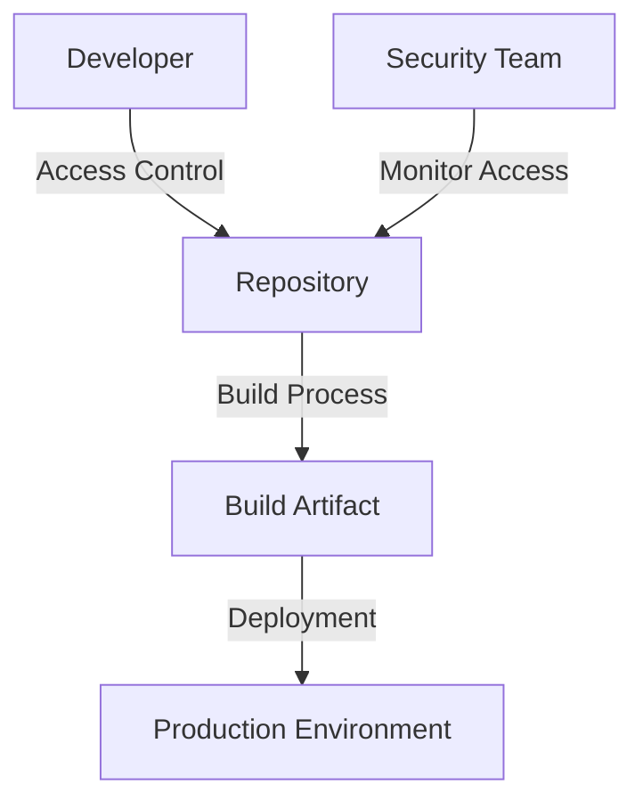
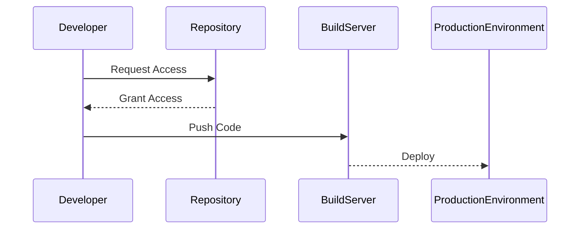

## Introduction to Hardening the CI/CD Pipeline

In the realm of DevSecOps, one of the most critical aspects is ensuring that the Continuous Integration and Continuous Deployment (CI/CD) pipeline is hardened against potential security threats. This process involves safeguarding the confidentiality, integrity, and availability of the data and systems within the pipeline. The CIA triad—Confidentiality, Integrity, and Availability—is a fundamental framework used to guide security policies and practices.

### Confidentiality
Confidentiality ensures that sensitive data is accessible only to authorized individuals. In the context of a CI/CD pipeline, this means protecting source code, build artifacts, and other sensitive information from unauthorized access. For example, if an attacker gains access to the source code repository, they could potentially exploit vulnerabilities or steal intellectual property.

#### Real-World Example: GitHub Data Breach
In 2020, GitHub experienced a significant data breach where unauthorized users gained access to private repositories. This incident highlighted the importance of robust access controls and encryption mechanisms to maintain confidentiality.

### Integrity
Integrity ensures that data remains unchanged and uncorrupted during transmission or storage. In a CI/CD pipeline, this means ensuring that the codebase and build artifacts are not tampered with. Any unauthorized modification could lead to the deployment of malicious code or the introduction of vulnerabilities.

#### Real-World Example: SolarWinds Supply Chain Attack
The SolarWinds supply chain attack in 2020 involved the insertion of malicious code into the SolarWinds Orion software. This compromised the integrity of the software, leading to widespread security breaches across various organizations.

### Availability
Availability ensures that systems and data are accessible to authorized users when needed. In a CI/CD pipeline, this means ensuring that the pipeline remains operational and that developers can continue to work without interruption. However, hardening measures can sometimes negatively impact availability, creating a trade-off between security and usability.

#### Trade-offs in Hardening
Hardening the CI/CD pipeline often involves implementing strict access controls, such as limiting user privileges and enforcing short-lived credentials. While these measures enhance security, they can also disrupt the workflow of developers if not carefully managed. For instance, if developers are unable to access necessary resources due to overly restrictive policies, the pipeline may become unusable, posing a different kind of security risk.

### Balancing Security and Usability

Security is always a trade-off. It is crucial to find a balance between securing the pipeline and maintaining its usability. Overly restrictive policies can hinder productivity, while lax policies can expose the pipeline to security risks. Therefore, it is essential to consider the perspectives of all stakeholders, including developers, security teams, and operations personnel.

#### Example: Implementing Least Privilege Access
One effective approach to balancing security and usability is to implement least privilege access. This principle states that users should have the minimum level of access necessary to perform their tasks. For example, developers should have access only to the repositories and tools they need for their work, rather than having full administrative rights.



### Hardening Measures

To effectively harden the CI/CD pipeline, several measures can be implemented:

#### 1. Access Controls
Implementing strong access controls is crucial for maintaining the confidentiality and integrity of the pipeline. This includes using role-based access control (RBAC) to ensure that users have only the permissions necessary for their roles.

##### Role-Based Access Control (RBAC)
RBAC allows administrators to define roles and assign them to users based on their responsibilities. For example, a developer might have access to the source code repository but not to the production environment.



#### 2. Encryption
Encrypting sensitive data both at rest and in transit is essential for maintaining confidentiality. This includes encrypting source code repositories, build artifacts, and communication channels.

##### Example: Encrypting Source Code Repositories
Using tools like GitLab or Bitbucket, you can enable encryption for repositories to ensure that data is protected even if the server is compromised.

```yaml
# GitLab Configuration Example
gitlab_rails['gitlab_shell_ssh_port'] = 22
gitlab_rails['gitlab_shell_secret'] = 'your_secret_key'
gitlab_rails['gitlab_shell_encryption_salt'] = 'your_encryption_salt'
```

#### 3. Short-Lived Credentials
Using short-lived credentials, such as temporary access tokens, can help mitigate the risk of credential theft. These tokens should be valid for a limited time and automatically expire after use.

##### Example: Using Temporary Access Tokens
GitHub Actions supports the use of temporary access tokens for workflows. These tokens are generated dynamically and have a limited lifespan.

```yaml
# GitHub Actions Workflow Example
name: CI
on:
  push:
    branches: [ main ]
jobs:
  build:
    runs-on: ubuntu-latest
    steps:
      - name: Checkout code
        uses: actions/checkout@v2
      - name: Set up Node.js
        uses: actions/setup-node@v2
        with:
          node-version: '14.x'
      - name: Install dependencies
        run: npm install
      - name: Run tests
        run: npm test
```

### How to Prevent / Defend

#### Detection
Regular monitoring and logging are essential for detecting potential security issues in the CI/CD pipeline. Tools like Splunk, ELK Stack, or Sumo Logic can be used to collect and analyze logs from various components of the pipeline.

##### Example: Monitoring Logs with Splunk
Splunk can be configured to monitor logs from the CI/CD pipeline and alert on suspicious activities.

```bash
# Splunk Configuration Example
index=ci_cd_pipeline sourcetype="github_actions" | search "failed login attempt"
```

#### Prevention
Implementing a combination of access controls, encryption, and short-lived credentials can significantly reduce the risk of security breaches. Additionally, regular security audits and penetration testing can help identify and address vulnerabilities.

##### Example: Regular Security Audits
Conducting regular security audits can help identify and remediate potential security issues. Tools like SonarQube or Veracode can be integrated into the CI/CD pipeline to perform static code analysis and identify vulnerabilities.

```yaml
# SonarQube Configuration Example
sonar.projectKey=my_project
sonar.sources=src
sonar.host.url=http://localhost:9000
sonar.login=my_token
```

#### Secure Coding Practices
Adopting secure coding practices is crucial for maintaining the integrity of the codebase. This includes following best practices such as input validation, error handling, and avoiding hard-coded secrets.

##### Example: Avoiding Hard-Coded Secrets
Instead of hard-coding secrets in the code, use environment variables or secret management tools like HashiCorp Vault.

```python
# Secure Coding Example
import os

SECRET_KEY = os.getenv('SECRET_KEY')
if not SECRET_KEY:
    raise ValueError("No SECRET_KEY set for the current environment")
```

### Conclusion

Hardening the CI/CD pipeline is a complex task that requires careful consideration of the CIA triad principles. By implementing strong access controls, encryption, and short-lived credentials, you can significantly enhance the security of the pipeline. However, it is essential to strike a balance between security and usability to ensure that the pipeline remains functional and productive. Regular monitoring, auditing, and secure coding practices are key to maintaining a robust and secure CI/CD pipeline.

### Practice Labs

For hands-on experience with integrating automated security testing into a CI/CD pipeline, consider the following practice labs:

- **PortSwigger Web Security Academy**: Offers interactive labs to learn about web application security.
- **OWASP Juice Shop**: A deliberately insecure web application for practicing security testing.
- **DVWA (Damn Vulnerable Web Application)**: A PHP/MySQL web application that is riddled with vulnerabilities for educational purposes.
- **WebGoat**: An interactive, gamified training application for learning about web application security.

These labs provide practical scenarios to apply the concepts learned in this chapter and gain hands-on experience with hardening a CI/CD pipeline.

---
<!-- nav -->
[[DevSecOps/DevSecOps Bootcamp/05-Application Security Testing/08-Integrating Automated Security Testing into a CI CD Pipeline/Hardening the Pipeline/00-Overview|Overview]] | [[DevSecOps/DevSecOps Bootcamp/05-Application Security Testing/08-Integrating Automated Security Testing into a CI CD Pipeline/Hardening the Pipeline/02-Enabling Access Logging|Enabling Access Logging]]
