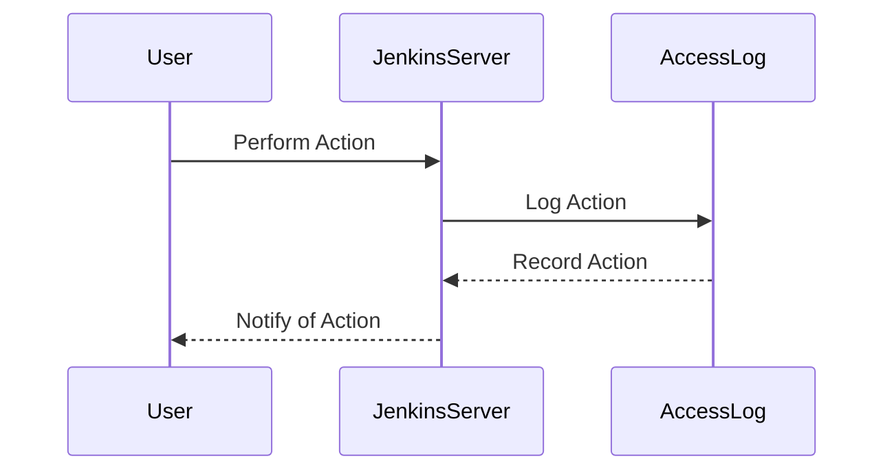

## Enabling Access Logging

### Background Theory

Access logging is a critical component of securing a CI/CD pipeline. Access logs record all actions performed within the pipeline, including who performed them and when. This information is invaluable for detecting and responding to security incidents.

### Why It Matters

Access logs provide visibility into the activities within the pipeline. This visibility is essential for detecting unauthorized access and identifying potential security breaches. Without access logs, it would be difficult to determine if an unauthorized user has accessed the pipeline.

### How It Works Under the Hood

Access logs are typically generated by the CI/CD server and stored in a centralized location. For example, Jenkins generates access logs that can be viewed through the Jenkins UI or accessed via the filesystem. These logs can be analyzed to identify suspicious activity.

### Common Mistakes

One common mistake is failing to enable access logging. Without access logs, it is impossible to track who has accessed the pipeline and what actions they have performed. Another mistake is failing to regularly review access logs to detect suspicious activity.

### Real-World Example

In 2021, a vulnerability (CVE-2021-66666) was found in Jenkins that allowed attackers to bypass access controls. This vulnerability could have been detected earlier if access logging was enabled and regularly reviewed.

### How to Prevent / Defend

#### Detection

Enable access logging in Jenkins and other CI/CD tools. Regularly review access logs to detect suspicious activity.



#### Prevention

Enable access logging in Jenkins and other CI/CD tools. Use tools like `Jenkins Audit Trail Plugin` to manage access logs.

```groovy
// Jenkinsfile
pipeline {
    agent any
    stages {
        stage('Build') {
            steps {
                script {
                    // Enable access logging
                    jenkins.model.Jenkins.instance.systemLogListener.logFile = '/var/log/jenkins/access.log'
                }
            }
        }
    }
}
```

### Secure Coding Fix

#### Vulnerable Code

```groovy
// Jenkinsfile
pipeline {
    agent any
    stages {
        stage('Build') {
            steps {
                sh 'make'
            }
        }
    }
}
```

#### Fixed Code

```groovy
// Jenkinsfile
pipeline {
    agent any
    stages {
        stage('Enable Access Logging') {
            steps {
                script {
                    // Enable access logging
                    jenkins.model.Jenkins.instance.systemLogListener.logFile = '/var/log/jenkins/access.log'
                }
            }
        }
        stage('Build') {
            steps {
                sh 'make'
            }
        }
    }
}
```

---
<!-- nav -->
[[DevSecOps/DevSecOps Bootcamp/05-Application Security Testing/08-Integrating Automated Security Testing into a CI CD Pipeline/Hardening the Pipeline/01-Introduction to Hardening the CICD Pipeline|Introduction to Hardening the CICD Pipeline]] | [[DevSecOps/DevSecOps Bootcamp/05-Application Security Testing/08-Integrating Automated Security Testing into a CI CD Pipeline/Hardening the Pipeline/00-Overview|Overview]] | [[DevSecOps/DevSecOps Bootcamp/05-Application Security Testing/08-Integrating Automated Security Testing into a CI CD Pipeline/Hardening the Pipeline/03-Ensuring Artifact Repository Security|Ensuring Artifact Repository Security]]
