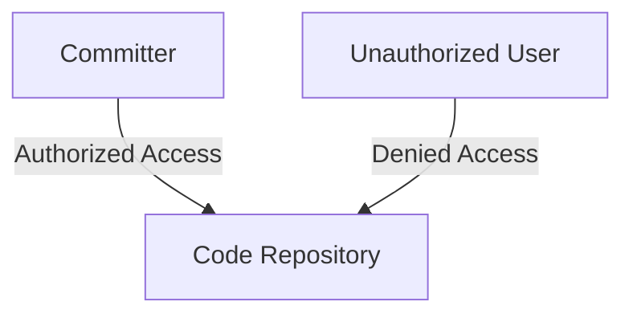
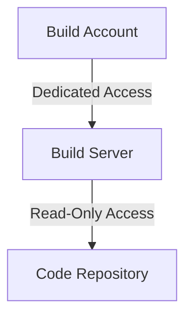
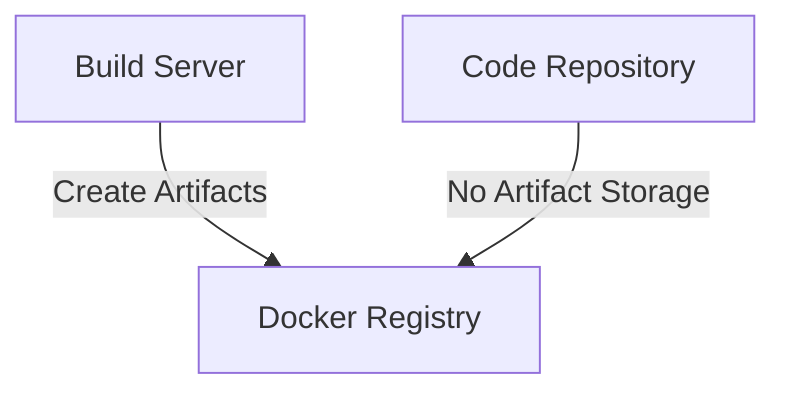
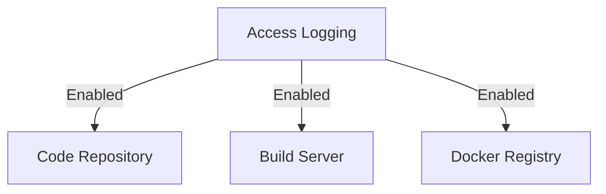
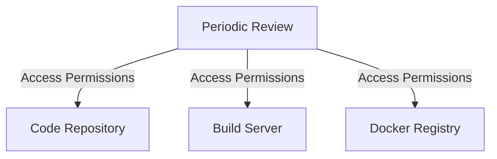

## Integrating Automated Security Testing into a CI/CD Pipeline: Hardening the Pipeline

### Introduction

In the realm of DevSecOps, integrating automated security testing into a Continuous Integration/Continuous Deployment (CI/CD) pipeline is crucial for ensuring the security and integrity of the software being developed. However, it is equally important to harden the pipeline itself to prevent unauthorized access and potential attacks. This chapter delves into the concept of hardening the pipeline, focusing on reducing the attack surface and ensuring that only authorized personnel can access critical components of the pipeline.

### Understanding Attack Surface

An **attack surface** can be defined as any component or aspect of a system that can be exploited by an adversary. This includes vulnerabilities in code, misconfigurations, and unauthorized access points. By reducing the attack surface, we aim to minimize the opportunities for an attacker to compromise the system.

#### What is an Attack Surface?

The attack surface encompasses all the potential entry points that an attacker could use to gain unauthorized access to a system. This includes:

- **Code Repositories**: Where the source code is stored.
- **Build Servers**: Where the code is compiled and built.
- **Artifact Storage**: Where the built artifacts are stored.
- **Access Control Mechanisms**: How access to these components is managed.

#### Why Reduce the Attack Surface?

Reducing the attack surface is essential because it minimizes the number of potential entry points for attackers. By limiting access to only necessary components and ensuring that access controls are strictly enforced, we can significantly reduce the risk of security breaches.

### Hardening the Code Repository

One of the first steps in hardening the pipeline is to secure the code repository. The code repository is where the source code is stored, and it is a critical component of the pipeline.

#### Access Control for Code Repositories

Ensure that only authorized committers have access to the code repository. This is a fundamental principle of access control and helps prevent unauthorized modifications to the codebase.



#### Real-World Example: CVE-2021-22205

In 2021, a vulnerability was discovered in GitHub Actions, where unauthorized users could potentially access and modify repositories. This highlights the importance of strict access control mechanisms.

```markdown
**CVE-2021-22205**
- **Description**: Unauthorized access to GitHub repositories via GitHub Actions.
- **Impact**: Potential modification of code repositories.
- **Mitigation**: Implement strict access control policies and regularly audit access permissions.
```

#### How to Prevent / Defend

- **Secure Access Control Policies**: Ensure that only authorized users have access to the code repository.
- **Regular Audits**: Periodically review access permissions to ensure that only necessary users have access.
- **Least Privilege Principle**: Grant users the minimum level of access required to perform their tasks.

### Hardening the Build Server

The build server is responsible for compiling and building the code. Ensuring that the build server is hardened is crucial to preventing unauthorized access and potential attacks.

#### Dedicated Build Accounts

Use dedicated build accounts that have read-only access to the code repository. This ensures that the build server can only read the code and cannot modify it.



#### Storing Artifacts Outside the Code Repository

If the build server creates artifacts, store them outside of the code repository. This helps prevent unauthorized access to the built artifacts.



#### Real-World Example: CVE-2-2022-23399

In 2022, a vulnerability was discovered in Jenkins, where unauthorized users could potentially access and modify build configurations. This highlights the importance of securing the build server.

```markdown
**CVE-2022-23399**
- **Description**: Unauthorized access to Jenkins build configurations.
- **Impact**: Potential modification of build configurations.
- **Mitigation**: Implement strict access control policies and regularly audit access permissions.
```

#### How to Prevent / Defend

- **Dedicated Build Accounts**: Use dedicated build accounts with read-only access to the code repository.
- **Separate Artifact Storage**: Store built artifacts in a separate location, such as a Docker registry.
- **Access Logging**: Enable access logging to track who accessed what and when.

### Access Logging and Monitoring

Access logging is a critical component of hardening the pipeline. It allows you to monitor who accessed the code repository, build server, and artifact storage, and what actions they performed.

#### Enabling Access Logging

Always ensure that access logging is enabled. This provides a record of who accessed the system and what actions they performed.



#### Periodic Access Permission Reviews

Periodically review access permissions to ensure that only necessary users have access. This helps prevent unauthorized access and potential attacks.



#### Real-World Example: CVE-2021-39142

In 2021, a vulnerability was discovered in GitLab, where unauthorized users could potentially access and modify repositories. This highlights the importance of enabling access logging and regularly reviewing access permissions.

```markdown
**CVE-2021-39142**
- **Description**: Unauthorized access to GitLab repositories.
- **Impact**: Potential modification of repositories.
- **Mitigation**: Enable access logging and regularly review access permissions.
```

#### How to Prevent / Defend

- **Enable Access Logging**: Ensure that access logging is enabled for all critical components of the pipeline.
- **Regular Reviews**: Periodically review access permissions to ensure that only necessary users have access.
- **Audit Trails**: Maintain audit trails to track who accessed the system and what actions they performed.

### Conclusion

Hardening the pipeline is a critical component of DevSecOps. By reducing the attack surface and ensuring that only authorized personnel can access critical components of the pipeline, we can significantly reduce the risk of security breaches. This chapter covered the key aspects of hardening the pipeline, including securing the code repository, hardening the build server, and enabling access logging and monitoring. By following these best practices, you can ensure that your pipeline is secure and resilient against potential attacks.

### Practice Labs

For hands-on practice in hardening a CI/CD pipeline, consider the following labs:

- **PortSwigger Web Security Academy**: Offers a variety of labs focused on web application security, including securing CI/CD pipelines.
- **OWASP Juice Shop**: A deliberately insecure web application for practicing web security skills, including securing CI/CD pipelines.
- **DVWA (Damn Vulnerable Web Application)**: Another web application for practicing web security skills, including securing CI/CD pipelines.
- **WebGoat**: An interactive web application for learning web security skills, including securing CI/CD pipelines.

These labs provide practical experience in implementing the concepts discussed in this chapter, helping you to master the art of hardening a CI/CD pipeline.

---
<!-- nav -->
[[DevSecOps/DevSecOps Bootcamp/05-Application Security Testing/08-Integrating Automated Security Testing into a CI CD Pipeline/Hardening the Pipeline/03-Ensuring Artifact Repository Security|Ensuring Artifact Repository Security]] | [[DevSecOps/DevSecOps Bootcamp/05-Application Security Testing/08-Integrating Automated Security Testing into a CI CD Pipeline/Hardening the Pipeline/00-Overview|Overview]] | [[DevSecOps/DevSecOps Bootcamp/05-Application Security Testing/08-Integrating Automated Security Testing into a CI CD Pipeline/Hardening the Pipeline/05-Integrating Automated Security Testing into a CICD Pipeline|Integrating Automated Security Testing into a CICD Pipeline]]
