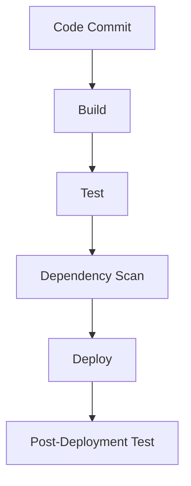

## Integrating Automated Security Testing into a CI/CD Pipeline

### Introduction

In the realm of DevSecOps, integrating automated security testing into a CI/CD pipeline is crucial for ensuring that applications are secure throughout their development lifecycle. This practice helps catch vulnerabilities early, reducing the cost and complexity of fixing them later. However, implementing such a system requires careful consideration and a balanced approach to ensure that security measures do not impede the development process.

### Key Concepts and Terminology

#### CI/CD Pipeline
A CI/CD (Continuous Integration/Continuous Deployment) pipeline is a series of steps that automate the process of building, testing, and deploying software. The primary goal is to enable developers to deliver code changes more frequently and reliably.

#### Automated Security Testing
Automated security testing involves using tools and scripts to automatically check code for security vulnerabilities. These tools can range from static application security testing (SAST) tools that analyze code without executing it, to dynamic application security testing (DAST) tools that test applications as they run.

### Trade-offs in Security Implementation

Security is inherently a trade-off between safety and usability. Overly strict security measures can hinder productivity and innovation, while lax security can expose the organization to significant risks. Therefore, it is essential to strike a balance that ensures both security and efficiency.

#### Common Sense in Security
Implementing security measures should always be guided by common sense. This means understanding the specific threats your application faces and tailoring your security strategy accordingly. For example, a financial application handling sensitive data will require more stringent security measures than a simple blog site.

### Steps to Harden the CI/CD Pipeline

To effectively integrate automated security testing into a CI/CD pipeline, follow these steps:

1. **Identify Security Tools**: Choose appropriate security tools that fit your application's needs. Some popular tools include:
    - **SAST Tools**: SonarQube, Fortify
    - **DAST Tools**: OWASP ZAP, Burp Suite
    - **Dependency Scanners**: Snyk, WhiteSource

2. **Integrate Security Tools into the Pipeline**: Integrate these tools into your CI/CD pipeline at appropriate stages. For example, SAST tools can be run during the build stage, while DAST tools can be run after deployment.

3. **Configure Security Policies**: Define security policies that specify which types of vulnerabilities are acceptable and which are not. These policies should be aligned with your organization’s risk tolerance.

4. **Automate Vulnerability Detection**: Automate the detection of vulnerabilities by configuring your CI/CD pipeline to run security scans automatically whenever new code is pushed.

5. **Review and Address Findings**: Ensure that findings from security scans are reviewed promptly and addressed. This may involve fixing vulnerabilities, updating dependencies, or adjusting security configurations.

### Real-World Examples

#### Example 1: CVE-2021-44228 (Log4Shell)
The Log4Shell vulnerability (CVE-2021-44228) affected the Apache Log4j library, allowing attackers to execute arbitrary code on vulnerable systems. This vulnerability highlights the importance of dependency scanning and keeping libraries up-to-date.

```yaml
# Example of a GitLab CI/CD pipeline with Snyk integration
stages:
  - build
  - test
  - deploy

build:
  stage: build
  script:
    - ./gradlew build

test:
  stage: test
  script:
    - ./gradlew test

dependency_scan:
  stage: test
  script:
    - snyk container test --file=Dockerfile
```

#### Example 2: Equifax Data Breach (2017)
The Equifax data breach in 2017 exposed sensitive personal information of millions of individuals due to a vulnerability in the Apache Struts framework. This incident underscores the importance of regular security audits and timely patch management.

### How to Prevent / Defend

#### Detection
Regularly scan your codebase and dependencies for vulnerabilities using tools like Snyk, SonarQube, and OWASP ZAP. Configure your CI/CD pipeline to automatically run these scans whenever new code is pushed.

#### Prevention
1. **Keep Dependencies Updated**: Regularly update your dependencies to the latest versions to mitigate known vulnerabilities.
2. **Use Secure Coding Practices**: Follow secure coding guidelines to avoid common vulnerabilities such as SQL injection, cross-site scripting (XSS), and buffer overflows.
3. **Implement Least Privilege Principle**: Ensure that applications and services run with the minimum privileges necessary to perform their tasks.

#### Secure-Coding Fixes

**Vulnerable Code Example:**
```python
import sqlite3

def get_user_data(username):
    conn = sqlite3.connect('database.db')
    cursor = conn.cursor()
    cursor.execute(f"SELECT * FROM users WHERE username = '{username}'")
    return cursor.fetchall()
```

**Secure Code Example:**
```python
import sqlite3

def get_user_data(username):
    conn = sqlite3.connect('database.db')
    cursor = conn.cursor()
    cursor.execute("SELECT * FROM users WHERE username = ?", (username,))
    return cursor.fetchall()
```

### Complete Example

#### Full HTTP Request and Response

**HTTP Request:**
```http
POST /api/login HTTP/1.1
Host: example.com
Content-Type: application/json
Content-Length: 36

{
  "username": "admin",
  "password": "password123"
}
```

**HTTP Response:**
```http
HTTP/1.1 200 OK
Date: Mon, 23 Jan 2023 12:00:00 GMT
Content-Type: application/json
Content-Length: 37

{
  "token": "eyJhbGciOiJIUzI1NiIsInR5cCI6IkpXVCJ9..."
}
```

### Mermaid Diagrams

#### CI/CD Pipeline Topology


### Hands-On Labs

For hands-on practice, consider the following labs:
- **PortSwigger Web Security Academy**: Offers interactive labs to learn about various web security vulnerabilities and how to test for them.
- **OWASP Juice Shop**: An intentionally insecure web application to practice security testing and penetration testing techniques.
- **CloudGoat**: Provides a set of vulnerable AWS environments to practice securing cloud infrastructure.

By following these steps and using the recommended tools and practices, you can significantly enhance the security of your CI/CD pipeline and reduce the risk of vulnerabilities in your applications.

---
<!-- nav -->
[[DevSecOps/DevSecOps Bootcamp/05-Application Security Testing/08-Integrating Automated Security Testing into a CI CD Pipeline/Hardening the Pipeline/04-Integrating Automated Security Testing into a CICD Pipeline Hardening the Pipeline|Integrating Automated Security Testing into a CICD Pipeline Hardening the Pipeline]] | [[DevSecOps/DevSecOps Bootcamp/05-Application Security Testing/08-Integrating Automated Security Testing into a CI CD Pipeline/Hardening the Pipeline/00-Overview|Overview]] | [[DevSecOps/DevSecOps Bootcamp/05-Application Security Testing/08-Integrating Automated Security Testing into a CI CD Pipeline/Hardening the Pipeline/06-Keeping Software and Plugins Up to Date|Keeping Software and Plugins Up to Date]]
