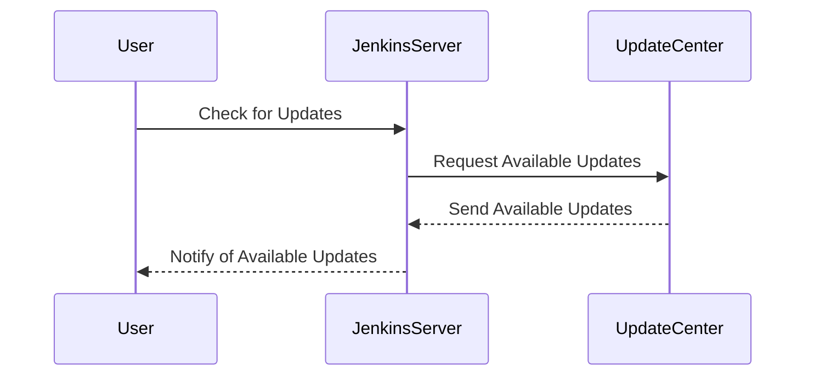

## Keeping Software and Plugins Up to Date

### Background Theory

Keeping software and plugins up to date is one of the most critical aspects of maintaining a secure CI/CD pipeline. Software vulnerabilities are discovered regularly, and vendors release patches to address these issues. Failure to update can leave your systems exposed to known exploits. This is particularly true for open-source tools like Jenkins, which are widely used and thus become attractive targets for attackers.

### Why It Matters

Outdated software can lead to significant security risks. For instance, the Jenkins plugin `Credentials` had a vulnerability (CVE-2018-1000159) that allowed attackers to execute arbitrary code on the Jenkins server. This vulnerability was exploited in the wild, leading to numerous compromises. By keeping your software and plugins updated, you mitigate such risks.

### How It Works Under the Hood

When a new version of a plugin or software is released, it typically includes bug fixes, performance improvements, and security patches. These updates are essential because they address newly discovered vulnerabilities. For example, the Jenkins update process involves downloading the latest version from the official repository and installing it on your server. This ensures that you have the latest security patches.

### Common Mistakes

One common mistake is relying solely on manual updates. This approach is error-prone and can lead to delays in applying critical security patches. Automated update mechanisms can help ensure that updates are applied promptly and consistently.

### Real-World Example

In 2018, a critical vulnerability (CVE-2018-1000159) was found in the Jenkins Credentials plugin. This vulnerability allowed attackers to execute arbitrary code on the Jenkins server. Many organizations were affected because they did not keep their Jenkins installations up to date. This highlights the importance of regular updates.

### How to Prevent / Defend

#### Detection

Regularly check for available updates using tools like `Jenkins Update Center`. You can also use third-party tools like `OWASP Dependency Check` to scan for outdated dependencies.



#### Prevention

Automate the update process using tools like `Jenkins Update Center` or `Jenkins Job Builder`. This ensures that updates are applied promptly and consistently.

```yaml
# Jenkinsfile
pipeline {
    agent any
    stages {
        stage('Update Jenkins') {
            steps {
                script {
                    def updateCenter = hudson.model.UpdateCenter.current()
                    updateCenter.updateAllSites()
                    updateCenter.downloadUpdates()
                    updateCenter.installUpdates()
                }
            }
        }
    }
}
```

### Secure Coding Fix

#### Vulnerable Code

```groovy
// Jenkinsfile
pipeline {
    agent any
    stages {
        stage('Build') {
            steps {
                sh 'make'
            }
        }
    }
}
```

#### Fixed Code

```groovy
// Jenkinsfile
pipeline {
    agent any
    stages {
        stage('Update Jenkins') {
            steps {
                script {
                    def updateCenter = hudson.model.UpdateCenter.current()
                    updateCenter.updateAllSites()
                    updateCenter.downloadUpdates()
                    updateCenter.installUpdates()
                }
            }
        }
        stage('Build') {
            steps {
                sh 'make'
            }
        }
    }
}
```

---
<!-- nav -->
[[DevSecOps/DevSecOps Bootcamp/05-Application Security Testing/08-Integrating Automated Security Testing into a CI CD Pipeline/Hardening the Pipeline/05-Integrating Automated Security Testing into a CICD Pipeline|Integrating Automated Security Testing into a CICD Pipeline]] | [[DevSecOps/DevSecOps Bootcamp/05-Application Security Testing/08-Integrating Automated Security Testing into a CI CD Pipeline/Hardening the Pipeline/00-Overview|Overview]] | [[DevSecOps/DevSecOps Bootcamp/05-Application Security Testing/08-Integrating Automated Security Testing into a CI CD Pipeline/Hardening the Pipeline/07-Keeping Software and Plugins Updated|Keeping Software and Plugins Updated]]
