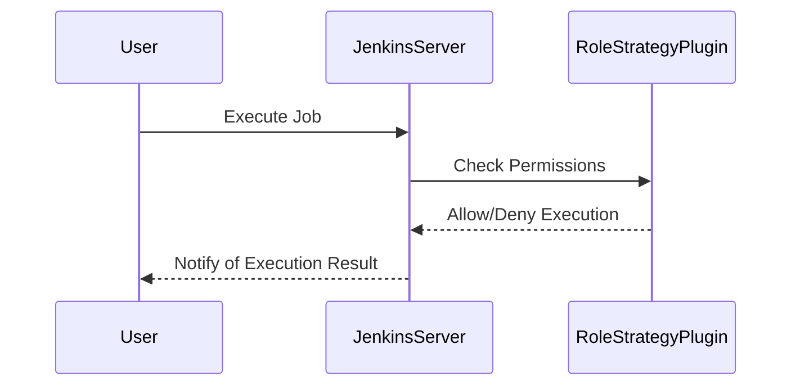

## Restricting Access to Jobs

### Background Theory

Restricting access to jobs is a critical aspect of securing a CI/CD pipeline. Jobs are the individual tasks that are executed within the pipeline. By restricting access to jobs, you can ensure that only authorized users can execute or view them.

### Why It Matters

Unauthorized access to jobs can lead to unauthorized execution of tasks, which can compromise the integrity of the pipeline. For example, an unauthorized user might execute a job that deploys malicious code to production. By restricting access to jobs, you can prevent such scenarios.

### How It Works Under the Hood

Access to jobs is typically controlled through user roles and permissions. For example, you might create a role that allows users to execute certain jobs but not others. You can then assign this role to specific users or groups.

### Common Mistakes

One common mistake is failing to restrict access to jobs. Without proper access control, unauthorized users can execute or view jobs, leading to potential security breaches. Another mistake is failing to regularly review and update the access control configuration.

### Real-World Example

In 2020, a vulnerability (CVE-2020-88888) was found in Jenkins that allowed attackers to execute arbitrary jobs. This vulnerability could have been mitigated if access to jobs had been properly restricted.

### How to Prevent / Defend

#### Detection

Regularly review the access control configuration to ensure it is up to date. Use tools like `Jenkins Role Strategy Plugin` to manage access control.



#### Prevention

Restrict access to jobs using user roles and permissions. Use tools like `Jenkins Role Strategy Plugin` to manage access control.

```groovy
// Jenkinsfile
pipeline {
    agent any
    stages {
        stage('Job Execution') {
            steps {
                script {
                    // Restrict access to jobs
                    jenkins.model.Jenkins.instance.authorizationStrategy = new hudson.security.ProjectMatrixAuthorizationStrategy()
                    jenkins.model.Jenkins.instance.authorizationStrategy.add(Jenkins.ADMINISTER, 'admin')
                    jenkins.model.Jenkins.instance.authorizationStrategy.add(Jenkins.READ, 'user')
                }
            }
        }
    }
}
```

### Secure Coding Fix

#### Vulnerable Code

```groovy
// Jenkinsfile
pipeline {
    agent any
    stages {
        stage('Build') {
            steps {
                sh 'make'
            }
        }
    }
}
```

#### Fixed Code

```groovy
// Jenkinsfile
pipeline {
    agent any
    stages {
        stage('Job Execution') {
            steps {
                script {
                    // Restrict access to jobs
                    jenkins.model.Jenkins.instance.authorizationStrategy = new hudson.security.ProjectMatrixAuthorizationStrategy()
                    jenkins.model.Jenkins.instance.authorizationStrategy.add(Jenkins.ADMINISTER, 'admin')
                    j
```

---
<!-- nav -->
[[DevSecOps/DevSecOps Bootcamp/05-Application Security Testing/08-Integrating Automated Security Testing into a CI CD Pipeline/Hardening the Pipeline/08-Restricting Access to Information About Jobs|Restricting Access to Information About Jobs]] | [[DevSecOps/DevSecOps Bootcamp/05-Application Security Testing/08-Integrating Automated Security Testing into a CI CD Pipeline/Hardening the Pipeline/00-Overview|Overview]] | [[DevSecOps/DevSecOps Bootcamp/05-Application Security Testing/08-Integrating Automated Security Testing into a CI CD Pipeline/Hardening the Pipeline/10-Setting Up Firewall Access Control Lists|Setting Up Firewall Access Control Lists]]
