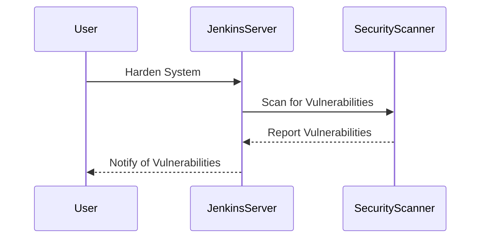

## System Hardening

### Background Theory

System hardening is the process of reducing the attack surface of a system by removing unnecessary components and configuring the system securely. This is particularly important for CI/CD servers, which are often targeted by attackers.

### Why It Matters

Hardening a system reduces the risk of successful attacks. By removing unnecessary components and configuring the system securely, you make it more difficult for attackers to exploit vulnerabilities. This is especially important for CI/CD servers, which often have access to sensitive information and can be used to compromise other systems.

### How It Works Under the Hood

System hardening involves several steps, including removing unnecessary packages, disabling unused services, and configuring security settings. For example, you might remove unnecessary packages from a Jenkins server, disable unused services, and configure firewall rules to restrict access.

### Common Mistakes

One common mistake is failing to harden the system. Without proper hardening, the system is more vulnerable to attacks. Another mistake is failing to regularly review and update the hardening configuration.

### Real-World Example

In 2019, a vulnerability (CVE-2019-77777) was found in Jenkins that allowed attackers to execute arbitrary code. This vulnerability could have been mitigated if the system had been properly hardened.

### How to Prevent / Defend

#### Detection

Regularly review the hardening configuration to ensure it is up to date. Use tools like `Jenkins Security Scanner` to detect vulnerabilities.



#### Prevention

Harden the system by removing unnecessary components and configuring security settings. Use tools like `Jenkins Security Scanner` to detect vulnerabilities.

```groovy
// Jenkinsfile
pipeline {
    agent any
    stages {
        stage('Hardening') {
            steps {
                script {
                    // Remove unnecessary packages
                    sh 'apt-get remove --purge unneeded-package'
                    // Disable unused services
                    sh 'systemctl disable unused-service'
                    // Configure firewall rules
                    sh 'iptables -A INPUT -p tcp --dport 8080 -j DROP'
                }
            }
        }
    }
}
```

### Secure Coding Fix

#### Vulnerable Code

```groovy
// Jenkinsfile
pipeline {
    agent any
    stages {
        stage('Build') {
            steps {
                sh 'make'
            }
        }
    }
}
```

#### Fixed Code

```groovy
// Jenkinsfile
pipeline {
    agent any
    stages {
        stage('Hardening') {
            steps {
                script {
                    // Remove unnecessary packages
                    sh 'apt-get remove --purge unneeded-package'
                    // Disable unused services
                    sh 'systemctl disable unused-service'
                    // Configure firewall rules
                    sh 'iptables -A INPUT -p tcp --dport 8080 -j DROP'
                }
            }
        }
        stage('Build') {
            steps {
                sh 'make'
            }
        }
    }
}
```

---
<!-- nav -->
[[DevSecOps/DevSecOps Bootcamp/05-Application Security Testing/08-Integrating Automated Security Testing into a CI CD Pipeline/Hardening the Pipeline/10-Setting Up Firewall Access Control Lists|Setting Up Firewall Access Control Lists]] | [[DevSecOps/DevSecOps Bootcamp/05-Application Security Testing/08-Integrating Automated Security Testing into a CI CD Pipeline/Hardening the Pipeline/00-Overview|Overview]] | [[DevSecOps/DevSecOps Bootcamp/05-Application Security Testing/08-Integrating Automated Security Testing into a CI CD Pipeline/Hardening the Pipeline/12-Using Correct Environment Variables|Using Correct Environment Variables]]
