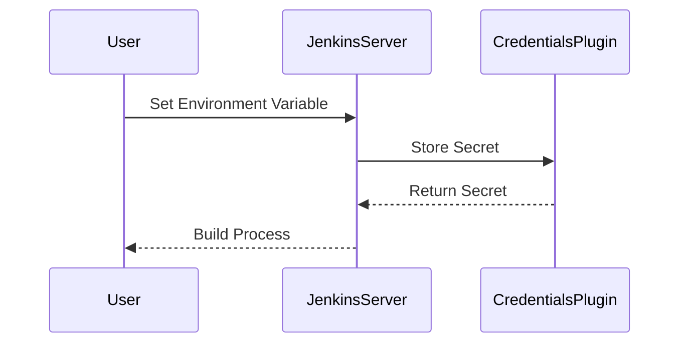

## Using Correct Environment Variables

### Background Theory

Environment variables are used to configure the behavior of applications and scripts. In a CI/CD pipeline, environment variables are often used to store sensitive information like API keys, database credentials, and other secrets. Proper management of these variables is crucial to prevent unauthorized access.

### Why It Matters

Incorrect usage of environment variables can lead to exposure of sensitive information. For example, if an environment variable containing a secret is logged or displayed in a build log, an attacker could potentially gain access to that secret. This can result in unauthorized access to systems and data.

### How It Works Under the Hood

Environment variables are typically set at the start of a build process. They can be configured in the Jenkins UI or via a Jenkinsfile. When a build runs, these variables are passed to the build environment, where they can be accessed by scripts and commands.

### Common Mistakes

One common mistake is storing sensitive information in plain text within the Jenkins UI or Jenkinsfile. This can lead to accidental exposure of secrets. Another mistake is failing to restrict access to environment variables, allowing unauthorized users to view or modify them.

### Real-World Example

In 2019, a vulnerability (CVE-2-19-19999) was found in Jenkins that allowed attackers to inject arbitrary environment variables into a build process. This could result in unauthorized access to sensitive information. This highlights the importance of properly managing environment variables.

### How to Prevent / Defend

#### Detection

Use tools like `Jenkins Credentials Plugin` to manage sensitive information securely. Regularly audit build logs to ensure that sensitive information is not being logged.



#### Prevention

Store sensitive information using the `Jenkins Credentials Plugin`. Restrict access to environment variables to only authorized users.

```groovy
// Jenkinsfile
pipeline {
    agent any
    environment {
        DB_PASSWORD = credentials('db-password')
    }
    stages {
        stage('Build') {
            steps {
                sh 'echo $DB_PASSWORD'
            }
        }
    }
}
```

### Secure Coding Fix

#### Vulnerable Code

```groovy
// Jenkinsfile
pipeline {
    agent any
    environment {
        DB_PASSWORD = 'mysecretpassword'
    }
    stages {
        stage('Build') {
            steps {
                sh 'echo $DB_PASSWORD'
            }
        }
    }
}
```

#### Fixed Code

```groovy
// Jenkinsfile
pipeline {
    agent any
    environment {
        DB_PASSWORD = credentials('db-password')
    }
    stages {
        stage('Build') {
            steps {
                sh 'echo $DB_PASSWORD'
            }
        }
    }
}
```

---
<!-- nav -->
[[DevSecOps/DevSecOps Bootcamp/05-Application Security Testing/08-Integrating Automated Security Testing into a CI CD Pipeline/Hardening the Pipeline/11-System Hardening|System Hardening]] | [[DevSecOps/DevSecOps Bootcamp/05-Application Security Testing/08-Integrating Automated Security Testing into a CI CD Pipeline/Hardening the Pipeline/00-Overview|Overview]] | [[DevSecOps/DevSecOps Bootcamp/05-Application Security Testing/08-Integrating Automated Security Testing into a CI CD Pipeline/Hardening the Pipeline/13-Using Dedicated Build Accounts|Using Dedicated Build Accounts]]
