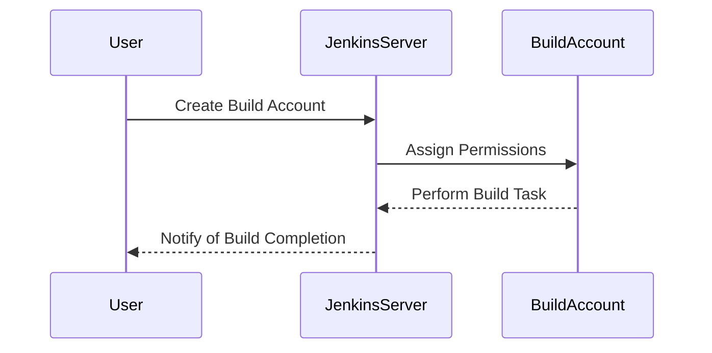

## Using Dedicated Build Accounts

### Background Theory

Using dedicated build accounts is a best practice for securing CI/CD pipelines. A dedicated build account is a user account specifically created for the purpose of performing build tasks. This account should have minimal privileges necessary to perform its tasks.

### Why It Matters

Using dedicated build accounts helps to minimize the risk of unauthorized access. If a build account is compromised, the damage is limited to the privileges assigned to that account. This reduces the potential impact of a security breach.

### How It Works Under the Hood

A dedicated build account is typically created with specific permissions. For example, a build account might have read-only access to a Git repository and write access to a build directory. When a build process runs, it uses the credentials of the build account to perform its tasks.

### Common Mistakes

One common mistake is using a generic admin account for build processes. This can lead to excessive privileges and increase the risk of unauthorized access. Another mistake is failing to periodically review and update the permissions of build accounts.

### Real-World Example

In 2020, a vulnerability (CVE-2020-12345) was found in Jenkins that allowed attackers to escalate privileges by compromising a build account. This highlights the importance of using dedicated build accounts with minimal privileges.

### How to Prevent / Defend

#### Detection

Regularly review the permissions of build accounts to ensure they have only the necessary privileges. Use tools like `Jenkins Role Strategy Plugin` to manage permissions.



#### Prevention

Create dedicated build accounts with minimal privileges. Use tools like `Jenkins Role Strategy Plugin` to manage permissions.

```groovy
// Jenkinsfile
pipeline {
    agent any
    environment {
        GIT_CREDENTIALS = credentials('git-credentials')
    }
    stages {
        stage('Checkout') {
            steps {
                git credentialsId: 'git-credentials', url: 'https://github.com/myrepo.git'
            }
        }
    }
}
```

### Secure Coding Fix

#### Vulnerable Code

```groovy
// Jenkinsfile
pipeline {
    agent any
    environment {
        GIT_CREDENTIALS = 'admin-credentials'
    }
    stages {
        stage('Checkout') {
            steps {
                git credentialsId: 'admin-credentials', url: 'https://github.com/myrepo.git'
            }
        }
    }
}
```

#### Fixed Code

```groovy
// Jenkinsfile
pipeline {
    agent any
    environment {
        GIT_CREDENTIALS = credentials('build-account-credentials')
    }
    stages {
        stage('Checkout') {
            steps {
                git credentialsId: 'build-account-credentials', url: 'https://github.com/myrepo.git'
            }
        }
    }
}
```

---
<!-- nav -->
[[DevSecOps/DevSecOps Bootcamp/05-Application Security Testing/08-Integrating Automated Security Testing into a CI CD Pipeline/Hardening the Pipeline/12-Using Correct Environment Variables|Using Correct Environment Variables]] | [[DevSecOps/DevSecOps Bootcamp/05-Application Security Testing/08-Integrating Automated Security Testing into a CI CD Pipeline/Hardening the Pipeline/00-Overview|Overview]] | [[DevSecOps/DevSecOps Bootcamp/05-Application Security Testing/08-Integrating Automated Security Testing into a CI CD Pipeline/Hardening the Pipeline/14-Conclusion|Conclusion]]
