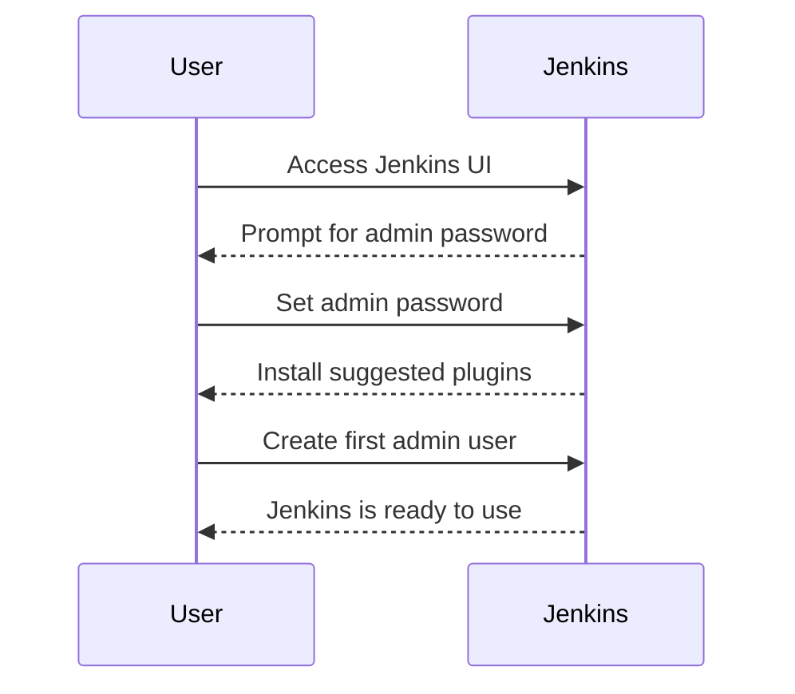

## Introduction to Jenkins and Integrating Automated Security Testing

Welcome to the module on Jenkins and integrating automated security testing. This module aims to provide a comprehensive understanding of how to integrate automated security testing into your Jenkins pipelines. We'll cover various approaches, including native Jenkins functionality, plugins, and external tools. By the end of this module, you should have a solid grasp of how to implement these techniques effectively and securely.

### Background Theory

Before diving into the specifics, let's establish some foundational knowledge about Jenkins and automated security testing.

#### What is Jenkins?

Jenkins is an open-source automation server that provides continuous integration and continuous delivery (CI/CD) services. It is widely used in software development to automate the building, testing, and deployment of applications. Jenkins supports a wide range of plugins and integrations, making it highly flexible and customizable.

#### Importance of Automated Security Testing

Automated security testing is crucial in modern software development practices. It helps identify vulnerabilities and security issues early in the development lifecycle, reducing the risk of security breaches and ensuring that the application is secure before it reaches production.

### Approaches to Integrating Automated Security Testing with Jenkins

In this module, we will explore three main approaches to integrating automated security testing with Jenkins:

1. **Using Native Jenkins Functionality**
2. **Using Special Plugins**
3. **Integrating External Security Tests**

Each approach has its own advantages and use cases, which we will discuss in detail.

### Demo 1: Getting Jenkins Up and Running

Before we can start integrating automated security testing, we need to set up a Jenkins instance. This demo will guide you through the process of setting up a Jenkins instance.

#### Setting Up Jenkins

To set up Jenkins, you can either install it on your local machine or use a cloud-based solution. Here, we will focus on installing Jenkins on a local machine.

```bash
# Install Java
sudo apt-get update
sudo apt-get install default-jdk

# Download Jenkins
wget https://get.jenkins.io/war-stable/latest/jenkins.war

# Run Jenkins
java -jar jenkins.war
```

Once Jenkins is running, you can access it via `http://localhost:8080`.

#### Jenkins Initial Setup

After starting Jenkins, you will be prompted to configure the initial setup. This includes setting up administrative credentials and installing suggested plugins.



### Demo 2: Modifying an Existing Jenkins Pipeline

Now that we have a Jenkins instance up and running, let's modify an existing Jenkins pipeline to include automated security testing.

#### Jenkins Pipeline Basics

A Jenkins pipeline is defined using a `Jenkinsfile`, which is a script written in Groovy. This file defines the steps of the pipeline, such as building, testing, and deploying the application.

Here is an example of a basic Jenkins pipeline:

```groovy
pipeline {
    agent any
    stages {
        stage('Build') {
            steps {
                sh 'make'
            }
        }
        stage('Test') {
            steps {
                sh 'make test'
            }
        }
        stage('Deploy') {
            steps {
                sh 'make deploy'
            }
        }
    }
}
```

#### Adding Automated Security Testing Using Native Jenkins Functionality

To add automated security testing using native Jenkins functionality, we can use the `sh` step to run security testing tools. For example, we can use a tool like `OWASP ZAP` to perform static analysis.

```groovy
pipeline {
    agent any
    stages {
        stage('Build') {
            steps {
                sh 'make'
            }
        }
        stage('Test') {
            steps {
                sh 'make test'
            }
        }
        stage('Security Test') {
            steps {
                sh './zap/zap.sh -cmd -quickurl http://localhost:8080'
            }
        }
        stage('Deploy') {
            steps {
                sh 'make deploy'
            }
        }
    }
}
```

#### Adding Automated Security Testing Using a Plugin

Jenkins offers numerous plugins that can be used to integrate automated security testing. One popular plugin is the `OWASP Dependency-Check` plugin, which scans for known vulnerabilities in project dependencies.

To use this plugin, you need to install it from the Jenkins plugin manager. Once installed, you can add a step to your pipeline to run the dependency check.

```groovy
pipeline {
    agent any
    stages {
        stage('Build') {
            steps {
                sh 'make'
            }
        }
        stage('Test') {
            steps {
                sh 'make test'
            }
        }
        stage('Security Test') {
            steps {
                dependencyCheck goals: 'check', skipOnSuccess: false
            }
        }
        stage('Deploy') {
            steps {
                sh 'make deploy'
            }
        }
    }
}
```

#### Adding Automated Security Testing Using External Tools

Another approach is to integrate external security testing tools into your Jenkins pipeline. For example, you can use a tool like `SonarQube` to perform static code analysis.

To integrate SonarQube, you need to install the `SonarQube Scanner` plugin and configure it in your pipeline.

```groovy
pipeline {
    agent any
    stages {
        stage('Build') {
            steps {
                sh 'make'
            }
        }
        stage('Test') {
            steps {
                sh 'make test'
            }
        }
        stage('Security Test') {
            steps {
                withSonarQubeEnv('SonarQube') {
                    sh 'sonar-scanner'
                }
            }
        }
        stage('Deploy') {
            steps {
                sh 'make deploy'
            }
        }
    }
}
```

### How to Prevent / Defend

#### Detection

To ensure that your Jenkins pipeline is secure, you should regularly monitor and audit your pipeline configurations. You can use tools like `Jenkins Security Scanner` to detect potential security issues.

#### Prevention

To prevent security issues in your Jenkins pipeline, you should follow best practices such as:

- **Use Secure Credentials**: Store sensitive information securely using Jenkins credentials management.
- **Limit Permissions**: Ensure that Jenkins agents have the minimum necessary permissions.
- **Regular Updates**: Keep Jenkins and its plugins up to date to mitigate known vulnerabilities.

#### Secure Coding Fixes

Here is an example of a vulnerable Jenkinsfile and its secure counterpart:

**Vulnerable Jenkinsfile:**

```groovy
pipeline {
    agent any
    stages {
        stage('Build') {
            steps {
                sh 'make'
            }
        }
        stage('Test') {
            steps {
                sh 'make test'
            }
        }
        stage('Security Test') {
            steps {
                sh 'echo $PASSWORD | ./security-tool'
            }
        }
        stage('Deploy') {
            steps {
                sh 'make deploy'
            }
        }
    }
}
```

**Secure Jenkinsfile:**

```groovy
pipeline {
    agent any
    stages {
        stage('Build') {
            steps {
                sh 'make'
            }
        }
        stage('Test') {
            steps {
                sh 'make test'
            }
        }
        stage('Security Test') {
            steps {
                withCredentials([usernamePassword(credentialsId: 'my-credentials-id', usernameVariable: 'USERNAME', passwordVariable: 'PASSWORD')]) {
                    sh './security-tool --username $USERNAME --password $PASSWORD'
                }
            }
        }
        stage('Deploy') {
            steps {
                sh 'make deploy'
            }
        }
    }
}
```

### Summary

In this module, we covered the basics of Jenkins and the importance of automated security testing. We explored three main approaches to integrating automated security testing with Jenkins: using native functionality, plugins, and external tools. We also provided detailed examples and secure coding practices to help you implement these techniques effectively and securely.

### Practice Labs

For hands-on practice, consider the following labs:

- **PortSwigger Web Security Academy**: Offers interactive labs on web security, including Jenkins security.
- **OWASP Juice Shop**: A deliberately insecure web application for practicing web security skills.
- **DVWA (Damn Vulnerable Web Application)**: Another intentionally vulnerable web application for learning web security.

These labs will help you apply the concepts learned in this module and gain practical experience in integrating automated security testing with Jenkins.

By the end of this module, you should have a solid understanding of how to integrate automated security testing into your Jenkins pipelines and ensure that your applications are secure throughout the development lifecycle.

---
<!-- nav -->
[[DevSecOps/DevSecOps Bootcamp/05-Application Security Testing/09-Jenkins and Integrating Automated Security Testing/01-Module Introduction/00-Overview|Overview]] | [[DevSecOps/DevSecOps Bootcamp/05-Application Security Testing/09-Jenkins and Integrating Automated Security Testing/01-Module Introduction/02-Practice Questions & Answers|Practice Questions & Answers]]
