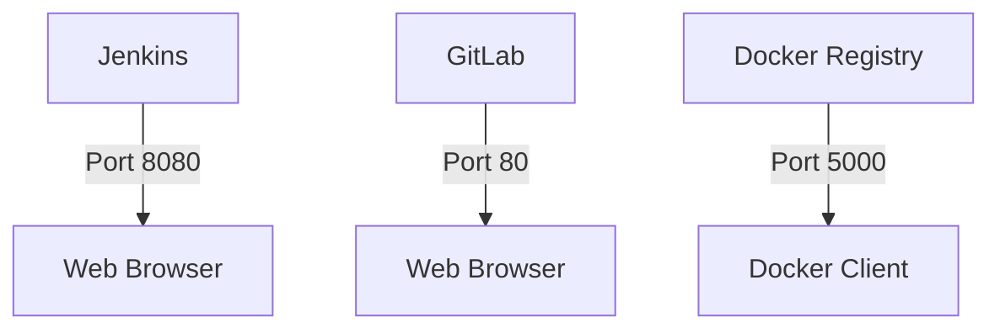
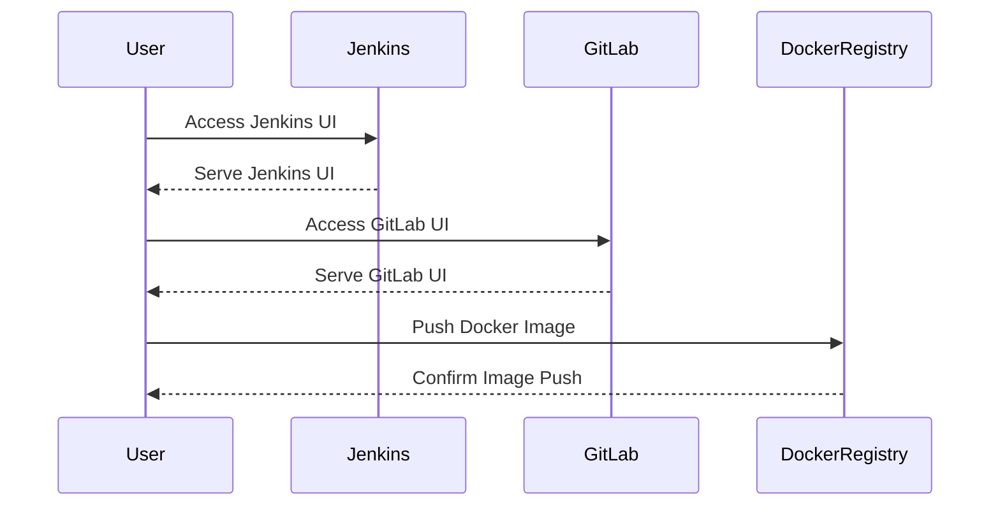

## Getting Jenkins Up and Running

### Background Theory

Jenkins is an open-source automation server that provides hundreds of plugins to support building, deploying, and automating any project. It is widely used in continuous integration and continuous delivery (CI/CD) pipelines to automate the build, test, and deployment processes. Jenkins can be run as a standalone application or within a containerized environment like Docker. In this section, we will cover how to set up Jenkins using Docker and Docker Compose.

### Prerequisites

Before proceeding, ensure that you have the following tools installed:

- **Docker**: A platform for developing, shipping, and running applications inside lightweight containers.
- **Docker Compose**: A tool for defining and running multi-container Docker applications.

### Cloning the DevSecOps Lab Repository

The first step is to clone the DevSecOps Lab repository from GitHub. This repository contains the necessary files and configurations to set up Jenkins and other related services.

```bash
git clone https://github.com/Betarmosmans/DevSecOps-Lab.git
cd DevSecOps-Lab
```

Next, checkout the `integrating` branch, which contains the specific configurations for this course.

```bash
git checkout integrating
```

### Verifying the Docker Group ID

To ensure that Jenkins runs smoothly, it is crucial to verify the Docker group ID. This is necessary because Jenkins needs to interact with Docker to manage containers.

```bash
id -Gn | grep docker
```

If the output does not include `docker`, you may need to add your user to the Docker group.

```bash
sudo usermod -aG docker $USER
```

After adding your user to the Docker group, log out and log back in to apply the changes.

### Using Docker Compose

Docker Compose is a tool that allows you to define and run multi-container Docker applications. The `docker-compose.yml` file in the repository defines the services required for the lab, including Jenkins, GitLab, and a Docker registry.

#### Understanding the `docker-compose.yml` File

Let's take a closer look at the `docker-compose.yml` file:

```yaml
version: '3'
services:
  jenkins:
    image: jenkins/jenkins:lts
    ports:
      - "8080:8080"
      - "50000:50000"
    volumes:
      - ./jenkins_home:/var/jenkins_home
    networks:
      - devsecops-net
  gitlab:
    image: gitlab/gitlab-ce:latest
    ports:
      - "80:80"
      - "443:443"
      - "22:22"
    volumes:
      - ./gitlab_data:/var/opt/gitlab
    networks:
      - devsecops-net
  docker-registry:
    image: registry:2
    ports:
      - "5000:5000"
    volumes:
      - ./registry_data:/var/lib/registry
    networks:
      - devsecops-net
networks:
  devsecops-net:
```

This file defines three services:

- **Jenkins**: Uses the official Jenkins LTS image and maps port 8080 for the Jenkins UI and port 50000 for agent communication. It also mounts a volume for persistent storage.
- **GitLab**: Uses the official GitLab CE image and maps ports 80, 443, and 22. It also mounts a volume for persistent storage.
- **Docker Registry**: Uses the official Docker registry image and maps port 5000. It also mounts a volume for persistent storage.

### Starting the Services

To start the services defined in the `docker-compose.yml` file, run the following command:

```bash
docker-compose up -d
```

This command starts the services in detached mode (`-d`).

### Accessing Jenkins

Once the services are up and running, you can access Jenkins via the URL `http://jenkins.demo.local:8080`. You will need to initialize Jenkins by following the initial setup wizard.

### Real-World Example: Recent Breaches

One notable breach involving Jenkins was the **CVE-2018-1000861** vulnerability, which allowed attackers to execute arbitrary code on the Jenkins server. This vulnerability was due to a flaw in the Jenkins CLI plugin, which did not properly validate user input.

#### Vulnerable Code Example

Here is an example of vulnerable code that could lead to such a vulnerability:

```java
public class VulnerableCLI {
    public void executeCommand(String command) {
        try {
            Process process = Runtime.getRuntime().exec(command);
            // Process handling
        } catch (IOException e) {
            e.printStackTrace();
        }
    }
}
```

#### Secure Code Example

To prevent such vulnerabilities, ensure that user input is properly validated and sanitized. Here is a secure version of the code:

```java
public class SecureCLI {
    public void executeCommand(String command) {
        if (isValidCommand(command)) {
            try {
                Process process = Runtime.getRuntime().exec(command);
                // Process handling
            } catch (IOException e) {
                e.printStackTrace();
            }
        } else {
            throw new IllegalArgumentException("Invalid command");
        }
    }

    private boolean isValidCommand(String command) {
        // Implement validation logic
        return true;
    }
}
```

### How to Prevent / Defend

#### Detection

Regularly scan your Jenkins instance for vulnerabilities using tools like **Jenkins Security Scanner** or **SonarQube**. These tools can help identify potential security issues.

#### Prevention

1. **Keep Jenkins and Plugins Updated**: Regularly update Jenkins and all installed plugins to the latest versions.
2. **Use Strong Authentication**: Enable strong authentication methods like LDAP, Active Directory, or OAuth.
3. **Limit Permissions**: Ensure that users have the minimum permissions necessary to perform their tasks.
4. **Secure Configuration**: Follow best practices for securing Jenkins configuration, such as disabling unnecessary plugins and securing sensitive data.

### Complete Example: Full HTTP Request and Response

When accessing Jenkins, the full HTTP request and response would look something like this:

#### HTTP Request

```http
GET / HTTP/1.1
Host: jenkins.demo.local:8080
User-Agent: curl/7.64.1
Accept: */*
```

#### HTTP Response

```http
HTTP/1.1 200 OK
Date: Mon, 01 Jan 2024 12:00:00 GMT
Server: Jetty(9.4.35.v20201120)
Content-Type: text/html;charset=UTF-8
Content-Length: 12345

<!DOCTYPE html>
<html lang="en">
<head>
    <meta charset="UTF-8">
    <title>Jenkins</title>
</head>
<body>
    <!-- Jenkins UI content -->
</body>
</html>
```

### Mermaid Diagrams

#### Network Topology



#### Sequence Diagram



### Pitfalls and Common Mistakes

1. **Not Keeping Jenkins Updated**: Failing to keep Jenkins and plugins updated can leave your system vulnerable to known exploits.
2. **Weak Authentication**: Using weak or default credentials can make it easy for attackers to gain unauthorized access.
3. **Overly Permissive Permissions**: Allowing users to have more permissions than necessary can lead to security breaches.

### Hands-On Labs

For hands-on practice, consider the following labs:

- **PortSwigger Web Security Academy**: Offers a variety of labs focused on web application security.
- **OWASP Juice Shop**: A deliberately insecure web application for security training.
- **DVWA (Damn Vulnerable Web Application)**: A PHP/MySQL web application that is riddled with vulnerabilities.
- **WebGoat**: An interactive, gamified security training application.

These labs provide practical experience in setting up and securing Jenkins and other related services.

### Conclusion

Setting up Jenkins using Docker and Docker Compose is a straightforward process that can be easily managed with the right tools and configurations. By following best practices and regularly updating your Jenkins instance, you can ensure that your CI/CD pipeline remains secure and efficient.

---
<!-- nav -->
[[DevSecOps/DevSecOps Bootcamp/05-Application Security Testing/09-Jenkins and Integrating Automated Security Testing/03-Demo Getting Jenkins up and Running/00-Overview|Overview]] | [[02-Setting Up Jenkins Using Docker Compose|Setting Up Jenkins Using Docker Compose]]
