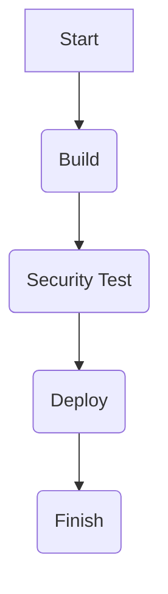
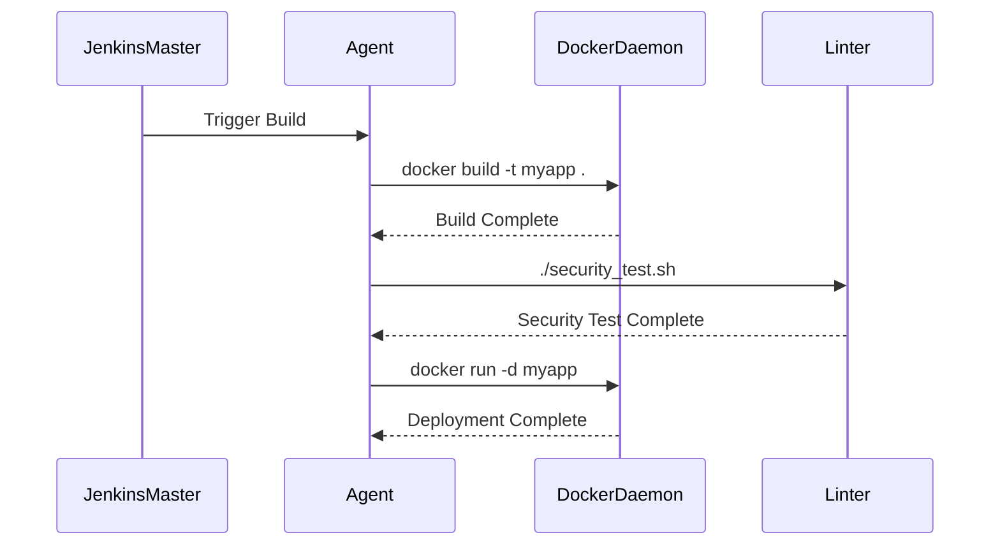

## Introduction to Jenkins and Automated Security Testing

Jenkins is one of the most widely used continuous integration and continuous delivery (CI/CD) tools. It allows developers to automate the building, testing, and deployment of applications. One of the key aspects of modern DevSecOps practices is integrating automated security testing into the CI/CD pipeline. This ensures that security checks are performed automatically and consistently throughout the development lifecycle.

In this chapter, we will explore how to integrate automated security testing into a Jenkins pipeline using an external approach. Specifically, we will use shell scripts, Docker, and a linter like Hadolint to perform security checks on Dockerfiles. This method provides flexibility and control over the testing process, allowing developers to customize their security checks according to their specific requirements.

### Background Theory

#### Continuous Integration and Continuous Delivery (CI/CD)

Continuous Integration (CI) is a practice where developers frequently merge their code changes into a central repository, followed by automated builds and tests. Continuous Delivery (CD) extends CI by ensuring that the software can be released to production at any time. Together, CI/CD aims to improve the speed and quality of software releases.

#### Jenkins

Jenkins is an open-source automation server that provides a powerful and flexible platform for automating various tasks in the software development lifecycle. It supports a wide range of plugins and integrations, making it highly customizable and extensible.

#### Automated Security Testing

Automated security testing involves using tools and scripts to automatically check for vulnerabilities and security issues in the codebase. This helps identify potential security risks early in the development process, reducing the likelihood of security breaches.

### Why Integrate Security Tests into Jenkins?

Integrating security tests into a Jenkins pipeline offers several benefits:

1. **Consistency**: Automated security tests ensure that security checks are performed consistently across different environments and stages of the development lifecycle.
2. **Early Detection**: By integrating security tests into the CI/CD pipeline, potential security issues can be identified and addressed early in the development process, reducing the cost and effort required to fix them later.
3. **Compliance**: Many organizations have regulatory requirements that mandate regular security assessments. Integrating security tests into the pipeline helps ensure compliance with these regulations.
4. **Efficiency**: Automating security tests reduces the manual effort required to perform these checks, allowing developers to focus on other critical tasks.

### External Approach vs. Plugin Approach

In the previous section, we discussed integrating security tests using a plugin approach. In this section, we will explore an external approach using shell scripts and Docker.

#### Advantages of External Approach

- **Flexibility**: The external approach allows developers to customize their security checks according to their specific requirements.
- **Control**: Developers have more control over the testing process, including the ability to choose specific tools and configurations.
- **Portability**: The external approach can be easily adapted to different environments and tools, making it more portable.

#### Disadvantages of External Approach

- **Complexity**: Setting up and maintaining an external approach can be more complex compared to using a plugin.
- **Maintenance**: Developers need to ensure that the external scripts and tools are kept up-to-date and compatible with the Jenkins environment.

### Setting Up the Shell Script

The first step in integrating security tests into a Jenkins pipeline using an external approach is to create a shell script that performs the security checks. In this example, we will use a generic bash script to run a Docker container containing a linter like Hadolint.

#### Creating the Bash Script

Let's create a simple bash script named `security_test.sh` that runs a Docker container to lint a Dockerfile.

```bash
#!/bin/bash

# Define the path to the Dockerfile
DOCKERFILE_PATH="path/to/Dockerfile"

# Run the Docker container with Hadolint
docker run --rm -v "$PWD":/work hadolint/hadolint hadolint /work/$DOCKERFILE_PATH
```

This script does the following:

1. Defines the path to the Dockerfile.
2. Runs a Docker container with Hadolint, mounting the current directory as a volume.
3. Executes Hadolint on the specified Dockerfile.

#### Running the Script Locally

Before integrating the script into the Jenkins pipeline, let's run it locally to ensure it works correctly.

```bash
chmod +x security_test.sh
./security_test.sh
```

If the script runs successfully, it should output several warnings and informational messages related to the Dockerfile.

### Modifying the Jenkins Pipeline

Now that we have a working shell script, we need to modify the Jenkins pipeline to use this script instead of the existing linting stage.

#### Opening the Jenkinsfile

Open the `Jenkinsfile` in your preferred text editor. This file defines the structure of the Jenkins pipeline.

#### Removing the Existing Linting Stage

Locate the existing linting stage in the `Jenkinsfile` and remove it. For example:

```groovy
pipeline {
    agent any

    stages {
        stage('Build') {
            steps {
                sh 'make build'
            }
        }

        // Remove the existing linting stage
        // stage('Lint') {
        //     steps {
        //         sh 'make lint'
        //     }
        // }

        stage('Test') {
            steps {
                sh 'make test'
            }
        }
    }
}
```

#### Adding the External Script

Replace the removed linting stage with a new stage that executes the external shell script.

```groovy
pipeline {
    agent any

    stages {
        stage('Build') {
            steps {
                sh 'make build'
            }
        }

        stage('Security Test') {
            steps {
                sh './security_test.sh'
            }
        }

        stage('Test') {
            steps {
                sh 'make test'
            }
        }
    }
}
```

### Explanation of the Jenkinsfile Changes

- **Agent**: The `agent any` directive specifies that the pipeline can run on any available agent.
- **Stages**: The pipeline consists of three stages: Build, Security Test, and Test.
- **Security Test Stage**: This stage executes the `security_test.sh` script using the `sh` step.

### Running the Jenkins Pipeline

After modifying the `Jenkinsfile`, save the changes and trigger a new build in Jenkins. The pipeline should now include the security test stage, which runs the external shell script.

### Real-World Example: CVE-2021-25285

CVE-2021-25285 is a vulnerability in the Jenkins Pipeline plugin that allows attackers to execute arbitrary code on the Jenkins master. This vulnerability highlights the importance of integrating security tests into the CI/CD pipeline to detect and mitigate such risks.

By integrating security tests into the Jenkins pipeline, developers can catch potential vulnerabilities like CVE-2021-25285 early in the development process, reducing the risk of security breaches.

### How to Prevent / Defend

To prevent and defend against security vulnerabilities in Jenkins pipelines, follow these best practices:

#### Secure Coding Practices

1. **Use Secure Libraries**: Ensure that all libraries and dependencies used in the pipeline are up-to-date and free from known vulnerabilities.
2. **Validate Inputs**: Validate all inputs to the pipeline to prevent injection attacks.
3. **Least Privilege Principle**: Run the pipeline with the least privilege necessary to perform the required tasks.

#### Configuration Hardening

1. **Disable Unnecessary Plugins**: Disable any unnecessary plugins to reduce the attack surface.
2. **Enable Security Features**: Enable security features such as CSRF protection and authentication mechanisms.
3. **Regular Updates**: Regularly update Jenkins and all plugins to the latest versions to ensure that known vulnerabilities are patched.

#### Secure Pipeline Configuration

1. **Use Secure Environments**: Use secure environments for running the pipeline, such as isolated Docker containers.
2. **Limit Access**: Limit access to the Jenkins master and restrict permissions to only authorized users.
3. **Monitor and Audit**: Monitor and audit the pipeline regularly to detect any suspicious activities.

### Complete Example: Vulnerable vs. Secure Code

#### Vulnerable Code

Consider a vulnerable Jenkins pipeline that uses an insecure Docker image:

```groovy
pipeline {
    agent any

    stages {
        stage('Build') {
            steps {
                sh 'docker build -t myapp .'
            }
        }

        stage('Deploy') {
            steps {
                sh 'docker run -d myapp'
            }
        }
    }
}
```

#### Secure Code

Here is the secure version of the pipeline that uses a secure Docker image and integrates security tests:

```groovy
pipeline {
    agent any

    stages {
        stage('Build') {
            steps {
                sh 'docker build -t myapp .'
            }
        }

        stage('Security Test') {
            steps {
                sh './security_test.sh'
            }
        }

        stage('Deploy') {
            steps {
                sh 'docker run -d myapp'
            }
        }
    }
}
```

### Mermaid Diagrams

#### Jenkins Pipeline Architecture



#### Request/Response Flow



### Practice Labs

For hands-on practice with integrating automated security testing into a Jenkins pipeline, consider the following labs:

- **PortSwigger Web Security Academy**: Offers a series of labs focused on web application security, including integration with Jenkins pipelines.
- **OWASP Juice Shop**: Provides a vulnerable web application that can be used to practice security testing and integration with Jenkins pipelines.
- **DVWA (Damn Vulnerable Web Application)**: Another vulnerable web application that can be used to practice security testing and integration with Jenkins pipelines.

These labs provide real-world scenarios and challenges that help reinforce the concepts covered in this chapter.

### Conclusion

Integrating automated security testing into a Jenkins pipeline using an external approach provides flexibility and control over the testing process. By following best practices and using secure coding techniques, developers can ensure that their pipelines are secure and reliable. The examples and diagrams provided in this chapter serve as a comprehensive guide for integrating security tests into Jenkins pipelines, helping developers build secure and robust applications.

---
<!-- nav -->
[[DevSecOps/DevSecOps Bootcamp/05-Application Security Testing/09-Jenkins and Integrating Automated Security Testing/06-Demo Integrating Automated Security Testing into a Jenkins Pipeline Using Scripts/00-Overview|Overview]] | [[DevSecOps/DevSecOps Bootcamp/05-Application Security Testing/09-Jenkins and Integrating Automated Security Testing/06-Demo Integrating Automated Security Testing into a Jenkins Pipeline Using Scripts/02-Introduction to Jenkins and Integrating Automated Security Testing|Introduction to Jenkins and Integrating Automated Security Testing]]
