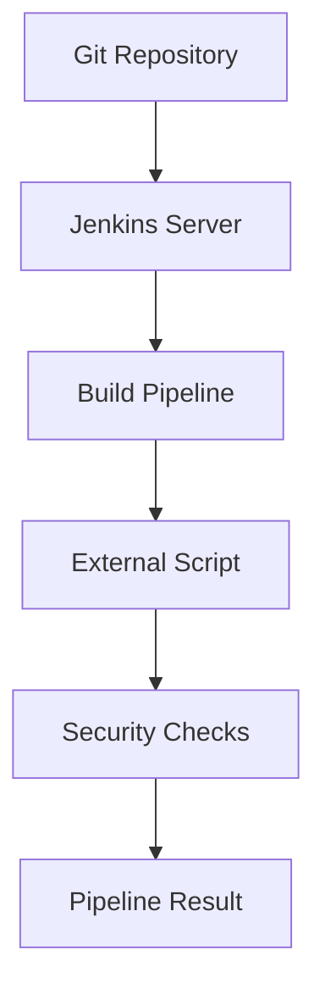
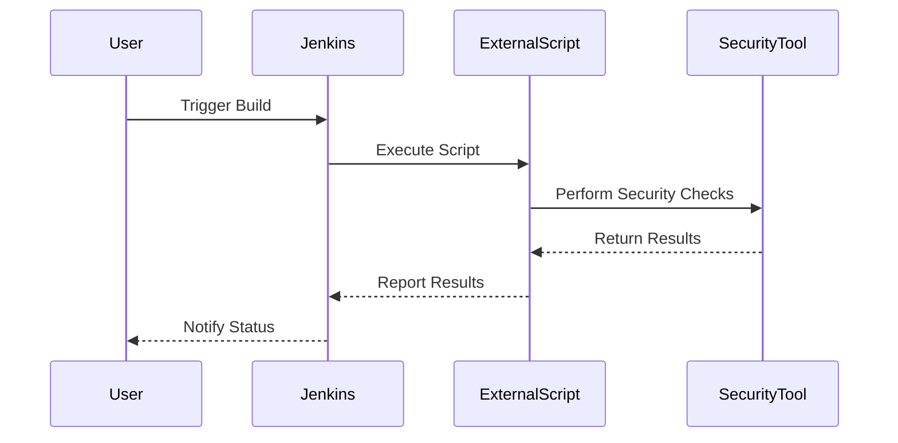

## Using External Scripts for Automated Security Testing

Using external scripts to perform automated security testing in a Jenkins pipeline is a flexible approach that allows teams to leverage existing security tools and scripts. This method involves executing a script as part of the pipeline stages and capturing the output to determine if the build passes or fails.

### Creating a New Git Branch

Before integrating the external script into the Jenkins pipeline, we need to create a new Git branch to store the script and the modified Jenkinsfile.

```bash
# Create a new Git branch called 'external'
git checkout -b external

# Add the external script to the repository
touch test/linter.sh

# Ensure the script has execute permissions
chmod +x test/linter.sh

# Stage the changes
git add test/linter.sh

# Commit the changes with a descriptive message
git commit -m "Add external linter script"

# Push the changes to the remote repository
git push origin external
```

### Modifying the Jenkinsfile

Next, we need to modify the Jenkinsfile to call the external script during the build process. The Jenkinsfile defines the steps that Jenkins will execute as part of the pipeline.

```groovy
pipeline {
    agent any

    stages {
        stage('Lint') {
            steps {
                sh 'test/linter.sh'
            }
        }
    }
}
```

### Executing the External Script

The `sh` step in the Jenkinsfile executes the external script `linter.sh`. This script can perform various security checks, such as syntax validation, static code analysis, or dynamic analysis.

#### Example: Linter Script

Here is an example of a simple linter script that checks the syntax of the Jenkinsfile:

```bash
#!/bin/bash

# Check the syntax of the Jenkinsfile
if ! groovy -e 'new File("Jenkinsfile").text' > /dev/null 2>&1; then
    echo "Syntax error in Jenkinsfile"
    exit 1
fi

echo "Jenkinsfile syntax is valid"
```

### Running the Pipeline

After pushing the changes to the repository, Jenkins detects the new branch and starts building the pipeline. If the external script generates any errors, the pipeline will fail.

#### Example: Pipeline Failure

If the linter script detects a syntax error in the Jenkinsfile, the pipeline will fail, and the logs will display the error message.

```plaintext
Started by user admin
Running in Durability level: MAX_SURVIVABILITY
[Pipeline] Start of Pipeline
[Pipeline] node
Running on Jenkins in /var/jenkins_home/workspace/external
[Pipeline] {
[Pipeline] stage
[Pipeline] { (Lint)
[Pipeline] sh
+ test/linter.sh
Syntax error in Jenkinsfile
[Pipeline] }
[Pipeline] // stage
[Pipeline] }
[Pipeline] // node
[Pipeline] End of Pipeline
ERROR: script returned exit code 1
Finished: FAILURE
```

### Advantages of Using External Scripts

Using external scripts for automated security testing offers several advantages:

1. **Flexibility**: Teams can use any scripting language and tooling they prefer.
2. **Reusability**: The same script can be run locally on developers' workstations, ensuring consistency between local and CI environments.
3. **Customization**: Scripts can be tailored to specific security requirements and can be easily updated as needed.

### Real-World Examples

Recent breaches and vulnerabilities have highlighted the importance of integrating automated security testing into CI/CD pipelines. For example, the Log4j vulnerability (CVE-2021-44228) affected numerous applications and systems worldwide. By integrating automated security testing, teams could have identified and mitigated such vulnerabilities earlier.

#### Example: Log4j Vulnerability

The Log4j vulnerability allowed attackers to execute arbitrary code on affected systems. By integrating automated security testing into the Jenkins pipeline, teams could have detected the presence of vulnerable Log4j versions and taken corrective actions.

```bash
#!/bin/bash

# Check for vulnerable Log4j versions
if grep -q "log4j-core-2.14.1.jar" /path/to/application; then
    echo "Vulnerable Log4j version detected"
    exit 1
fi

echo "No vulnerable Log4j versions found"
```

### How to Prevent / Defend

To effectively integrate automated security testing into a Jenkins pipeline, teams should follow best practices for detection, prevention, and mitigation.

#### Detection

Teams should regularly scan their codebases for known vulnerabilities using tools like OWASP Dependency-Check, SonarQube, or Trivy.

```bash
#!/bin/bash

# Run OWASP Dependency-Check
dependency-check --project "My Project" --scan /path/to/codebase --out /path/to/reports
```

#### Prevention

Teams should enforce secure coding practices and use static code analysis tools to identify potential security issues.

```bash
#!/bin/bash

# Run SonarQube analysis
sonar-scanner -Dsonar.projectKey=my_project -Dsonar.sources=/path/to/sources
```

#### Mitigation

Teams should have a plan in place to address security issues promptly. This includes updating dependencies, applying patches, and conducting regular security audits.

```bash
#!/bin/bash

# Update dependencies
pip install --upgrade pip
pip install --upgrade -r requirements.txt
```

### Mermaid Diagrams

To visualize the integration of automated security testing into a Jenkins pipeline, consider the following mermaid diagrams.

#### Pipeline Architecture



#### Request/Response Flow



### Complete Example

Here is a complete example of integrating automated security testing into a Jenkins pipeline using an external script.

#### Jenkinsfile

```groovy
pipeline {
    agent any

    stages {
        stage('Lint') {
            steps {
                sh 'test/linter.sh'
            }
        }
    }
}
```

#### linter.sh

```bash
#!/bin/bash

# Check the syntax of the Jenkinsfile
if ! groovy -e 'new File("Jenkinsfile").text' > /dev/null 2>&1; then
    echo "Syntax error in Jenkinsfile"
    exit 1
fi

echo "Jenkinsfile syntax is valid"
```

#### Full HTTP Request/Response

```http
POST /job/external/buildWithParameters HTTP/1.1
Host: jenkins.example.com
Content-Type: application/x-www-form-urlencoded

token=your-token&cause=Triggered+by+user+admin
```

```http
HTTP/1.1 201 Created
Date: Tue, 01 Jan 2024 00:00:00 GMT
Location: http://jenkins.example.com/job/external/1/
Content-Length: 0
```

### Common Pitfalls

When integrating automated security testing into a Jenkins pipeline, teams should be aware of common pitfalls and how to avoid them.

#### Pitfall: False Positives

False positives can occur when security tools incorrectly flag benign code as suspicious. To mitigate this, teams should configure security tools to ignore known false positives.

#### Pitfall: Outdated Dependencies

Outdated dependencies can introduce security vulnerabilities. Teams should regularly update dependencies and use tools like Dependabot to track updates.

### Hands-On Labs

To practice integrating automated security testing into a Jenkins pipeline, consider the following hands-on labs:

- **PortSwigger Web Security Academy**: Offers interactive labs for web application security.
- **OWASP Juice Shop**: A deliberately insecure web application for practicing security testing.
- **DVWA (Damn Vulnerable Web Application)**: A PHP/MySQL web application that contains numerous security vulnerabilities.

By following these guidelines and best practices, teams can effectively integrate automated security testing into their Jenkins pipelines, ensuring that their applications are built and deployed securely.

---

This chapter provides a comprehensive guide to integrating automated security testing into a Jenkins pipeline using external scripts. It covers the background theory, practical steps, real-world examples, and best practices for detection, prevention, and mitigation. By following these guidelines, teams can enhance the security of their CI/CD pipelines and reduce the risk of vulnerabilities in their applications.

---
<!-- nav -->
[[DevSecOps/DevSecOps Bootcamp/05-Application Security Testing/09-Jenkins and Integrating Automated Security Testing/06-Demo Integrating Automated Security Testing into a Jenkins Pipeline Using Scripts/02-Introduction to Jenkins and Integrating Automated Security Testing|Introduction to Jenkins and Integrating Automated Security Testing]] | [[DevSecOps/DevSecOps Bootcamp/05-Application Security Testing/09-Jenkins and Integrating Automated Security Testing/06-Demo Integrating Automated Security Testing into a Jenkins Pipeline Using Scripts/00-Overview|Overview]] | [[DevSecOps/DevSecOps Bootcamp/05-Application Security Testing/09-Jenkins and Integrating Automated Security Testing/06-Demo Integrating Automated Security Testing into a Jenkins Pipeline Using Scripts/04-Practice Questions & Answers|Practice Questions & Answers]]
