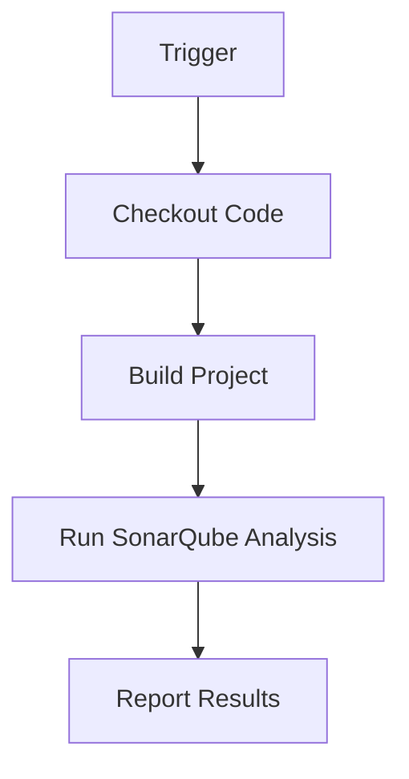
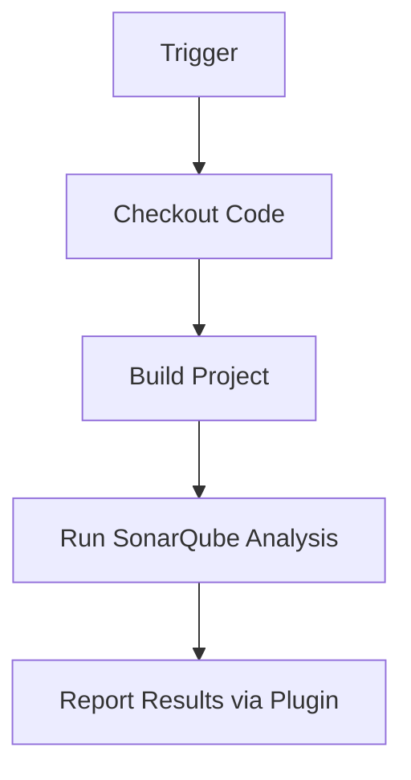
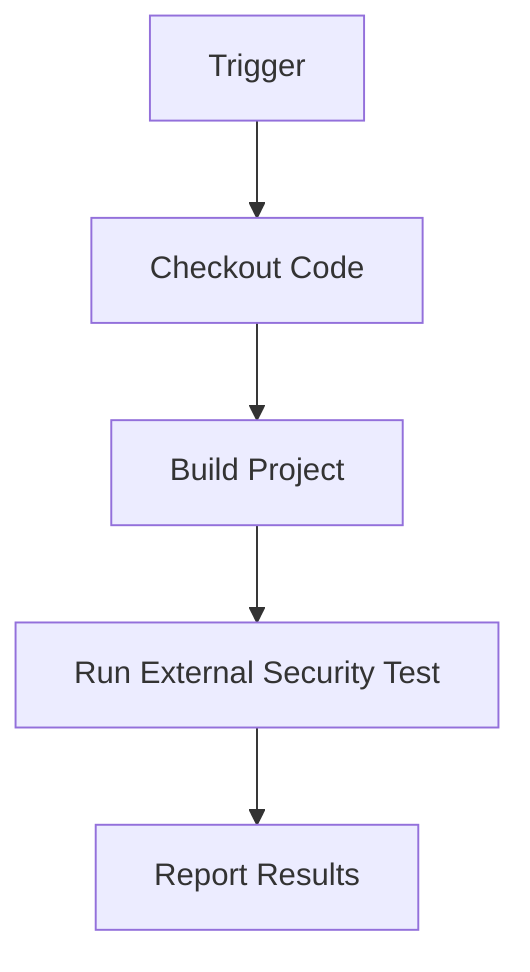

## Introduction to Jenkins and Integrating Automated Security Testing

In the realm of DevSecOps, continuous integration and continuous delivery (CI/CD) pipelines play a pivotal role in ensuring that software is developed, tested, and deployed efficiently and securely. Jenkins, one of the most widely used open-source automation servers, is a cornerstone in this process. This chapter delves into the integration of automated security testing within Jenkins pipelines, exploring various methods and their implications.

### Background Theory

Jenkins is an extensible automation server that provides a continuous integration and continuous delivery (CI/CD) environment. It supports building, testing, and deploying software across a wide range of platforms and tools. The core strength of Jenkins lies in its flexibility and extensibility through plugins, which allow developers to integrate various tools and services into their CI/CD pipelines.

Automated security testing is the practice of using automated tools to identify security vulnerabilities in software. This includes static application security testing (SAST), dynamic application security testing (DAST), interactive application security testing (IAST), and dependency scanning. Integrating these tests into Jenkins ensures that security is a part of the development lifecycle, enabling teams to catch and fix issues early.

### Native Method of Integration

The native method of integrating security tests into Jenkins involves configuring the Jenkins job to execute security testing tools directly. This method leverages Jenkins' built-in capabilities to manage and execute jobs.

#### How It Works

When a Jenkins job is configured to run security tests, the following steps typically occur:

1. **Job Configuration**: Define the job parameters, including the source code repository, build triggers, and security testing tools.
2. **Build Execution**: When the job is triggered, Jenkins checks out the source code and executes the build process.
3. **Security Testing**: After the build completes, Jenkins runs the configured security testing tools.
4. **Results Reporting**: The results of the security tests are reported back to Jenkins, which can then notify stakeholders or trigger further actions based on the test outcomes.

#### Example Configuration

Here is an example of a Jenkins job configuration that integrates a static analysis tool like SonarQube:

```yaml
pipeline {
    agent any
    stages {
        stage('Checkout') {
            steps {
                git 'https://github.com/example/repo.git'
            }
        }
        stage('Build') {
            steps {
                sh 'mvn clean install'
            }
        }
        stage('SonarQube Analysis') {
            steps {
                withSonarQubeEnv('SonarQube') {
                    sh 'mvn sonar:sonar'
                }
            }
        }
    }
}
```

#### Mermaid Diagram



### Plugin Method of Integration

The plugin method extends Jenkins' functionality by leveraging third-party plugins designed specifically for security testing. This method offers a more integrated and user-friendly experience compared to the native method.

#### How It Works

Plugins like the Jenkins SonarQube Plugin or the OWASP ZAP Plugin provide a seamless way to integrate security testing into Jenkins pipelines. These plugins offer features such as:

- **Graphical Dashboard**: A visual interface to monitor the status of security tests.
- **Automatic Integration**: Plugins automatically configure Jenkins jobs to run security tests.
- **Customizable Reports**: Detailed reports that can be customized to meet specific requirements.

#### Example Configuration

Here is an example of a Jenkins job configuration using the SonarQube Plugin:

```yaml
pipeline {
    agent any
    stages {
        stage('Checkout') {
            steps {
                git 'https://github.com/example/repo.git'
            }
        }
        stage('Build') {
            steps {
                sh 'mvn clean install'
            }
        }
        stage('SonarQube Analysis') {
            steps {
                withSonarQubeEnv('SonarQ-Server') {
                    sh 'mvn sonar:sonar'
                }
            }
        }
    }
    post {
        always {
            step([$class: 'SonarQubePublisher'])
        }
    }
}
```

#### Mermaid Diagram



### External Tests Integration

External tests involve using standalone scripts or tools that are incorporated into the Jenkins pipeline. This method allows for greater flexibility and control over the testing process.

#### How It Works

External tests can be run locally or on remote systems. They are typically executed as part of a Jenkins job, and the results are reported back to Jenkins.

#### Example Configuration

Here is an example of a Jenkins job configuration that uses an external script for security testing:

```yaml
pipeline {
    agent any
    stages {
        stage('Checkout') {
            steps {
                git 'https://github.com/example/repo.git'
            }
        }
        stage('Build') {
            steps {
                sh 'mvn clean install'
            }
        }
        stage('Run External Security Test') {
            steps {
                sh './security-test.sh'
            }
        }
    }
}
```

#### Mermaid Diagram



### Best Practices and Considerations

Regardless of the method chosen, several best practices should be followed to ensure effective integration of security testing into Jenkins pipelines:

1. **Use Existing Workflows**: Leverage existing workflows and processes to minimize disruption.
2. **Shift Left**: Integrate security testing early in the development cycle to catch issues sooner.
3. **Test Often**: Regularly run security tests to ensure continuous security validation.
4. **Document and Communicate**: Clearly document the security testing process and communicate it to all team members.

### Real-World Examples

Recent real-world examples highlight the importance of integrating security testing into CI/CD pipelines. For instance, the Log4j vulnerability (CVE-2021-44228) affected numerous applications due to the lack of proper security testing. By integrating tools like Dependency Check into Jenkins pipelines, organizations can detect and mitigate such vulnerabilities early.

### How to Prevent / Defend

#### Detection

To detect security vulnerabilities, integrate tools like SonarQube, OWASP ZAP, and Dependency Check into Jenkins pipelines. These tools can identify issues such as code weaknesses, injection attacks, and vulnerable dependencies.

#### Prevention

Prevent security vulnerabilities by:

1. **Secure Coding Practices**: Implement secure coding guidelines and review code regularly.
2. **Dependency Management**: Use tools like Dependency Check to scan for vulnerable dependencies.
3. **Regular Updates**: Keep all tools and libraries up to date to patch known vulnerabilities.

#### Secure-Coding Fixes

Compare the vulnerable code with the secure version:

**Vulnerable Code**

```java
public class UserInputHandler {
    public void handleInput(String input) {
        // Vulnerable to SQL Injection
        String query = "SELECT * FROM users WHERE username = '" + input + "'";
        // Execute query
    }
}
```

**Secure Code**

```java
public class UserInputHandler {
    public void handleInput(String input) {
        // Secure against SQL Injection
        String query = "SELECT * FROM users WHERE username = ?";
        // Use Prepared Statement to execute query
    }
}
```

#### Configuration Hardening

Harden Jenkins configurations by:

1. **Limit Access**: Restrict access to Jenkins to authorized personnel only.
2. **Enable Security Features**: Enable security features like CSRF protection and strong authentication mechanisms.
3. **Regular Audits**: Conduct regular audits to ensure compliance with security policies.

### Complete Example

Here is a complete example of a Jenkins pipeline that integrates multiple security testing tools:

```yaml
pipeline {
    agent any
    stages {
        stage('Checkout') {
            steps {
                git 'https://github.com/example/repo.git'
            }
        }
        stage('Build') {
            steps {
                sh 'mvn clean install'
            }
        }
        stage('Static Analysis') {
            steps {
                withSonarQubeEnv('SonarQ-Server') {
                    sh 'mvn sonar:sonar'
                }
            }
        }
        stage('Dynamic Analysis') {
            steps {
                sh './run-zap-scan.sh'
            }
        }
        stage('Dependency Check') {
            steps {
                sh 'mvn dependency-check:check'
            }
        }
    }
    post {
        always {
            step([$class: 'SonarQubePublisher'])
        }
    }
}
```

### Expected Result

The expected result of running this pipeline is a comprehensive report detailing the status of all security tests. This report can be used to identify and address any security issues before deployment.

### Hands-On Labs

For hands-on practice, consider the following labs:

- **PortSwigger Web Security Academy**: Offers a variety of labs focused on web application security.
- **OWASP Juice Shop**: A deliberately insecure web application for practicing security testing.
- **DVWA (Damn Vulnerable Web Application)**: Another popular web application for security testing.

These labs provide practical experience in integrating security testing into Jenkins pipelines.

### Conclusion

Integrating automated security testing into Jenkins pipelines is crucial for maintaining the security of software throughout the development lifecycle. By leveraging native methods, plugins, and external scripts, teams can effectively detect and mitigate security vulnerabilities. Following best practices and using real-world examples helps ensure that security is a priority in every aspect of the development process.

---
<!-- nav -->
[[DevSecOps/DevSecOps Bootcamp/05-Application Security Testing/09-Jenkins and Integrating Automated Security Testing/07-Module Summary/00-Overview|Overview]] | [[DevSecOps/DevSecOps Bootcamp/05-Application Security Testing/09-Jenkins and Integrating Automated Security Testing/07-Module Summary/02-Practice Questions & Answers|Practice Questions & Answers]]
