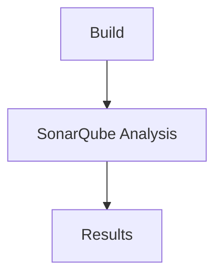
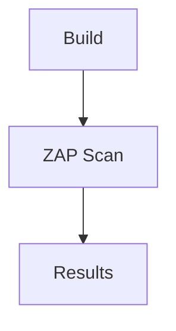

## Introduction to Jenkins and Integrating Automated Security Testing

In the realm of DevSecOps, integrating automated security testing into the Continuous Integration/Continuous Deployment (CI/CD) pipeline is crucial for ensuring that applications are secure from the very beginning of development. Jenkins, a widely-used open-source automation server, plays a pivotal role in this process by providing a platform to automate the building, testing, and deployment of software.

### Why Integrate Security Testing Early?

Integrating security testing early in the pipeline offers several benefits:

1. **Early Detection**: Identifying vulnerabilities early in the development cycle can significantly reduce the cost and effort required to fix them.
2. **Shift Left**: This approach aligns with the "shift left" philosophy, which emphasizes addressing security concerns as early as possible in the software development lifecycle (SDLC).
3. **Developer Buy-In**: Providing developers with the tools to test their code ensures that security is not an afterthought but an integral part of the development process.

However, this approach also comes with its own set of challenges and trade-offs.

### Challenges of Early Security Testing

While integrating security testing early in the pipeline is beneficial, it also presents several challenges:

1. **Spread Out Tests**: Security tests are often spread across multiple files and scripts, making it difficult to manage and maintain these tests.
2. **Less Native Integration**: Jenkins may lack native support for certain security testing tools, leading to a less cohesive experience.
3. **Dashboard Limitations**: Without a comprehensive dashboard, it can be challenging to visualize and interpret the results of security tests.

### Approaches to Integrating Security Testing with Jenkins

There are three primary approaches to integrating security testing with Jenkins:

1. **Native Integration**
2. **Plugins**
3. **External Tools**

Each approach has its own set of advantages and disadvantages, which we will explore in detail.

#### Native Integration

**What is Native Integration?**

Native integration refers to using Jenkins' built-in features and capabilities to perform security testing. This includes leveraging Jenkins' built-in plugins and configurations to run security tests.

**Advantages:**

- **Ease of Use**: Native integration is straightforward and does not require additional setup.
- **Consistency**: Results are consistent and can be easily integrated into the Jenkins dashboard.

**Disadvantages:**

- **Limited Functionality**: Jenkins' native security testing capabilities are limited compared to specialized security testing tools.
- **Customization**: Customizing security tests can be more complex and time-consuming.

**Example:**

Consider a scenario where you want to run a static code analysis tool like SonarQube within Jenkins. You can configure Jenkins to run SonarQube scans as part of the build process.

```yaml
pipeline {
    agent any
    stages {
        stage('Build') {
            steps {
                sh 'mvn clean package'
            }
        }
        stage('SonarQube Analysis') {
            steps {
                withSonarQubeEnv('SonarQube') {
                    sh 'mvn sonar:sonar'
                }
            }
        }
    }
}
```

**Mermaid Diagram:**



#### Plugins

**What are Plugins?**

Jenkins plugins extend the functionality of Jenkins by adding new features and capabilities. There are numerous plugins available for security testing, such as the SonarQube plugin, Fortify plugin, and others.

**Advantages:**

- **Rich Functionality**: Plugins provide rich functionality and integrate seamlessly with Jenkins.
- **Ease of Setup**: Plugins are easy to install and configure, making them accessible to users with varying levels of expertise.

**Disadvantages:**

- **Dependency Management**: Managing dependencies between plugins can be complex.
- **Compatibility Issues**: Some plugins may not be compatible with the latest versions of Jenkins.

**Example:**

Using the SonarQube plugin to integrate static code analysis into the Jenkins pipeline.

```yaml
pipeline {
    agent any
    stages {
        stage('Build') {
            steps {
                sh 'mvn clean package'
            }
        }
        stage('SonarQube Analysis') {
            steps {
                withSonarQubeEnv('SonarQube') {
                    sh 'mvn sonar:sonar'
                }
            }
        }
    }
    post {
        always {
            echo 'Pipeline completed'
        }
    }
}
```

**Mermaid Diagram:**


#### External Tools

**What are External Tools?**

External tools refer to third-party security testing tools that are integrated into the Jenkins pipeline via custom scripts or plugins. Examples include OWASP ZAP, Burp Suite, and others.

**Advantages:**

- **Specialized Functionality**: External tools offer specialized functionality that may not be available in Jenkins natively.
- **Flexibility**: These tools can be customized to meet specific security testing requirements.

**Disadvantages:**

- **Complexity**: Integrating external tools can be complex and requires significant setup.
- **Maintenance**: Maintaining these integrations can be time-consuming and resource-intensive.

**Example:**

Using OWASP ZAP to perform dynamic application security testing (DAST).

```yaml
pipeline {
    agent any
    stages {
        stage('Build') {
            steps {
                sh 'mvn clean package'
            }
        }
        stage('ZAP Scan') {
            steps {
                script {
                    def zapHome = '/path/to/zap'
                    def zapScript = "${zapHome}/zap.sh"
                    def targetUrl = 'http://localhost:8080'

                    sh "${zapScript} -cmd -quickurl ${targetUrl}"
                }
            }
        }
    }
}
```

**Mermaid Diagram:**



### Real-World Examples and Recent Breaches

Recent breaches and CVEs highlight the importance of integrating security testing into the CI/CD pipeline. For instance, the Log4j vulnerability (CVE-2021-44228) affected numerous applications due to the lack of proper security testing and patch management.

**Example:**

In the case of the Log4j vulnerability, integrating static code analysis tools like SonarQube could have helped identify the usage of vulnerable libraries early in the development cycle.

### How to Prevent / Defend

To effectively integrate security testing into the Jenkins pipeline, consider the following best practices:

1. **Use a Combination of Approaches**: Leverage both native integration and plugins to cover a wide range of security testing scenarios.
2. **Regularly Update Plugins and Tools**: Ensure that all plugins and tools are up-to-date to take advantage of the latest security features and patches.
3. **Automate Security Testing**: Automate security testing as much as possible to ensure that it is performed consistently and reliably.
4. **Monitor and Analyze Results**: Regularly monitor and analyze the results of security tests to identify and address vulnerabilities promptly.

**Secure Code Example:**

Compare the insecure and secure versions of a Jenkinsfile that integrates security testing.

**Insecure Version:**

```yaml
pipeline {
    agent any
    stages {
        stage('Build') {
            steps {
                sh 'mvn clean package'
            }
        }
    }
}
```

**Secure Version:**

```yaml
pipeline {
    agent any
    stages {
        stage('Build') {
            steps {
                sh 'mvn clean package'
            }
        }
        stage('SonarQube Analysis') {
            steps {
                withSonarQubeEnv('SonarQube') {
                    sh 'mvn sonar:sonar'
                }
            }
        }
    }
}
```

### Conclusion

Integrating automated security testing into the Jenkins pipeline is essential for ensuring that applications are secure from the very beginning of development. While there are challenges associated with this approach, leveraging a combination of native integration, plugins, and external tools can help overcome these challenges and provide a robust security testing framework.

### Hands-On Labs

For hands-on practice, consider the following labs:

- **PortSwigger Web Security Academy**: Offers a variety of labs focused on web application security.
- **OWASP Juice Shop**: A deliberately insecure web application for practicing security testing.
- **DVWA (Damn Vulnerable Web Application)**: Another popular web application for learning and practicing security testing.

These labs provide practical experience in integrating security testing into the CI/CD pipeline using Jenkins and other tools.

---
<!-- nav -->
[[DevSecOps/DevSecOps Bootcamp/05-Application Security Testing/09-Jenkins and Integrating Automated Security Testing/Approaches on Integrating Automated Security Testing with Jenkins/02-Introduction to Jenkins and Automated Security Testing|Introduction to Jenkins and Automated Security Testing]] | [[DevSecOps/DevSecOps Bootcamp/05-Application Security Testing/09-Jenkins and Integrating Automated Security Testing/Approaches on Integrating Automated Security Testing with Jenkins/00-Overview|Overview]] | [[DevSecOps/DevSecOps Bootcamp/05-Application Security Testing/09-Jenkins and Integrating Automated Security Testing/Approaches on Integrating Automated Security Testing with Jenkins/04-Introduction to Jenkins and Integrating Automated Security Testing|Introduction to Jenkins and Integrating Automated Security Testing]]
