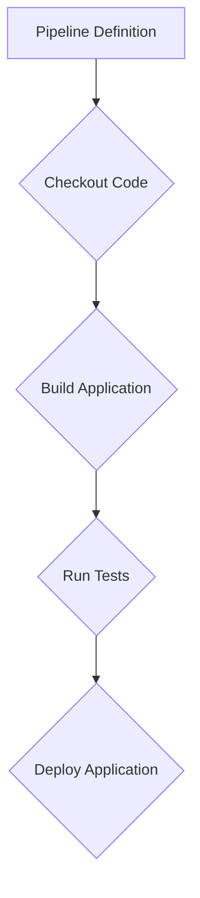

## Introduction to Jenkins and Integrating Automated Security Testing

Jenkins is an open-source automation server that provides continuous integration and continuous delivery (CI/CD) services. It is widely used in DevSecOps environments to automate the building, testing, and deployment of applications. One critical aspect of DevSecOps is integrating automated security testing into the CI/CD pipeline. This ensures that security checks are performed consistently and early in the development lifecycle, reducing the likelihood of vulnerabilities making it to production.

### Why Integrate Automated Security Testing?

Automated security testing helps identify potential security issues early in the development process. By automating these tests, teams can ensure that security checks are not skipped due to time constraints or human error. Additionally, automated testing can scale with the project, allowing for consistent security checks regardless of the size of the codebase.

### Challenges in Integrating Automated Security Testing

While integrating automated security testing into Jenkins offers numerous benefits, there are several challenges to consider:

1. **Security Risks Introduced by Plugins**: Not all Jenkins plugins are well-maintained, which can introduce new security risks. Using outdated or unsupported plugins can leave your pipeline vulnerable to attacks.
2. **Non-uniform Plugin Syntax**: Different plugins may have varying syntax and configurations, leading to a steep learning curve for developers and administrators.
3. **Dependency on Specific Platforms**: Some solutions may be tightly coupled with Jenkins, limiting portability and flexibility.

### Approaches to Integrating Automated Security Testing

There are three primary approaches to integrating automated security testing with Jenkins:

1. **Native Jenkins Features**
2. **Plugins**
3. **External Scripts**

#### Native Jenkins Features

Jenkins provides some built-in features for security testing, such as:

- **Pipeline as Code**: Allows defining the entire CI/CD pipeline in a declarative manner using Groovy scripts.
- **Built-in Steps**: Jenkins includes steps for common tasks like checking out code, building, and deploying applications.

However, native features are limited in terms of specialized security testing capabilities.



#### Plugins

Jenkins has a rich ecosystem of plugins that can extend its functionality. Some popular security-related plugins include:

- **OWASP Dependency-Check Plugin**: Scans for known vulnerabilities in project dependencies.
- **SonarQube Scanner Plugin**: Integrates with SonarQube for static code analysis.
- **Fortify Software Security Center Plugin**: Integrates with Fortify for dynamic and static application security testing.

However, using plugins comes with risks:

- **Maintenance Issues**: Not all plugins are actively maintained, leading to potential security vulnerabilities.
- **Learning Curve**: Different plugins may have varying syntax and configurations, requiring additional training.

##### Example: OWASP Dependency-Check Plugin

To use the OWASP Dependency-Check Plugin, you first need to install it via the Jenkins plugin manager. Once installed, you can configure it in your Jenkinsfile:

```groovy
pipeline {
    agent any
    stages {
        stage('Build') {
            steps {
                sh 'mvn clean package'
            }
        }
        stage('Security Check') {
            steps {
                dependencyCheck goals: 'update', failBuildOnCVSS: 5.0
            }
        }
    }
}
```

This pipeline defines a `Build` stage followed by a `Security Check` stage using the OWASP Dependency-Check Plugin.

##### Pitfalls and How to Prevent

**Pitfall**: Using outdated or unsupported plugins can introduce security vulnerabilities.

**Prevention**:
- Regularly review and update plugins.
- Monitor plugin repositories for security advisories.
- Consider using plugins from reputable sources with active maintenance.

#### External Scripts

Using external scripts for security testing offers several advantages:

- **Portability**: Scripts can be run on any platform, not just Jenkins.
- **Modularity**: Scripts can be reused across different projects.
- **Developer Independence**: Developers can run tests locally without relying on the CI/CD server.

##### Example: Running External Scripts

Consider a scenario where you use a Python script for static code analysis:

```python
import subprocess

def run_code_analysis():
    result = subprocess.run(['bandit', '-r', './src'], capture_output=True, text=True)
    print(result.stdout)

if __name__ == "__main__":
    run_code_analysis()
```

This script uses the `bandit` tool to perform static code analysis on the `./src` directory.

In Jenkins, you can call this script using a shell step:

```groovy
pipeline {
    agent any
    stages {
        stage('Build') {
            steps {
                sh 'mvn clean package'
            }
        }
        stage('Security Check') {
            steps {
                sh 'python3 ./scripts/security_check.py'
            }
        }
    }
}
```

##### Pitfalls and How to Prevent

**Pitfall**: Scripts may contain vulnerabilities if not properly reviewed and tested.

**Prevention**:
- Regularly review and test scripts for security vulnerabilities.
- Use static analysis tools to check scripts for common security issues.
- Ensure scripts are version-controlled and audited regularly.

### Real-World Examples and Recent CVEs

#### Example: CVE-2021-21234 - Jenkins Pipeline Script Security

In 2021, a critical vulnerability was discovered in Jenkins Pipeline Script Security Plugin (CVE-2021-21234). This vulnerability allowed attackers to execute arbitrary code on the Jenkins server through malicious scripts.

**Impact**: An attacker could gain full control of the Jenkins server, potentially compromising the entire CI/CD pipeline.

**Mitigation**:
- Update to the latest version of the Pipeline Script Security Plugin.
- Implement strict access controls and least privilege principles.
- Regularly audit and review Jenkins configurations and plugins.

#### Example: CVE-2-2022-37976 - Jenkins Credentials Plugin

In 2022, a vulnerability was found in the Jenkins Credentials Plugin (CVE-2022-37976). This vulnerability allowed unauthorized access to sensitive credentials stored in Jenkins.

**Impact**: Attackers could gain access to sensitive credentials, leading to further compromise of the system.

**Mitigation**:
- Update to the latest version of the Credentials Plugin.
- Use encrypted storage for sensitive credentials.
- Regularly audit and review Jenkins configurations and plugins.

### How to Prevent / Defend

#### Detection

- **Regular Audits**: Conduct regular audits of Jenkins configurations and plugins.
- **Security Scanning Tools**: Use tools like SonarQube or Fortify to scan Jenkins configurations and plugins for vulnerabilities.
- **Monitoring**: Implement monitoring and logging to detect unusual activities or unauthorized access attempts.

#### Prevention

- **Update Regularly**: Keep Jenkins and all plugins up to date with the latest security patches.
- **Least Privilege Principle**: Apply the principle of least privilege to Jenkins users and roles.
- **Secure Configuration**: Follow best practices for securing Jenkins configurations, such as disabling unnecessary plugins and securing sensitive data.

#### Secure Coding Fixes

##### Vulnerable Code Example

```groovy
pipeline {
    agent any
    stages {
        stage('Build') {
            steps {
                sh 'mvn clean package'
            }
        }
        stage('Security Check') {
            steps {
                dependencyCheck goals: 'update', failBuildOnCVSS: 5.0
            }
        }
    }
}
```

##### Fixed Code Example

```groovy
pipeline {
    agent any
    environment {
        SECURITY_PLUGIN_VERSION = 'latest'
    }
    stages {
        stage('Build') {
            steps {
                sh 'mvn clean package'
            }
        }
        stage('Security Check') {
            steps {
                dependencyCheck goals: 'update', failBuildOnCVSS: 5.0
            }
        }
        stage('Update Plugins') {
            steps {
                sh 'jenkins-plugin-manager update --plugins ${SECURITY_PLUGIN_VERSION}'
            }
        }
    }
}
```

In the fixed code example, we added a stage to update plugins to the latest version, ensuring that security patches are applied.

### Conclusion

Integrating automated security testing into Jenkins is crucial for maintaining a secure CI/CD pipeline. While there are challenges associated with using plugins, leveraging external scripts can provide a more flexible and portable solution. By following best practices for detection, prevention, and secure coding, organizations can effectively mitigate security risks and ensure a robust DevSecOps environment.

### Practice Labs

For hands-on practice with Jenkins and automated security testing, consider the following resources:

- **PortSwigger Web Security Academy**: Offers interactive labs for web application security.
- **OWASP Juice Shop**: A deliberately insecure web application for practicing security testing.
- **DVWA (Damn Vulnerable Web Application)**: Another intentionally vulnerable web application for security testing.
- **WebGoat**: A deliberately insecure Java web application for learning about web application security.

These resources provide practical experience in integrating automated security testing into Jenkins pipelines.

---
<!-- nav -->
[[03-Introduction to Jenkins and Integrating Automated Security Testing Part 1|Introduction to Jenkins and Integrating Automated Security Testing Part 1]] | [[DevSecOps/DevSecOps Bootcamp/05-Application Security Testing/09-Jenkins and Integrating Automated Security Testing/Approaches on Integrating Automated Security Testing with Jenkins/00-Overview|Overview]] | [[05-Native Method|Native Method]]
