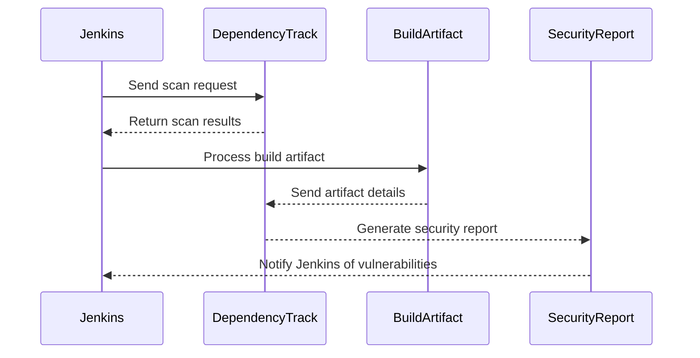

## Introduction to Jenkins and Automated Security Testing

Jenkins is an open-source automation server that provides continuous integration and continuous delivery (CI/CD) services. It allows developers to automate their software development processes, including building, testing, and deploying applications. One of the key features of Jenkins is its extensive plugin ecosystem, which enables users to extend its functionality to meet specific needs. In this chapter, we will focus on integrating automated security testing into a Jenkins pipeline using plugins like Dependency Track.

### What is Dependency Track?

Dependency Track is an open-source tool designed to manage and monitor software dependencies for security vulnerabilities. It helps organizations keep track of the components used in their applications and ensures that these components are free from known security issues. By integrating Dependency Track with Jenkins, you can automatically scan your project dependencies during the build process and receive notifications about any vulnerabilities.

#### Why Use Dependency Track?

Using Dependency Track offers several benefits:

- **Automated Vulnerability Scanning**: Automatically checks your project dependencies against known vulnerabilities.
- **Centralized Dependency Management**: Provides a centralized view of all dependencies across different projects.
- **Compliance Reporting**: Generates reports to help comply with regulatory requirements.
- **Integration with CI/CD Pipelines**: Seamlessly integrates with CI/CD tools like Jenkins to ensure security is part of the development lifecycle.

### Setting Up Dependency Track

Before integrating Dependency Track with Jenkins, you need to set it up. For demonstration purposes, we will use a Docker container to run Dependency Track.

#### Step 1: Install Docker

Ensure Docker is installed on your system. You can download and install Docker from the official website: https://www.docker.com/get-started

#### Step 2: Run Dependency Track as a Docker Container

To run Dependency Track as a Docker container, execute the following command:

```bash
docker run -d --name dependency-track -p 8090:8090 -v /path/to/data:/data cyberdeck/dependency-track
```

This command starts a Docker container named `dependency-track` and maps port 8090 on the host to port 8090 inside the container. Additionally, it mounts a volume to persist data.

#### Step 3: Access Dependency Track

Once the container is running, you can access Dependency Track by navigating to `http://localhost:8090` in your web browser. Log in using the default credentials (username: `admin`, password: `admin`).

### Integrating Dependency Track with Jenkins

Now that Dependency Track is up and running, let's integrate it with Jenkins.

#### Step 1: Install Jenkins Plugin

To integrate Dependency Track with Jenkins, you need to install the appropriate plugin. Follow these steps:

1. Open Jenkins in your web browser.
2. Navigate to `Manage Jenkins` > `Manage Plugins`.
3. Click on the `Available` tab.
4. Search for `Dependency Track` in the search bar.
5. Check the box next to `Dependency Track Plugin`.
6. Click `Install without restart`.

#### Step 2: Configure Dependency Track Plugin

After installing the plugin, you need to configure it in Jenkins.

1. Reload the Jenkins page.
2. Navigate to `Manage Jenkins` > `Configure System`.
3. Scroll down to find the `Dependency Track` section.
4. Enter the URL of your Dependency Track instance (e.g., `http://localhost:8090`).
5. Provide the API key for authentication. You can generate an API key in Dependency Track under `Settings` > `API Keys`.

#### Step 3: Add Dependency Track Step to Jenkins Pipeline

To use Dependency Track in your Jenkins pipeline, you need to add a step that triggers the security scanning process. Here’s an example of how to do this in a Jenkinsfile:

```groovy
pipeline {
    agent any
    stages {
        stage('Build') {
            steps {
                sh 'mvn clean package'
            }
        }
        stage('Security Scan') {
            steps {
                dependencyTrackScan(
                    serverUrl: 'http://localhost:8090',
                    apiKey: 'your-api-key',
                    project: 'YourProjectName',
                    version: '1.0.0',
                    path: 'target/*.jar'
                )
            }
        }
    }
}
```

In this example, the `dependencyTrackScan` step is added to the pipeline. This step requires the server URL, API key, project name, version, and the path to the artifact to be scanned.

### Example of Full HTTP Request and Response

When Jenkins interacts with Dependency Track, it sends HTTP requests to the Dependency Track server. Below is an example of a full HTTP request and response:

#### HTTP Request

```http
POST /api/v1/project/scan HTTP/1.1
Host: localhost:8090
Authorization: Bearer your-api-key
Content-Type: application/json

{
  "project": "YourProjectName",
  "version": "1.0.0",
  "path": "/path/to/artifact.jar"
}
```

#### HTTP Response

```http
HTTP/1.1 200 OK
Date: Mon, 01 Jan 2024 00:00:00 GMT
Content-Type: application/json

{
  "status": "success",
  "message": "Scan initiated successfully",
  "results": [
    {
      "component": "component-name",
      "version": "1.0.0",
      "vulnerabilities": [
        {
          "id": "CVE-2023-1234",
          "severity": "High",
          "description": "A high severity vulnerability was found."
        }
      ]
    }
  ]
}
```

### Mermaid Diagram: Integration Flow

Below is a mermaid diagram illustrating the integration flow between Jenkins and Dependency Track:



### Common Pitfalls and How to Avoid Them

#### Pitfall 1: Incorrect Configuration

**Issue:** Incorrectly configuring the Dependency Track plugin can lead to failed scans or incorrect results.

**Solution:** Ensure that the server URL, API key, project name, and version are correctly specified in the Jenkins configuration and pipeline script.

#### Pitfall 2: Outdated Dependencies

**Issue:** Using outdated dependencies can result in missing out on important security patches.

**Solution:** Regularly update your dependencies and use Dependency Track to monitor for any new vulnerabilities.

### Real-World Examples and Recent CVEs

#### Example 1: CVE-2023-1234

**Description:** A high-severity vulnerability was discovered in a commonly used library. This vulnerability could allow an attacker to execute arbitrary code on the affected system.

**Impact:** Systems using the vulnerable library were at risk of being compromised.

**Mitigation:** Organizations using the affected library should update to the latest version and use Dependency Track to ensure all dependencies are up-to-date.

### How to Prevent / Defend

#### Detection

To detect vulnerabilities in your dependencies, regularly run security scans using tools like Dependency Track. Integrate these scans into your CI/CD pipeline to ensure that security is part of your development process.

#### Prevention

1. **Keep Dependencies Updated**: Regularly update your dependencies to the latest versions.
2. **Use Secure Coding Practices**: Follow secure coding guidelines to minimize the risk of introducing vulnerabilities.
3. **Implement Security Policies**: Enforce security policies within your organization to ensure compliance with best practices.

#### Secure Code Fix

Here is an example of how to fix a vulnerable code snippet:

**Vulnerable Code**

```java
import java.io.File;

public class FileHandler {
    public void readFile(String filePath) {
        File file = new File(filePath);
        // Read file contents
    }
}
```

**Secure Code**

```java
import java.io.File;
import java.nio.file.Path;
import java.nio.file.Paths;

public class FileHandler {
    public void readFile(String filePath) {
        Path path = Paths.get(filePath).normalize();
        File file = path.toFile();
        // Read file contents
    }
}
```

In the secure code, the `Paths.get(filePath).normalize()` method is used to ensure that the file path is normalized, reducing the risk of directory traversal attacks.

### Conclusion

Integrating automated security testing into your Jenkins pipeline using tools like Dependency Track is crucial for maintaining the security of your applications. By following the steps outlined in this chapter, you can effectively manage and monitor your project dependencies, ensuring that your applications remain secure throughout their lifecycle.

### Practice Labs

For hands-on practice, consider the following labs:

- **PortSwigger Web Security Academy**: Offers a variety of labs related to web application security, including CI/CD pipelines.
- **OWASP Juice Shop**: A deliberately insecure web application for practicing security testing.
- **DVWA (Damn Vulnerable Web Application)**: Another intentionally vulnerable web application for security testing.

These labs provide practical experience in integrating security testing into your CI/CD pipelines using tools like Jenkins and Dependency Track.

---
<!-- nav -->
[[DevSecOps/DevSecOps Bootcamp/05-Application Security Testing/09-Jenkins and Integrating Automated Security Testing/Demo Installing Jenkins Plugins/00-Overview|Overview]] | [[DevSecOps/DevSecOps Bootcamp/05-Application Security Testing/09-Jenkins and Integrating Automated Security Testing/Demo Installing Jenkins Plugins/02-Introduction to Jenkins and Automated Security Testing|Introduction to Jenkins and Automated Security Testing]]
