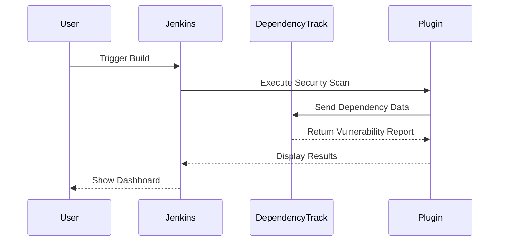

## Introduction to Jenkins and Automated Security Testing

Jenkins is a widely used open-source automation server that provides continuous integration and continuous delivery (CI/CD) services. One of the key features of Jenkins is its ability to integrate various plugins to extend its functionality. In the context of DevSecOps, integrating automated security testing is crucial to ensure that applications are secure throughout their development lifecycle.

### Why Use Jenkins Plugins for Security Testing?

Using Jenkins plugins for security testing offers several advantages:

1. **Integration**: Plugins can seamlessly integrate with your existing CI/CD pipelines, allowing you to automate security checks as part of your build process.
2. **Automation**: Automating security testing ensures that security checks are performed consistently and frequently, reducing the likelihood of human error.
3. **Visibility**: Plugins provide detailed reports and dashboards that help developers and security teams understand the security posture of their applications.
4. **Scalability**: Jenkins plugins can scale with your infrastructure, supporting large and complex projects.

However, there are also some disadvantages to consider:

1. **Maintenance**: Using outdated or unmaintained plugins can introduce security vulnerabilities into your environment.
2. **Compatibility**: Some plugins may not be compatible with the latest versions of Jenkins or other tools in your ecosystem.
3. **Overhead**: Managing a large number of plugins can increase the complexity of your Jenkins setup.

### Example: Outdated Third-Party Libraries

One common security issue in software development is the use of outdated third-party libraries. These libraries may contain known vulnerabilities that can be exploited by attackers. To mitigate this risk, you can use Jenkins plugins to automatically scan your projects for outdated dependencies.

#### Real-World Example: CVE-2021-44228 (Log4j)

The Log4j vulnerability (CVE-2021-44228) is a recent example of a widely used library containing a critical security flaw. This vulnerability affected millions of applications worldwide, highlighting the importance of keeping third-party dependencies up to date.

### Searching for Jenkins Plugins

To integrate automated security testing into your Jenkins setup, you first need to find and install the appropriate plugins. The Jenkins Plugin site (plugins.jenkins.io) is a comprehensive repository of available plugins.

#### Steps to Search for a Plugin

1. **Visit the Jenkins Plugin Site**: Navigate to `https://plugins.jenkins.io`.
2. **Search for the Desired Plugin**: Use the search bar to look for plugins related to security testing. For example, you can search for "OASP" (Open Web Application Security Project).

#### Example: Searching for OASP Dependency Track Plugin

Let's walk through the process of finding and installing the OASP Dependency Track plugin.

1. **Navigate to the Plugin Site**:
    ```markdown
    https://plugins.jenkins.io
    ```

2. **Search for OASP**:
    - Enter "OASP" in the search bar.
    - You will see a list of results, including the OASP Dependency Track plugin.

3. **Review Plugin Details**:
    - Click on the OASP Dependency Track plugin to view more details.
    - Scroll down to understand the plugin's capabilities and integration with Jenkins.

### Installing the OASP Dependency Track Plugin

Once you have identified the desired plugin, you can proceed to install it on your Jenkins server.

#### Steps to Install a Plugin

1. **Access Jenkins Dashboard**:
    - Log in to your Jenkins server.
    - Navigate to the dashboard.

2. **Manage Jenkins**:
    - Click on "Manage Jenkins" in the left sidebar.

3. **Manage Plugins**:
    - Click on "Manage Plugins" in the left sidebar.

4. **Available Plugins**:
    - Select the "Available" tab.
    - Search for "dependency track" in the search bar.

5. **Install Plugin**:
    - Check the box next to the OASP Dependency Track plugin.
    - Click "Install without restart" or "Download now and install after restart".

### Configuring the OASP Dependency Track Plugin

After installation, you need to configure the plugin to work with your Jenkins pipeline.

#### Example Configuration

Here is an example of how to configure the OASP Dependency Track plugin in a Jenkinsfile:

```groovy
pipeline {
    agent any
    stages {
        stage('Build') {
            steps {
                sh 'mvn clean package'
            }
        }
        stage('Security Scan') {
            steps {
                dependencyTrackPublisher(
                    serverUrl: 'http://your-dependency-track-server',
                    apiToken: 'your-api-token',
                    project: 'your-project-name',
                    version: 'your-version-number'
                )
            }
        }
    }
}
```

### Understanding the Plugin Integration

The OASP Dependency Track plugin integrates with Dependency Track, a tool designed to manage and monitor software composition analysis (SCA) data. This integration allows you to track the number of vulnerable third-party libraries within your project.

#### Mermaid Diagram: Plugin Integration Flow



### Pitfalls and Common Mistakes

When integrating Jenkins plugins for security testing, there are several pitfalls to avoid:

1. **Outdated Plugins**: Ensure that you are using the latest version of the plugin to avoid security vulnerabilities.
2. **Configuration Errors**: Incorrect configuration can lead to false positives or negatives, making the security testing less effective.
3. **Performance Impact**: Some plugins can significantly slow down your build process, especially if they perform extensive scans.

### How to Prevent / Defend

#### Detection

To detect potential issues with Jenkins plugins:

1. **Regular Audits**: Periodically review the plugins installed on your Jenkins server to ensure they are up to date and maintained.
2. **Vulnerability Scanning**: Use tools like Sonatype Nexus Lifecycle or OWASP Dependency-Check to scan your plugins for known vulnerabilities.

#### Prevention

To prevent security issues:

1. **Use Trusted Sources**: Only install plugins from trusted sources like the official Jenkins Plugin site.
2. **Keep Plugins Updated**: Regularly update your plugins to the latest versions.
3. **Secure Configuration**: Follow best practices for configuring plugins to minimize security risks.

#### Secure Coding Fixes

Here is an example of a vulnerable Jenkinsfile and its secure counterpart:

**Vulnerable Jenkinsfile**:
```groovy
pipeline {
    agent any
    stages {
        stage('Build') {
            steps {
                sh 'mvn clean package'
            }
        }
        stage('Security Scan') {
            steps {
                dependencyTrackPublisher(
                    serverUrl: 'http://your-dependency-track-server',
                    apiToken: 'your-api-token', // Hardcoded API token
                    project: 'your-project-name',
                    version: 'your-version-number'
                )
            }
        }
    }
}
```

**Secure Jenkinsfile**:
```groovy
pipeline {
    agent any
    stages {
        stage('Build') {
            steps {
                sh 'mvn clean package'
            }
        }
        stage('Security Scan') {
            steps {
                dependencyTrackPublisher(
                    serverUrl: 'http://your-dependency-track-server',
                    apiToken: credentials('dependency-track-api-token'), // Use credentials plugin
                    project: 'your-project-name',
                    version: 'your-version-number'
                )
            }
        }
    }
}
```

### Hands-On Practice

To gain practical experience with Jenkins and automated security testing, you can use the following labs:

- **PortSwigger Web Security Academy**: Offers a series of labs focused on web application security, including Jenkins security configurations.
- **OWASP Juice Shop**: A deliberately insecure web application for practicing security testing techniques.
- **DVWA (Damn Vulnerable Web Application)**: Another popular web application for learning web security.

These labs provide a safe environment to experiment with Jenkins plugins and security testing tools.

### Conclusion

Integrating Jenkins plugins for automated security testing is a powerful way to enhance the security of your applications. By carefully selecting and configuring these plugins, you can ensure that your CI/CD pipelines are robust and secure. Always stay vigilant about maintaining your plugins and following best practices to avoid common pitfalls.

---
<!-- nav -->
[[DevSecOps/DevSecOps Bootcamp/05-Application Security Testing/09-Jenkins and Integrating Automated Security Testing/Demo Installing Jenkins Plugins/01-Introduction to Jenkins and Automated Security Testing Part 1|Introduction to Jenkins and Automated Security Testing Part 1]] | [[DevSecOps/DevSecOps Bootcamp/05-Application Security Testing/09-Jenkins and Integrating Automated Security Testing/Demo Installing Jenkins Plugins/00-Overview|Overview]] | [[03-Introduction to Jenkins and Dependency Track Integration|Introduction to Jenkins and Dependency Track Integration]]
