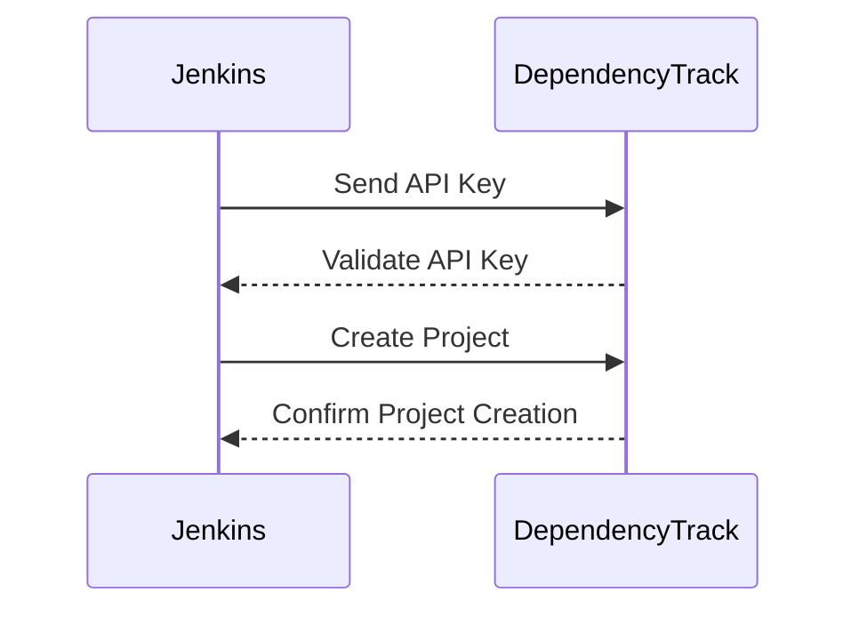

## Configuring the Dependency Track Plugin in Jenkins

### Step-by-Step Configuration

To configure the Dependency Track plugin in Jenkins, follow these steps:

1. **Install the Dependency Track Plugin**:
   - Navigate to the Jenkins dashboard.
   - Go to `Manage Jenkins` > `Manage Plugins`.
   - Search for `Dependency Track` in the available plugins.
   - Install the plugin and restart Jenkins if necessary.

2. **Configure the Dependency Track Server**:
   - Navigate to `Manage Jenkins` > `Configure System`.
   - Scroll down to the `Dependency Track` section.
   - Enter the URL of your Dependency Track server.

3. **Add the API Key**:
   - When installing the Dependency Track server, an API key is generated.
   - Copy the API key and paste it into the `API Key` field in Jenkins.
   - Set the `Identifier` to `dependency track` and the `Description` to `dependency track API token`.

4. **Create Credentials**:
   - Click on `Add` to create new credentials.
   - Select `Secret Text` as the type.
   - Paste the API key into the `Secret` field.
   - Set the `Identifier` to `dependency track` and the `Description` to `dependency track API token`.
   - Save the credentials.

5. **Test the Connection**:
   - After saving the credentials, click on `Test Connection` to verify that Jenkins can communicate with the Dependency Track server.
   - If the connection is successful, proceed to the next step.

### Example Configuration

Here is an example of how the configuration might look in the Jenkins UI:

```plaintext
Dependency Track URL: http://localhost:8080
API Key: <your-api-key>
Identifier: dependency track
Description: dependency track API token
```

### Full HTTP Request and Response

When testing the connection, Jenkins sends an HTTP request to the Dependency Track server to validate the API key. Here is an example of the full HTTP request and response:

```http
POST /api/v1/projects HTTP/1.1
Host: localhost:8080
Authorization: Bearer <your-api-key>
Content-Type: application/json

{
  "name": "Jenkins Project",
  "version": "1.0"
}
```

```http
HTTP/1.1 200 OK
Date: Mon, 01 Jan 2024 00:00:00 GMT
Content-Type: application/json

{
  "id": 1,
  "name": "Jenkins Project",
  "version": "1.0",
  "status": "SUCCESS"
}
```

### Mermaid Diagram of the Integration Flow



---
<!-- nav -->
[[DevSecOps/DevSecOps Bootcamp/05-Application Security Testing/09-Jenkins and Integrating Automated Security Testing/Demo Installing Jenkins Plugins/04-Introduction to Jenkins and Integrating Automated Security Testing|Introduction to Jenkins and Integrating Automated Security Testing]] | [[DevSecOps/DevSecOps Bootcamp/05-Application Security Testing/09-Jenkins and Integrating Automated Security Testing/Demo Installing Jenkins Plugins/00-Overview|Overview]] | [[06-Modifying the Jenkins Pipeline|Modifying the Jenkins Pipeline]]
