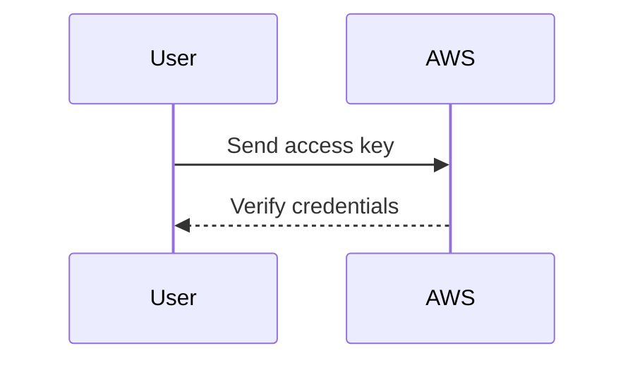
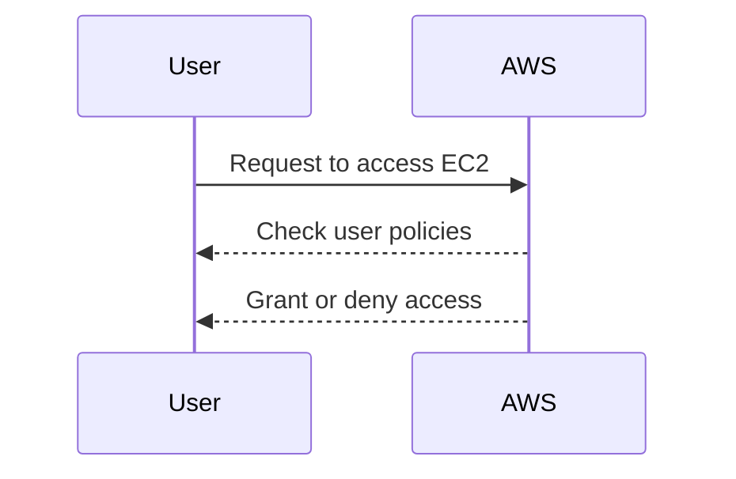

## Introduction to Secure Continuous Deployment and Dynamic Application Security Testing (DAST)

Continuous deployment (CD) is a practice in DevSecOps where code changes are automatically deployed to production after passing through a series of automated tests. This process ensures that the application is always in a deployable state and reduces the time between development and deployment. However, this automation introduces new security challenges, particularly around accessing and managing deployment servers securely.

Dynamic Application Security Testing (DAST) is a type of security testing that involves scanning applications while they are running to identify vulnerabilities. This method is crucial for identifying issues that might arise during runtime, such as SQL injection, cross-site scripting (XSS), and other dynamic vulnerabilities.

In this chapter, we will delve into the security essentials for accessing deployment servers, focusing on AWS EC2 instances and the use of AWS CLI for authentication and authorization. We will cover the theoretical background, practical implementation, recent real-world examples, and comprehensive security measures to ensure a robust and secure continuous deployment pipeline.

### Background Theory

#### AWS Identity and Access Management (IAM)

AWS Identity and Access Management (IAM) is a service that helps you securely control access to AWS resources. IAM allows you to create and manage AWS users and groups, and grant permissions to access specific resources. IAM is critical for ensuring that only authorized users can perform actions on AWS resources, including EC2 instances.

#### AWS Command Line Interface (CLI)

The AWS Command Line Interface (CLI) is a unified tool to manage AWS services. With the AWS CLI, you can issue commands from the command line to interact with AWS services, such as EC2, S3, and RDS. The CLI uses the AWS SDK to make API calls to AWS services, providing a powerful and flexible way to automate tasks.

### Authentication and Authorization in AWS

#### Authentication

Authentication is the process of verifying the identity of a user. In AWS, authentication is typically performed using IAM user credentials, such as access keys. When a user attempts to access an AWS service, AWS verifies the user's identity by checking their credentials.



#### Authorization

Authorization is the process of granting or denying access to resources based on the user's permissions. Once a user is authenticated, AWS checks the user's permissions to determine whether they are allowed to perform specific actions.



### Using AWS CLI for Deployment

#### Authenticating with AWS CLI

To use the AWS CLI, you need to configure it with your IAM user credentials. This can be done using the `aws configure` command, which prompts you to enter your access key and secret key.

```sh
aws configure
```

Once configured, you can use the AWS CLI to make API calls to AWS services. For example, to list all EC2 instances in your account, you can use the following command:

```sh
aws ec2 describe-instances
```

#### Authorizing Actions with Policies

IAM policies define the permissions granted to users or groups. Policies can be attached to users, groups, or roles, and specify which actions are allowed on which resources.

Here is an example of an IAM policy that grants permission to list EC2 instances and push images to an ECR repository:

```json
{
    "Version": "2012-10-17",
    "Statement": [
        {
            "Effect": "Allow",
            "Action": [
                "ec2:DescribeInstances"
            ],
            "Resource": "*"
        },
        {
            "Effect": "Allow",
            "Action": [
                "ecr:GetAuthorizationToken",
                "ecr:BatchCheckLayerAvailability",
                "ecr:GetDownloadUrlForLayer",
                "ecr:BatchGetImage",
                "ecr:InitiateLayerUpload",
                "ecr:UploadLayerPart",
                "ecr:CompleteLayerUpload",
                "ecr:PutImage"
            ],
            "Resource": "arn:aws:ecr:<region>:<account-id>:repository/<repository-name>"
        }
    ]
}
```

### Direct SSH Access to EC2 Instances

While using the AWS CLI is a secure and recommended approach, some teams may choose to directly SSH into EC2 instances to perform deployment tasks. This method bypasses the AWS API and can introduce security risks.

#### Risks of Direct SSH Access

Direct SSH access to EC2 instances can be considered a "backdoor" to AWS resources because it bypasses the standard authentication and authorization mechanisms provided by AWS. This can lead to several security issues:

1. **Lack of Auditability**: Direct SSH access does not generate audit logs in the same way that API calls do. This makes it difficult to track who accessed the instance and what actions were performed.
2. **Credential Management**: Managing SSH keys can be challenging, especially in large organizations. Mismanaged SSH keys can lead to unauthorized access.
3. **Security Group Configuration**: Direct SSH access requires opening port 22 on the EC2 instance, which can expose the instance to potential attacks.

### Recent Real-World Examples

#### CVE-2021-20225: AWS IAM Policy Vulnerability

In 2021, a vulnerability was discovered in AWS IAM policies that could allow unauthorized access to S3 buckets. This vulnerability highlights the importance of properly configuring IAM policies to restrict access to sensitive resources.

#### Example Exploit

An attacker could exploit this vulnerability by crafting a malicious IAM policy that grants excessive permissions. For example, a policy that allows read access to all S3 buckets could be exploited to exfiltrate sensitive data.

```json
{
    "Version": "2012-10-17",
    "Statement": [
        {
            "Effect": "Allow",
            "Action": "s3:*",
            "Resource": "*"
        }
    ]
}
```

### How to Prevent / Defend

#### Secure Configuration of IAM Policies

To prevent unauthorized access, it is essential to configure IAM policies with the principle of least privilege. This means granting only the minimum permissions necessary to perform a task.

**Vulnerable Policy**

```json
{
    "Version": "2012-10-17",
    "Statement": [
        {
            "Effect": "Allow",
            "Action": "ec2:*",
            "Resource": "*"
        }
    ]
}
```

**Secure Policy**

```json
{
    "Version": "2012-10-17",
    "Statement": [
        {
            "Effect": "Allow",
            "Action": [
                "ec2:DescribeInstances",
                "ecr:GetAuthorizationToken",
                "ecr:BatchCheckLayerAvailability",
                "ecr:GetDownloadUrlForLayer",
                "ecr:BatchGetImage",
                "ecr:InitiateLayerUpload",
                "ecr:UploadLayerPart",
                "ecr:CompleteLayerUpload",
                "ecr:PutImage"
            ],
            "Resource": "arn:aws:ec2:<region>:<account-id>:instance/* arn:aws:ecr:<region>:<account-id>:repository/<repository-name>"
        }
    ]
}
```

#### Hardening SSH Access

If direct SSH access is necessary, it is important to harden the SSH configuration to minimize security risks.

1. **Use Strong SSH Keys**: Generate strong SSH keys and store them securely.
2. **Disable Password Authentication**: Configure SSH to only accept key-based authentication.
3. **Limit SSH Access**: Restrict SSH access to specific IP addresses or ranges using security groups.

**SSH Configuration Example**

```sh
# /etc/ssh/sshd_config
PubkeyAuthentication yes
PasswordAuthentication no
PermitRootLogin no
```

### Complete Example: Full HTTP Request and Response

#### HTTP Request to AWS API

When using the AWS CLI to make API calls, the underlying HTTP requests are made to the AWS API endpoints. Here is an example of a full HTTP request to list EC2 instances:

```http
GET /?Action=DescribeInstances&Version=2016-11-15 HTTP/1.1
Host: ec2.<region>.amazonaws.com
Content-Type: application/x-www-form-urlencoded; charset=utf-8
Authorization: AWS4-HMAC-SHA256 Credential=<access-key>/20230415/<region>/ec2/aws4_request, SignedHeaders=host;x-amz-date, Signature=<signature>
X-Amz-Date: 20230415T123456Z
```

#### HTTP Response from AWS API

The response from the AWS API includes metadata about the request and the actual data requested.

```http
HTTP/1.1 200 OK
Content-Type: application/xml
Content-Length: <length>
Date: Mon, 15 Apr 2023 12:34:56 GMT

<DescribeInstancesResponse xmlns="http://ec2.amazonaws.com/doc/2016-11-15/">
  <requestId>7a62c49f-3467-4fc4-9331-6e8eEXAMPLE</requestId>
  <reservationSet>
    <item>
      <reservationId>r-06a9f2c7d0f123456</reservationId>
      <ownerId>123456789012</ownerId>
      <groupSet/>
      <instancesSet>
        <item>
          <instanceId>i-06a9f2c7d0f123456</instanceId>
          <imageId>ami-0ff8a91507f773ee5</imageId>
          <instanceState>
            <code>16</code>
            <name>running</name>
          </instanceState>
          <privateDnsName>ip-10-0-1-23.ec2.internal</privateDnsName>
          <dnsName/>
          <publicDnsName/>
          <privateIpAddress>10.0.1.23</privateIpAddress>
          <vpcId>vpc-0a19b2c3d4e5f6g7h</vpcId>
          <subnetId>subnet-0a19b2c3d4e5f6g7h</subnetId>
          <architecture>x86_64</architecture>
          <rootDeviceType>ebs</rootDeviceType>
          <rootDeviceName>/dev/sda1</rootDeviceName>
          <blockDeviceMapping>
            <item>
              <deviceName>/dev/sda1</deviceName>
              <ebs>
                <volumeId>vol-0a19b2c3d4e5f6g7h</volumeId>
                <status>attached</status>
                <attachTime>2023-04-15T12:34:56Z</attachTime>
                <deleteOnTermination>true</deleteOnTermination>
              </ebs>
            </item>
          </blockDeviceMapping>
          <virtualizationType<hvm</virtualizationType>
          <monitoring>
            <state>disabled</state>
          </monitoring>
          <placement>
            <availabilityZone>us-west-2a</availabilityZone>
            <groupName/>
            <tenancy>default</tenancy>
          </placement>
          <hypervisor>xen</hypervisor>
          <networkInterfacesSet>
            <item>
              <networkInterfaceId>eni-0a19b2c3d4e5f6g7h</networkInterfaceId>
              <subnetId>subnet-0a19b2c3d4e5f6g7h</subnetId>
              <vpcId>vpc-0a19b2c3d4e5f6g7h</vpcId>
              <description/>
              <ownerId>123456789012</ownerId>
              <status>in-use</status>
              <privateIpAddress>10.0.1.23</privateIpAddress>
              <sourceDestCheck>true</sourceDestCheck>
              <groups>
                <item>
                  <groupId>sg-0a19b2c3d4e5f6g7h</groupId>
                  <groupName>default</groupName>
                </item>
              </groups>
              <attachment>
                <attachmentId>eni-attach-0a19b2c3d4e5f6g7h</attachmentId>
                <deviceIndex>0</deviceIndex>
                <status>attached</status>
                <attachTime>2023-04-15T12:34:56Z</attachTime>
                <deleteOnTermination>true</deleteOnTermination>
              </attachment>
              <privateIpAddressesSet>
                <item>
                  <privateIpAddress>10.0.1.23</privateIpAddress>
                  <primary>true</primary>
                  <association>
                    <publicIp>54.240.143.5</publicIp>
                    <ipOwnerId>amazon-aws</ipOwnerId>
                  </association>
                </item>
              </privateIpAddressesSet>
              <ipv6AddressesSet/>
              <tagSet/>
              <interfaceType>interface</interfaceType>
            </item>
          </networkInterfacesSet>
          <iamInstanceProfile>
            <arn>arn:aws:iam::123456789012:instance-profile/EC2InstanceProfile</arn>
            <id>IADPQH6EXAMPLE</id>
          </iamInstanceProfile>
          <ebsOptimized>false</ebsOptimized>
          <enaSupport>true</enaSupport>
          <capacityReservationSpecification>
            <capacityReservationPreference>open</capacityReservationPreference>
          </capacityReservationSpecification>
          <metadataOptions>
            <httpTokens>optional</httpTokens>
            <httpPutResponseHopLimit>1</httpPutResponseHopLimit>
            <httpEndpoint>enabled</httpEndpoint>
          </metadataOptions>
          <enclaveOptions>
            <enabled>false</enabled>
          </enclaveOptions>
          <hibernationOptions>
            <configured>false</configured>
          </hibernationOptions>
          <supportedRootDeviceTypes>
            <item>ebs</item>
          </supportedRootDeviceTypes>
          <supportedVirtualizationTypes>
            <item>hvm</item>
          </supportedVirtualizationTypes>
          <tagSet>
            <item>
              <key>Name</key>
              <value>MyInstance</value>
            </item>
          </tagSet>
        </item>
      </instancesSet>
    </item>
  </reservationSet>
</DescribeInstancesResponse>
```

### Hands-On Labs

To practice these concepts, you can use the following labs:

- **PortSwigger Web Security Academy**: Offers interactive labs to practice web security techniques, including DAST.
- **OWASP Juice Shop**: A deliberately insecure web application for practicing web security skills.
- **DVWA (Damn Vulnerable Web Application)**: Another intentionally vulnerable web application for learning web security.
- **WebGoat**: An interactive training application designed to teach web application security lessons.

These labs provide a safe environment to experiment with different security configurations and practices, helping you gain hands-on experience with securing continuous deployment pipelines.

### Conclusion

In this chapter, we covered the essential aspects of secure continuous deployment and dynamic application security testing (DAST) in the context of AWS EC2 instances and the AWS CLI. We explored the theoretical background, practical implementation, recent real-world examples, and comprehensive security measures to ensure a robust and secure continuous deployment pipeline. By following the principles outlined in this chapter, you can significantly enhance the security of your deployment processes and protect your AWS resources from unauthorized access and exploitation.

---
<!-- nav -->
[[DevSecOps/DevSecOps Bootcamp/05-Application Security Testing/10-Secure Continuous Deployment & DAST/03-Security Essentials for Accessing Deployment Server/00-Overview|Overview]] | [[02-Secure Continuous Deployment & DAST Security Essentials for Accessing Deployment Server|Secure Continuous Deployment & DAST Security Essentials for Accessing Deployment Server]]
