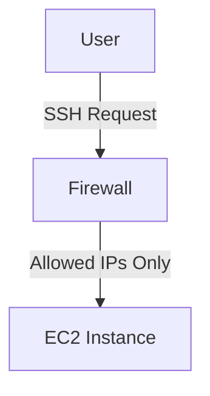

## Secure Continuous Deployment & DAST: Security Essentials for Accessing Deployment Server

### Introduction to Secure Access Control

In the context of DevSecOps, ensuring secure access to deployment servers is paramount. This involves securing both the infrastructure and the application itself. One critical aspect is securing the SSH (Secure Shell) access to the deployment server. SSH is a cryptographic network protocol used for secure data communication, remote command-line login, and other secure network services between two networked computers.

#### Why Secure SSH Access Matters

SSH access is often required for deploying applications, managing configurations, and performing maintenance tasks. However, leaving SSH port 22 open to the entire internet poses significant security risks. An attacker could attempt to brute-force the SSH credentials, leading to unauthorized access to the server. Therefore, it is essential to implement multiple layers of security to mitigate these risks.

### Securing SSH Access

#### Limiting Access to Specific IP Addresses

One of the primary methods to secure SSH access is to restrict access to specific IP addresses. This approach ensures that only trusted IP addresses can establish an SSH connection to the server. This is typically achieved through firewall rules or security group settings in cloud environments like AWS.

##### Example: Configuring Security Groups in AWS

To configure security groups in AWS to allow SSH access only from specific IP addresses, follow these steps:

1. **Navigate to the EC2 Dashboard**: Log in to the AWS Management Console and navigate to the EC2 dashboard.
2. **Select Security Groups**: In the left-hand menu, select "Security Groups."
3. **Edit Inbound Rules**: Click on the security group associated with your EC2 instance and then click on the "Inbound rules" tab.
4. **Add Rule for SSH**: Click on "Edit inbound rules," then click "Add rule." Select "SSH" as the type, specify the source IP address (or range), and click "Save."



#### Example Configuration

Here is an example of a security group rule that allows SSH access only from a specific IP address:

```json
{
  "IpPermissions": [
    {
      "FromPort": 22,
      "ToPort": 22,
      "IpProtocol": "tcp",
      "UserIdGroupPairs": [],
      "IpRanges": [
        {
          "CidrIp": "192.168.1.1/32"
        }
      ]
    }
  ]
}
```

This configuration restricts SSH access to the IP address `192.168.1.1`.

### Multi-Factor Authentication (MFA)

While limiting access to specific IP addresses is a good start, it is also crucial to implement multi-factor authentication (MFA) for SSH access. MFA adds an additional layer of security by requiring users to provide two or more verification factors to gain access to a resource.

#### Example: Enabling MFA for SSH

To enable MFA for SSH, you can use tools like Google Authenticator or YubiKey. Here’s how you can set up MFA using Google Authenticator:

1. **Install Google Authenticator**: Install the Google Authenticator app on your mobile device.
2. **Generate a Secret Key**: Generate a secret key for the user on the server.
3. **Configure SSHD**: Configure the SSH daemon (`sshd`) to require MFA.

```bash
# Install Google Authenticator library
sudo apt-get install libpam-google-authenticator

# Configure PAM
echo "auth required pam_google_authenticator.so" | sudo tee -a /etc/pam.d/sshd

# Generate secret key for user
google-authenticator
```

#### Example SSHD Configuration

Here is an example of how to configure the SSH daemon to require MFA:

```bash
# Edit /etc/ssh/sshd_config
sudo nano /etc/ssh/sshd_config

# Add the following lines
ChallengeResponseAuthentication yes
UsePAM yes
```

After making these changes, restart the SSH service:

```bash
sudo systemctl restart ssh
```

### Secure Private Key Management

Even with IP restrictions and MFA, it is essential to manage private keys securely. Private keys are used to authenticate users to the SSH server. If a private key is compromised, an attacker can gain unauthorized access to the server.

#### Best Practices for Private Key Management

1. **Store Private Keys Securely**: Store private keys in a secure location, such as a hardware security module (HSM) or a secure key management system.
2. **Limit Access to Private Keys**: Ensure that only authorized personnel have access to the private keys.
3. **Rotate Private Keys Regularly**: Rotate private keys regularly to minimize the risk of compromise.

#### Example: Generating and Managing SSH Keys

To generate an SSH key pair, use the following commands:

```bash
# Generate SSH key pair
ssh-keygen -t rsa -b 4096 -C "your_email@example.com"

# Copy public key to the server
ssh-copy-id -i ~/.ssh/id_rsa.pub user@server_ip
```

### Recent Real-World Examples

#### CVE-2021-20225: Unsecured SSH Servers

In 2021, researchers discovered numerous unsecured SSH servers exposed to the internet. These servers lacked proper access controls and were vulnerable to brute-force attacks. This led to unauthorized access and potential data breaches.

#### Example: SSH Brute-Force Attack

A brute-force attack against an SSH server involves systematically trying different username and password combinations until the correct credentials are found. This can be mitigated by implementing rate-limiting and monitoring for suspicious activity.

### How to Prevent / Defend

#### Detection

To detect unauthorized SSH access attempts, monitor the server logs for failed login attempts. Tools like `fail2ban` can be used to automatically ban IP addresses that exhibit suspicious behavior.

#### Prevention

1. **Implement Rate-Limiting**: Use tools like `fail2ban` to limit the number of login attempts from a single IP address.
2. **Monitor Logs**: Regularly review server logs for signs of unauthorized access attempts.
3. **Use Strong Passwords**: Ensure that all SSH accounts use strong, complex passwords.

#### Secure Coding Fixes

Here is an example of how to configure `fail2ban` to protect against SSH brute-force attacks:

```bash
# Install fail2ban
sudo apt-get install fail2ban

# Configure fail2ban
sudo cp /etc/fail2ban/jail.conf /etc/fail2ban/jail.local

# Edit jail.local
sudo nano /etc/fail2ban/jail.local

# Add the following section
[sshd]
enabled = true
port = ssh
filter = sshd
logpath = /var/log/auth.log
maxretry = 5
bantime = 3600
```

After configuring `fail2ban`, restart the service:

```bash
sudo systemctl restart fail2ban
```

### Conclusion

Securing SSH access to deployment servers is a critical component of DevSecOps. By implementing multiple layers of security, including IP restrictions, MFA, and secure private key management, you can significantly reduce the risk of unauthorized access. Regular monitoring and proactive measures are essential to maintaining the security of your deployment environment.

### Hands-On Labs

For hands-on practice, consider the following labs:

- **PortSwigger Web Security Academy**: Offers modules on securing SSH access and preventing brute-force attacks.
- **AWS Official Workshops**: Provides detailed guides on configuring security groups and implementing MFA for SSH access.

By following these practices and engaging in hands-on labs, you can ensure that your deployment environment remains secure and resilient against potential threats.

---
<!-- nav -->
[[DevSecOps/DevSecOps Bootcamp/05-Application Security Testing/10-Secure Continuous Deployment & DAST/03-Security Essentials for Accessing Deployment Server/01-Introduction to Secure Continuous Deployment and Dynamic Application Security Testing (DAST)|Introduction to Secure Continuous Deployment and Dynamic Application Security Testing (DAST)]] | [[DevSecOps/DevSecOps Bootcamp/05-Application Security Testing/10-Secure Continuous Deployment & DAST/03-Security Essentials for Accessing Deployment Server/00-Overview|Overview]] | [[DevSecOps/DevSecOps Bootcamp/05-Application Security Testing/10-Secure Continuous Deployment & DAST/03-Security Essentials for Accessing Deployment Server/03-Practice Questions & Answers|Practice Questions & Answers]]
