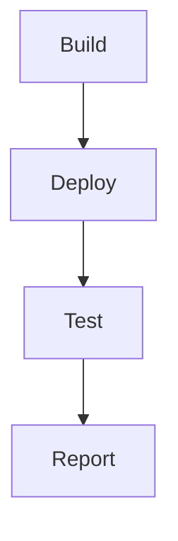
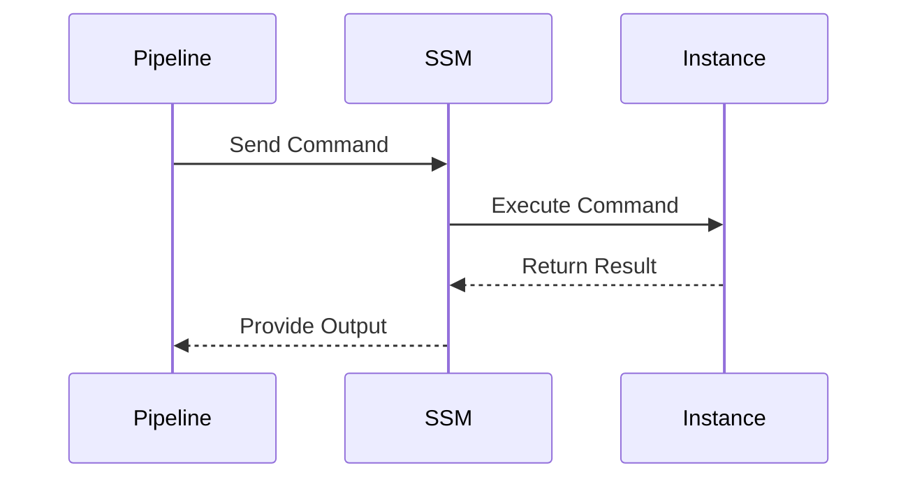

## Introduction to Secure Continuous Deployment and Dynamic Application Security Testing (DAST)

Continuous Deployment (CD) is an essential practice in modern DevSecOps environments, enabling teams to deliver software updates rapidly and reliably. However, ensuring that these deployments are secure requires careful management of permissions and access controls. This chapter focuses on using AWS Systems Manager (SSM) commands within a release pipeline to securely access servers, emphasizing the importance of proper authorization and dynamic application security testing (DAST).

### Background Theory

AWS Systems Manager (SSM) is a powerful tool that helps manage your Amazon EC2 instances and on-premises servers. It provides capabilities such as patch management, inventory, and run command, which can be integrated into continuous deployment pipelines to automate tasks like deploying applications and performing security checks.

#### Key Concepts

- **ECR (Elastic Container Registry)**: A fully-managed Docker container registry that makes it easy to store, manage, and deploy Docker container images.
- **SSM Service**: Provides various functionalities including sending commands to managed instances, managing patches, and maintaining inventory.
- **IAM Policies**: Define permissions for users, groups, and roles in AWS. These policies control access to AWS services and resources.

### Permission Management in AWS

Permissions in AWS are managed through Identity and Access Management (IAM). IAM allows you to create and manage AWS identities (users, groups, and roles) and define permissions that apply to those identities.

#### Example IAM Policy for ECR

```json
{
    "Version": "2012-10-17",
    "Statement": [
        {
            "Effect": "Allow",
            "Action": [
                "ecr:GetDownloadUrlForLayer",
                "ecr:BatchGetImage"
            ],
            "Resource": "*"
        }
    ]
}
```

This policy grants permissions to download layers and batch get images from ECR.

#### Example IAM Policy for SSM

```json
{
    "Version": "2012-10-17",
    "Statement": [
        {
            "Effect": "Allow",
            "Action": [
                "ssm:SendCommand",
                "ssm:ListCommandInvocations",
                "ssm:GetCommandInvocation"
            ],
            "Resource": "*"
        }
    ]
}
```

This policy grants permissions to send commands, list command invocations, and get command invocation details using SSM.

### Integrating SSM Commands in a Release Pipeline

To integrate SSM commands in a release pipeline, you need to ensure that the pipeline has the necessary permissions to execute these commands. This involves attaching appropriate IAM policies to the pipeline's execution role.

#### Step-by-Step Integration

1. **Define IAM Role for Pipeline**:
   Create an IAM role for the pipeline and attach the necessary policies.

2. **Configure Pipeline to Use IAM Role**:
   Ensure the pipeline uses the IAM role with the required permissions.

3. **Add SSM Command Execution Step**:
   Add a step in the pipeline to execute SSM commands.

#### Example Pipeline Configuration

```yaml
stages:
  - build
  - deploy

build:
  stage: build
  script:
    - echo "Building the application"

deploy:
  stage: deploy
  script:
    - aws ssm send-command --document-name "AWS-RunShellScript" --instance-ids "i-1234567890abcdef0" --parameters '{"commands":["echo Hello World"]}'
```

This pipeline configuration includes a build stage and a deploy stage. The deploy stage uses the `aws ssm send-command` to execute a shell script on the specified instance.

### Handling Authorization Issues

In the provided transcript, the pipeline failed due to insufficient permissions to execute SSM commands. This highlights the importance of proper authorization management.

#### Example Error Message

```
GitLab user is not authorized to perform SSM send command because we didn't give it the policy to do that.
```

To resolve this, you need to attach the appropriate IAM policy to the pipeline's execution role.

#### Corrected IAM Policy Attachment

```json
{
    "Version": "2012-10-17",
    "Statement": [
        {
            "Effect": "Allow",
            "Action": [
                "ssm:SendCommand",
                "ssm:ListCommandInvocations",
                "ssm:GetCommandInvocation"
            ],
            "Resource": "*"
        }
    ]
}
```

Attach this policy to the IAM role used by the pipeline.

### Dynamic Application Security Testing (DAST)

Dynamic Application Security Testing (DAST) involves testing a running application to identify security vulnerabilities. This can be integrated into the release pipeline to ensure that deployed applications are secure.

#### Example DAST Integration

```yaml
stages:
  - build
  - deploy
  - test

build:
  stage: build
  script:
    - echo "Building the application"

deploy:
  stage: deploy
  script:
    - aws ssm send-command --document-name "AWS-RunShellScript" --instance-ids "i-1234567890abcdef0" --parameters '{"commands":["echo Hello World"]}'

test:
  stage: test
  script:
    - docker run -v $(pwd):/app -w /app owasp/zap2docker-stable zap-baseline.py -t http://localhost:8080
```

This pipeline configuration includes a test stage that runs OWASP ZAP to perform DAST on the deployed application.

### Real-World Examples and Recent CVEs

Recent breaches and CVEs highlight the importance of secure continuous deployment practices. For example, the Log4j vulnerability (CVE-2021-44228) affected numerous applications and systems. Ensuring that your deployment pipeline includes security checks can help mitigate such risks.

#### Example: Log4j Vulnerability

The Log4j vulnerability allowed attackers to execute arbitrary code on affected systems. By integrating DAST into your pipeline, you can detect and mitigate such vulnerabilities before deployment.

### Mermaid Diagrams

#### Pipeline Topology



This diagram shows the stages in a typical CD pipeline, including build, deploy, test, and report stages.

#### SSM Command Execution Flow



This sequence diagram illustrates the flow of an SSM command execution from the pipeline to the instance and back.

### Common Pitfalls and How to Prevent Them

#### Pitfall: Insufficient Permissions

Insufficient permissions can cause pipeline failures. Always ensure that the pipeline has the necessary permissions to execute all required actions.

#### Prevention: Proper IAM Policy Management

Manage IAM policies carefully to grant only the necessary permissions. Regularly review and update policies to reflect current requirements.

#### Pitfall: Lack of Security Testing

Failing to include security testing in the pipeline can lead to vulnerabilities being deployed.

#### Prevention: Integrate DAST

Integrate DAST tools into the pipeline to automatically test deployed applications for security vulnerabilities.

### Conclusion

Secure continuous deployment is crucial for maintaining the integrity and security of your applications. By properly managing permissions, integrating SSM commands, and including DAST in your pipeline, you can ensure that your deployments are both efficient and secure.

### Practice Labs

For hands-on experience with secure continuous deployment and DAST, consider the following labs:

- **PortSwigger Web Security Academy**: Offers comprehensive training on web security, including DAST techniques.
- **OWASP Juice Shop**: A deliberately insecure web application for practicing security testing.
- **DVWA (Damn Vulnerable Web Application)**: Another intentionally vulnerable web app for learning security testing.

These labs provide practical experience in securing continuous deployment pipelines and performing dynamic application security testing.

---
<!-- nav -->
[[DevSecOps/DevSecOps Bootcamp/05-Application Security Testing/10-Secure Continuous Deployment & DAST/AWS SSM Commands in Release Pipeline for Server Access/02-Introduction to AWS Systems Manager (SSM)|Introduction to AWS Systems Manager (SSM)]] | [[DevSecOps/DevSecOps Bootcamp/05-Application Security Testing/10-Secure Continuous Deployment & DAST/AWS SSM Commands in Release Pipeline for Server Access/00-Overview|Overview]] | [[04-Introduction to Secure Continuous Deployment and Dynamic Application Security Testing (DAST)|Introduction to Secure Continuous Deployment and Dynamic Application Security Testing (DAST)]]
