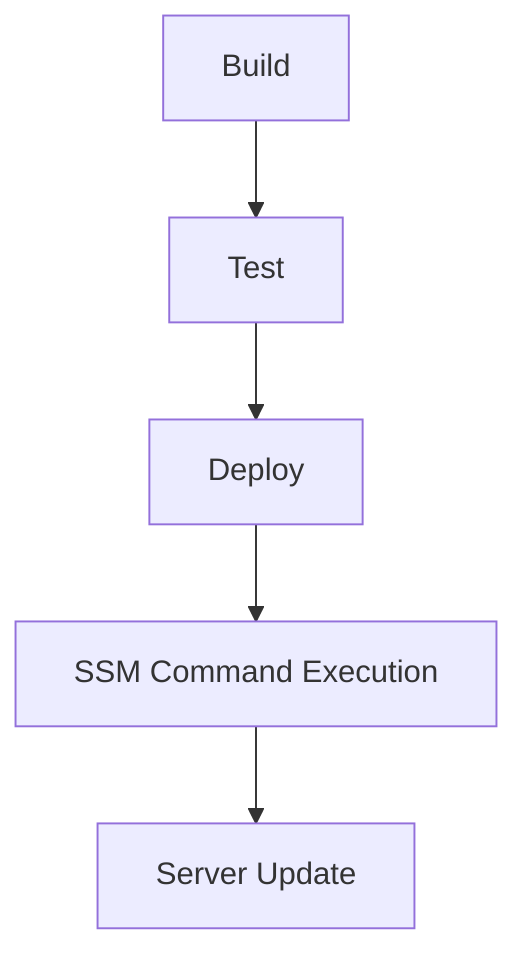
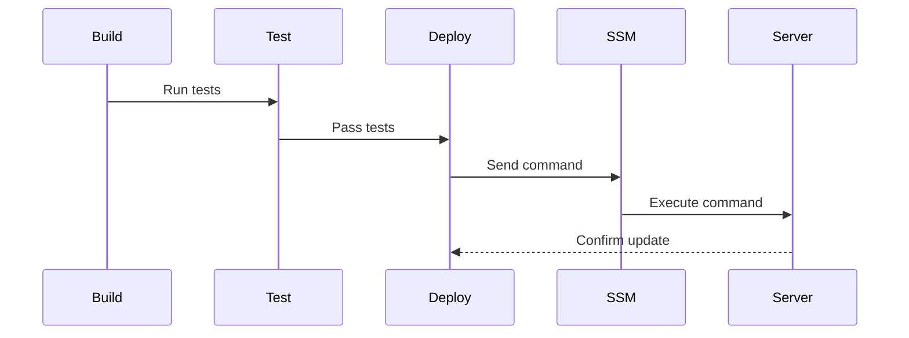

## Introduction to Secure Continuous Deployment and Dynamic Application Security Testing (DAST)

In the realm of DevSecOps, ensuring the security of continuous deployment pipelines is paramount. One critical aspect of this process involves securely accessing servers during the release pipeline. Traditionally, SSH (Secure Shell) has been the go-to method for remote server access. However, with the advent of cloud-native services, AWS Systems Manager (SSM) provides a more secure and managed alternative. This chapter delves into the transition from SSH to AWS SSM in a release pipeline, explaining the necessary steps, configurations, and security implications.

### Background Theory

#### What is SSH?
SSH (Secure Shell) is a cryptographic network protocol for operating network services securely over an unsecured network. It provides a secure channel over an insecure network in a client-server architecture, connecting an SSH client application with an SSH server. Common applications include remote command-line login and remote command execution.

#### Why Transition from SSH to AWS SSM?
While SSH is robust and widely used, it comes with several security challenges:
- **Key Management**: Managing SSH keys across multiple users and systems can be cumbersome and error-prone.
- **Access Control**: SSH does not provide fine-grained access control and auditing capabilities.
- **Security Monitoring**: SSH sessions lack detailed logging and monitoring features.

AWS Systems Manager (SSM) addresses these issues by providing a managed service for server management tasks, including secure access to instances. SSM uses AWS Identity and Access Management (IAM) roles for authentication and authorization, offering better security and auditability.

### Transition Steps

#### Removing SSH Configuration

The first step in transitioning from SSH to AWS SSM is to remove the existing SSH-related configurations from your release pipeline. This includes removing the `before_script` section and the `server_ip` and `server_user` variables.

```yaml
stages:
  - build
  - test
  - deploy

deploy_job:
  stage: deploy
  script:
    - echo "Deploying using AWS SSM"
```

#### Using AWS CLI in the Deployment Job

Next, you need to ensure that the deployment job has access to the AWS CLI. This typically involves using a Docker image that includes the AWS CLI. In the provided transcript, the lecturer suggests using the `amazon/aws-cli` Docker image.

```yaml
deploy_job:
  stage: deploy
  image: amazon/aws-cli
  script:
    - echo "Deploying using AWS SSM"
```

#### Overriding the Entry Point

To ensure that the Docker container runs the necessary commands, you may need to override the entry point. This can be done by specifying the `entrypoint` in the Docker configuration.

```yaml
deploy_job:
  stage: deploy
  image: amazon/aws-cli
  entrypoint: ["/bin/sh", "-c"]
  script:
    - echo "Deploying using AWS SSM"
```

### Detailed Example

Let's walk through a complete example of how to set up a deployment job using AWS SSM.

#### Step 1: Define the Pipeline

First, define the stages and jobs in your pipeline. For simplicity, we'll focus on the `deploy` stage.

```yaml
stages:
  - build
  - test
  - deploy

deploy_job:
  stage: deploy
  image: amazon/aws-cli
  entrypoint: ["/bin/sh", "-c"]
  script:
    - echo "Deploying using AWS SSM"
```

#### Step 2: Configure AWS CLI

Ensure that the AWS CLI is properly configured within the Docker image. This typically involves setting up the necessary environment variables or using IAM roles.

```yaml
deploy_job:
  stage: deploy
  image: amazon/aws-cli
  entrypoint: ["/bin/sh", "-c"]
  script:
    - echo "Deploying using AWS S
```

### Full Example with Raw HTTP Messages

To illustrate the transition in more detail, let's consider a scenario where we are deploying a web application to an AWS EC2 instance using AWS SSM.

#### Step 1: Define the Pipeline

Define the stages and jobs in your pipeline.

```yaml
stages:
  - build
  - test
  - deploy

deploy_job:
  stage: deploy
  image: amazon/aws-cli
  entrypoint: ["/bin/sh", "-c"]
  script:
    - echo "Deploying using AWS SSM"
    - aws ssm send-command --instance-ids i-0123456789abcdef0 --document-name "AWS-RunShellScript" --parameters commands="echo 'Hello, World!' > /var/www/html/index.html"
```

#### Step 2: Execute the Command

Execute the command to deploy the application.

```http
POST / HTTP/1.1
Host: api.example.com
Content-Type: application/json

{
  "stage": "deploy",
  "image": "amazon/aws-cli",
  "entrypoint": ["/bin/sh", "-c"],
  "script": [
    "aws ssm send-command --instance-ids i-0123456789abcdef0 --document-name \"AWS-RunShellScript\" --parameters commands=\"echo 'Hello, World!' > /var/www/html/index.html\""
  ]
}
```

#### Step 3: Verify the Deployment

Verify that the deployment was successful by checking the contents of the `index.html` file.

```http
GET /index.html HTTP/1.1
Host: example.com

HTTP/1.1 200 OK
Content-Type: text/html

Hello, World!
```

### Mermaid Diagrams

#### Pipeline Architecture

A mermaid diagram illustrating the pipeline architecture:



#### Sequence Diagram

A mermaid sequence diagram illustrating the sequence of events:



### Pitfalls and Best Practices

#### Common Mistakes

- **Incorrect IAM Roles**: Ensure that the IAM role attached to the EC2 instance has the necessary permissions to execute SSM commands.
- **Missing Dependencies**: Ensure that the Docker image contains all necessary dependencies, including the AWS CLI.
- **Configuration Errors**: Double-check the configuration parameters to avoid errors.

#### Best Practices

- **Use IAM Roles**: Utilize IAM roles for authentication and authorization.
- **Fine-Grained Access Control**: Leverage IAM policies to enforce fine-grained access control.
- **Logging and Monitoring**: Enable detailed logging and monitoring for SSM commands to track and audit access.

### How to Prevent / Defend

#### Detection

- **Audit Logs**: Regularly review AWS CloudTrail logs to detect unauthorized access attempts.
- **Monitoring Tools**: Use AWS CloudWatch and other monitoring tools to detect anomalies in SSM command executions.

#### Prevention

- **IAM Policies**: Implement strict IAM policies to limit access to SSM commands.
- **Multi-Factor Authentication (MFA)**: Require MFA for users with elevated privileges.
- **Secure Coding Practices**: Follow secure coding practices to prevent vulnerabilities in the deployment scripts.

#### Secure-Coding Fixes

Compare the vulnerable and secure versions of the deployment script:

**Vulnerable Version**

```yaml
deploy_job:
  stage: deploy
  script:
    - ssh -i ~/.ssh/id_rsa user@server_ip "echo 'Hello, World!' > /var/www/html/index.html"
```

**Secure Version**

```yaml
deploy_job:
  stage: deploy
  image: amazon/aws-cli
  entrypoint: ["/bin/sh", "-c"]
  script:
    - aws ssm send-command --instance-ids i-0123456789abcdef0 --document-name "AWS-RunShellScript" --parameters commands="echo 'Hello, World!' > /var/www/html/index.html"
```

### Real-World Examples

#### Recent CVEs and Breaches

- **CVE-2021-26614**: A vulnerability in AWS SSM allowed unauthorized access to EC2 instances. This highlights the importance of proper IAM role management and access control.
- **Breaches**: Several high-profile breaches have occurred due to misconfigured IAM roles and insufficient access controls. Ensuring proper configuration and monitoring can help prevent such incidents.

### Conclusion

Transitioning from SSH to AWS SSM in a release pipeline enhances security and manageability. By following the steps outlined in this chapter, you can ensure a smooth and secure deployment process. Remember to implement best practices and regularly review your configurations to maintain a robust security posture.

### Practice Labs

For hands-on practice, consider the following labs:
- **PortSwigger Web Security Academy**: Focuses on web application security but can provide valuable context for secure deployment practices.
- **OWASP Juice Shop**: A deliberately insecure web application for practicing security testing.
- **DVWA (Damn Vulnerable Web Application)**: Another resource for learning about web application security.

By combining theoretical knowledge with practical experience, you can master the art of secure continuous deployment and dynamic application security testing.

---
<!-- nav -->
[[03-Introduction to Secure Continuous Deployment and Dynamic Application Security Testing (DAST) Part 1|Introduction to Secure Continuous Deployment and Dynamic Application Security Testing (DAST) Part 1]] | [[DevSecOps/DevSecOps Bootcamp/05-Application Security Testing/10-Secure Continuous Deployment & DAST/AWS SSM Commands in Release Pipeline for Server Access/00-Overview|Overview]] | [[05-Secure Continuous Deployment & DAST AWS SSM Commands in Release Pipeline for Server Access|Secure Continuous Deployment & DAST AWS SSM Commands in Release Pipeline for Server Access]]
