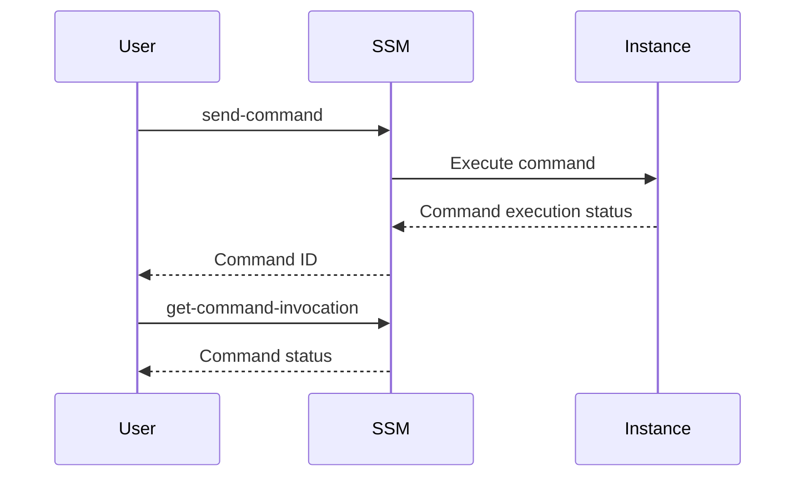

## Secure Continuous Deployment & DAST: AWS SSM Commands in Release Pipeline for Server Access

### Background Theory

In the realm of DevSecOps, ensuring the security and integrity of continuous deployment pipelines is paramount. One critical aspect of this process involves managing and monitoring commands executed on remote servers through tools like AWS Systems Manager (SSM). SSM provides a robust framework for automating tasks across various AWS resources, including EC2 instances, Lambda functions, and more.

### Understanding AWS SSM

AWS Systems Manager (SSM) is a powerful tool that enables you to automate operational tasks such as patch management, configuration management, and runbooks. It allows you to manage your AWS resources efficiently and securely. One of the key features of SSM is the ability to execute commands on managed instances using the `send-command` API.

#### Key Concepts

- **Managed Instances**: These are EC2 instances, on-premises servers, or virtual machines that are configured to communicate with SSM.
- **Command Execution**: SSM allows you to run commands on these managed instances, providing a way to automate tasks and monitor their status.

### Command Execution in SSM

To execute a command on a managed instance, you use the `send-command` API. This API sends a command to one or more managed instances and returns a unique `CommandId` for tracking the command's execution.

#### Example: Sending a Command

```bash
aws ssm send-command \
    --document-name "AWS-RunShellScript" \
    --instance-ids "i-0123456789abcdef0" \
    --comment "Install updates" \
    --parameters '{"commands":["sudo yum update -y"]}'
```

This command sends a script to the specified instance (`i-0123456789abcdef0`) to install system updates. The `--comment` parameter adds a description to the command, and the `--parameters` parameter specifies the actual commands to be executed.

### Monitoring Command Status

Once a command is sent, it is crucial to monitor its execution status to ensure that the intended actions were completed successfully. This is achieved using the `get-command-invocation` API.

#### Example: Getting Command Status

```bash
aws ssm get-command-invocation \
    --command-id "0123456789abcdef0123456789abcdef" \
    --instance-id "i-0123456789abcdef0"
```

This command retrieves the status of the command execution on the specified instance. The `--command-id` parameter is essential as it uniquely identifies the command execution.

### Integrating with Continuous Deployment Pipelines

In a continuous deployment pipeline, integrating SSM commands ensures that automated tasks are executed and monitored effectively. This integration can be done using CI/CD tools like Jenkins, GitLab CI, or AWS CodePipeline.

#### Example: Adding SSM Command to Pipeline

```yaml
stages:
  - stage:
      name: Deploy
      jobs:
        - job:
            name: Execute-SSM-Command
            steps:
              - script:
                  name: Send-Command
                  shell: bash
                  script: |
                    aws ssm send-command \
                      --document-name "AWS-RunShellScript" \
                      --instance-ids "i-0123456789abcdef0" \
                      --comment "Install updates" \
                      --parameters '{"commands":["sudo yum update -y"]}'
              - script:
                  name: Get-Command-Status
                  shell: bash
                  script: |
                    aws ssm get-command-invocation \
                      --command-id "0123456789abcdef01234456789abcdef" \
                      --instance-id "i-0123456789abcdef0"
```

This YAML snippet demonstrates how to integrate SSM commands into a GitLab CI pipeline. The first script sends the command, and the second script retrieves the command's status.

### Extracting Command ID

The `CommandId` is a unique identifier generated when a command is sent. This ID is necessary for tracking the command's execution status. To extract the `CommandId`, you can use the `query` option provided by the `send-command` API.

#### Example: Extracting Command ID

```bash
aws ssm send-command \
    --document-name "AWS-RunShellScript" \
    --instance-ids "i-0123456789abcdef0" \
    --comment "Install updates" \
    --parameters '{"commands":["sudo yum update -y"]}' \
    --output text \
    --query 'Command.CommandId'
```

This command sends the command and extracts the `CommandId` from the response. The `--output text` and `--query` options format the output to return only the `CommandId`.

### Saving Command ID for Later Use

Once the `CommandId` is extracted, it should be saved for later use in monitoring the command's status. This can be done by assigning the `CommandId` to a variable in your CI/CD pipeline.

#### Example: Saving Command ID

```bash
COMMAND_ID=$(aws ssm send-command \
    --document-name "AWS-RunShellScript" \
    --instance-ids "i-0123456789abcdef0" \
    --comment "Install updates" \
    --parameters '{"commands":["sudo yum update -y"]}' \
    --output text \
    --query 'Command.CommandId')

echo "Command ID: $COMMAND_ID"
```

This script assigns the `CommandId` to the `COMMAND_ID` variable and prints it out.

### Mermaid Diagrams

To visualize the flow of commands and their status retrieval, a mermaid diagram can be used.



This diagram illustrates the sequence of events when executing and monitoring a command using SSM.

### Real-World Examples

Recent breaches and vulnerabilities often involve misconfigurations or unauthorized access to managed instances. For example, CVE-2021-26614 highlighted issues with SSM permissions, where improper IAM policies could allow unauthorized users to execute commands on managed instances.

#### Example: CVE-2021-26614

CVE-2021-26614 demonstrated the importance of securing SSM permissions. An attacker with access to an IAM role with SSM permissions could execute arbitrary commands on managed instances. This underscores the need for strict IAM policies and regular audits.

### How to Prevent / Defend

#### Detection

Regularly audit IAM policies and SSM permissions to ensure that only authorized users have access to execute commands. Use AWS CloudTrail to log and monitor SSM activities.

#### Prevention

- **IAM Policies**: Restrict SSM permissions to specific roles and users.
- **CloudTrail**: Enable logging for SSM activities to detect unauthorized access.
- **Secure Coding**: Ensure that scripts and commands executed via SSM are secure and do not expose sensitive information.

#### Secure-Coding Fixes

**Vulnerable Code**

```bash
aws ssm send-command \
    --document-name "AWS-RunShellScript" \
    --instance-ids "i-0123456789abcdef0" \
    --comment "Install updates" \
    --parameters '{"commands":["sudo yum update -y"]}'
```

**Fixed Code**

```bash
aws ssm send-command \
    --document-name "AWS-RunShellScript" \
    --instance-ids "i-0123456789abcdef0" \
    --comment "Install updates" \
    --parameters '{"commands":["sudo yum update -y"]}' \
    --output text \
    --query 'Command.CommandId'
```

The fixed code includes the `--output text` and `--query` options to ensure that only the `CommandId` is returned, reducing the risk of exposing sensitive information.

### Conclusion

Integrating AWS SSM commands into continuous deployment pipelines ensures that automated tasks are executed and monitored securely. By understanding the concepts, using real-world examples, and implementing secure coding practices, you can enhance the security of your DevSecOps processes.

### Practice Labs

For hands-on experience with AWS SSM and continuous deployment, consider the following labs:

- **PortSwigger Web Security Academy**: Focuses on web application security but can provide insights into integrating security practices into CI/CD pipelines.
- **AWS Official Workshops**: Offers detailed guides and labs on using AWS services, including SSM, in CI/CD pipelines.
- **Pacu**: A penetration testing framework that can be used to test and secure AWS environments, including SSM configurations.

These labs provide practical experience and reinforce the theoretical knowledge gained from this chapter.

---
<!-- nav -->
[[04-Introduction to Secure Continuous Deployment and Dynamic Application Security Testing (DAST)|Introduction to Secure Continuous Deployment and Dynamic Application Security Testing (DAST)]] | [[DevSecOps/DevSecOps Bootcamp/05-Application Security Testing/10-Secure Continuous Deployment & DAST/AWS SSM Commands in Release Pipeline for Server Access/00-Overview|Overview]] | [[06-Secure Continuous Deployment & DAST Using AWS SSM Commands in Release Pipeline for Server Access|Secure Continuous Deployment & DAST Using AWS SSM Commands in Release Pipeline for Server Access]]
