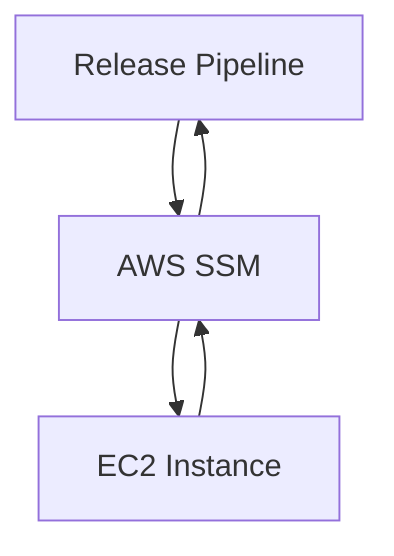

## Secure Continuous Deployment & Dynamic Application Security Testing (DAST)

### Introduction to Secure Continuous Deployment

Secure Continuous Deployment (SCD) is a critical component of modern DevSecOps practices, ensuring that applications are deployed securely and efficiently. One of the key tools used in this process is AWS Systems Manager (SSM), which provides a suite of capabilities for managing and automating tasks across your infrastructure. In this section, we will focus on how to use AWS SSM commands within a release pipeline to gain secure access to servers.

### Understanding Shell Syntax and Variable Assignment

Before diving into the specifics of AWS SSM commands, it is essential to understand the basics of shell syntax and variable assignment. Shell scripts are commonly used in automation pipelines to execute commands and manage outputs.

#### Shell Syntax

Shell syntax refers to the structure and rules governing how commands are written and executed in a shell environment. A typical shell script consists of a series of commands, each of which performs a specific task. For example:

```sh
echo "Hello, World!"
```

This simple command prints "Hello, World!" to the console.

#### Variable Assignment

Variables in shell scripts are used to store and manipulate data. They can hold strings, numbers, or even the output of commands. To assign a value to a variable, you use the following syntax:

```sh
variable_name=value
```

For example:

```sh
output="Hello, World!"
```

To reference the value stored in a variable, you prepend the variable name with a `$` symbol:

```sh
echo $output
```

This will print "Hello, World!" to the console.

### Using AWS SSM Commands in a Release Pipeline

AWS Systems Manager (SSM) provides a set of tools for managing and automating tasks across your AWS resources. One of the key features of SSM is the ability to execute commands remotely on managed instances using the `aws ssm send-command` command.

#### Command Execution with `aws ssm send-command`

The `aws ssm send-command` command allows you to execute a specified command on one or more managed instances. Here’s a breakdown of the command structure:

```sh
aws ssm send-command --document-name "AWS-RunShellScript" --instance-ids <instance-id> --parameters commands=<command>
```

- **--document-name**: Specifies the document to use for the command. `"AWS-RunShellScript"` is a built-in document that allows you to run shell scripts on Linux instances.
- **--instance-ids**: Specifies the instance IDs on which the command should be executed.
- **--parameters**: Specifies the parameters for the command, including the actual command to be executed.

#### Example: Executing a Simple Command

Let’s walk through an example of executing a simple command on an EC2 instance using `aws ssm send-command`.

1. **Identify the Instance ID**:
   First, you need to know the instance ID of the EC2 instance you want to target. You can find this information in the AWS Management Console or using the `aws ec2 describe-instances` command.

2. **Execute the Command**:
   Now, let’s execute a simple `echo "Hello, World!"` command on the specified instance.

```sh
aws ssm send-command --document-name "AWS-RunShellScript" --instance-ids i-0123456789abcdef0 --parameters commands='echo "Hello, World!"'
```

This command will execute the `echo "Hello, World!"` command on the specified instance.

#### Capturing Command Output

When executing commands using `aws ssm send-command`, you can capture the output of the command by specifying an output parameter. This is useful for storing the results of the command execution in a variable for further processing.

```sh
command_id=$(aws ssm send-command --document-name "AWS-RunShellScript" --instance-ids i-0123456789abcdef0 --parameters commands='echo "Hello, World!"')
```

In this example, the `command_id` variable will store the ID of the command execution.

#### Retrieving Command Status

After executing a command, you can retrieve the status of the command execution using the `aws ssm list-command-invocations` command.

```sh
aws ssm list-command-invocations --command-id $command_id --details
```

This command will return detailed information about the command execution, including the status and output.

### Real-World Examples and Recent Breaches

Recent breaches and vulnerabilities often highlight the importance of secure deployment practices. For example, the Log4j vulnerability (CVE-2021-44228) demonstrated the risks associated with insecure deployment processes. Ensuring that commands executed on managed instances are properly validated and monitored can help mitigate such risks.

### Pitfalls and Common Mistakes

While using AWS SSM commands in a release pipeline can greatly enhance automation and security, there are several pitfalls and common mistakes to avoid:

1. **Insufficient Permissions**: Ensure that the IAM role or user executing the SSM commands has the necessary permissions to perform the required actions.
2. **Incorrect Instance IDs**: Double-check the instance IDs to ensure that the commands are being executed on the correct instances.
3. **Sensitive Data Exposure**: Avoid exposing sensitive data in command outputs. Use proper logging and monitoring practices to ensure that sensitive information is not inadvertently disclosed.

### How to Prevent / Defend

#### Detection

To detect potential issues with command execution, you can use AWS CloudTrail to log and monitor API calls made to AWS services, including SSM. This can help identify unauthorized or suspicious activity.

#### Prevention

1. **IAM Role Configuration**: Configure IAM roles with least privilege access to ensure that only necessary permissions are granted.
2. **Instance Metadata Service (IMDS)**: Use IMDS to securely retrieve instance metadata and credentials.
3. **Secure Logging**: Implement secure logging practices to ensure that command outputs are properly logged and monitored.

#### Secure Coding Fixes

Here’s an example of a vulnerable versus a secure approach to executing commands:

**Vulnerable Code**:
```sh
aws ssm send-command --document-name "AWS-RunShellScript" --instance-ids i-0123456789abcdef0 --parameters commands='echo "Hello, World!"'
```

**Secure Code**:
```sh
# Define the command to be executed
command="echo 'Hello, World!'"

# Execute the command and capture the command ID
command_id=$(aws ssm send-command --document-name "AWS-RunShellScript" --instance-ids i-0123456789abcdef0 --parameters commands="$command")

# Retrieve the command status
aws ssm list-command-invocations --command-id $command_id --details
```

### Complete Example

Here’s a complete example of executing a command on an EC2 instance using AWS SSM and capturing the output:

```sh
# Define the command to be executed
command="echo 'Hello, World!'"

# Execute the command and capture the command ID
command_id=$(aws ssm send-command --document-name "AWS-RunShellScript" --instance-ids i-0123456789abcdef0 --parameters commands="$command")

# Retrieve the command status
aws ssm list-command-invocations --command-id $command_id --details
```

### Network Topology and Request/Response Flow

To better understand the flow of commands and responses, consider the following network topology and request/response flow:



### HTTP Details

When working with HTTP requests and responses, it is important to understand the full raw HTTP message and each relevant header. Here’s an example of a full HTTP request and response:

**HTTP Request**:
```http
POST /v1/commands HTTP/1.1
Host: ssm.us-east-1.amazonaws.com
Content-Type: application/json
Authorization: Bearer <access_token>

{
  "DocumentName": "AWS-RunShellScript",
  "InstanceIds": ["i-0123456789abcdef0"],
  "Parameters": {
    "commands": ["echo 'Hello, World!'"]
  }
}
```

**HTTP Response**:
```http
HTTP/1.1 200 OK
Content-Type: application/json

{
  "Command": {
    "CommandId": "d-0123456789abcdef0",
    "DocumentName": "AWS-RunShellScript",
    "InstanceIds": ["i-1234567890abcdef0"],
    "Parameters": {
      "commands": ["echo 'Hello, World!'"]
    },
    "Status": "Success"
  }
}
```

### Practice Labs

To practice these concepts, consider the following well-known labs:

- **PortSwigger Web Security Academy**: Offers hands-on labs for web application security.
- **OWASP Juice Shop**: Provides a vulnerable web application for practicing security testing.
- **DVWA (Damn Vulnerable Web Application)**: Another popular web application for security testing.
- **WebGoat**: An interactive web application designed to teach web application security lessons.

These labs provide practical experience in applying secure deployment practices and dynamic application security testing (DAST).

### Conclusion

Understanding and implementing secure continuous deployment practices is crucial for maintaining the integrity and security of your applications. By leveraging AWS SSM commands and following best practices, you can ensure that your deployment processes are both efficient and secure.

---
<!-- nav -->
[[06-Secure Continuous Deployment & DAST Using AWS SSM Commands in Release Pipeline for Server Access|Secure Continuous Deployment & DAST Using AWS SSM Commands in Release Pipeline for Server Access]] | [[DevSecOps/DevSecOps Bootcamp/05-Application Security Testing/10-Secure Continuous Deployment & DAST/AWS SSM Commands in Release Pipeline for Server Access/00-Overview|Overview]] | [[DevSecOps/DevSecOps Bootcamp/05-Application Security Testing/10-Secure Continuous Deployment & DAST/AWS SSM Commands in Release Pipeline for Server Access/08-Practice Questions & Answers|Practice Questions & Answers]]
