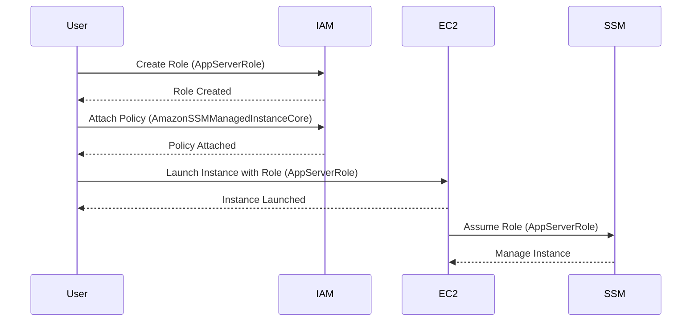

## Introduction to AWS Systems Manager and EC2 Integration

AWS Systems Manager (SSM) is a powerful tool designed to help you manage your AWS resources efficiently. It provides a suite of capabilities that can help you automate tasks, maintain compliance, and troubleshoot issues across your infrastructure. One of the key functionalities of SSM is its ability to manage EC2 instances, which are virtual servers in the cloud. To effectively use SSM with EC2 instances, you need to configure roles and permissions correctly.

### Understanding Roles and Permissions

In AWS, roles are used to grant permissions to entities such as EC2 instances. A role is essentially a set of permissions that can be assumed by an entity. When an EC2 instance assumes a role, it gains the permissions defined in that role. This is crucial for allowing the EC2 instance to interact with other AWS services securely.

#### Why Roles Matter

Roles are essential because they provide a way to control access to AWS resources in a fine-grained manner. Instead of granting broad permissions to individual instances, you can define specific roles that contain the necessary permissions. This approach enhances security by adhering to the principle of least privilege, where each entity has only the permissions it needs to perform its tasks.

#### How Roles Work

When an EC2 instance assumes a role, it receives temporary credentials that allow it to access other AWS services. These credentials are valid for a limited time and are automatically rotated, enhancing security. The process of assuming a role involves the following steps:

1. **Role Creation**: You create a role with specific permissions.
2. **Instance Association**: You associate the role with the EC2 instance.
3. **Assumption**: The EC2 instance assumes the role and uses the temporary credentials to access other services.

### Configuring a Role for EC2 Instances

To configure a role for an EC2 instance, you need to follow these steps:

1. **Create a Role**:
    - Navigate to the IAM console.
    - Click on "Roles" and then "Create role".
    - Choose "AWS service" as the trusted entity type.
    - Select "EC2" as the service that will use this role.
    - Attach the necessary policies to the role.

2. **Attach Policies**:
    - For managing EC2 instances with SSM, you need to attach the `AmazonSSMManagedInstanceCore` policy.
    - This policy grants the necessary permissions for the EC2 instance to be managed by the SSM service.

3. **Assign the Role to the EC2 Instance**:
    - When launching an EC2 instance, you can specify the role to be associated with it.
    - Alternatively, you can modify an existing instance to use the role.

### Detailed Example: Creating and Assigning a Role

Let's walk through the process of creating a role and assigning it to an EC2 instance using the AWS Management Console.

#### Step 1: Create a Role

1. **Navigate to IAM Console**:
    - Open the AWS Management Console.
    - Go to the IAM section.

2. **Create a New Role**:
    - Click on "Roles" and then "Create role".
    - Choose "AWS service" as the trusted entity type.
    - Select "EC2" as the service that will use this role.

3. **Attach Policies**:
    - Search for and attach the `AmazonSSMManagedInstanceCore` policy.
    - This policy is specifically designed to allow EC2 instances to be managed by the SSM service.

4. **Name the Role**:
    - Name the role something meaningful, such as `AppServerRole`.

5. **Review and Create**:
    - Review the settings and click "Create role".

#### Step 2: Assign the Role to an EC2 Instance

1. **Launch an EC2 Instance**:
    - Go to the EC2 dashboard.
    - Click on "Launch instance".
    - Choose an AMI and configure the instance details.

2. **Configure IAM Role**:
    - Under "IAM role", select the role you created (`AppServerRole`).

3. **Complete the Launch Process**:
    - Continue with the rest of the launch process and launch the instance.

### Detailed Example: Using the AWS CLI

You can also create and assign roles using the AWS Command Line Interface (CLI). Here’s how you can do it:

#### Step 1: Create a Role Using the CLI

```bash
aws iam create-role --role-name AppServerRole --assume-role-policy-document '{
  "Version": "2012-10-17",
  "Statement": [
    {
      "Effect": "Allow",
      "Principal": {
        "Service": "ec2.amazonaws.com"
      },
      "Action": "sts:AssumeRole"
    }
  ]
}'
```

#### Step 2: Attach the Policy to the Role

```bash
aws iam attach-role-policy --role-name AppServerRole --policy-arn arn:aws:iam::aws:policy/AmazonSSMManagedInstanceCore
```

#### Step 3: Launch an EC2 Instance with the Role

```bash
aws ec2 run-instances --image-id ami-0c55b159cbfafe1f0 --count 1 --instance-type t2.micro --key-name MyKeyPair --security-group-ids sg-0123456789abcdef0 --subnet-id subnet-0123456789abcdef0 --iam-instance-profile Name=AppServerRole
```

### Diagramming the Role Configuration

Let's visualize the role configuration using a Mermaid diagram:



### Common Pitfalls and Best Practices

#### Pitfall: Incorrect Role Assignment

One common pitfall is incorrectly assigning roles to EC2 instances. If the role is not properly attached, the instance may not have the necessary permissions to be managed by SSM.

**Best Practice**: Always verify that the role is correctly attached to the EC2 instance. You can check this in the EC2 console under the instance details.

#### Pitfall: Insufficient Permissions

Another pitfall is attaching insufficient permissions to the role. If the role does not have the necessary permissions, the EC2 instance will not be able to communicate with other services.

**Best Practice**: Ensure that the role has the correct policies attached. For SSM management, the `AmazonSSSMMangedInstanceCore` policy is essential.

### Real-World Examples and Recent Breaches

Recent breaches have highlighted the importance of proper role management and permissions. For example, in the Capital One breach (CVE-2019-11081), misconfigured IAM roles allowed unauthorized access to sensitive data. Properly configured roles and permissions could have prevented such breaches.

### How to Prevent / Defend

#### Detection

To detect misconfigurations, you can use AWS CloudTrail to log API calls and monitor for unauthorized actions. Additionally, AWS Config can be used to track changes to your resources and ensure compliance with your security policies.

#### Prevention

1. **Use IAM Policies**: Ensure that IAM policies are correctly configured to adhere to the principle of least privilege.
2. **Regular Audits**: Regularly audit your IAM roles and permissions to ensure they are up-to-date and secure.
3. **Secure Coding Practices**: Implement secure coding practices to avoid common vulnerabilities.

#### Secure Code Fix

Here’s an example of a vulnerable IAM role configuration and its secure counterpart:

**Vulnerable Configuration**:
```json
{
  "Version": "2012-10-17",
  "Statement": [
    {
      "Effect": "Allow",
      "Action": "*",
      "Resource": "*"
    }
  ]
}
```

**Secure Configuration**:
```json
{
  "Version": "2012-10-17",
  "Statement": [
    {
      "Effect": "Allow",
      "Action": [
        "ssm:*",
        "ec2:Describe*"
      ],
      "Resource": "*"
    }
  ]
}
```

### Conclusion

Properly configuring roles and permissions is crucial for securing your EC2 instances and ensuring they can be effectively managed by AWS Systems Manager. By following best practices and regularly auditing your configurations, you can enhance the security of your AWS environment.

### Hands-On Labs

For hands-on practice, consider the following labs:

- **PortSwigger Web Security Academy**: Offers practical exercises on securing web applications.
- **OWASP Juice Shop**: Provides a vulnerable web application for learning security concepts.
- **CloudGoat**: Focuses on cloud security and offers scenarios for practicing secure configuration.

These labs will help you gain practical experience in configuring roles and permissions for EC2 instances in AWS.

---
<!-- nav -->
[[03-Introduction to AWS Systems Manager and EC2 Integration Part 1|Introduction to AWS Systems Manager and EC2 Integration Part 1]] | [[DevSecOps/DevSecOps Bootcamp/05-Application Security Testing/10-Secure Continuous Deployment & DAST/Configure AWS Systems Manager for EC2 Server/00-Overview|Overview]] | [[05-Secure Continuous Deployment & DAST Configuring AWS Systems Manager for EC2 Servers|Secure Continuous Deployment & DAST Configuring AWS Systems Manager for EC2 Servers]]
