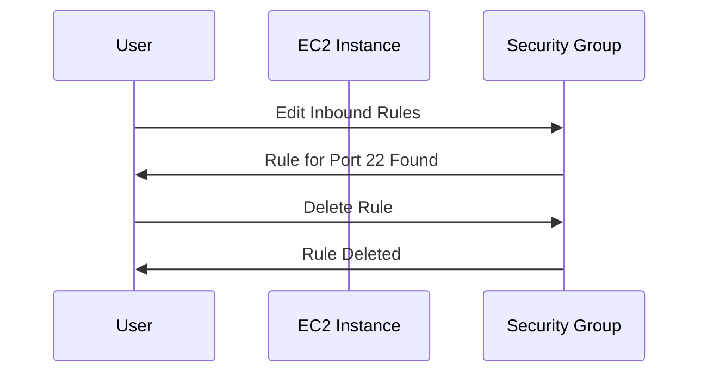
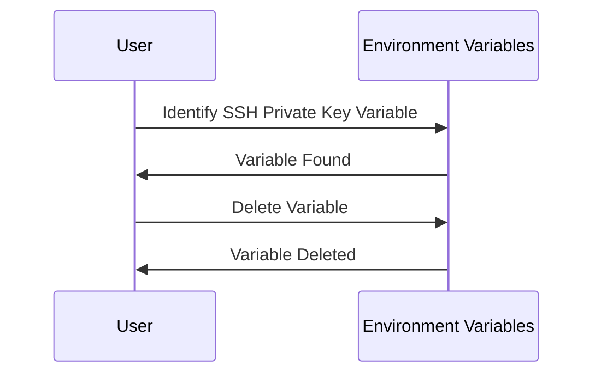
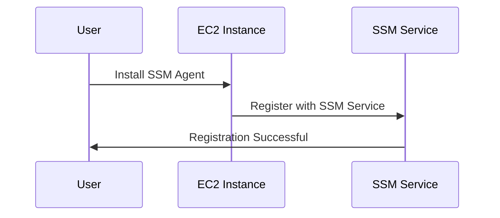

## Secure Continuous Deployment & DAST: Configuring AWS Systems Manager for EC2 Servers

### Introduction to Secure Continuous Deployment

Secure Continuous Deployment (SCD) is a practice that integrates security into the continuous integration and continuous deployment (CI/CD) pipeline. This ensures that applications are deployed securely and efficiently. One critical aspect of SCD is managing access to servers and executing commands securely. In this section, we will focus on configuring AWS Systems Manager (SSM) for EC2 servers to enhance security and streamline operations.

### Closing SSH Access to EC2 Instances

#### Why Close SSH Access?

SSH (Secure Shell) is a protocol used to securely access remote servers. However, leaving SSH open can pose significant security risks. Attackers can exploit vulnerabilities in SSH configurations or brute-force login attempts to gain unauthorized access to the server. By closing SSH access, we reduce the attack surface and ensure that only authorized and secure methods are used to interact with the server.

#### Steps to Close SSH Access

1. **Edit Inbound Rules**:
    - Navigate to the EC2 instance's security group settings.
    - Locate the inbound rule that allows traffic on port 22 (SSH).
    - Delete this rule to close SSH access.



2. **Test SSH Access**:
    - Attempt to SSH into the server to verify that access is denied.
    - You should receive a connection timeout or similar error message.

```bash
ssh username@server_ip
```

Expected output:

```
ssh: connect to host server_ip port 22: Connection timed out
```

### Removing Unnecessary SSH Private Keys

#### Why Remove SSH Private Keys?

Once SSH access is closed, the SSH private keys associated with the server become unnecessary. Retaining these keys increases the risk of unauthorized access if the keys fall into the wrong hands. Therefore, it is essential to remove these keys to further secure the server.

#### Steps to Remove SSH Private Keys

1. **Delete SSH Private Key Variable**:
    - Identify the environment variable storing the SSH private key.
    - Delete this variable to ensure the key is no longer accessible.



### Introduction to AWS Systems Manager (SSM)

#### What is AWS Systems Manager?

AWS Systems Manager is a comprehensive service that helps you manage your Amazon EC2 instances and other AWS resources at scale. It provides a unified console for managing various aspects of your infrastructure, including:

- **Instance Management**: Managing and operating EC2 instances.
- **Patch Management**: Automating patch management across your fleet.
- **Run Command**: Executing commands on multiple instances simultaneously.
- **State Manager**: Automating tasks and maintaining desired states.
- **OpsCenter**: Monitoring and troubleshooting operational issues.

#### Why Use AWS Systems Manager?

Using AWS Systems Manager enhances security and efficiency by:

- **Centralized Management**: Allowing you to manage multiple resources from a single console.
- **Secure Access**: Utilizing AWS authentication mechanisms, ensuring secure access to resources.
- **Automation**: Automating routine tasks, reducing manual errors and improving consistency.

### Configuring AWS Systems Manager for EC2 Servers

#### Prerequisites

Before configuring AWS Systems Manager, ensure that:

- Your EC2 instances have the necessary permissions to communicate with SSM.
- The SSM agent is installed and running on your EC2 instances.

#### Steps to Configure AWS Systems Manager

1. **Enable SSM Agent**:
    - Ensure the SSM agent is installed and running on your EC2 instances.
    - The SSM agent communicates with the SSM service to execute commands and manage instances.



2. **Configure IAM Roles**:
    - Create an IAM role with the necessary permissions to allow SSM to manage your EC2 instances.
    - Attach this role to your EC2 instances.

```json
{
    "Version": "2012-10-17",
    "Statement": [
        {
            "Effect": "Allow",
            "Action": [
                "ssm:DescribeAssociation",
                "ssm:GetParameter",
                "ssm:PutParameter",
                "ssm:DescribeInstanceInformation",
                "ssm:SendCommand"
            ],
            "Resource": "*"
        }
    ]
}
```

3. **Use Run Command**:
    - Execute commands on your EC2 instances using the `aws ssm send-command` CLI command.

```bash
aws ssm send-command --instance-ids i-1234567890abcdef0 --document-name "AWS-RunShellScript" --parameters commands="echo Hello World"
```

Expected output:

```json
{
    "Command": {
        "CommandId": "d-1234567890abcdef0",
        "DocumentName": "AWS-RunShellScript",
        "Parameters": {
            "commands": ["echo Hello World"]
        },
        "Status": "Success",
        "StandardOutputContent": "Hello World\n"
    }
}
```

### Real-World Examples and Recent Breaches

#### Example: CVE-2021-26614

CVE-2021-26614 is a critical vulnerability in the AWS Systems Manager Agent (SSM Agent) that could allow unauthorized access to EC2 instances. This vulnerability highlights the importance of keeping the SSM Agent updated and ensuring proper configuration.

#### Prevention and Detection

To prevent such vulnerabilities:

- **Keep SSM Agent Updated**: Regularly update the SSM Agent to the latest version.
- **Monitor Logs**: Monitor SSM logs for any suspicious activity.
- **Use IAM Policies**: Implement strict IAM policies to limit access to SSM services.

### How to Prevent / Defend

#### Secure Configuration

1. **IAM Role Configuration**:
    - Ensure IAM roles are properly configured with minimal permissions.
    - Use IAM policies to restrict access to specific SSM actions.

```json
{
    "Version": "2012-10-17",
    "Statement": [
        {
            "Effect": "Deny",
            "Action": [
                "ssm:SendCommand"
            ],
            "Resource": "*",
            "Condition": {
                "StringNotEquals": {
                    "aws:PrincipalArn": "arn:aws:iam::123456789012:role/SSMRole"
                }
            }
        }
    ]
}
```

2. **SSM Agent Updates**:
    - Regularly check for updates to the SSM Agent and apply them promptly.

#### Detection

- **CloudTrail Logs**: Enable CloudTrail logging to monitor SSM activities.
- **AWS Config**: Use AWS Config to track changes in SSM configurations.

### Conclusion

By closing SSH access, removing unnecessary SSH private keys, and configuring AWS Systems Manager, you can significantly enhance the security of your EC2 servers. This approach ensures that only authorized and secure methods are used to manage and operate your instances, reducing the risk of unauthorized access and potential breaches.

### Practice Labs

For hands-on experience with configuring AWS Systems Manager, consider the following labs:

- **PortSwigger Web Security Academy**: Offers practical exercises on securing AWS environments.
- **CloudGoat**: Provides a series of labs focused on securing AWS services, including Systems Manager.
- **AWS Official Workshops**: Includes detailed guides and labs on configuring and securing AWS services.

These labs will help you gain practical experience and deepen your understanding of secure continuous deployment practices.

---
<!-- nav -->
[[04-Introduction to AWS Systems Manager and EC2 Integration|Introduction to AWS Systems Manager and EC2 Integration]] | [[DevSecOps/DevSecOps Bootcamp/05-Application Security Testing/10-Secure Continuous Deployment & DAST/Configure AWS Systems Manager for EC2 Server/00-Overview|Overview]] | [[06-Understanding IAM Roles and Policies in AWS|Understanding IAM Roles and Policies in AWS]]
