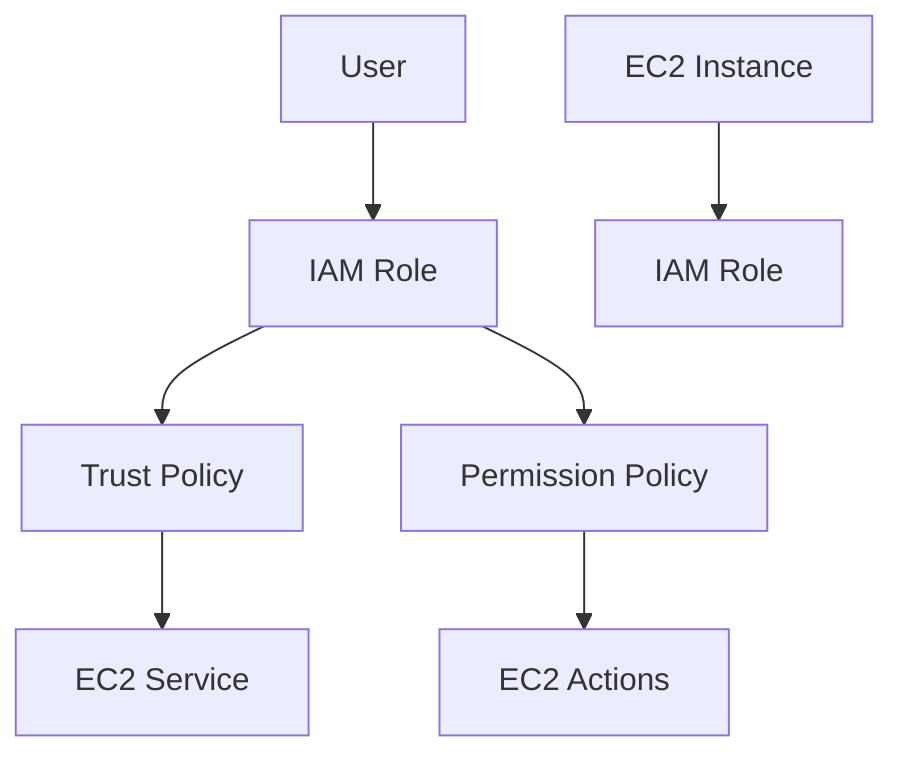
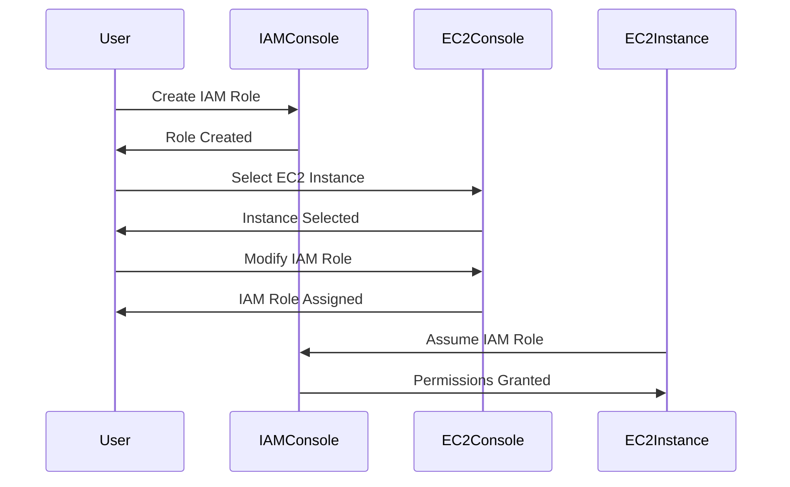

## Understanding IAM Roles and Policies in AWS

### Introduction to IAM Roles and Policies

In Amazon Web Services (AWS), Identity and Access Management (IAM) roles and policies are fundamental components used to control access to resources within your AWS environment. IAM roles are entities that can be assumed by other AWS services or users, allowing them to perform specific actions within your AWS account. IAM policies define the permissions associated with these roles, specifying what actions can be performed and on which resources.

#### What is an IAM Role?

An IAM role is an IAM entity that defines a set of permissions. Unlike an IAM user, an IAM role does not have credentials associated with it. Instead, it is assumed by other AWS services or users to gain temporary permissions to perform specific actions. This separation of identity and permissions is crucial for maintaining security and compliance in large-scale environments.

#### What is an IAM Policy?

An IAM policy is a document that specifies permissions. Policies are used to grant permissions to IAM identities (users, groups, and roles) or AWS resources. A policy is a JSON document that contains one or more statements. Each statement in a policy specifies the following:

- **Effect**: Whether the statement allows or denies access (`Allow` or `Deny`).
- **Action**: The specific API operations that the statement applies to.
- **Resource**: The specific AWS resource(s) that the statement applies to.
- **Condition**: Additional conditions that must be met for the policy to apply.

### Trust Policies vs. Permission Policies

One of the key concepts in IAM roles is the distinction between trust policies and permission policies.

#### Trust Policy

A trust policy is attached to an IAM role and specifies which entities (principals) are allowed to assume the role. The trust policy is crucial because it controls who can assume the role and thereby inherit the permissions defined in the role's permission policy.

**Example of a Trust Policy:**

```json
{
    "Version": "2012-10-17",
    "Statement": [
        {
            "Effect": "Allow",
            "Principal": {
                "Service": "ec2.amazonaws.com"
            },
            "Action": "sts:AssumeRole"
        }
    ]
}
```

In this example, the trust policy allows the EC2 service to assume the role. The `Principal` field specifies that only the EC2 service can assume the role, and the `Action` field specifies that the action allowed is `sts:AssumeRole`.

#### Permission Policy

A permission policy is attached to an IAM role and specifies the permissions that the role grants to the entities that assume it. This policy defines what actions can be performed and on which resources.

**Example of a Permission Policy:**

```json
{
    "Version": "2012-10-17",
    "Statement": [
        {
            "Effect": "Allow",
            "Action": [
                "ec2:DescribeInstances",
                "ec2:StartInstances",
                "ec2:StopInstances"
            ],
            "Resource": "*"
        }
    ]
}
```

In this example, the permission policy allows the role to perform the `ec2:DescribeInstances`, `ec2:StartInstances`, and `ec2:StopInstances` actions on all EC2 instances.

### Creating and Assigning IAM Roles

Now that we understand the basics of IAM roles and policies, let's walk through the process of creating and assigning an IAM role to an EC2 instance.

#### Step-by-Step Process

1. **Create the IAM Role:**
   - Navigate to the IAM console in the AWS Management Console.
   - Click on "Roles" and then "Create role."
   - Select the type of trusted entity (e.g., AWS service).
   - Choose the service that will assume the role (e.g., EC2).
   - Attach the necessary permissions policy to the role.
   - Review and create the role.

2. **Assign the IAM Role to an EC2 Instance:**
   - Navigate to the EC2 console in the AWS Management Console.
   - Select the EC2 instance to which you want to assign the role.
   - Click on "Actions" and then "Security" and "Modify IAM role."
   - Choose the IAM role you created and click "Update."

### Example: Creating and Assigning an IAM Role

Let's go through a detailed example of creating and assigning an IAM role to an EC2 instance.

#### Step 1: Create the IAM Role

1. **Navigate to IAM Console:**
   - Open the AWS Management Console and navigate to the IAM section.

2. **Create a New Role:**
   - Click on "Roles" and then "Create role."
   - Select "EC2" as the trusted entity type.
   - Click "Next: Permissions."

3. **Attach Permissions Policy:**
   - Search for and attach a permissions policy that grants the necessary permissions (e.g., `AmazonEC2FullAccess`).
   - Click "Next: Tags" and optionally add tags.
   - Click "Next: Review."
   - Name the role (e.g., `AppServerRole`) and review the settings.
   - Click "Create role."

#### Step 2: Assign the IAM Role to an EC2 Instance

1. **Navigate to EC2 Console:**
   - Open the AWS Management Console and navigate to the EC2 section.

2. **Select the EC2 Instance:**
   - Locate the EC2 instance to which you want to assign the role.
   - Click on the instance ID to open the instance details page.

3. **Modify IAM Role:**
   - Click on "Actions" and then "Security" and "Modify IAM role."
   - Select the IAM role you created (e.g., `AppServerRole`).
   - Click "Update."

### Real-World Examples and Recent Breaches

Understanding the importance of IAM roles and policies is crucial, especially in light of recent breaches and vulnerabilities. One notable example is the Capital One data breach in 2019, where a misconfigured S3 bucket and improper IAM role permissions led to the exposure of sensitive customer data.

#### Capital One Data Breach

- **CVE Details:** CVE-2019-14540
- **Description:** The attacker exploited a misconfigured S3 bucket and improper IAM role permissions to gain unauthorized access to sensitive data.
- **Impact:** Over 100 million customers were affected, leading to significant financial and reputational damage.

### How to Prevent / Defend

To prevent such breaches and ensure the security of your AWS environment, follow these best practices:

#### Secure IAM Role Configuration

1. **Least Privilege Principle:**
   - Ensure that IAM roles have the minimum set of permissions required to perform their tasks.
   - Regularly review and update IAM policies to remove unnecessary permissions.

2. **Use Managed Policies:**
   - Utilize managed policies provided by AWS, which are regularly updated and maintained.
   - Avoid using inline policies unless absolutely necessary.

3. **Monitor IAM Activity:**
   - Enable AWS CloudTrail to monitor IAM activity and detect unauthorized changes.
   - Set up alerts for critical IAM events using AWS CloudWatch.

#### Secure EC2 Instance Configuration

1. **Use IAM Roles for EC2 Instances:**
   - Assign IAM roles to EC2 instances to provide them with the necessary permissions.
   - Avoid hardcoding access keys and secrets in EC2 instances.

2. **Enable Instance Metadata Service Version 2 (IMDSv2):**
   - Use IMDSv2 to securely retrieve metadata from EC2 instances.
   - Disable IMDSv1 to prevent unauthorized access.

3. **Regularly Update and Patch EC2 Instances:**
   - Keep EC2 instances up-to-date with the latest security patches and updates.
   - Use automated patch management tools to ensure timely updates.

### Complete Example: Configuring IAM Role for EC2 Instance

Let's walk through a complete example of configuring an IAM role for an EC2 instance, including the creation of the role, assignment to the instance, and securing the configuration.

#### Step 1: Create the IAM Role

1. **Navigate to IAM Console:**
   - Open the AWS Management Console and navigate to the IAM section.

2. **Create a New Role:**
   - Click on "Roles" and then "Create role."
   - Select "EC2" as the trusted entity type.
   - Click "Next: Permissions."

3. **Attach Permissions Policy:**
   - Search for and attach a permissions policy that grants the necessary permissions (e.g., `AmazonEC2FullAccess`).
   - Click "Next: Tags" and optionally add tags.
   - Click "Next: Review."
   - Name the role (e.g., `AppServerRole`) and review the settings.
   - Click "Create role."

#### Step 2: Assign the IAM Role to an EC2 Instance

1. **Navigate to EC2 Console:**
   - Open the AWS Management Console and navigate to the EC2 section.

2. **Select the EC2 Instance:**
   - Locate the EC2 instance to which you want to assign the role.
   - Click on the instance ID to open the instance details page.

3. **Modify IAM Role:**
   - Click on "Actions" and then "Security" and "Modify IAM role."
   - Select the IAM role you created (e.g., `AppServerRole`).
   - Click "Update."

#### Step 3: Secure the Configuration

1. **Enable IMDSv2:**
   - Navigate to the EC2 instance details page.
   - Click on "Actions" and then "Instance Settings" and "Configure advanced options."
   - Enable IMDSv2 and save the changes.

2. **Monitor IAM Activity:**
   - Enable AWS CloudTrail to monitor IAM activity.
   - Set up alerts for critical IAM events using AWS CloudWatch.

### Mermaid Diagrams

#### IAM Role Architecture



#### IAM Role Assignment Flow



### Conclusion

Understanding and properly configuring IAM roles and policies is essential for securing your AWS environment. By following best practices and regularly reviewing and updating your configurations, you can significantly reduce the risk of unauthorized access and data breaches. Always ensure that IAM roles are configured with the least privilege principle and that EC2 instances are properly secured with IAM roles and IMDSv2 enabled.

### Practice Labs

For hands-on practice with IAM roles and policies, consider the following labs:

- **PortSwigger Web Security Academy:** Offers interactive labs to practice securing web applications.
- **OWASP Juice Shop:** Provides a vulnerable web application for practicing security testing.
- **CloudGoat:** A series of labs designed to help you learn about AWS security best practices.
- **flaws.cloud:** A platform for practicing cloud security with real-world scenarios.

By completing these labs, you can gain practical experience in configuring and securing IAM roles and policies in AWS.

---
<!-- nav -->
[[05-Secure Continuous Deployment & DAST Configuring AWS Systems Manager for EC2 Servers|Secure Continuous Deployment & DAST Configuring AWS Systems Manager for EC2 Servers]] | [[DevSecOps/DevSecOps Bootcamp/05-Application Security Testing/10-Secure Continuous Deployment & DAST/Configure AWS Systems Manager for EC2 Server/00-Overview|Overview]] | [[DevSecOps/DevSecOps Bootcamp/05-Application Security Testing/10-Secure Continuous Deployment & DAST/Configure AWS Systems Manager for EC2 Server/07-Practice Questions & Answers|Practice Questions & Answers]]
