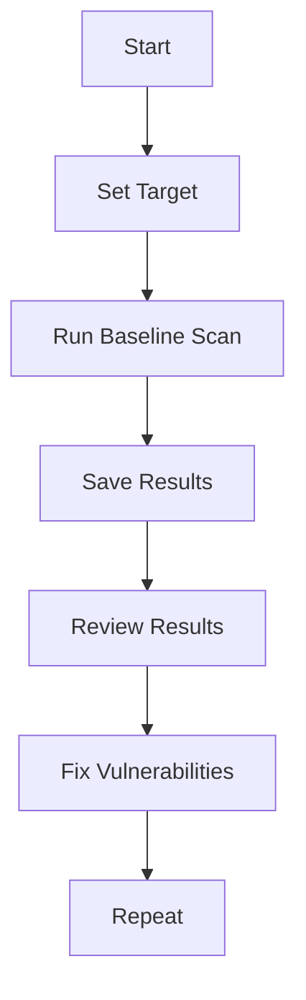

## Introduction to Dynamic Application Security Testing (DAST)

Dynamic Application Security Testing (DAST) is a method used to identify security vulnerabilities in a web application by simulating attacks on the running application. This approach allows testers to find issues such as SQL injection, cross-site scripting (XSS), and other security weaknesses that could be exploited by attackers. DAST tools typically perform automated scans that mimic the behavior of an attacker, thereby providing a comprehensive view of potential security risks.

### Why Use DAST?

DAST is particularly useful because it tests the application in a live environment, which closely mirrors real-world conditions. This means that DAST can uncover issues that might not be detected through static analysis alone. Additionally, DAST can help ensure that security controls are properly implemented and functioning as intended.

### How Does DAST Work?

DAST tools work by sending various types of malicious input to the application and observing the responses. These tools can automate the process of identifying common vulnerabilities and provide detailed reports on the findings. One popular DAST tool is OWASP ZAP (Zed Attack Proxy).

### OWASP ZAP Overview

OWASP ZAP is an open-source DAST tool that can be used to test the security of web applications. It provides both a graphical user interface (GUI) and a command-line interface (CLI) for ease of use. ZAP can be integrated into continuous integration/continuous deployment (CI/CD) pipelines to automatically scan applications during the development process.

### Configuring Automated DAST Scans in CI/CD Pipeline

To integrate DAST scans into a CI/CD pipeline, we will use OWASP ZAP's `zap-baseline.py` script. This script automates the process of performing a baseline scan on a web application. Let's walk through the steps to configure this in a CI/CD pipeline.

#### Step 1: Setting Up the Target

The first step is to specify the target of the scan. The target is the URL or IP address of the web application that you want to test. In a CI/CD pipeline, this target is often dynamically determined based on the current deployment environment.

```bash
# Example of setting the target as an environment variable
export ZAP_TARGET="http://<public_ip_address>:<port>"
```

In a real-world scenario, you would replace `<public_ip_address>` and `<port>` with the actual values for your application. For instance:

```bash
export ZAP_TARGET="http://192.168.1.100:8080"
```

Alternatively, if you have a domain name configured for your application, you might use:

```bash
export ZAP_TARGET="https://dev.myapp.com"
```

#### Step 2: Running the Baseline Scan

Once the target is set, you can run the baseline scan using the `zap-baseline.py` script. This script requires several parameters to be specified, including the target URL and the output directory for the scan results.

```bash
python3 zap-baseline.py -t $ZAP_TARGET -r /path/to/report/directory
```

Here, `$ZAP_TARGET` is the environment variable containing the target URL, and `/path/to/report/directory` is the directory where the scan results will be saved.

### Full Example of a CI/CD Pipeline Configuration

Let's put together a complete example of how to configure a CI/CD pipeline to run an automated DAST scan using OWASP ZAP.

#### Dockerfile for ZAP

First, create a Dockerfile to set up the ZAP environment:

```dockerfile
FROM owasp/zap2docker-weekly

COPY entrypoint.sh /entrypoint.sh
RUN chmod +x /entrypoint.sh

ENTRYPOINT ["/entrypoint.sh"]
```

#### Entry Point Script

Next, create an entry point script (`entrypoint.sh`) to run the baseline scan:

```bash
#!/bin/bash

# Set the target URL as an environment variable
export ZAP_TARGET="http://192.168.1.100:8080"

# Run the baseline scan
python3 zap-baseline.py -t $ZAP_TARGET -r /zap/wrk/

# Exit with the status code of the last command
exit $?
```

#### CI/CD Pipeline Configuration

Finally, configure your CI/CD pipeline to build the Docker image and run the entry point script. Here’s an example using GitLab CI/CD:

```yaml
stages:
  - build
  - test

build-zap:
  stage: build
  script:
    - docker build -t my-zap-image .
  artifacts:
    paths:
      - /zap/wrk/

run-zap-scan:
  stage: test
  script:
    - docker run --rm -v $(pwd)/zap/wrk:/zap/wrk my-zap-image
```

### Detailed Explanation of Each Component

#### Dockerfile

- **FROM owasp/zap2docker-weekly**: This line specifies the base image for the Docker container. The `owasp/zap2docker-weekly` image contains the latest version of OWASP ZAP.
- **COPY entrypoint.sh /entrypoint.sh**: This line copies the entry point script into the Docker container.
- **RUN chmod +x /entrypoint.sh**: This line makes the entry point script executable.
- **ENTRYPOINT ["/entrypoint.sh"]**: This line sets the entry point script as the default command to run when the container starts.

#### Entry Point Script

- **export ZAP_TARGET="http://192.168.1.100:8080"**: This line sets the target URL as an environment variable.
- **python3 zap-baseline.py -t $ZAP_TARGET -r /zap/wrk/**: This line runs the baseline scan using the `zap-baseline.py` script. The `-t` option specifies the target URL, and the `-r` option specifies the output directory for the scan results.
- **exit $?**: This line exits the script with the status code of the last command.

#### CI/CD Pipeline Configuration

- **stages**: This section defines the stages of the pipeline. In this example, there are two stages: `build` and `test`.
- **build-zap**: This job builds the Docker image and saves the scan results as an artifact.
- **run-zap-scan**: This job runs the Docker container and executes the entry point script.

### Real-World Examples and Recent CVEs

#### Example 1: CVE-2021-21972

CVE-2021-21972 is a critical vulnerability in the Apache Log4j library that allows remote code execution. By integrating DAST scans into the CI/CD pipeline, developers can catch such vulnerabilities early in the development cycle.

#### Example 2: Equifax Data Breach (2017)

The Equifax data breach was caused by a vulnerability in the Apache Struts framework. A DAST scan could have identified this vulnerability and prevented the breach.

### Common Pitfalls and Best Practices

#### Pitfall 1: False Positives

One common issue with DAST scans is the generation of false positives. To mitigate this, it is important to configure the scan parameters correctly and review the results carefully.

#### Pitfall 2: Performance Impact

Running DAST scans can impact the performance of the application being tested. To minimize this impact, it is recommended to run scans during off-peak hours or in a staging environment.

### How to Prevent / Defend

#### Detection

- **Regular Scans**: Schedule regular DAST scans as part of the CI/CD pipeline to detect new vulnerabilities.
- **Automated Alerts**: Set up automated alerts to notify the development team of any new vulnerabilities found during scans.

#### Prevention

- **Secure Coding Practices**: Follow secure coding practices to prevent common vulnerabilities such as SQL injection and XSS.
- **Input Validation**: Validate all user inputs to ensure they meet expected formats and lengths.
- **Security Training**: Provide regular security training to the development team to keep them informed about the latest threats and mitigation techniques.

#### Secure Code Fix

Here’s an example of a vulnerable code snippet and its secure counterpart:

**Vulnerable Code:**

```python
def get_user_data(user_id):
    cursor = db.cursor()
    query = f"SELECT * FROM users WHERE id = {user_id}"
    cursor.execute(query)
    return cursor.fetchall()
```

**Secure Code:**

```python
def get_user_data(user_id):
    cursor = db.cursor()
    query = "SELECT * FROM users WHERE id = %s"
    cursor.execute(query, (user_id,))
    return cursor.fetchall()
```

In the secure code, parameterized queries are used to prevent SQL injection attacks.

### Conclusion

Integrating DAST scans into a CI/CD pipeline is a crucial step in ensuring the security of web applications. By automating the process of identifying and fixing vulnerabilities, organizations can significantly reduce the risk of security breaches. Using tools like OWASP ZAP and following best practices can help ensure that applications are secure throughout their lifecycle.

### Practice Labs

For hands-on practice with DAST and CI/CD integration, consider the following labs:

- **PortSwigger Web Security Academy**: Offers interactive labs to learn and practice web application security.
- **OWASP Juice Shop**: A deliberately insecure web application for practicing security testing.
- **DVWA (Damn Vulnerable Web Application)**: Another intentionally vulnerable web application for learning security testing.

By completing these labs, you can gain practical experience in configuring and running DAST scans in a CI/CD pipeline.



This diagram illustrates the workflow of setting up and running a DAST scan in a CI/CD pipeline.

---
<!-- nav -->
[[DevSecOps/DevSecOps Bootcamp/05-Application Security Testing/10-Secure Continuous Deployment & DAST/Configure Automated DAST Scans in CICD Pipeline/00-Overview|Overview]] | [[02-Introduction to Dynamic Application Security Testing (DAST) Part 2|Introduction to Dynamic Application Security Testing (DAST) Part 2]]
