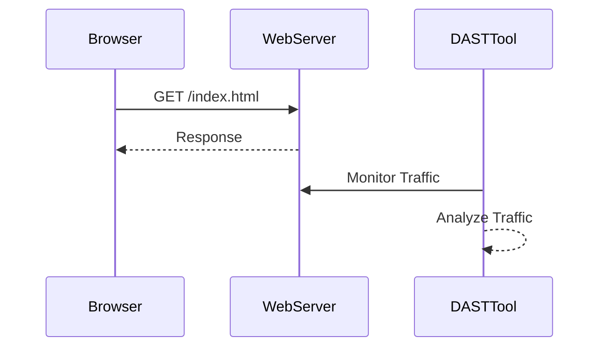
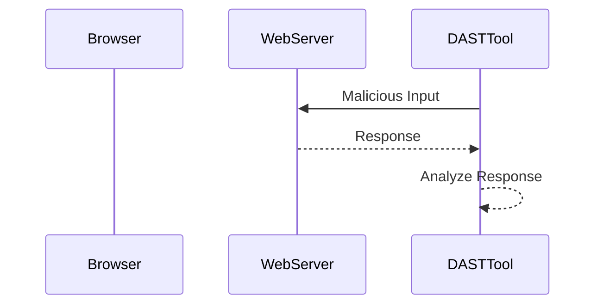
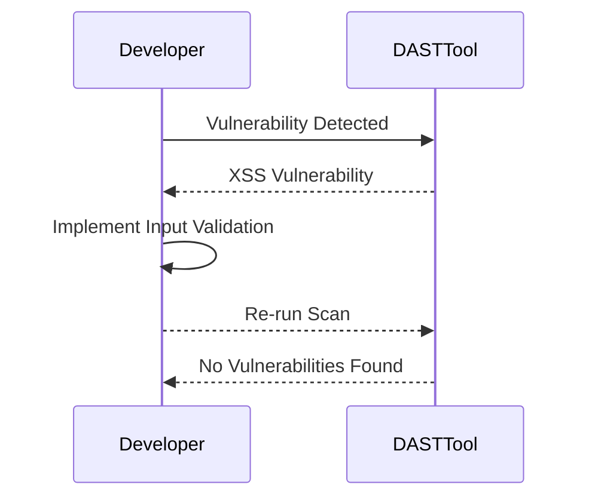

## Introduction to Dynamic Application Security Testing (DAST)

Dynamic Application Security Testing (DAST) is a critical component of modern DevSecOps practices, designed to identify vulnerabilities in applications during runtime. This method involves interacting with the application as an end user would, thereby simulating real-world attacks. DAST tools can detect a wide range of security issues, including SQL injection, cross-site scripting (XSS), and other common vulnerabilities.

### Passive vs Active Scanning

In DAST, there are two primary types of scanning methods: passive and active.

#### Passive Scanning

Passive scanning involves monitoring the web traffic and analyzing it for security issues without actively engaging with the application. This method is less intrusive and faster compared to active scanning. However, it may miss certain vulnerabilities that require active interaction with the application.

**Example of Passive Scanning:**


#### Active Scanning

Active scanning, on the other hand, involves sending malicious inputs to the server and analyzing the response for security issues. This method is more thorough but also more time-consuming and potentially disruptive to the application state.

**Example of Active Scanning:**


### Duration and Application State Alteration

Active scanning typically takes longer than passive scanning due to the nature of the tests being performed. Additionally, active scanning can alter the application state, which is a significant consideration when integrating DAST into a continuous integration and deployment (CI/CD) pipeline.

### Integration into CI/CD Pipelines

Given the potential disruptions caused by active scanning, it is common practice to integrate DAST into CI/CD pipelines in a way that minimizes interference with the main pipeline execution.

#### Baseline Scans in Main Pipeline

Baseline scans are often run in the main CI/CD pipeline to provide a quick overview of the application's security status. These scans are less intrusive and faster, making them suitable for regular integration checks.

**Example of Baseline Scan Configuration:**
```yaml
# .github/workflows/ci.yml
name: CI
on:
  push:
    branches:
      - main
jobs:
  build:
    runs-on: ubuntu-latest
    steps:
      - name: Checkout code
        uses: actions/checkout@v2
      - name: Run baseline DAST scan
        run: |
          dast_tool --baseline-scan
```

#### Full Scans in Dedicated Pipeline

Full scans, which are more comprehensive and time-consuming, are typically run in a separate, dedicated pipeline. This ensures that the main pipeline remains unaffected by the longer duration of full scans.

**Example of Full Scan Configuration:**
```yaml
# .github/workflows/dast.yml
name: DAST
on:
  schedule:
    - cron: '0 0 * * *'
jobs:
  dast:
    runs-on: ubuntu-latest
    steps:
      - name: Checkout code
        uses: actions/checkout@v2
      - name: Run full DAST scan
        run: |
          dast_tool --full-scan
```

### Real-World Examples and Recent Breaches

Recent breaches and CVEs highlight the importance of DAST in identifying and mitigating security vulnerabilities. For instance, the Equifax breach in 2017 was partly due to a vulnerability that could have been detected through DAST.

**CVE Example:**
- **CVE-2021-44228 (Log4j)**: This vulnerability allowed attackers to execute arbitrary code on affected systems. A DAST tool could have identified this issue by sending crafted payloads to the application and analyzing the responses.

### Common Pitfalls and How to Prevent/Defend

#### Common Pitfalls

1. **False Positives**: DAST tools can generate false positives, leading to unnecessary investigations.
2. **Disruption of Application State**: Active scanning can alter the application state, causing unintended consequences.
3. **Long Execution Times**: Full scans can take hours, potentially delaying the CI/CD process.

#### How to Prevent/Defend

1. **Configure DAST Tools Properly**: Ensure that DAST tools are configured to minimize false positives and disruptions.
2. **Use Separate Environments**: Run full scans in a dedicated environment to avoid altering the production application state.
3. **Optimize Scan Configurations**: Fine-tune scan configurations to balance thoroughness and speed.

**Secure Code Fix Example:**


### Detection and Prevention Strategies

#### Detection

- **Regular Scans**: Schedule regular DAST scans to detect new vulnerabilities.
- **Automated Alerts**: Set up automated alerts for any detected vulnerabilities.

#### Prevention

- **Input Validation**: Implement robust input validation to prevent common vulnerabilities.
- **Security Policies**: Enforce strict security policies and guidelines for developers.

### Conclusion

Integrating DAST into CI/CD pipelines is essential for maintaining the security of modern applications. By understanding the differences between passive and active scanning, and by properly configuring and scheduling DAST scans, organizations can effectively identify and mitigate security vulnerabilities.

### Hands-On Labs

For practical experience with DAST in CI/CD pipelines, consider the following labs:

- **PortSwigger Web Security Academy**: Offers interactive labs for learning web security concepts, including DAST.
- **OWASP Juice Shop**: A deliberately insecure web application for practicing security testing techniques.
- **DVWA (Damn Vulnerable Web Application)**: A PHP/MySQL web application that is riddled with vulnerabilities for educational purposes.

These labs provide a comprehensive understanding of how to integrate DAST into CI/CD pipelines and effectively manage security risks.

---
<!-- nav -->
[[01-Introduction to Dynamic Application Security Testing (DAST) Part 1|Introduction to Dynamic Application Security Testing (DAST) Part 1]] | [[DevSecOps/DevSecOps Bootcamp/05-Application Security Testing/10-Secure Continuous Deployment & DAST/Configure Automated DAST Scans in CICD Pipeline/00-Overview|Overview]] | [[03-Introduction to Dynamic Application Security Testing (DAST)|Introduction to Dynamic Application Security Testing (DAST)]]
